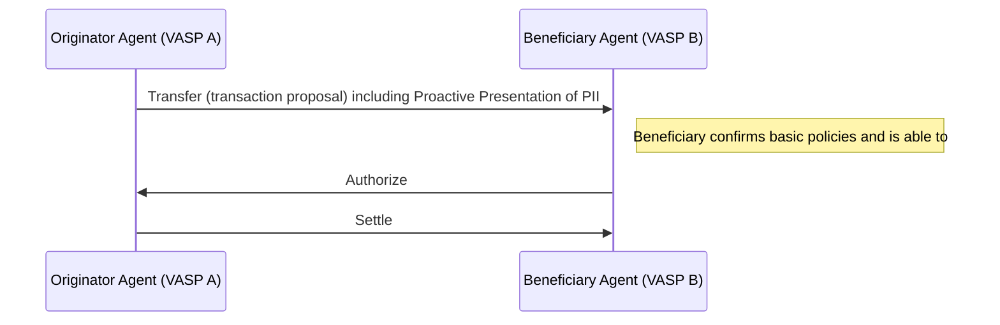
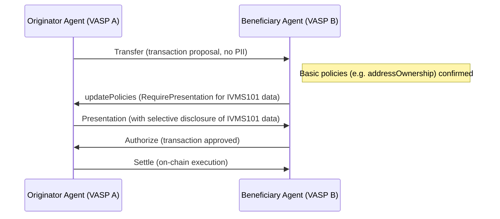

## Summary

TAIP-10 describes how to implement Travel Rule data exchange for counterparty identity verification in TAP. IVMS101 data can be included directly in party objects alongside schema.org data (per [TAIP-6]) or exchanged through selective disclosure using pre-existing message types and flows. This presents a policy-based workflow allowing companies to comply with not only their own regulators requirements, but also take a policy-based approach to helping key counterparties be compliant.

## Abstract

This TAIP proposes the integration of [IVMS-101] identity data into TAP to meet FATF Travel Rule requirements. IVMS101 data can be included directly in party objects (per [TAIP-6]) for transparent compliance, or exchanged privately using existing mechanisms from [TAIP-7] (updatePolicies with a RequirePresentation directive) and [TAIP-8] (Presentation message with selective disclosure).

When using direct inclusion, parties may include IVMS101 data alongside schema.org properties in transaction messages. For enhanced privacy, particularly with natural person information, selective disclosure via Presentation messages is recommended. The proposal also supports proactive transmission of Personally Identifiable Information (PII) via a Presentation message in cases where the originator must send the information once the beneficiary has confirmed basic policies (e.g. addressOwnership).

## Motivation

**Regulatory Needs & Interoperability:**
VASPs must comply with the FATF Travel Rule ([TR-Guide]) by exchanging detailed originator and beneficiary identity data. [IVMS-101] is an industry-recognized standard for structuring such identity information. By integrating [IVMS-101] into TAP, VASPs can share the required data in a consistent and verifiable format.

**Reuse of Existing Mechanisms:**
[TAIP-8] already defines a selective disclosure protocol based on Presentation messages. [TAIP-7] provides a mechanism (via updatePolicies) to require a presentation of identity data. TAIP-10 builds on these standards—no new message types are introduced. Instead, identity verification is achieved by updating policies to require presentation of [IVMS-101] data and by sending a Presentation message (or proactively sending one) when appropriate.

**Privacy and Minimal Disclosure:**
Keeping sensitive identity information out of the primary Transfer, Authorize, and Settle messages minimizes data exposure. With selective disclosure, only the minimal required [IVMS-101] attributes are shared, and only with the authorized counterparty.

**Flexibility:**
The proposal allows either party to initiate the identity exchange. In many cases, the Beneficiary's agent will trigger a request (via an updatePolicies message) to obtain the Originator's [IVMS-101] data. Alternatively, when appropriate (for example, after confirming addressOwnership), the Originator's agent may proactively send a Presentation containing [IVMS-101] data without an explicit request.

## Specification

TAIP-10 uses two existing message mechanisms:

1. **RequirePresentation via updatePolicies (TAIP-7):**
   - The Requester/Verifier (typically the Beneficiary's agent) sends an updatePolicies message that includes a RequirePresentation directive.
   - The updatePolicies message specifies a presentation definition that mandates [IVMS-101] person information for the originator or beneficiary (depending on the use case).
   - This message instructs the counterparty that, for compliance reasons, they must provide the requested identity data.

2. **Presentation Message (TAIP-8) with Selective Disclosure:**
   - The Responding agent (the Presenter) replies with a Presentation message containing a Verifiable Presentation.
   - The Verifiable Presentation embeds a Verifiable Credential generated from the [IVMS-101] data, mapped to the subject's DID (originator or beneficiary).
   - The credential is created with full serialization of [IVMS-101] data and selectively discloses only the fields required by the presentation definition.
   - In addition, the originator may also send a proactive Presentation (without a preceding request) once the beneficiary confirms basic policies (e.g. addressOwnership), to meet baseline Travel Rule requirements.

### Detailed Message Flow

#### Scenario 1: Proactive Identity Sharing by the Originator

1. **Preliminary Transaction Flow:**
   - After an initial exchange (e.g., a Transfer message and basic confirmation of addressOwnership by the Beneficiary), the Originator's agent is required by local policy to share its [IVMS-101] data.
   - The Originator's agent proactively attaches a **Presentation** message that includes a Verifiable Presentation containing the [IVMS-101] data.
   - This proactive step ensures that even if no explicit request is made, the necessary identity data is provided to fulfill Travel Rule obligations.

2. **Subsequent Processing:**
   - The Beneficiary's agent receives the proactive Presentation, verifies it, and then continues with the transaction approval process (e.g., sending an Authorize).

### Diagram 1: Proactive [IVMS-101] Data Submission



*Figure 2: Flow where the Originator's agent proactively sends its [IVMS-101] identity data after the beneficiary confirms basic policies, fulfilling the Travel Rule without waiting for an explicit updatePolicies request.*

### Sample DIDComm Messages

#### Proactive Travel Rule compliant transfer Message Example

```json
{
  "from":"did:web:originator.vasp",
  "type": "https://tap.rsvp/schema/1.0#Transfer",
  "id": "...",
  "to": ["did:web:beneficiary.vasp", "did:pkh:eip155:1:0x1234a96D359eC26a11e2C2b3d8f8B8942d5Bfcdb"],
  "body": {
    "@context": "https://tap.rsvp/schema/1.0",
    "@type": "https://tap.rsvp/schema/1.0#Transfer",
    "originator":{
      "@id":"did:eg:bob"
    },
    "beneficiary":{
      "@id":"did:eg:alice"
    },
    "asset": "eip155:1/slip44:60",
    "amount": "1.23",
    "settlementId":"eip155:1:tx/0x3edb98c24d46d148eb926c714f4fbaa117c47b0c0821f38bfce9763604457c33",
    "agents":[
      {
        "@id":"did:web:originator.vasp",
      },
      {
        "@id":"did:beneficiary.vasp",
      },
      {
        "@id":"did:pkh:eip155:1:0x1234a96D359eC26a11e2C2b3d8f8B8942d5Bfcdb",
        "role":"SettlementAddress"
      }
    ]
  },
  "attachments": [
    {
      "id": "ivms101-vp",
      "media_type": "application/json",
      "format": "dif/presentation-exchange/submission@v1.0",
      "data": {
        "json": {
          "@context": [
            "https://www.w3.org/2018/credentials/v1",
            "https://intervasp.org/ivms101"
          ],
          "type": ["VerifiablePresentation", "PresentationSubmission"],
          "presentation_submission": {
            <!-- omitted: details mapping to the request definition -->
          },
          "verifiableCredential": [{
            "@context": [
              "https://www.w3.org/2018/credentials/v1",
              "https://intervasp.org/ivms101"
            ],
            "type": ["VerifiableCredential", "TravelRuleCredential"],
            "issuer": "did:web:originator.vasp",
            "credentialSubject": {
              "originator": {
                "naturalPerson": {
                  "name": {
                    "nameIdentifiers": [
                      {
                        "primaryIdentifier": "Alice",
                        "secondaryIdentifier": "Smith",
                        "nameIdentifierType": "LegalName"
                      }
                    ]
                  },
                  "nationalIdentification": { "nationalIdentifier": "AB1234567" },
                  "geographicAddress": [
                    {
                      "streetName": "100 Main Street",
                      "buildingNumber": "1",
                      "postCode": "12345",
                      "townName": "Anytown",
                      "country": "US"
                    }
                  ]
              },
              "beneficiary": {
                "naturalPerson": {
                  "name": {
                    "nameIdentifiers": [
                      {
                        "primaryIdentifier": "Bob",
                        "secondaryIdentifier": "Lee",
                        "nameIdentifierType": "LegalName"
                      }
                    ]
                  }
                }
              }
            }
          }]
        }
      }
    }
  ]
}
```

#### Scenario 2: Beneficiary Requests Originator [IVMS-101] Data

1. **Transaction Initiation:**
   - The Originator's agent sends a **Transfer** message (without PII) to initiate a transaction.

2. **Policy Update to Require Presentation:**
   - The Beneficiary's agent, per its compliance policy, sends an **updatePolicies** message that includes a RequirePresentation directive with a presentation definition URL (e.g., `https://tap.rsvp/presentation-definitions/ivms-101/eu/tfr`).
   - This instructs the Originator's agent to provide [IVMS-101] identity data for the originator.

3. **Presentation Response:**
   - The Originator's agent, upon receiving the updatePolicies message, gathers [IVMS-101] data (e.g. full name, address, national ID) for the originator.
   - It creates a **Verifiable Credential** attesting to this data and wraps it in a **Verifiable Presentation**.
   - The agent then sends a **Presentation** message (per TAIP-8) carrying the Verifiable Presentation as an attachment.

4. **Verification & Authorization:**
   - The Beneficiary's agent verifies the Presentation (checks the digital signatures and confirms that the credential meets the requested [IVMS-101] schema).
   - If valid, the Beneficiary's agent proceeds to send an **Authorize** message to complete the transaction flow.

### Diagram 2: Identity Exchange via UpdatePolicies



*Figure 1: Flow where the Beneficiary's agent requests [IVMS-101] data via an updatePolicies message. The Originator's agent responds with a Presentation, and upon verification, the transaction proceeds.*


### Sample DIDComm Messages

#### UpdatePolicies (RequirePresentation) Message Example

```json
{
  "id": "req-001",
  "type": "https://tap.rsvp/schema/1.0#UpdatePolicies",
  "from": "did:web:beneficiary.vasp",
  "to": "did:web:originator.vasp",
  "body": {
    "@context": "https://tap.rsvp/schema/1.0",
    "@type": "https://tap.rsvp/schema/1.0#UpdatePolicies",
    "policies":[
      {
        "@type":"RequirePresentation",
        "@context":["https://schema.org/Person", "https://www.gleif.org/ontology/Base/Entity"],
        "fromAgent":"originator",
        "aboutParty":"originator",
        "credentials": {
          "Person": ["firstName","lastName","nationalId"],
          "Entity": ["leiCode"]
        }
      },
    ]
  }
}
```

*This message is sent by the Beneficiary's agent to request that the Originator's agent provide [IVMS-101] identity data for the originator.*

#### Presentation Message Example

```json
{
  "type": "https://didcomm.org/present-proof/3.0/presentation",
  "id": "f1ca8245-ab2d-4d9c-8d7d-94bf310314ef",
  "thid": "95e63a5f-73e1-46ac-b269-48bb22591bfa",
  "from": "did:web:originator.vasp",
  "to": [
    "did:web:beneficiary.vasp"
  ],
  "body": {},
  "attachments": [
    {
      "id": "ivms101-vp",
      "media_type": "application/json",
      "format": "dif/presentation-exchange/submission@v1.0",
      "data": {
        "json": {
          "@context": [
            "https://www.w3.org/2018/credentials/v1",
            "https://intervasp.org/ivms101"
          ],
          "type": ["VerifiablePresentation", "PresentationSubmission"],
          "presentation_submission": {
            <!-- omitted: details mapping to the request definition -->
          },
          "verifiableCredential": [{
            "@context": [
              "https://www.w3.org/2018/credentials/v1",
              "https://intervasp.org/ivms101"
            ],
            "type": ["VerifiableCredential", "TravelRuleCredential"],
            "issuer": "did:web:originator.vasp",
            "credentialSubject": {
              "originator": {
                "naturalPerson": {
                  "name": {
                    "nameIdentifiers": [
                      {
                        "primaryIdentifier": "Alice",
                        "secondaryIdentifier": "Smith",
                        "nameIdentifierType": "LegalName"
                      }
                    ]
                  },
                  "nationalIdentification": { "nationalIdentifier": "AB1234567" },
                  "geographicAddress": [
                    {
                      "streetName": "100 Main Street",
                      "buildingNumber": "1",
                      "postCode": "12345",
                      "townName": "Anytown",
                      "country": "US"
                    }
                  ]
              },
              "beneficiary": {
                "naturalPerson": {
                  "name": {
                    "nameIdentifiers": [
                      {
                        "primaryIdentifier": "Bob",
                        "secondaryIdentifier": "Lee",
                        "nameIdentifierType": "LegalName"
                      }
                    ]
                  }
                }
              }
            }
          }]
        }
      }
    }
  ]
}
```

## Rationale

TAIP-10 does not introduce new message types. It leverages the existing **RequirePresentation** functionality (via updatePolicies as specified in TAIP-7) and the **Presentation** message from TAIP-8. This minimizes complexity while providing full Travel Rule compliance.

- **Proactive Data Sharing:**
  Some jurisdictions require that originator data is sent automatically once minimal checks (such as addressOwnership) are satisfied. Allowing a proactive Presentation message ensures that even without an explicit request, compliance can be met.

- **Interoperability:**
  Most legacy Travel Rule solutions support [IVMS-101], but in some cases with very different sequences of flows. TAP's message and policy negotiation features makes it trivial to create a gateway to a legacy based travel rule solution.

- **Security:**
  The security of sensitive customer PII is one of the number one issues causing companies pause when implementing the Travel Rule. Most Travel Rule protocols have built their own encryption methodologies that have often not been properly audited or reviewed from a security point of view. TAP relies on [DIDComm] which itself relies on well tested standards like [JWE] from IETF that has stood the test of time.

**Policy based Counterparty Due-Diligence:**
  Counterparty due-diligence is a key requirement for implementing the Travel Rule. Not only do you need to ensure you can trust your counterparty to have properly performed on-going KYC of their customer. You also need to trust them from a data privacy point of view with your customer data.

  Without a centralized gatekeeper enforcing their risk appetite it is paramount that institutions maintain their own policy based risk appetite for counterparty due-diligence. By requesting additional required details and proofs about the counterparty institution directly within the transaction flow, this can increase the Straight-through Processing rates even when encountering new or infrequent counterparties.

## Security Considerations

- **Encryption & Authentication:**
  All messages are transmitted via DIDComm v2 with robust encryption (authcrypt) ensuring that sensitive identity information is only accessible to the intended recipient.

  Verifiable Credentials are digitally signed by the issuing VASP, and the accompanying Verifiable Presentation is signed by the holder. Recipients must verify these signatures against trusted DID Documents to ensure data integrity.

  By sharing only the fields required in the presentation definition, the risk of unnecessary PII exposure is minimized.

- **Policy Enforcement:**
  Agents must enforce internal compliance policies. If a required Presentation is not received within a defined timeframe, the transaction should be rejected to maintain regulatory compliance.
- **Replay Protection:**
  Each message contains unique identifiers and thread references to prevent replay attacks.

## Backwards Compatibility

TAIP-10 is an additive extension to TAP. Existing TAP flows that do not require [IVMS-101] data remain unaffected. Agents not supporting TAIP-10 will ignore the updatePolicies and Presentation messages related to identity verification. However, in regulated contexts, failure to exchange [IVMS-101] data will result in a transaction rejection by compliant agents. This ensures that while legacy systems continue to operate, industry adoption of TAIP-10 becomes a de facto requirement for Travel Rule compliance.

## References

* [TAIP-7] Policy Updates
* [TAIP-8] Selective Disclosure
* [DID] W3C Decentralized Identifiers
* [DIDComm] DIDComm Messaging
* [IVMS-101] InterVASP Messaging Standard 101
* [VCModel] W3C Verifiable Credentials Data Model
* [VC] Verifiable Credentials
* [VP] Verifiable Presentations
* [PEx] Presentation Exchange
* [WACIPEx] Wallet and Credential Interaction (WACI) Protocols
* [TR-Guide] Travel Rule Guidance Note

[TAIP-7]: ./taip-7
[TAIP-8]: ./taip-8
[DID]: <https://www.w3.org/TR/did-core/>
[DIDComm]: <https://identity.foundation/didcomm-messaging/spec/v2.1/>
[IVMS-101]: <https://www.intervasp.org>
[VCModel]: <https://www.w3.org/TR/vc-data-model-2.0/>
[VC]: <https://www.w3.org/TR/vc-data-model-2.0/#credentials>
[VP]: <https://www.w3.org/TR/vc-data-model-2.0/#presentations>
[PEx]: <https://identity.foundation/presentation-exchange/spec/v2.0.0/>
[WACIPEx]: <https://identity.foundation/waci-didcomm/>
[TR-Guide]: <https://www.jerseyfsc.org/industry/guidance-and-policy/travel-rule-guidance-note/>

## Copyright

Copyright and related rights waived via [CC0](../LICENSE).
