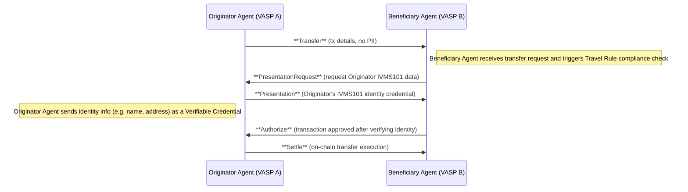
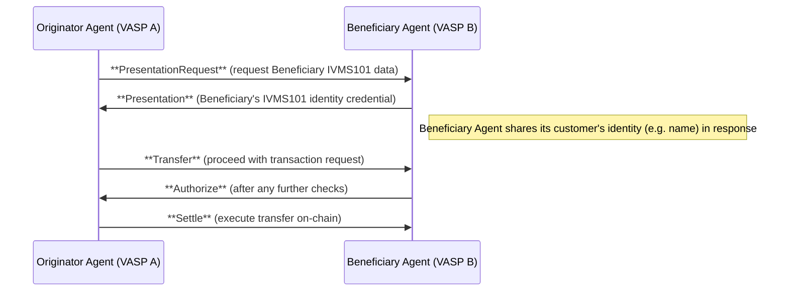

# TAIP-10: IVMS101 for Travel Rule Identity Verification in TAP

## Abstract

This proposal introduces a standard method for exchanging required originator and beneficiary identity information in the Transaction Authorization Protocol (TAP) to comply with the FATF Travel Rule. TAIP-10 leverages the **Selective Disclosure** framework defined in [TAIP-8], using its existing `PresentationRequest` and `Presentation` (verifiable credential exchange) messages, to incorporate the **IVMS101** data model for identity information. By using [IVMS-101] – a widely adopted standard for originator/beneficiary data – and [DIDComm] v2 secure messaging, TAP agents can request and share identity details **on-demand** in a privacy-preserving way. No new message types are introduced; instead, IVMS101 is integrated into the current selective disclosure mini-protocol. This ensures that VASPs can fulfill Travel Rule requirements (sharing sender and recipient identity data) **securely**, with selective disclosure and end-to-end encryption, without exposing personal information in core TAP messages.

## Motivation

**Regulatory Compliance:** Virtual Asset Service Providers (VASPs) are required under the FATF's Travel Rule (Recommendation 16) to obtain and transmit accurate identifying information about the **originator and beneficiary** of cryptocurrency transactions ([TR-Guide]). This means that for qualifying transactions, the Originating VASP must share the originator's identity (and in some cases beneficiary's identity) with the Beneficiary VASP. Failing to include this information can lead to non-compliance and legal penalties. Today, different Travel Rule solutions exist, but without a TAP-standardized approach, VASPs would need out-of-band channels or proprietary protocols to exchange this data.

**IVMS101 Standard:** **IVMS101 (InterVASP Messaging Standard 101)** provides a common data model for the personal identifying information that VASPs must exchange ([IVMS-101]). It defines a structured format for originator and beneficiary details (names, physical address, national ID, etc.) so that all parties interpret the data consistently. By adopting IVMS101 within TAP, we ensure interoperability with existing compliance systems and a **universal language** for identity data. Using IVMS101 as the schema means TAP messages can carry the full scope of required information in a format regulators and industry solutions recognize.

**Privacy and Data Minimization:** A core design goal is to avoid exposing sensitive personal information unless absolutely necessary. In traditional wire transfer protocols (and some early Travel Rule implementations), PII is sent alongside each transfer message, which **creates privacy risks** ([TAIP-8#selective-disclosure]). Embedding names, IDs, and addresses directly in transaction messages can lead to unwanted data exposure or storage, especially if multiple parties or intermediaries see the data. TAP's philosophy (per TAIP-8) is to keep PII out of the primary transaction flow and exchange it **only on request** between the parties that require it ([TAIP-8#selective-disclosure]). This aligns with global data protection principles and reduces liability for VASPs handling user data. The motivation for TAIP-10 is to enable Travel Rule compliance **without sacrificing user privacy**, by using selective disclosure: only the requesting counterparty sees the identity information, and only the minimum necessary attributes are shared.

**Enhanced Trust and Verification:** Incorporating identity verification into TAP can improve transaction integrity and trust between VASPs. For example, an originator's agent may want to **verify the beneficiary's identity** before approving a large transfer (to ensure the funds aren't going to a sanctioned or unintended recipient), and a beneficiary's agent will want to vet the originator's information for sanctions screening and record-keeping. By exchanging IVMS101 credentials, both sides gain confidence in who they are transacting with, beyond just DIDs or blockchain addresses. This also ties transactions to real-world identities in a secure manner, facilitating audits and compliance checks. In summary, TAIP-10 is motivated by the need to meet mandatory compliance requirements while preserving the security and privacy ethos of TAP.

## Specification

**Overview:** TAIP-10 extends TAP's selective disclosure mechanism (TAIP-8) to carry out Travel Rule identity information exchange using the IVMS101 schema. It does so by standardizing how agents formulate a **Presentation Request** for IVMS101 data and how the responding agent provides a **Presentation** containing the IVMS101-compliant identity information. The exchange occurs as a DIDComm v2 encrypted sub-protocol within the overall TAP flow, typically between the **Originator's Agent** and **Beneficiary's Agent**. The requesting agent (the **Verifier**) asks for identity data, and the responding agent (the **Holder/Issuer** of the credentials) replies with the data in a verifiable format. Both **natural persons** and **legal entities** are supported via IVMS101's structure for individuals and organizations.

### Using TAIP-8 Selective Disclosure for Travel Rule (IVMS101 Integration)

TAIP-8 defines a mini-protocol for selective disclosure, allowing an agent to request verifiable credentials from another agent ([TAIP-8#selective-disclosure]). TAIP-10 profiles this capability specifically for Travel Rule compliance. Implementers MUST use the existing message types introduced by TAIP-8:

- **`PresentationRequest` message:** In TAIP-8, this is conceptually the "request for credentials" message (referred to as a `RequirePresentation` policy/request). It indicates what identity information is needed and from whom. For TAIP-10, the `PresentationRequest` MUST specify the **IVMS101 data model** as the format of requested credentials and clearly identify which party's information is being sought (originator or beneficiary).

- **`Presentation` message:** This is the response message carrying the requested information. In TAIP-8, this aligns with the WACI **Present Proof** 3.0 message containing a Verifiable Presentation. For TAIP-10, the `Presentation` MUST include the originator/beneficiary identity data formatted according to IVMS101. Typically this will be conveyed as a W3C Verifiable Credential (VC) embedded in the presentation, signed by the providing VASP to assert the data's authenticity.

No new message types are introduced by this proposal; we reuse the above by **plugging in IVMS101-specific content**. In practice, a PresentationRequest is a DIDComm message (with a defined `@type` in the TAP namespace or DIDComm protocol) that travels from one agent to the other, followed by a Presentation message in reply. Both messages are transmitted **encrypted via DIDComm** to ensure confidentiality ([TAIP-8#selective-disclosure]).

### Flow Scenarios

In a typical TAP transaction flow, the need for Travel Rule data arises after an initial transaction proposal. The following scenarios illustrate how TAIP-10 is used:

**1. Beneficiary VASP requests Originator's IVMS101 information:** This is the most common case (the originator's information must "travel" to the beneficiary side). After receiving a `Transfer` message, the Beneficiary's Agent determines that compliance requires identifying the originator. It sends a `PresentationRequest` to the Originator's Agent, asking for the IVMS101 identity details of the originator (person or entity who initiated the transfer). Upon receiving the request, the Originator's Agent prepares a `Presentation` containing its customer's identity data (e.g. name, date of birth, address, etc., structured per IVMS101) and sends it back. Only once the Beneficiary Agent validates this data (e.g. performs sanctions screening, matches the beneficiary info if needed) will it proceed to send an `Authorize`.

**2. Originator VASP requests Beneficiary's IVMS101 information (if needed):** In some cases, the originator's side may also require information about the beneficiary (for instance, to satisfy its own jurisdiction's rules or to confirm the beneficiary's identity before sending funds). The Originator's Agent can initiate a `PresentationRequest` to the Beneficiary's Agent, asking for the beneficiary's IVMS101 data. The Beneficiary's Agent would respond with a `Presentation` containing its customer's identity details (the beneficiary's info). This exchange could occur *before* or in parallel to the transfer authorization. For example, the originator might first request "who is the beneficiary?" as part of pre-transaction checks; or the originator might do so after receiving an `Authorize` to double-check the beneficiary's name against what the sender intended. In any case, TAIP-10 supports this bidirectional exchange: either side can be the verifier or holder depending on which identity data is needed.

**Selective Disclosure of Attributes:** The PresentationRequest can specify *which specific IVMS101 attributes* are required, leveraging mechanisms from TAIP-8 (such as a **Presentation Definition**). For instance, a beneficiary VASP might only request the originator's **name and account number**, if that suffices under local rules; or it might request additional fields like physical address if mandated. TAIP-10 recommends using a standard presentation definition for Travel Rule data to ensure both parties agree on the fields. (An example is the TAP reference definition at `https://tap.rsvp/presentation-definitions/ivms-101/eu/tfr`, which could enumerate the IVMS101 fields required under EU Travel Rule guidelines ([TAIP-8#selective-disclosure]).) The request message can either include this definition or a URI reference to it. The responding agent should then provide a credential containing at least those requested fields. Unrequested sensitive data can be omitted or redacted – fulfilling the **minimum necessary** principle.

**Formatting of the IVMS101 Credential:** IVMS101 defines a JSON structure with nested objects for Originator, Beneficiary, OriginatingVASP, and BeneficiaryVASP. In practice, the Verifiable Credential's `credentialSubject` can be structured to reflect these IVMS101 components. For example, the credential may contain an `"originator"` object (for originator person data) and a `"beneficiary"` object (for beneficiary person data), along with the VASP's own identifying details. However, to simplify implementations, a credential might also directly include person attributes (like `givenName`, `familyName`, etc.) if both sides pre-agree on the schema. The key requirement is that the data provided in the Presentation **meets the IVMS101 specification for all required fields** so that the verifier can reliably interpret it. TAIP-10 does not mandate a single encoding of IVMS101 in the credential, but it is RECOMMENDED to use the standard field names and structure from the IVMS101 specification for interoperability. This includes distinguishing natural persons vs legal persons in the data (e.g. using IVMS101's `naturalPerson` or `legalPerson` sub-structures where appropriate).

**DIDComm Message Examples:** Below are example DIDComm v2 messages (in JSON form) illustrating a Travel Rule identity exchange using TAIP-10. These are for demonstration and omit some DIDComm envelope wrappers (like full DID headers, signatures, etc.) for brevity.

- **Example A:** Beneficiary's Agent requests IVMS101 data about the originator from the Originator's Agent. (This corresponds to scenario 1 above, initiated by Beneficiary VASP.)

```json
{
  "@id": "123e4567-e89b-12d3-a456-426614174000",
  "@type": "https://tap.rsvp/schema/1.0/PresentationRequest",
  "from": "did:web:beneficiary.vasp",
  "to": "did:web:originator.vasp",
  "body": {
    "comment": "Please provide originator IVMS101 information for Travel Rule compliance"
  },
  "presentationDefinition": "https://tap.rsvp/presentation-definitions/ivms-101/eu/tfr",
  "requester": {
    "fromAgent": "originator",
    "aboutParty": "originator"
  }
}
```

In this request, the Beneficiary's agent (did:web:beneficiary.vasp) asks the Originator's agent for information about the originator party. The `presentationDefinition` points to a predefined IVMS101 data requirement (for example, requiring originator's full name and address). The `fromAgent: "originator"` and `aboutParty: "originator"` (following TAIP-8 conventions) indicate that the **originator's agent** is expected to present information **about the originator** ([TAIP-8#selective-disclosure]). (All necessary routing and thread identifiers are handled via DIDComm; here we focus on the message content.)

- **Example B:** Originator's Agent responds with a Presentation containing the originator's identity data in IVMS101 format.

```json
{
  "@id": "789f4567-e89b-12d3-a456-426614174999",
  "@type": "https://didcomm.org/present-proof/3.0/presentation",
  "from": "did:web:originator.vasp",
  "to": ["did:web:beneficiary.vasp"],
  "~thread": { "thid": "123e4567-e89b-12d3-a456-426614174000" },
  "body": {},
  "attachments": [
    {
      "id": "ivms101-vp",
      "media_type": "application/json",
      "format": "dif/presentation-exchange/submission@v1.0",
      "data": {
        "json": {
          "@context": [
            "https://www.w3.org/2018/credentials/v1",
            "https://intervasp.org/ivms101"
          ],
          "type": ["VerifiablePresentation", "PresentationSubmission"],
          "presentation_submission": {
            <!-- omitted: details mapping to the request definition -->
          },
          "verifiableCredential": [{
            "@context": [
              "https://www.w3.org/2018/credentials/v1",
              "https://intervasp.org/ivms101"
            ],
            "type": ["VerifiableCredential", "TravelRuleCredential"],
            "issuer": "did:web:originator.vasp",
            "credentialSubject": {
              "originator": {
                "naturalPerson": {
                  "name": {
                    "nameIdentifiers": [
                      {
                        "primaryIdentifier": "Alice",
                        "secondaryIdentifier": "Smith",
                        "nameIdentifierType": "LegalName"
                      }
                    ]
                  },
                  "nationalIdentification": { "nationalIdentifier": "AB1234567" },
                  "geographicAddress": [
                    {
                      "streetName": "100 Main Street",
                      "buildingNumber": "1",
                      "postCode": "12345",
                      "townName": "Anytown",
                      "country": "US"
                    }
                  ]
                }
              },
              "beneficiary": {
                "naturalPerson": {
                  "name": {
                    "nameIdentifiers": [
                      {
                        "primaryIdentifier": "Bob",
                        "secondaryIdentifier": "Lee",
                        "nameIdentifierType": "LegalName"
                      }
                    ]
                  }
                }
              }
            },
            "proof": {
              "type": "EcdsaSecp256k1Signature2019",
              "created": "2025-03-02T09:00:00Z",
              "verificationMethod": "did:web:originator.vasp#key1",
              "proofPurpose": "assertion",
              "jws": "<signature-value>"
            }
          }]
        }
      }
    }
  ]
}
```

In this Presentation message, the originator's agent provides a Verifiable Presentation (attachment) that contains a **Verifiable Credential** with IVMS101 data. The `credentialSubject` includes the **Originator**'s personal details under `"originator"` (as a natural person named Alice Smith, with an ID number and address), and also echoes the **Beneficiary**'s name as provided by the originator's side (Bob Lee). The credential is issued (signed) by the Originator VASP (`issuer: did:web:originator.vasp`), attesting that this information is verified KYC data. The `presentation_submission` object (omitted for brevity) would map the provided credential's fields to the requested fields defined in the Presentation Definition ([TAIP-8#selective-disclosure]). Because the DIDComm message is authenticated and encrypted, the Beneficiary VASP can trust that this data truly came from the Originator VASP and has not been altered in transit. Upon receiving this, the Beneficiary agent would verify the credential's signature, check that the data satisfies its Travel Rule requirements, and proceed with the transaction flow (e.g., sending an `Authorize` message if all checks pass).

- **Example C:** Originator's Agent requests IVMS101 data about the beneficiary from the Beneficiary's Agent. (Scenario 2, roles reversed.)

```json
{
  "@id": "5678abcd-90ab-cdef-1234-567890abcdef",
  "@type": "https://tap.rsvp/schema/1.0/PresentationRequest",
  "from": "did:web:originator.vasp",
  "to": "did:web:beneficiary.vasp",
  "body": {
    "comment": "Requesting beneficiary IVMS101 information for due diligence"
  },
  "presentationDefinition": "https://tap.rsvp/presentation-definitions/ivms-101/eu/tfr",
  "requester": {
    "fromAgent": "beneficiary",
    "aboutParty": "beneficiary"
  }
}
```

Here the Originator's agent is asking for the Beneficiary's identity details. Note that `fromAgent: "beneficiary"` and `aboutParty: "beneficiary"` indicate the request targets the **beneficiary's agent** to provide info about the **beneficiary party**. The format and definition are again referencing IVMS101. This request might be triggered if the Originator needs to know who their customer is sending funds to (e.g., for sanction screening of the beneficiary name if not already known).

- **Example D:** Beneficiary's Agent responds with a Presentation containing the beneficiary's IVMS101 data.

```json
{
  "@id": "abcdef12-3456-7890-abcd-ef1234567890",
  "@type": "https://didcomm.org/present-proof/3.0/presentation",
  "from": "did:web:beneficiary.vasp",
  "to": ["did:web:originator.vasp"],
  "~thread": { "thid": "5678abcd-90ab-cdef-1234-567890abcdef" },
  "body": {},
  "attachments": [
    {
      "id": "ivms101-vp-ben",
      "media_type": "application/json",
      "format": "dif/presentation-exchange/submission@v1.0",
      "data": {
        "json": {
          "@context": [
            "https://www.w3.org/2018/credentials/v1",
            "https://intervasp.org/ivms101"
          ],
          "type": ["VerifiablePresentation", "PresentationSubmission"],
          "verifiableCredential": [{
            "@context": [
              "https://www.w3.org/2018/credentials/v1",
              "https://intervasp.org/ivms101"
            ],
            "type": ["VerifiableCredential", "TravelRuleCredential"],
            "issuer": "did:web:beneficiary.vasp",
            "credentialSubject": {
              "beneficiary": {
                "naturalPerson": {
                  "name": {
                    "nameIdentifiers": [
                      {
                        "primaryIdentifier": "Bob",
                        "secondaryIdentifier": "Lee",
                        "nameIdentifierType": "LegalName"
                      }
                    ]
                  },
                  "birthDate": "1990-05-15",
                  "geographicAddress": [
                    {
                      "streetName": "500 Market St",
                      "buildingNumber": "20",
                      "postCode": "54321",
                      "townName": "Othertown",
                      "country": "US"
                    }
                  ]
                }
              }
            },
            "proof": {
              "type": "EcdsaSecp256k1Signature2019",
              "created": "2025-03-02T09:01:30Z",
              "verificationMethod": "did:web:beneficiary.vasp#key1",
              "proofPurpose": "assertion",
              "jws": "<signature-value>"
            }
          }]
        }
      }
    }
  ]
}
```

In this response, the Beneficiary's agent issues a credential about its **beneficiary customer** (Bob Lee, including perhaps birth date and address in this example) and presents it to the originator's agent. The credential is signed by the Beneficiary VASP (the issuer), proving that it's an official identity claim of their customer. The originator's agent can now verify and use this information (e.g., check that the name matches what the sender expected or run it against sanction lists). This example shows only the beneficiary's data in the credentialSubject; the originator's info is not included because the originator VASP obviously already knows its own customer. The selective disclosure here ensures the originator only learns what is necessary about the beneficiary (and nothing more).

### Sequence Diagrams

The following Mermaid sequence diagrams illustrate how the identity verification exchanges fit into the TAP message flow:

**Diagram 1: Beneficiary requests Originator's IVMS101 information (Travel Rule flow)** – The Beneficiary's agent obtains the originator's identity before authorizing the transaction.



*Figure 1: TAP flow with Travel Rule identity exchange. The Beneficiary Agent requests the Originator's IVMS101 information after receiving the Transfer request, then upon validation, proceeds to authorize the transaction.*

In this diagram, notice that the sensitive identity data is exchanged **out-of-band** (off the main transaction messages). The `Transfer` and `Authorize` messages remain free of PII, fulfilling the design goal of keeping the core protocol privacy-preserving. The identity info is only visible to the Originator and Beneficiary agents involved, carried in the encrypted Presentation messages ([TAIP-8#selective-disclosure]).

**Diagram 2: Originator requests Beneficiary's IVMS101 information (reverse scenario)** – The Originator's agent seeks the beneficiary's identity before proceeding with the transaction (this could occur prior to or just after sending the Transfer).



*Figure 2: Optional flow where the Originator Agent requests the Beneficiary's identity. This could be done as a preliminary step if required by the Originator's compliance policies.*

This reverse inquiry might not occur in every transaction, but TAIP-10 enables it for completeness. It shows that either party can utilize the PresentationRequest/Presentation protocol to satisfy their due diligence requirements, making the system flexible for different regulatory contexts.

### Compliance and Data Handling

By using IVMS101 within these selective disclosure messages, **all FATF Travel Rule required information can be conveyed** in a standard way. For a typical personal (natural person) transfer, this includes: the originator's full name, account number (or wallet ID), physical address and/or national ID number (if required by jurisdiction), and the beneficiary's name and account number ([IVMS-101]). IVMS101 also supports identifying information for legal entities and the VASPs themselves. TAIP-10-compliant agents should populate the relevant IVMS101 fields for the scenario at hand:

- If you are the Originator VASP providing information, you should include the Originator person's details and (if known/applicable) the Beneficiary's name as provided by your customer, as well as your own VASP identifier (e.g. company name, LEI in the OriginatingVASP section). The BeneficiaryVASP section could also be included if known (e.g., the DID or name of the beneficiary's institution), though in practice the receiving agent already knows itself.

- If you are the Beneficiary VASP providing information (upon the originator's request), you include your Beneficiary customer's details (and you may include your VASP's identifier in the BeneficiaryVASP field). In this case the originator's person info is not needed in the credential, since the originator VASP inherently has that.

All identity data exchanged should be **accurate and up-to-date** as per each VASP's KYC records. It is recommended that the VASP's compliance team define which IVMS101 fields are mandatory for them to receive or send, consistent with local regulations. For example, some jurisdictions might require the originator's date of birth for certain transfers, while others might not – the PresentationRequest should reflect those needs.

## Rationale

**Why IVMS101?** IVMS101 is an industry-developed standard specifically for Travel Rule purposes, adopted by multiple Travel Rule protocols and solutions ([IVMS-101]). By using IVMS101 in TAP, we ensure that the data elements (e.g. name parts, ID types, addresses) are compatible with what other systems expect for compliance. This avoids reinventing a schema and eases integration: VASPs likely already store or can format their customer data according to IVMS101, given its broad adoption. Using the same standard in TAP means a VASP can fulfill compliance obligations through TAP without needing a parallel system. It also future-proofs TAP against evolving regulatory demands, since IVMS101 can be updated by the industry to accommodate new requirements and all TAP agents following TAIP-10 would inherently align with those updates.

**Why the TAIP-8 selective disclosure approach?** The decision to **not embed identity info in core TAP messages** (Transfer/Authorize) is deliberate. As noted in TAIP-8, many traditional approaches (including ISO 20022 messaging and early Travel Rule systems) send PII in line with the payment instructions ([TAIP-8#selective-disclosure]), which could expose that data to unintended parties or logs. TAP's architecture avoids this by separating concerns: transaction coordination vs. identity exchange. TAIP-8 already provides a secure, request-response protocol for sharing credentials when needed, so TAIP-10 builds on it instead of creating a whole new message type. This yields a cleaner design – we reuse the **`PresentationRequest` and `Presentation`** messages with an IVMS101 payload, rather than adding a bespoke "TravelRuleInfo" message. Reusing means less new code and consistency with the general proof-of-identity mechanism TAP supports (which could also cover other credentials like proof of funds, KYC certificates, etc., via similar flows).

**Selective disclosure and minimal exposure:** By exchanging information only when needed, TAIP-10 reduces the window in which PII is in motion. No sensitive data is included in the initial `Transfer` message (which might be seen by multiple hops or logged in systems that handle transaction proposals). Instead, the data is only revealed in a point-to-point channel when required ([TAIP-8#selective-disclosure]). Even then, the **scope of data** can be limited: for example, if only a name is needed for screening, the PresentationRequest can be defined to ask only for name fields, and the responding agent can choose to omit other info (like physical address) from the credential. This minimizes unnecessary exposure of data and aligns with GDPR/data protection principles (data minimization and purpose limitation).

**Data Handling and Storage:** VASPs implementing TAIP-10 should handle the received identity data with care in their internal systems. The protocol ensures secure transit, but once the Beneficiary VASP receives the originator's info (for instance), it becomes responsible for it under privacy laws. Implementers should avoid logging the raw IVMS101 data in plaintext in unsecure logs, and should store it with appropriate access controls (as they would for any KYC information). The **consent** for using this data is inherently given as part of the transaction process (customers consent to Travel Rule sharing via the VASP's terms), but VASPs should still treat the data as confidential.

**Trust Model:** This protocol assumes that each VASP trusts the other's attestation of their customer's identity, at least to the extent required by regulation. The **issuer** of the credential is the counterparty VASP, which is the entity performing KYC on the customer. As long as the two VASPs have an established relationship or legal framework (e.g., both are regulated entities under FATF rules), this is a reasonable trust assumption. If there is ever doubt about a credential's claims, additional verification out-of-band might be needed (but that is outside TAP's scope). Ensuring that [DID]s used in the protocol are linked to known VASP identities (through DID registration, certification, or directories) can strengthen trust that the data indeed comes from the real VASP and not an imposter.

In summary, TAIP-10 significantly enhances the security of Travel Rule compliance compared to naive approaches (like emailing spreadsheets of user data or including PII in blockchain memos). It leverages cryptographic protocols to keep data confidential and authentic, aligning compliance with the principle of privacy by design. By following this TAIP, VASPs can confidently exchange required information knowing it's protected against unauthorized access or tampering.

## Backwards Compatibility

TAIP-10 is designed as an **additive extension** to TAP; it does not break or alter existing TAP message types or flows. Agents that do not implement TAIP-10 (or the underlying [TAIP-8] selective disclosure) will simply not engage in the PresentationRequest/Presentation sub-protocol. The core transaction negotiation (Transfer, Authorize, etc.) can technically still occur without the TAIP-10 steps, as it would prior to this proposal. This means that from a protocol perspective, TAIP-10 is backwards compatible: a legacy TAP agent will ignore or decline unknown message types, and the flow would proceed (albeit without an identity exchange).

However, in a regulatory context, an agent that doesn't implement TAIP-10 might be unable to complete transactions with a compliant counterparty that requires Travel Rule info. For example, if VASP B sends a PresentationRequest for originator info and VASP A does not understand it or cannot respond, VASP B is likely to Reject the transaction for compliance reasons. Thus, while the presence of TAIP-10 messages won't crash or halt the protocol handshakes (thanks to [DIDComm]'s tolerance for optional message families), **the transaction will not be authorized** if the compliance requirements aren't met. In that sense, adoption of TAIP-10 will need to be mutual for VASPs engaging in regulated transfers.

From a versioning standpoint, TAIP-10 doesn't require bumping the TAP protocol version; it relies on feature detection. Agents can advertise support for the selective disclosure protocol (e.g., via their Agent profile or through [TAIP-8] policies). If both sides support it, they will use it as needed. If one side doesn't, the other side can either fall back to an out-of-band Travel Rule solution or refuse the transaction. It's expected that as VASPs upgrade to comply with regulations, TAIP-10 (and [TAIP-8]) support will become a de facto requirement for doing business via TAP in jurisdictions with Travel Rule enforcement.

No existing TAP fields or message schemas are changed by this proposal. The only **additions** are the use of the PresentationRequest and Presentation messages with agreed-upon [IVMS-101] content. This means implementations can be incrementally upgraded: a TAP stack can add a module for handling these messages without modifying the transaction message handler logic. If needed, it's also possible to extend TAIP-10 in the future without breaking it (for instance, if FATF updates the required data elements, a new presentation definition URL or version can be introduced, and both sides would use that). Because [IVMS-101] is extensible and versioned by the Joint Working Group, backwards compatibility of the data model itself will be managed externally; TAIP-10 simply acts as a carrier.

In summary, TAIP-10 maintains backwards compatibility at the protocol level (no disruption to non-compliant agents' messaging), while acknowledging that practical compliance will drive widespread adoption. Early adopters can implement it to seamlessly exchange Travel Rule info, and as more VASPs do the same, the network effect will ensure those not supporting it will quickly update or be excluded from regulated value transfers. TAP's modular design makes this upgrade path straightforward and low-risk.

## References

* [TAIP-8] Selective Disclosure
* [DID] W3C Decentralized Identifiers
* [DIDComm] DIDComm Messaging
* [IVMS-101] InterVASP Messaging Standard 101
* [VCModel] W3C Verifiable Credentials Data Model
* [VC] Verifiable Credentials
* [VP] Verifiable Presentations
* [PEx] Presentation Exchange
* [WACIPEx] Wallet and Credential Interaction (WACI) Protocols
* [TR-Guide] Crypto Travel Rule 101

[TAIP-8]: ./taip-8
[DID]: <https://www.w3.org/TR/did-core/>
[DIDComm]: https://identity.foundation/didcomm-messaging/spec/v2.1/
[IVMS-101]: <https://www.intervasp.org>
[VCModel]: <https://www.w3.org/TR/vc-data-model-2.0/>
[VC]: <https://www.w3.org/TR/vc-data-model-2.0/#credentials>
[VP]: <https://www.w3.org/TR/vc-data-model-2.0/#presentations>
[PEx]: https://identity.foundation/presentation-exchange/spec/v2.0.0/
[WACIPEx]: <https://identity.foundation/waci-didcomm/>
[TR-Guide]: https://notabene.id/crypto-travel-rule-101/what-is-the-crypto-travel-rule

## Copyright

Copyright and related rights waived via [CC0](../LICENSE).
