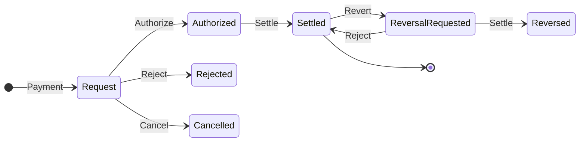
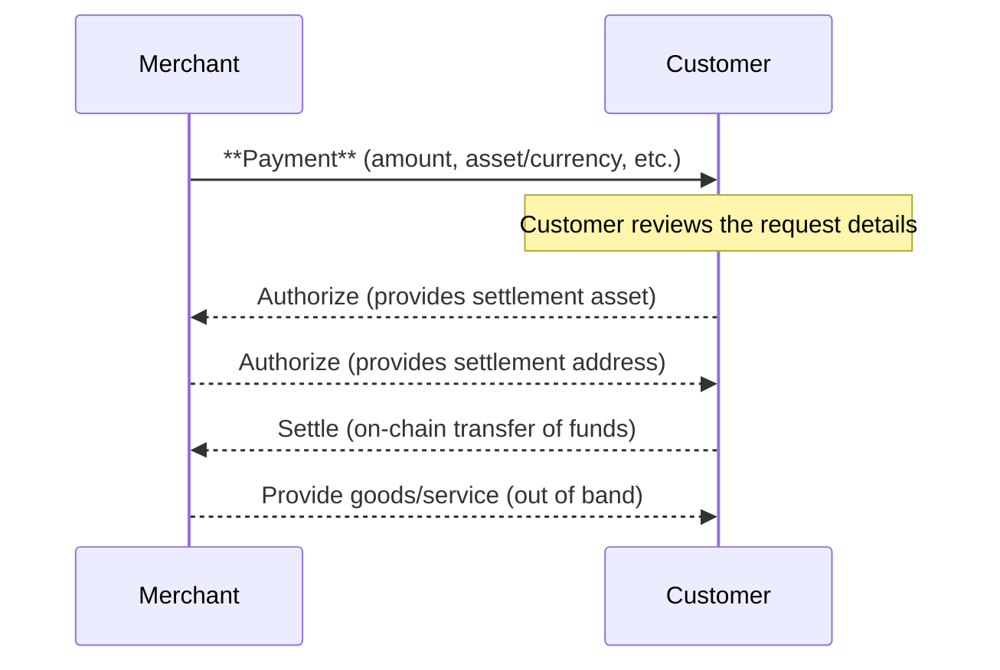
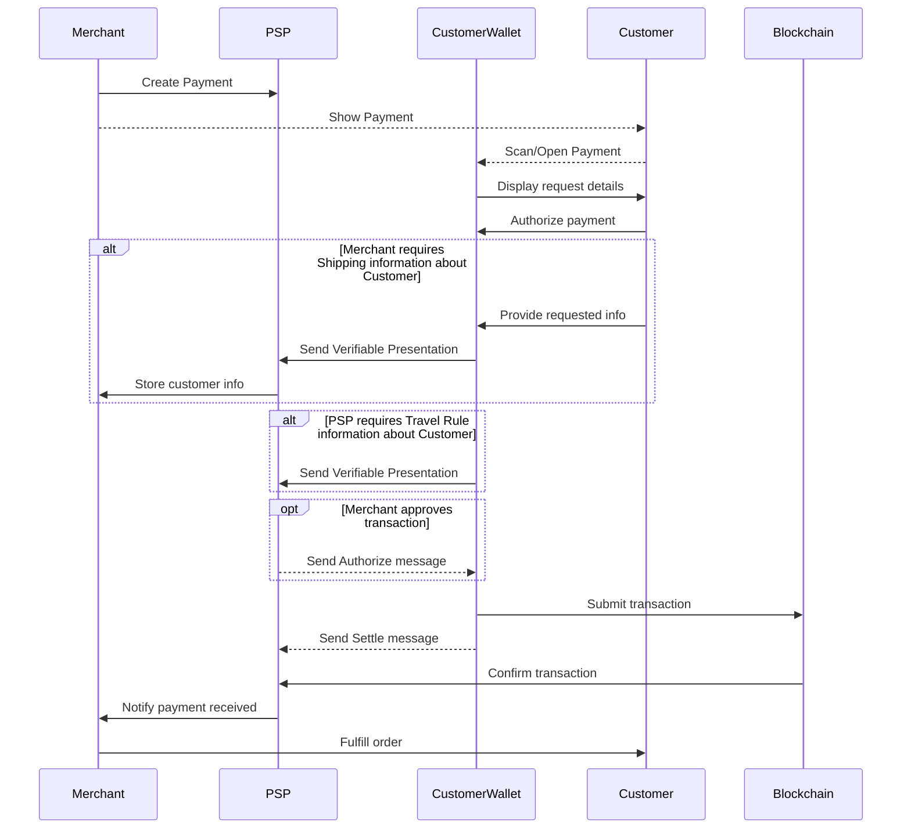
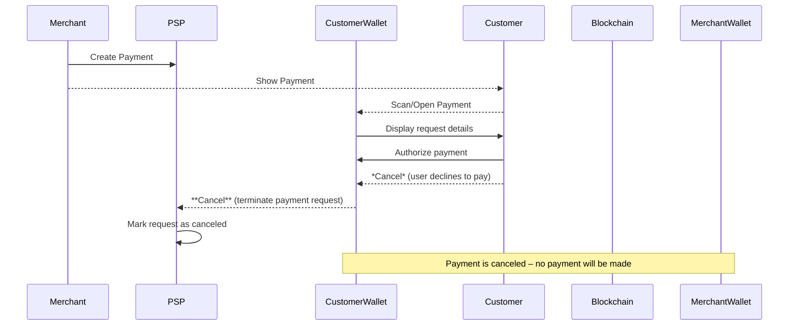
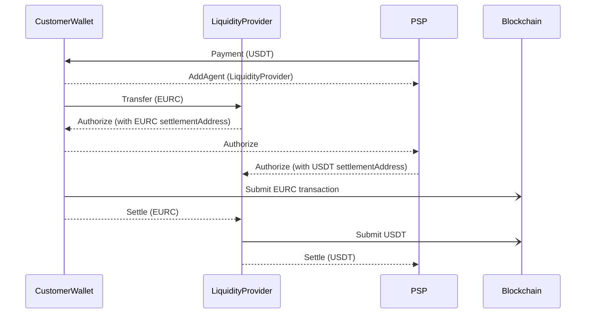

## Simple Summary

A standard for **Payments** workflows that allows a *merchant* to request a blockchain payment from a *customer*. This proposal defines a Payment message including the amount due (in either a specific asset or fiat currency), the destination address, and any required customer information.

## Abstract

Traditional on-chain transactions are push-only and irreversible [TAIP-4], making it challenging to replicate familiar payment flows (like e-commerce invoices) on public blockchains. This proposal extends the Transaction Authorization Protocol to support *pull payments* initiated by merchants. A Payment message lets a merchant specify an amount and asset or currency for payment, optionally denominated in fiat (ISO 4217) with supported crypto assets [CAIP-19]. It also allows merchants to require additional customer details (e.g. email, billing/shipping address) via a `RequirePresentation` policy as defined in [TAIP-8], instead of sharing personal data in the clear. We replace the terms **originator** and **beneficiary** from [TAIP-3] with **customer** and **merchant** for clarity in both retail and b2b scenarios, while maintaining compatibility with underlying roles defined in [TAIP-6].

## Motivation

**User-Friendly Crypto Payments:** Today's blockchain payments lack a built-in request/response flow comparable to invoicing or checkout in traditional payments. By enabling merchants to send Payments to customers, we facilitate typical e-commerce use cases where a customer is prompted to pay a specified amount to a merchant. Using **"customer"** and **"merchant"** terminology (instead of originator/beneficiary) makes the roles more intuitive in retail contexts, without changing their underlying meaning (payer and payee).

**Flexible Asset/Currency Support:** A merchant may want payment in a particular cryptocurrency or in an amount of fiat currency. This proposal ensures a Payment can specify **either a crypto asset or a fiat currency** (one is required). If a fiat currency (per ISO 4217 code, e.g. USD) is given, the request may include a list of acceptable crypto assets that the merchant supports for settling that currency amount. This gives customers flexibility in *how* to pay (e.g. choose USDC or DAI to settle a $100.00 invoice) while ensuring the merchant's requirements are clear. It also lays groundwork for dynamic currency conversion by wallets if needed and allows for composability with multiple blockchain transactions through linked `Transfer` messages.

**Improved Compliance and Data Privacy:** Merchants often need additional customer details (for compliance with regulations like the Travel Rule, or for business purposes like shipping). Instead of including personally identifiable information in the payment request (which would risk exposure to other parties) [TAIP-8], the merchant can declare a `RequirePresentation` policy (as per [TAIP-8]) in the Payment. This signals that the customer's wallet must present certain credentials (e.g. proof of identity, email, shipping address) privately to the merchant's agent before or alongside payment. By leveraging [TAIP-8] selective disclosure, sensitive data is exchanged **only** between the requesting merchant and the customer, minimizing privacy risks.

**Cancellation Capability:** Real-world payment flows allow either party to cancel an invoice or payment before completion (e.g. a customer abandons checkout, or a merchant voids an order). On blockchains, once a transaction is broadcast, it cannot be reversed [TAIP-4], but before settlement there should be a way to abort the process. We introduce a **Cancel** message in [TAIP-4] so that any agent involved can signal termination of the Payment thread. The `Cancel` action complements these by allowing a voluntary cancellation (distinct from a policy-based rejection). For example, a customer's wallet can send Cancel if the user declines to proceed, or a merchant's system can Cancel if the payment window expired or the order was invalidated. This improves the user experience by explicitly closing the loop in failure cases, informing both sides that no payment will occur.

## Specification

### Payment Message

A **Payment** is a [DIDComm] message (per [TAIP-2]) initiated by the merchant's agent and sent to the customer's agent to request a blockchain payment. It MUST include either an **`asset`** or a **`currency`** to denominate the payment, along with the amount and recipient information. The message structure is defined as follows (fields in **bold** are required):

- **`@type`** – Type identifier of the message, e.g. `"Payment"` (in context of TAIP message types).
- **`asset`** – *Optional*, **string** ([CAIP-19] or [DTI] identifier) for the specific cryptocurrency being requested. Must be a blockchain asset identifier. Either `asset` OR `currency` is required (one must be present); if both are given, they should be consistent, with `asset` having precedence (the wallet should send in the asset specified, not based on currency).
- **`currency`** – *Optional*, **string** (ISO 4217 currency code, e.g. "USD" or "EUR") for fiat-denominated payments. Either `asset` OR `currency` is required (one must be present). If `currency` is present, a wallet might not know which crypto asset the merchant prefers to settle this fiat amount; this is addressed by the `supportedAssets` field.
- **`supportedAssets`** – *Optional*, **array of strings** ([CAIP-19] or [DTI] asset identifiers). If `currency` is given (fiat-denominated request), this field can list which crypto assets are acceptable to settle that currency amount. Each entry is an asset the merchant will accept as payment for the given fiat amount. For example, a Payment might specify `"currency": "EUR", "amount": "50.00", "supportedAssets": ["eip155:1/erc20:0xA0b86991..."]` to indicate €50.00 can be paid in USDC on Ethereum (asset listed) or potentially other listed stablecoins. If `supportedAssets` is omitted for a fiat request, it implies the customer's wallet may choose any asset to settle that amount, subject to the merchant and wallet's out-of-band agreement or policy.
- `fallbackSettlementAddresses` - OPTIONAL array of strings representing alternative settlement addresses in either [CAIP-10] or [RFC 8905] format. These addresses provide fallback mechanisms for fiat payments or simple crypto transfers. Each address MUST match the asset specified in the `asset` field or one of the assets in `supportedAssets`. If `currency` is specified, the fallback addresses should support settlement of that currency amount. This field enables redundancy for payment settlement and supports scenarios where the primary settlement method may fail or be unavailable.
- **`expiry`** – *Optional*, **timestamp** indicating an expiration time for the request. After this time the merchant may no longer honor the payment (e.g. if exchange rates or inventory changed). The customer's wallet SHOULD treat an expired Payment as invalid and not allow payment. If omitted, the request is considered valid until canceled or fulfilled. This field SHOULD align with the DIDComm `expires_time` header (as specified in [TAIP-2]) to ensure consistency. In hotel reservation scenarios, for example, a merchant might set an expiry to the checkout date, indicating that if the payment is not authorized by then, the reservation will be lost.
- **`amount`** – **Required**, **string** containing a decimal representation of the payment amount. The amount must be a valid positive number expressed as a string. Leading zeroes may be omitted (e.g. "0.5" or ".5" for half a unit). Trailing zeroes may be present (e.g. "10.00" for exactly ten units). The amount is denominated in the `asset` token units or the `currency` fiat units as appropriate.
- **`invoice`** – *Optional*, **Invoice** per [TAIP-16] or **URI** providing additional details about the payment being requested (e.g. a link to an external invoice). This can provide further context for the customer, though the basic payment details should always be present directly in the Payment message itself.
- **`policies`** – *Optional*, **array of policy objects** defining requirements that must be satisfied by the customer's agent. Each policy object conforms to [TAIP-7] and may include:
  - **`requirePresentation`** – *Optional*, **array** of policy objects each of type `RequirePresentation`. This specifies that the merchant requires certain verifiable information from the customer before or alongside payment. Each entry is a request for a verifiable presentation as defined in **TAIP-8**. For example, a merchant might include a policy: `{ "@type": "RequirePresentation", "fromAgent": "originator", "about": "...", "credentialType": "email" }` to require the customer's agent (originator) to present an email credential. In general, a `RequirePresentation` policy will indicate **which party's agent** must present data (e.g. `fromAgent: "originator"` meaning the customer's side) and **what data** is needed (either by specifying credential type, or a schema, etc.) [TAIP-8]. The exact format and additional fields for these policies follow TAIP-8 and TAIP-7 (Agent Policies). When a Payment contains `requirePresentation` entries, the customer's wallet MUST prompt the user to provide the requested credentials or proofs, and return them to the merchant's agent (see Flow below). The merchant's agent will verify the provided information (e.g. check the credentials' validity) before authorizing the payment to proceed.
- **`customer`** – *Optional*, **object** for information about the customer (payer). In many cases, the merchant may not know the customer's identity at the time of issuing the request (for example, if the Payment is delivered via a public QR code or link). This object can be omitted or left minimal in such cases. If the merchant does know the customer's identity or wants to bind the request to a specific customer, they MAY include an identifier here (e.g. the customer's DID or reference). The `customer` object could simply be: `{ "@id": "did:example:alice" }` to target a specific party. Even if provided, this field is mainly informational; the DIDComm transport (to the customer's agent) or context of delivery typically ensures the request reaches the intended customer.
- **`merchant`** – **Required**, **object** with information about the merchant (payee). This includes the merchant's identity (DID) and may include additional descriptive information such as a name or website to help the customer recognize the merchant. The merchant object **MUST** include an `@id` attribute with the merchant's DID. The merchant object **MAY** include an `mcc` attribute with the ISO 18245 Merchant Category Code to identify the type of business (e.g., "5411" for grocery stores or "5812" for restaurants).
- **`agents`** – **Required**, **array of objects** representing agents involved in the payment process. Each agent object must have an `@id` attribute with the agent's DID. At minimum, one agent MUST be associated with the merchant to handle the Payment. The agent's capabilities (and any policies it enforces) are defined according to the Agent specification [TAIP-6].

### Payment Flow

Once a Payment is sent by the merchant's agent, the transaction can progress through various states as messages are exchanged and the on-chain payment is executed. Payments operate within the **Transaction Authorization Protocol** defined in [TAIP-4]. In particular, the Payment message serves as the initial transaction request to which subsequent authorization messages (Authorize, Settle, Reject, Cancel, Revert) will refer via the `thid` (thread ID).

Any agent that is part of the transaction (customer's or merchant's) can send [TAIP-4] authorization messages in response to the Payment:
- **Authorize:** Signals approval or readiness. (In a simple two-party payment, this may be optional. The merchant's agent might send an Authorize after receiving required info, or the customer's agent might implicitly consider the request authorized by the user's acceptance.)
- **Settle:** Indicates an agent is sending the transaction to the blockchain for settlement [TAIP-4]. In practice, the customer's wallet will perform the actual settlement (broadcast the payment). It may send a `Settle` message to inform the merchant that it is doing so or has done so.
- **Reject:** Indicates an agent rejects the transaction (e.g. due to policy or error) [TAIP-4]. For instance, if the merchant's compliance checks fail after seeing the customer's info, the merchant's agent could reject the payment request, refusing to accept funds.
- **Cancel:** Indicates a party or agent is voluntarily cancelling the Payment. This is newly introduced with this proposal. Either party can issue `Cancel` to abort the process when it's not going to proceed. For example, the customer's wallet can send Cancel if the user declines to pay or takes too long, or the merchant can send Cancel if the invoice is no longer valid or they choose to revoke it. When a Cancel is sent, the expectation is that no further authorization messages or payments for that request should occur. (Cancellation is essentially a polite *handshake* to terminate the thread, whereas a Reject might be used to convey a compliance or error-based refusal.)
- **Revert:** Indicates an party requests the reversal of the transaction [TAIP-4], which is a key aspect of building customer trust in a merchant payment system.

See **Figure 1** for a potential statemachine

#### Figure 1: State machine from the point of view of merchant



The following diagrams illustrate the payment flows. **Figure 2** is a high-level overview of a successful Payment flow between a merchant and customer. **Figure 3** shows a more detailed sequence with the involvement of each party's wallet and an example where the merchant requires additional customer information (per TAIP-8) before payment. **Figure 4** shows an example failure scenario where the customer cancels the Payment. (Other failure scenarios, such as merchant cancellation or rejection for policy reasons, follow a similar message pattern, with the merchant's agent sending a Cancel or Reject.)

#### Figure 2: High-Level Payment Flow (Success Scenario)



*Description:* In the high-level flow, the **Merchant** sends a Payment to the **Customer** for a certain amount. Each side Authorizes the flow and the Customer (via their wallet) sends the payment to the merchant's blockchain address. Once the payment is confirmed, the merchant fulfills the order (delivers the product or service). This diagram omits the low-level messaging and focuses on the core intent and outcome.

#### Figure 3: Detailed Payment Flow with Required Presentation (Successful Payment)



*Description:* This detailed sequence involves the **Merchant's agent (Payment Service Provider - PSP)** and **Customer's agent (CustomerWallet)** exchanging messages. The merchant's PSP creates a Payment that the **Merchant** presents to the customer, including the **amount** and a policy requiring additional information (for example, an email for receipt, and shipping address for delivery). The Customer's wallet alerts the **Customer** (user) with the details and asks for the required information and approval. The user approves the transfer and sharing of data, which the wallet packages into a **Verifiable Presentation** (per [TAIP-8]) and returns to the merchant's wallet. The merchant's wallet verifies the credentials (ensuring they meet policy). Once satisfied, the merchant's wallet (or the merchant) sends a **Authorize** message indicating everything is in order containing the settlement address. The **CustomerWallet** now automatically submits the blockchain transaction to the **Blockchain** network (this is depicted as a `Settle` action and the actual on-chain transfer). When the blockchain confirms the payment, the Merchant's wallet is notified (by listening to the blockchain or via an event). Finally, the **Merchant** is informed and can now consider the payment complete—at which point they deliver the product or service to the customer (this last step occurs off-chain, but is triggered by the confirmed payment).

**Notes:** In this flow, if any required presentation was missing or invalid, the merchant's agent could send a **Reject** instead of Authorize, or simply not authorize the payment (the customer might then choose not to pay).

#### Figure 4: Payment Flow with Cancellation (Failure Scenario)



*Description:* In this failure scenario, the merchant's wallet sends a Payment, but the customer decides not to proceed (for any reason – maybe they canceled the checkout or disagreed with the terms). The **Customer's wallet** then sends a **Cancel** message to the **Merchant's wallet**, notifying that the request is aborted. Both sides consider the payment request closed. The merchant's wallet may notify the merchant system to void the invoice or record the cancellation. Similarly, if the merchant needed to cancel (e.g. the order was out-of-stock or expired), the merchant's wallet would send a Cancel to the customer's wallet, which would inform the user. In either case, the Cancel message definitively ends that Payment thread. This differs from a **Reject** in that it isn't necessarily due to rule violations; it's a voluntary termination (any outstanding authorization or info exchange stops here). After a Cancel, the customer is not expected to send payment, and the merchant should not accept a payment if one somehow arrives late (they might refund it or handle it out of band).

### Composability

Most simple payments involving a single blockchain and a single token transfer can be implemented using the `Payment` -> `Authorize` -> `Authorize` -> `Settle` flow. More complex payments may include a Forex swap between different stablecoins or bridging between blockchain networks. For full transparency these can be implemented using multiple `Transfer` messages refering to the parent Payment through the `pthid` field (see [TAIP-2]).



### Out-of-Band Initiation

To initiate a Payment with a party that hasn't communicated before, the merchant's agent MUST support [Out-of-Band Messages](https://identity.foundation/didcomm-messaging/spec/v2.1/#out-of-band-messages). The OOB message allows sharing the Payment with potential customers through URLs or QR codes.

OOB messages for Payments:

1. MUST use the `https://didcomm.org/out-of-band/2.0` protocol
2. MUST include the goal_code `tap.payment`
3. SHOULD be shared as URLs according to the [Out-of-Band message spec](https://identity.foundation/didcomm-messaging/spec/v2.1/#out-of-band-messages)
4. MUST include the Payment as a signed DIDComm message in the attachment

Example Out-of-Band message with Payment:

```json
{
  "type": "https://didcomm.org/out-of-band/2.0/invitation",
  "id": "2e9e257c-2839-4fae-b0c4-dcd4e2159f4e",
  "from": "did:example:merchant",
  "body": {
    "goal_code": "tap.payment",
    "goal": "Process payment request",
    "accept": ["didcomm/v2"]
  },
  "attachments": [{
    "id": "payment-1",
    "mime_type": "application/didcomm-signed+json",
    "data": {
      "json": {
        "payload": "eyJpZCI6IjU5OWY3MjIwLTYxNDktNGM0NS1hZGJiLTg2ZDk2YzhlMDYwOCIsInR5cGUiOiJodHRwczovL3RhcC5yc3ZwL3NjaGVtYS8xLjAjUGF5bWVudFJlcXVlc3QiLCJmcm9tIjoiZGlkOmV4YW1wbGU6bWVyY2hhbnQiLCJib2R5Ijp7IkBjb250ZXh0IjoiaHR0cHM6Ly90YXAucnN2cC9zY2hlbWEvMS4wIiwiQHR5cGUiOiJodHRwczovL3RhcC5yc3ZwL3NjaGVtYS8xLjAjUGF5bWVudFJlcXVlc3QiLCJjdXJyZW5jeSI6IlVTRCIsImFtb3VudCI6IjEwMC4wMCIsIm1lcmNoYW50Ijp7IkBpZCI6ImRpZDpleGFtcGxlOm1lcmNoYW50In19fQ",
        "signatures": [{
          "protected": "eyJ0eXAiOiJKV1QiLCJhbGciOiJFZERTQSIsImtpZCI6ImRpZDpleGFtcGxlOm1lcmNoYW50I2tleS0xIn0",
          "signature": "FW33NnvOHV0Ted9-F7GZbkia-vYAfBKtH4oBxbrttWAhBZ6UFJMxcGjL3lwOl4YohI3kyyd2LqvFHsEFk7R7Cg"
        }]
      }
    }
  }]
}
```

The `json` field contains a signed JWS with:
- `payload`: Base64URL-encoded Payment message
- `signatures`: Array of signatures with protected header and signature value
- The protected header includes the key identifier (`kid`) that can be resolved through the signer's DID Document

The corresponding URL format would be either:
```
https://example.com/path?_oob=eyJ0eXAiOiJKV1QiLCJhbGciOiJFZERTQSJ9...
```

Or using the shorter `_oobid` parameter that references a previously published Out-of-Band message:
```
https://example.com/path?_oobid=2e9e257c-2839-4fae-b0c4-dcd4e2159f4e
```

Where the `_oob` parameter contains the base64url-encoded Out-of-Band message, or the `_oobid` parameter contains a unique identifier that can be resolved to retrieve the full Out-of-Band message.

### Example Payment with Fallback Settlement Addresses

Here's an example Payment message that includes fallback settlement addresses supporting both blockchain and traditional bank transfer settlement:

```json
{
  "id": "payment-example-001",
  "type": "https://tap.rsvp/schema/1.0#Payment",
  "from": "did:example:merchant",
  "to": ["did:example:customer"],
  "body": {
    "@context": "https://tap.rsvp/schema/1.0",
    "@type": "https://tap.rsvp/schema/1.0#Payment",
    "currency": "EUR",
    "amount": "250.00",
    "supportedAssets": [
      "eip155:1/erc20:0xA0b86991c53D94fa4C0bCBf0C1C4DF2F15F1b7A8",
      "eip155:137/erc20:0x2791Bca1f2de4661ED88A30C2A8A6b5E7C54fD3A"
    ],
    "fallbackSettlementAddresses": [
      "eip155:137:0x8B5e7A2C3f4D1E6F9A0b3C5e7D9f1A2B4C6E8F0A",
      "payto://iban/DE89370400440532013000",
    ],
    "expiry": "2025-07-30T14:30:00Z",
    "merchant": {
      "@id": "did:example:merchant",
      "name": "Digital Goods Store",
      "mcc": "5734"
    },
    "agents": [{
      "@id": "did:example:merchant-psp",
      "role": "paymentProcessor"
    }]
  }
}
```

In this example, the merchant accepts EUR 250.00 payment through various settlement methods:
- Primary: USDC on Ethereum mainnet
- Fallback options: USDC on Polygon, SEPA bank transfer, or IBAN bank transfer

## Security Considerations

Because Payments involve off-chain negotiation and on-chain settlement, there are security implications on both sides:

- **Authentication and Integrity:** It is critical that the customer's wallet verify that a Payment actually comes from the legitimate merchant's agent (and not an attacker). Using the DIDComm messaging framework (TAIP-2) provides message authentication and encryption, ensuring the request cannot be tampered with or spoofed in transit. The merchant's `@id` (DID or IRI) in the message should be trusted or resolved via a secure channel. Wallets should present the merchant identity to the user (e.g. display the merchant name or verified identifier) so the user can confirm they are paying the right party.

- **Address Verification:** The blockchain address in the Payment must belong to the merchant. If an attacker substituted their own address, funds could be stolen. By securing the DIDComm channel and possibly using **Proof of Relationship** (TAIP-9) or other mechanisms, the customer can be assured the address is provided by the merchant's agent. Merchants might sign the Payment content as an extra guarantee. Implementations should also consider showing the user the target address (or a recognizable name for it) and possibly checking it against known reputations or warnings (to avoid phishing).

- **Denial of Service:** A merchant's system could send many Payments or require excessive presentations, overwhelming the customer, or vice versa customers could repeatedly request Payments (if the protocol were extended for customers to solicit invoices). Rate-limiting and user consent are important. Customers should only receive Payments from merchants they engaged with (e.g. by scanning a QR or clicking a link), and wallets may require user confirmation before responding with any data or payment. Similarly, merchants should not rely on just Cancel to stop all issues—if a malicious customer keeps retrying or sending nonsense info, the merchant's agent might use a Reject and blacklist the party.

## Privacy Considerations

Payments are designed to minimize unnecessary exposure of personal data by leveraging selective disclosure [TAIP-8]:

- The **`requirePresentation`** mechanism ensures that sensitive customer information (PII) is **not included directly in the Payment** message broadcast to all agents. Instead, only the agent that needs the info (usually the merchant's agent) receives it, and only after explicitly requesting it [TAIP-8]. For example, if the merchant requires the customer's email for receipt, the email is provided in a private presentation straight to the merchant, rather than being embedded in the Payment which might be visible to other intermediaries in the protocol. This aligns with the principle of data minimization, reducing exposure in case any other agents or network observers are involved.

- **Data Transparency to User:** The customer should be informed what information is being requested and why. Wallet UIs should clearly show the user which credentials or data the merchant is asking for (e.g. "Merchant requests your email address for sending a receipt"), allowing the user to consent. This transparency, combined with the trust framework of verifiable credentials, helps protect user privacy and autonomy.

- **Address Reuse:** As noted, merchants should use unique addresses per Payment. Using the same blockchain address for multiple customers or requests could allow different customers' activities to be linked, undermining privacy. Unique addresses ensure that on-chain payment records cannot be trivially correlated across different transactions or users.

- **Traceability and Records:** The Payment itself could be stored by either party for record-keeping (e.g. the merchant might save the invoice details, the customer might save proof of what was requested). These records might include pseudonymous identifiers (DIDs, addresses) and amounts. Implementers should treat these records with care, especially if they include any personal data. For instance, if the customer's DID can be tied to an identity, it should be protected. We recommend following data protection best practices for any logging of Payments, and scrubbing or encrypting sensitive fields at rest.

- **Regulatory Compliance:** In some jurisdictions, requesting certain information (like government ID) may invoke privacy laws. [TAIP-8] and this specification allow for compliance with regulations by VASPs and PSPs (e.g. Travel Rule) in a privacy-preserving way. Only the required info is exchanged, and possibly in a hashed or reference form if supported (for example, using identity proxies or proof of KYC status instead of full data). Parties should ensure that any personal data exchange through `RequirePresentation` adheres to applicable privacy regulations and that they only request what is necessary for the transaction's purpose.

By incorporating selective disclosure and unique payment addresses, the Payment protocol seeks to balance **traceability** (for businesses and compliance) with **privacy** for customers. Each party only learns what they need to know to complete the transaction, and nothing more. Any data that is exchanged is kept off the public ledger and shared directly between the relevant agents, reducing the risk of leakage or unwanted correlation.

## References

* [TAIP-2] TAP Messaging
* [TAIP-3] Asset Transfer
* [TAIP-4] Transaction Authorization Protocol
* [TAIP-6] Transaction Parties
* [TAIP-7] Agent Policies
* [TAIP-8] Selective Disclosure
* [TAIP-9] Proof of Relationship
* [TAIP-16] Invoices
* [CAIP-19] Asset Type and Asset ID Specification
* [BIP-70] Payment Protocol
* [BIP-75] Out of Band Address Exchange using Payment Protocol Encryption
* [DTI] Digital Token Identifier
* [ISO-4217] Currency Codes
* [RFC 8905] The 'payto' URI Scheme for Payments
* [DIDComm] DIDComm Messaging

[TAIP-2]: ./taip-2 "TAP Messaging"
[TAIP-3]: ./taip-3 "Asset Transfer"
[TAIP-4]: ./taip-4 "Transaction Authorization Protocol"
[TAIP-6]: ./taip-6 "Transaction Parties"
[TAIP-7]: ./taip-7 "Agent Policies"
[TAIP-8]: ./taip-8 "Selective Disclosure"
[TAIP-9]: ./taip-9 "Proof of Relationship"
[TAIP-16]: ./taip-16 "Invoices"
[CAIP-19]: https://chainagnostic.org/CAIPs/caip-19 "Asset Type and Asset ID Specification"
[BIP-70]: https://github.com/bitcoin/bips/blob/master/bip-0070.mediawiki "Payment Protocol"
[BIP-75]: https://github.com/bitcoin/bips/blob/master/bip-0075.mediawiki "Out of Band Address Exchange using Payment Protocol Encryption"
[DTI]: https://www.iso.org/obp/ui/en/#iso:std:iso:24165:-1:ed-1:v1:en
[ISO-4217]: https://www.iso.org/iso-4217-currency-codes.html "Currency Codes"
[RFC 8905]: https://datatracker.ietf.org/doc/rfc8905/ "The 'payto' URI Scheme for Payments"
[DIDComm]: https://identity.foundation/didcomm-messaging/spec/v2.1/

## Copyright

Copyright and related rights waived via [CC0].
