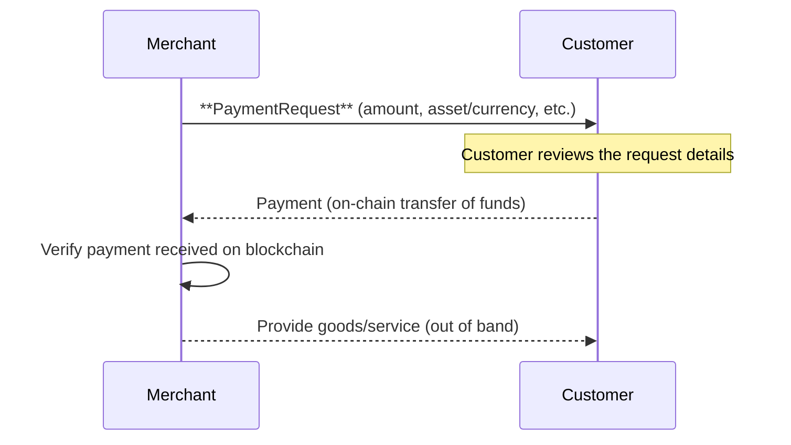
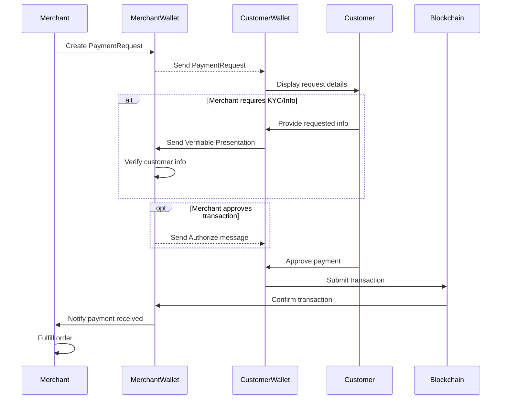
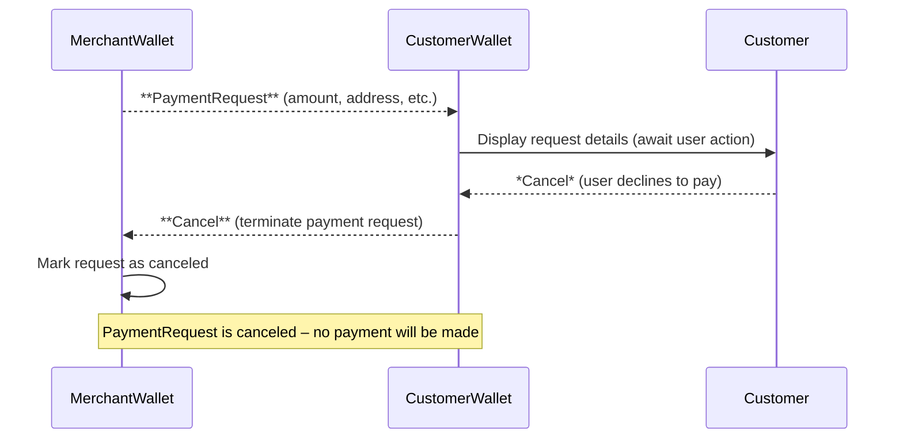

## Simple Summary

A standard for **Payment Requests** that allows a *merchant* (formerly "beneficiary") to request a blockchain payment from a *customer* (formerly "originator"). This proposal defines a PaymentRequest message including the amount due (in either a specific asset or fiat currency), the destination address, and any required customer information.

## Abstract

Traditional on-chain transactions are push-only and irreversible [TAIP-4], making it challenging to replicate familiar payment flows (like e-commerce invoices) on public blockchains. This proposal extends the Transaction Authorization Protocol to support *pull payments* initiated by merchants. A PaymentRequest message lets a merchant specify an amount and asset or currency for payment, optionally denominated in fiat (ISO 4217) with supported crypto assets [CAIP-19]. It also allows merchants to require additional customer details (e.g. email, billing/shipping address) via a `RequirePresentation` policy as defined in [TAIP-8], instead of sharing personal data in the clear. We replace the terms **originator** and **beneficiary** from [TAIP-3] with **customer** and **merchant** for clarity in both retail and b2b scenarios, while maintaining compatibility with underlying roles defined in [TAIP-6].

## Motivation

**User-Friendly Crypto Payments:** Today's blockchain payments lack a built-in request/response flow comparable to invoicing or checkout in traditional payments. By enabling merchants to send PaymentRequests to customers, we facilitate typical e-commerce use cases where a customer is prompted to pay a specified amount to a merchant. Using **"customer"** and **"merchant"** terminology (instead of originator/beneficiary) makes the roles more intuitive in retail contexts, without changing their underlying meaning (payer and payee).

**Flexible Asset/Currency Support:** A merchant may want payment in a particular cryptocurrency or in an amount of fiat currency. This proposal ensures a PaymentRequest can specify **either a crypto asset or a fiat currency** (one is required). If a fiat currency (per ISO 4217 code, e.g. USD) is given, the request may include a list of acceptable crypto assets that the merchant supports for settling that currency amount. This gives customers flexibility in *how* to pay (e.g. choose USDC or DAI to settle a $100.00 invoice) while ensuring the merchant's requirements are clear. It also lays groundwork for dynamic currency conversion by wallets if needed.

**Improved Compliance and Data Privacy:** Merchants often need additional customer details (for compliance with regulations like the Travel Rule, or for business purposes like shipping). Instead of including personally identifiable information in the payment request (which would risk exposure to other parties) [TAIP-8], the merchant can declare a `RequirePresentation` policy (as per [TAIP-8]) in the PaymentRequest. This signals that the customer's wallet must present certain credentials (e.g. proof of identity, email, shipping address) privately to the merchant's agent before or alongside payment. By leveraging [TAIP-8] selective disclosure, sensitive data is exchanged **only** between the requesting merchant and the customer, minimizing privacy risks.

**Partial Payments Handling:** In some cases a customer may not be able to pay the full amount at once or may accidentally underpay. **partial payments are implicitly possible** and whether to accept them is determined by the customer's wallet and the merchant's policy. This change reflects that ultimately a wallet (originator's agent) decides if it will allow sending a partial amount (and possibly follow up with additional payments) to fulfill the total.

**Cancellation Capability:** Real-world payment flows allow either party to cancel an invoice or payment before completion (e.g. a customer abandons checkout, or a merchant voids an order). On blockchains, once a transaction is broadcast, it cannot be reversed [TAIP-4], but before settlement there should be a way to abort the process. We introduce a **Cancel** message in [TAIP-4] so that any agent involved can signal termination of the PaymentRequest thread. The `Cancel` action complements these by allowing a voluntary cancellation (distinct from a policy-based rejection). For example, a customer's wallet can send Cancel if the user declines to proceed, or a merchant's system can Cancel if the payment window expired or the order was invalidated. This improves the user experience by explicitly closing the loop in failure cases, informing both sides that no payment will occur.

## Specification

### PaymentRequest Message

A **PaymentRequest** is a [DIDComm] message (per [TAIP-2]) initiated by the merchant's agent and sent to the customer's agent to request a blockchain payment. It MUST include either an **`asset`** or a **`currency`** to denominate the payment, along with the amount and recipient information. The message structure is defined as follows (fields in **bold** are required):

- **`@type`** – Type identifier of the message, e.g. `"PaymentRequest"` (in context of TAIP message types).
- **`asset`** – *Optional*, **string** formatted as a CAIP-19 asset identifier [CAIP-19] or [DTI] specifying the exact crypto asset to be paid (including chain and asset details, e.g. `"eip155:1/erc20:0x...USDC"` for USDC on Ethereum). **Must be present if `currency` is not provided.**
- **`currency`** – *Optional*, **string** ISO 4217 currency code specifying a fiat currency for the requested amount (e.g. `"USD"` for US Dollars). **MUST be present if `asset` is not provided.**
- **`amount`** – **Required**, **number or string** indicating the amount requested. This amount is interpreted in the context of the provided `asset` or `currency`. For a fiat `currency`, this is a decimal currency amount (e.g. `100.00` if currency is USD). For an `asset`, it may be in the minimal unit of that asset or a decimal string, depending on asset's conventions.
- **`supportedAssets`** – *Optional*, **array of strings** ([CAIP-19] or [DTI] asset identifiers). If `currency` is given (fiat-denominated request), this field can list which crypto assets are acceptable to settle that currency amount. Each entry is an asset the merchant will accept as payment for the given fiat amount. For example, a PaymentRequest might specify `"currency": "EUR", "amount": "50.00", "supportedAssets": ["eip155:1/erc20:0xA0b86991..."]` to indicate €50.00 can be paid in USDC on Ethereum (asset listed) or potentially other listed stablecoins. If `supportedAssets` is omitted for a fiat request, it implies the customer's wallet may choose any asset to settle that amount, subject to the merchant and wallet's out-of-band agreement or policy.
- **`invoice`** - *Optional*, **URI** URL to an invoice
- **`expiry`** – *Optional*, **timestamp** indicating an expiration time for the request. After this time the merchant may no longer honor the payment (e.g. if exchange rates or inventory changed). The customer's wallet SHOULD treat an expired PaymentRequest as invalid and not allow payment. If omitted, the request is considered valid until canceled or fulfilled.
- **`merchant`** – **Required**, **object** containing information about the merchant (the payment beneficiary) and any policies or requirements for this transaction. This object represents the merchant's **Party** as defined in [TAIP-6] (with real-world identity as a DID or IRI). It MAY include:
  - **`@id`** – **string** URI/IRI for the merchant's identity (e.g. a DID or business registry identifier). This identifies the merchant party in a standard way [TAIP-6].
  - *Other identifying details* – *Optional*, any additional public information about the merchant, such as a display `name`, logo, or description. (This data should be non-sensitive; see Privacy Considerations.)
  - **`requirePresentation`** – *Optional*, **array** of policy objects each of type `RequirePresentation`. This specifies that the merchant requires certain verifiable information from the customer before or alongside payment. Each entry is a request for a verifiable presentation as defined in **TAIP-8**. For example, a merchant might include a policy: `{ "@type": "RequirePresentation", "fromAgent": "originator", "about": "...", "credentialType": "email" }` to require the customer's agent (originator) to present an email credential. In general, a `RequirePresentation` policy will indicate **which party's agent** must present data (e.g. `fromAgent: "originator"` meaning the customer's side) and **what data** is needed (either by specifying credential type, or a schema, etc.) [TAIP-8]. The exact format and additional fields for these policies follow TAIP-8 and TAIP-7 (Agent Policies). When a PaymentRequest contains `requirePresentation` entries, the customer's wallet MUST prompt the user to provide the requested credentials or proofs, and return them to the merchant's agent (see Flow below). The merchant's agent will verify the provided information (e.g. check the credentials' validity) before authorizing the payment to proceed.
- **`customer`** – *Optional*, **object** for information about the customer (payer). In many cases, the merchant may not know the customer's identity at the time of issuing the request (for example, if the PaymentRequest is delivered via a public QR code or link). This object can be omitted or left minimal in such cases. If the merchant does know the customer's identity or wants to bind the request to a specific customer, they MAY include an identifier here (e.g. the customer's DID or reference). The `customer` object could simply be: `{ "@id": "did:example:alice" }` to target a specific party. Even if provided, this field is mainly informational; the DIDComm transport (to the customer's agent) or context of delivery typically ensures the request reaches the intended customer.


### Payment Authorization Flow

Once a PaymentRequest is sent by the merchant's agent, the transaction can progress through various states as messages are exchanged and the on-chain payment is executed. PaymentRequests operate within the **Transaction Authorization Protocol** defined in [TAIP-4]. In particular, the PaymentRequest message serves as the initial transaction request to which subsequent authorization messages (Authorize, Settle, Reject, Cancel, Revert) will refer via the `thid` (thread ID).

Any agent that is part of the transaction (customer's or merchant's) can send [TAIP-4] authorization messages in response to the PaymentRequest:
- **Authorize:** Signals approval or readiness. (In a simple two-party payment, this may be optional. The merchant's agent might send an Authorize after receiving required info, or the customer's agent might implicitly consider the request authorized by the user's acceptance.)
- **Settle:** Indicates an agent is sending the transaction to the blockchain for settlement [TAIP-4]. In practice, the customer's wallet will perform the actual settlement (broadcast the payment). It may send a `Settle` message to inform the merchant that it is doing so or has done so.
- **Reject:** Indicates an agent rejects the transaction (e.g. due to policy or error) [TAIP-4]. For instance, if the merchant's compliance checks fail after seeing the customer's info, the merchant's agent could reject the payment request, refusing to accept funds.
- **Cancel:** Indicates a party or agent is voluntarily cancelling the PaymentRequest. This is newly introduced with this proposal. Either party can issue `Cancel` to abort the process when it's not going to proceed. For example, the customer's wallet can send Cancel if the user declines to pay or takes too long, or the merchant can send Cancel if the invoice is no longer valid or they choose to revoke it. When a Cancel is sent, the expectation is that no further authorization messages or payments for that request should occur. (Cancellation is essentially a polite *handshake* to terminate the thread, whereas a Reject might be used to convey a compliance or error-based refusal.)
- **Revert:** Indicates an party requests the reversal of the transaction [TAIP-4], which is a key aspect of building customer trust in a merchant payment system.

See **Figure 1** for a potential statemachine

#### Figure 1: State machine from the point of view of merchant

```mermaid
stateDiagram-v2
    direction lr
    [*] --> Request : PaymentRequest
    Request --> Authorized : Authorize
    Request --> Rejected : Reject
    Request --> Cancelled : Cancel
    Authorized --> Settled : Settle
    Settled -> ReversalRequested: Revert
    ReversalRequested -> Reversed: Settle
    ReversalRequested -> Settled: Reject
    Settled --> [*]
```

The following diagrams illustrate the payment flows. **Figure 2** is a high-level overview of a successful PaymentRequest flow between a merchant and customer. **Figure 3** shows a more detailed sequence with the involvement of each party's wallet and an example where the merchant requires additional customer information (per TAIP-8) before payment. **Figure 4** shows an example failure scenario where the customer cancels the PaymentRequest. (Other failure scenarios, such as merchant cancellation or rejection for policy reasons, follow a similar message pattern, with the merchant's agent sending a Cancel or Reject.)


#### Figure 2: High-Level Payment Request Flow (Success Scenario)



*Description:* In the high-level flow, the **Merchant** sends a PaymentRequest to the **Customer** for a certain amount. The Customer (via their wallet) sends the payment to the merchant's blockchain address. Once the payment is confirmed, the merchant fulfills the order (delivers the product or service). This diagram omits the low-level messaging and focuses on the core intent and outcome.

#### Figure 3: Detailed Payment Flow with Required Presentation (Successful Payment)



*Description:* This detailed sequence involves the **Merchant's agent (MerchantWallet)** and **Customer's agent (CustomerWallet)** exchanging messages. The merchant's wallet first sends a PaymentRequest to the customer's wallet, including a blockchain **address**, the **amount**, and a policy requiring additional information (for example, an email for receipt, and shipping address for delivery). The Customer's wallet alerts the **Customer** (user) with the details and asks for the required information. The user provides the info, which the wallet packages into a **Verifiable Presentation** (per TAIP-8) and returns to the merchant's wallet. The merchant's wallet verifies the credentials (ensuring they meet policy). Once satisfied, the merchant's wallet (or the merchant) can optionally send an **Authorize** message indicating everything is in order. The **Customer** then approves the payment, prompting the Customer's wallet to submit the blockchain transaction to the **Blockchain** network (this is depicted as a `Settle` action and the actual on-chain transfer). When the blockchain confirms the payment, the Merchant's wallet is notified (by listening to the blockchain or via an event). Finally, the **Merchant** is informed and can now consider the payment complete—at which point they deliver the product or service to the customer (this last step occurs off-chain, but is triggered by the confirmed payment).

**Notes:** In this flow, if any required presentation was missing or invalid, the merchant's agent could send a **Reject** instead of Authorize, or simply not authorize the payment (the customer might then choose not to pay). The optional Authorize step can be omitted in a simple implementation; the customer could directly send the transaction once they've provided the required info (implying consent). The `Authorize` message is more relevant in multi-agent scenarios or where the merchant wants to explicitly signal readiness. Also note that partial payments are not explicitly shown – if the customer decided to send only a portion of the amount, the CustomerWallet would still do a Settle with that amount. The merchant's wallet would detect a shortfall and could either treat it as a partial (awaiting the rest) or send a Reject (if partial not acceptable), according to its policy.

#### Figure 4: Payment Request Flow with Cancellation (Failure Scenario)



*Description:* In this failure scenario, the merchant's wallet sends a PaymentRequest, but the customer decides not to proceed (for any reason – maybe they canceled the checkout or disagreed with the terms). The **Customer's wallet** then sends a **Cancel** message to the **Merchant's wallet**, notifying that the request is aborted. Both sides consider the payment request closed. The merchant's wallet may notify the merchant system to void the invoice or record the cancellation. Similarly, if the merchant needed to cancel (e.g. the order was out-of-stock or expired), the merchant's wallet would send a Cancel to the customer's wallet, which would inform the user. In either case, the Cancel message definitively ends that PaymentRequest thread. This differs from a **Reject** in that it isn't necessarily due to rule violations; it's a voluntary termination (any outstanding authorization or info exchange stops here). After a Cancel, the customer is not expected to send payment, and the merchant should not accept a payment if one somehow arrives late (they might refund it or handle it out of band).

## Security Considerations

Because PaymentRequests involve off-chain negotiation and on-chain settlement, there are security implications on both sides:

- **Authentication and Integrity:** It is critical that the customer's wallet verify that a PaymentRequest actually comes from the legitimate merchant's agent (and not an attacker). Using the DIDComm messaging framework (TAIP-2) provides message authentication and encryption, ensuring the request cannot be tampered with or spoofed in transit. The merchant's `@id` (DID or IRI) in the message should be trusted or resolved via a secure channel. Wallets should present the merchant identity to the user (e.g. display the merchant name or verified identifier) so the user can confirm they are paying the right party.

- **Address Verification:** The blockchain address in the PaymentRequest must belong to the merchant. If an attacker substituted their own address, funds could be stolen. By securing the DIDComm channel and possibly using **Proof of Relationship** (TAIP-9) or other mechanisms, the customer can be assured the address is provided by the merchant's agent. Merchants might sign the PaymentRequest content as an extra guarantee. Implementations should also consider showing the user the target address (or a recognizable name for it) and possibly checking it against known reputations or warnings (to avoid phishing).

- **Denial of Service:** A merchant's system could send many PaymentRequests or require excessive presentations, overwhelming the customer, or vice versa customers could repeatedly request PaymentRequests (if the protocol were extended for customers to solicit invoices). Rate-limiting and user consent are important. Customers should only receive PaymentRequests from merchants they engaged with (e.g. by scanning a QR or clicking a link), and wallets may require user confirmation before responding with any data or payment. Similarly, merchants should not rely on just Cancel to stop all issues—if a malicious customer keeps retrying or sending nonsense info, the merchant's agent might use a Reject and blacklist the party.

## Privacy Considerations

PaymentRequests are designed to minimize unnecessary exposure of personal data by leveraging selective disclosure [TAIP-8]:

- The **`requirePresentation`** mechanism ensures that sensitive customer information (PII) is **not included directly in the PaymentRequest** message broadcast to all agents. Instead, only the agent that needs the info (usually the merchant's agent) receives it, and only after explicitly requesting it [TAIP-8]. For example, if the merchant requires the customer's email for receipt, the email is provided in a private presentation straight to the merchant, rather than being embedded in the PaymentRequest which might be visible to other intermediaries in the protocol. This aligns with the principle of data minimization, reducing exposure in case any other agents or network observers are involved.

- **Data Transparency to User:** The customer should be informed what information is being requested and why. Wallet UIs should clearly show the user which credentials or data the merchant is asking for (e.g. "Merchant requests your email address for sending a receipt"), allowing the user to consent. This transparency, combined with the trust framework of verifiable credentials, helps protect user privacy and autonomy.

- **Address Reuse:** As noted, merchants should use unique addresses per PaymentRequest. Using the same blockchain address for multiple customers or requests could allow different customers' activities to be linked, undermining privacy. Unique addresses ensure that on-chain payment records cannot be trivially correlated across different transactions or users.

- **Traceability and Records:** The PaymentRequest itself could be stored by either party for record-keeping (e.g. the merchant might save the invoice details, the customer might save proof of what was requested). These records might include pseudonymous identifiers (DIDs, addresses) and amounts. Implementers should treat these records with care, especially if they include any personal data. For instance, if the customer's DID can be tied to an identity, it should be protected. We recommend following data protection best practices for any logging of PaymentRequests, and scrubbing or encrypting sensitive fields at rest.

- **Regulatory Compliance:** In some jurisdictions, requesting certain information (like government ID) may invoke privacy laws. [TAIP-8] and this specification allow for compliance with regulations by VASPs and PSPs (e.g. Travel Rule) in a privacy-preserving way. Only the required info is exchanged, and possibly in a hashed or reference form if supported (for example, using identity proxies or proof of KYC status instead of full data). Parties should ensure that any personal data exchange through `RequirePresentation` adheres to applicable privacy regulations and that they only request what is necessary for the transaction's purpose.

By incorporating selective disclosure and unique payment addresses, the PaymentRequest protocol seeks to balance **traceability** (for businesses and compliance) with **privacy** for customers. Each party only learns what they need to know to complete the transaction, and nothing more. Any data that is exchanged is kept off the public ledger and shared directly between the relevant agents, reducing the risk of leakage or unwanted correlation.

## References

[TAIP-2]: ./taip-2 "TAP Messaging"
[TAIP-3]: ./taip-3 "Asset Transfer"
[TAIP-4]: ./taip-4 "Transaction Authorization Protocol"
[TAIP-6]: ./taip-6 "Transaction Parties"
[TAIP-7]: ./taip-7 "Agent Policies"
[TAIP-8]: ./taip-8 "Selective Disclosure"
[TAIP-9]: ./taip-9 "Proof of Relationship"
[CAIP-19]: https://chainagnostic.org/CAIPs/caip-19 "Asset Type and Asset ID Specification"
[BIP-70]: https://github.com/bitcoin/bips/blob/master/bip-0070.mediawiki "Payment Protocol"
[BIP-75]: https://github.com/bitcoin/bips/blob/master/bip-0075.mediawiki "Out of Band Address Exchange using Payment Protocol Encryption"
[DTI]: https://www.iso.org/obp/ui/en/#iso:std:iso:24165:-1:ed-1:v1:en
[ISO-4217]: https://www.iso.org/iso-4217-currency-codes.html "Currency Codes"

## Copyright

Copyright and related rights waived via [CC0].
