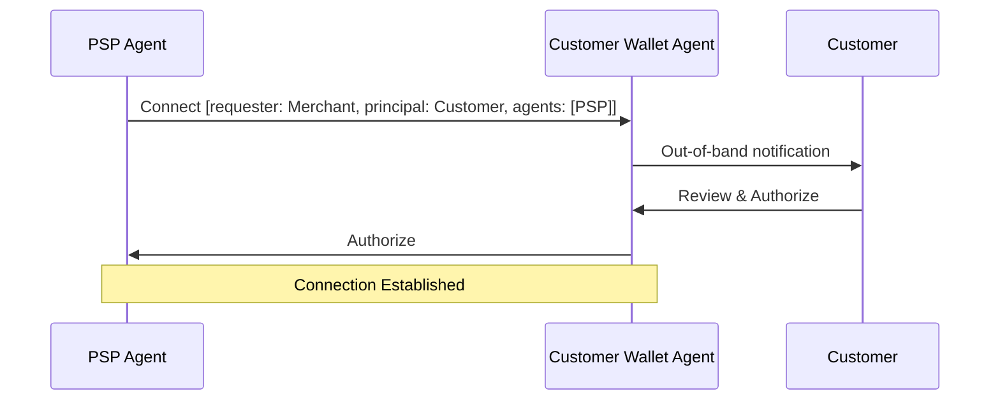
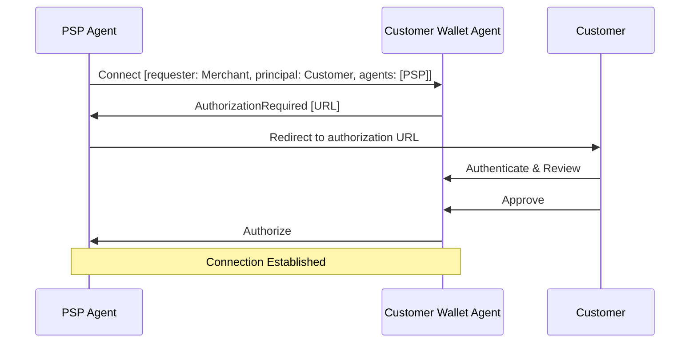
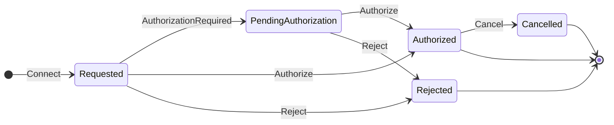
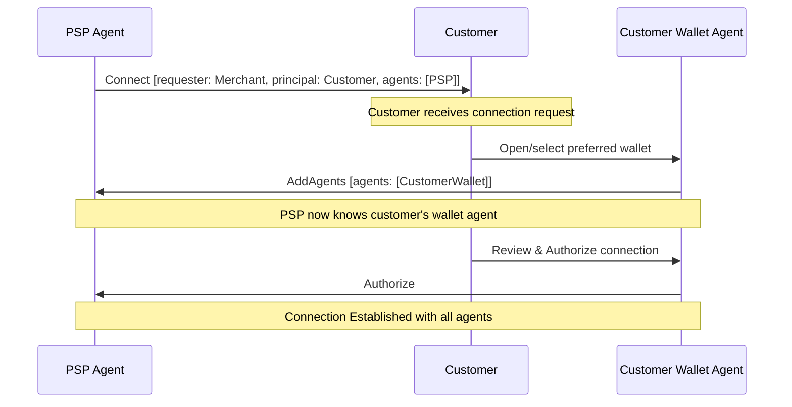
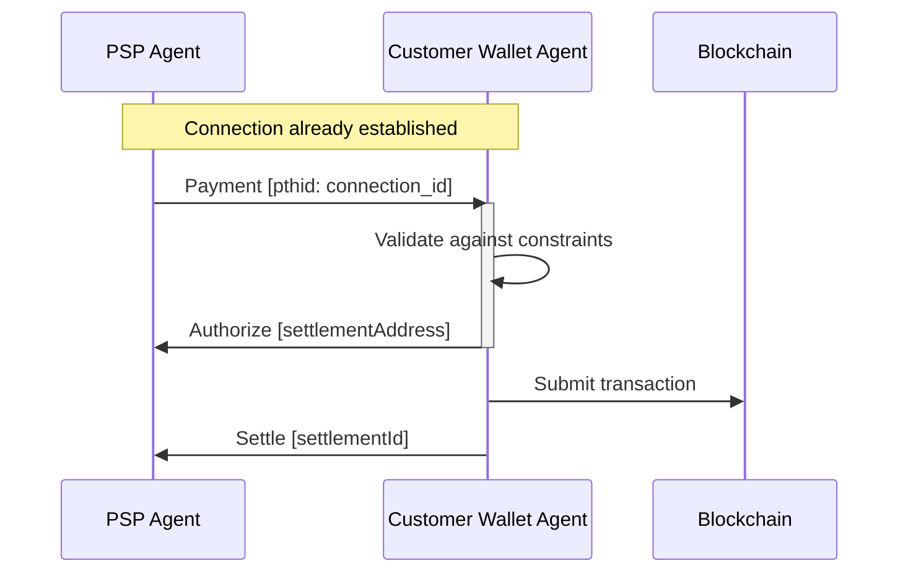

## Simple Summary

A standard protocol for establishing secure, authorized connections between agents in the Transaction Authorization Protocol ecosystem, with support for OAuth-style authorization flows and transaction constraints.

## Abstract

This TAIP defines a protocol for agents to establish secure, authorized connections with each other, particularly for ongoing business relationships like agentic initiated transaction workflows as well as recurring and metered billing. It builds on [TAIP-2] messaging, [TAIP-9] relationship proofs, and [TAIP-13] purpose codes to provide a standardized way for agents to request and authorize connections with transaction constraints. The protocol includes OAuth-style authorization flows, allowing interactive user consent when needed, and supports defining transaction limits and allowed purposes upfront.

## Motivation

The Transaction Authorization Protocol enables secure communication between different agents (AI Agents, VASPs, wallets, custodians, etc.). However, for ongoing business relationships, agents need a way to establish persistent, authorized connections with predefined constraints. Current implementations often rely on ad-hoc methods or require repeated authorizations. This TAIP addresses several key needs:

1. **AI Agent Transactions:** Autonomous AI agents executing trades, payments, or financial operations within user-defined limits and purposes (e.g., trading bot with $10k daily limit for crypto arbitrage).
2. **Subscription & Recurring Payments:** SaaS platforms, streaming services, and membership organizations collecting recurring fees (e.g., monthly Netflix subscription, annual software licenses, usage-based cloud billing).
3. **Self-Onboarding Services:** Entities directly onboarding with service providers where the agent and principal are the same party (e.g., a merchant directly connecting to a payment processor's API, a business self-registering with a financial platform).

4. **Corporate Treasury Management:** CFO tools and treasury platforms managing cash flows, vendor payments, and payroll on behalf of businesses (e.g., automated supplier payments, cross-border payroll processing).
5. **Expense Management Systems:** Corporate payment wallet programs and expense platforms processing employee reimbursements and vendor payments (e.g., Expensify submitting reimbursements, Ramp processing corporate card settlements).
6. **Marketplace & Platform Payouts:** E-commerce platforms, gig economy apps, and creator platforms distributing earnings (e.g., Shopify merchant payouts, Uber driver payments, YouTube creator revenue sharing).
7. **Automated Compliance & Reporting:** RegTech solutions performing automated transaction monitoring, tax withholding, and regulatory reporting (e.g., automatic tax payments, AML transaction screening).
8. **Cross-Border Payment Services:** International payment providers and remittance services executing FX conversions and transfers (e.g., Wise business accounts, payroll providers handling multi-currency payments).
9. **DeFi Protocol Integration:** Decentralized protocols performing automated yield farming, liquidity provision, or collateral management (e.g., auto-compounding vaults, algorithmic trading strategies).

By standardizing these connection aspects, we enable secure B2B integrations while maintaining user control and risk management. Each connection enforces specific constraints including transaction limits, allowed purposes, and time boundaries.

## Specification

### Message Types

All messages implement [TAIP-2] and are sent between [TAIP-5 Agents][TAIP-5]. Each message type has specific requirements for its body object. The principal-agent relationship follows the model defined in [TAIP-6], where agents act on behalf of real-world parties.

### Parties and Agent Roles

The Agent Connection Protocol involves two distinct parties and their respective agents:

**Requester Party**: The party that initiates the connection request. This is typically a service provider, merchant, or other entity seeking permission to perform transactions on behalf of or with another party. The requester party is represented by one or more agents that handle the technical aspects of the connection process.

**Principal Party**: The party that the requester wants to establish a connection with, and on whose behalf future transactions may be performed. This is typically a customer, user, or business entity that will authorize the connection and set transaction constraints. The principal party may have their own agents (such as wallet providers or custodial services) that act on their behalf.

**Agent Relationships**: 
- The requester's agent initiates the Connect message and must be included in the `agents` array with a `for` attribute pointing to the requester's DID
- The principal's agent(s) may be added during the connection process using AddAgent messages as replies to the Connect thread
- Each agent clearly identifies which party it represents through the `for` attribute as defined in [TAIP-5]
- Multiple agents can represent the same party for different capabilities (e.g., compliance, wallet services, settlement)

This separation allows for complex B2B relationships where a service provider (requester) wants to act on behalf of their customer (principal) while maintaining clear accountability and authorization chains.

### Connect Message

A message sent by an agent requesting connection to another agent:

- `@context` - REQUIRED the JSON-LD context `https://tap.rsvp/schema/1.0`
- `@type` - REQUIRED the JSON-LD type `https://tap.rsvp/schema/1.0#Connect`
- `requester` - REQUIRED [TAIP-6] Party object representing the party requesting the connection:
  - `@id` - REQUIRED string DID or IRI of the requesting party
  - Additional attributes MAY be included as defined in [TAIP-6], such as country code, merchant category code, or other party metadata
- `principal` - REQUIRED [TAIP-6] Party object representing the party the requesting agent acts on behalf of:
  - `@id` - REQUIRED string DID or IRI of the principal party
  - Additional attributes MAY be included as defined in [TAIP-6], such as country code, merchant category code, or other party metadata
- `agents` - REQUIRED array of agent objects representing agents involved in the connection process. Each agent object follows [TAIP-5] specification. At minimum, there MUST be one agent in this array whose `@id` matches the `from` field of the surrounding DIDComm message and has a `for` attribute set to the `requester` DID
- `constraints` - REQUIRED object specifying the requested transaction constraints:
  - `purposes` - OPTIONAL array of [TAIP-13] purpose codes
  - `categoryPurposes` - OPTIONAL array of [TAIP-13] category purpose codes
  - `limits` - OPTIONAL object containing transaction limits:
    - `per_transaction` - OPTIONAL string decimal amount
    - `per_day` - OPTIONAL string decimal amount
    - `per_week` - OPTIONAL string decimal amount
    - `per_month` - OPTIONAL string decimal amount
    - `per_year` - OPTIONAL string decimal amount
    - `currency` - REQUIRED string ISO 4217 currency code if limits are specified
- `agreement` - OPTIONAL string URL pointing to terms of service or agreement between the principal and requesting agent
- `expiry` - OPTIONAL timestamp in ISO 8601 format indicating when the connection request expires. After this time, if no authorization has occurred, the connection request should be considered invalid. This is distinct from the technical message expiry handled by the DIDComm `expires_time` header.

### AuthorizationRequired Message

A message sent in response to a Connect request when interactive authorization is needed. This message follows the specification defined in [TAIP-4] for interactive authorization flows.

- `@context` - REQUIRED the JSON-LD context `https://tap.rsvp/schema/1.0`
- `@type` - REQUIRED the JSON-LD type `https://tap.rsvp/schema/1.0#AuthorizationRequired`
- `authorizationUrl` - REQUIRED string URL where the user can authorize the connection
- `expires` - REQUIRED string ISO 8601 timestamp when the authorization URL expires
- `from` - OPTIONAL the party type (e.g., `customer`, `principal`, or `originator`) that is required to open the URL

For the complete specification of this message type, see [TAIP-4].

### Authorize Message

A message sent to approve a connection request:

- `@context` - REQUIRED the JSON-LD context `https://tap.rsvp/schema/1.0`
- `@type` - REQUIRED the JSON-LD type `https://tap.rsvp/schema/1.0#Authorize`

### Reject Message

A message sent to reject a connection request:

- `@context` - REQUIRED the JSON-LD context `https://tap.rsvp/schema/1.0`
- `@type` - REQUIRED the JSON-LD type `https://tap.rsvp/schema/1.0#Reject`
- `reason` - OPTIONAL string human-readable reason for rejection

### Cancel Message

A message sent by principal to terminate an existing connection:

- `@context` - REQUIRED the JSON-LD context `https://tap.rsvp/schema/1.0`
- `@type` - REQUIRED the JSON-LD type `https://tap.rsvp/schema/1.0#Cancel`
- `by` - REQUIRED should be `principal`
- `reason` - OPTIONAL string human-readable reason for cancellation

### AddAgents Message

A message sent to add additional agents to the connection process as defined in [TAIP-5]. This is particularly useful for adding the principal's agent after the initial Connect request:

- `@context` - REQUIRED the JSON-LD context `https://tap.rsvp/schema/1.0`
- `@type` - REQUIRED the JSON-LD type `https://tap.rsvp/schema/1.0#AddAgents`
- `agents` - REQUIRED an array of agent objects to add to the connection. Each agent object follows [TAIP-5] specification

For complete specification of this message type, see [TAIP-5].

### Connection Flow

1. Agent A sends Connect message to Agent B with:
   - The requesting party's identity
   - The principal party they represent
   - Agent identities and endpoints in the agents array
   - Desired transaction constraints

2. Agent B chooses an authorization method:
   - Option 1: Out-of-band Authorization
     - Notifies customer through existing channels
     - Customer logs into VASP's service to review
   - Option 2: Authorization URL
     - Returns AuthorizationRequired with URL
     - Customer opens URL to review and authenticate

3. Customer reviews and decides:
   - Views connection details and constraints
   - Approves or denies through chosen interface

4. Agent B sends final response:
   - Authorize message if approved
   - Reject message if denied

5. Agent addition (if needed):
   - Additional agents may be added using AddAgent messages as replies to the Connect thread
   - This allows the principal's agent to be included if not initially present

6. Once authorized:
   - Connection is established with a unique identifier
   - Future transactions must respect the agreed constraints
   - Either party can Cancel the connection

### Out-of-Band Initiation

To initiate a connection with a party that hasn't communicated before, agents MUST support [Out-of-Band Messages](https://identity.foundation/didcomm-messaging/spec/v2.1/#out-of-band-messages). The OOB message allows sharing the Connect request through URLs or QR codes.

OOB messages for Connect requests:

1. MUST use the `https://didcomm.org/out-of-band/2.0` protocol
2. MUST include the goal_code `tap.connect`
3. SHOULD be shared as URLs according to the [Out-of-Band message spec](https://identity.foundation/didcomm-messaging/spec/v2.1/#out-of-band-messages)
4. MUST include the Connect message as a signed DIDComm message in the attachment

Example Out-of-Band message with Connect request:

```json
{
  "type": "https://didcomm.org/out-of-band/2.0/invitation",
  "id": "2e9e257c-2839-4fae-b0c4-dcd4e2159f4e",
  "from": "did:example:b2b-service",
  "body": {
    "goal_code": "tap.connect",
    "goal": "Establish agent connection",
    "accept": ["didcomm/v2"]
  },
  "attachments": [{
    "id": "connect-request-1",
    "mime_type": "application/didcomm-signed+json",
    "data": {
      "json": {
        "type": "https://tap.rsvp/schema/1.0#Connect",
        "id": "599f7220-6149-4c45-adbb-86d96c8e0608",
        "from": "did:example:b2b-service",
        "body": {
          "@context": "https://tap.rsvp/schema/1.0",
          "@type": "https://tap.rsvp/schema/1.0#Connect",
          "requester": {
            "@id": "did:example:b2b-service"
          },
          "principal": {
            "@id": "did:example:business-customer"
          },
          "agents": [
            {
              "@id": "did:example:b2b-service",
              "name": "B2B Payment Service",
              "for": "did:example:b2b-service"
            }
          ],
          "constraints": {
            "purposes": ["BEXP", "SUPP"]
          },
          "agreement": "https://b2b-service.com/terms"
        },
        "attachments": [],
        "created_time": 1516269022
      }
    }
  }]
}
```

The corresponding URL format would be either:
```
https://example.com/path?_oob=eyJ0eXAiOiJKV1QiLCJhbGciOiJFZERTQSJ9...
```

Or using the shorter `_oobid` parameter that references a previously published Out-of-Band message:
```
https://example.com/path?_oobid=2e9e257c-2839-4fae-b0c4-dcd4e2159f4e
```

Where the `_oob` parameter contains the base64url-encoded Out-of-Band message, or the `_oobid` parameter contains a unique identifier that can be resolved to retrieve the full Out-of-Band message.

### Connection Flow Diagrams

#### Basic Connection Flow with Direct Authorization



#### Connection Flow with Interactive Authorization



#### Connection State Machine



#### Connection Flow with AddAgents

The following diagram shows how a customer's wallet agent can join the connection using AddAgents:



### Transaction Flow Using Connection

The following diagram shows how an established connection is used for subsequent transactions:



### Connection Security

- All messages MUST be encrypted using [TAIP-2] message encryption
- Agents MUST verify DIDs and signatures before accepting connections
- Authorization MUST be performed through secure, authenticated channels
- Authorization URLs MUST use HTTPS and include CSRF protection
- Connection identifiers should be unique and unpredictable
- When using `serviceUrl` in the agent object:
  - The URL MUST use HTTPS for security
  - Agents MUST prioritize DIDComm service endpoints from the DID document over the `serviceUrl` field
  - The `serviceUrl` SHOULD only be used when no valid DIDComm service endpoint is resolvable from the DID document
  - Agents SHOULD validate that the `serviceUrl` actually belongs to the DID holder through appropriate verification mechanisms

## Rationale

The design choices in this specification aim to balance security, usability, and flexibility:

- **Flexible Authorization:** Supports both out-of-band and URL-based flows
- **Purpose Codes:** Uses [TAIP-13] for standardized transaction types
- **Transaction Limits:** Provides clear constraints for risk management
- **Connection Identifiers:** Enable tracking and management of approved connections
- **State Management:** Receiving agents track connection status

## Security Considerations

- **Authorization Flow:** Must use secure authentication channels
- **Authorization URLs:** Must prevent CSRF and phishing attacks
- **Connection Identifiers:** Must be unique and unpredictable
- **Transaction Limits:** Must be enforced server-side
- **Connection State:** Must be securely maintained

## Privacy Considerations

- **Minimal Disclosure:** Only exchange necessary information
- **User Consent:** Clear authorization UI showing permissions
- **Connection Isolation:** Unique identifiers per connection
- **Data Retention:** Clear connection data when terminated
- **Audit Logs:** Balance logging with privacy

## Test Cases

The following are example plaintext messages. See [TAIP-2] for how to sign the messages.

### Connect

```json
{
  "id": "123e4567-e89b-12d3-a456-426614174000",
  "type": "https://tap.rsvp/schema/1.0#Connect",
  "from": "did:example:b2b-service",
  "to": ["did:example:vasp"],
  "created_time": 1516269022,
  "body": {
    "@context": "https://tap.rsvp/schema/1.0",
    "@type": "https://tap.rsvp/schema/1.0#Connect",
    "requester": {
      "@id": "did:example:b2b-service"
    },
    "principal": {
      "@id": "did:example:business-customer"
    },
    "agents": [
      {
        "@id": "did:example:b2b-service",
        "name": "B2B Payment Service",
        "serviceUrl": "https://b2b-service/did-comm",
        "for": "did:example:b2b-service"
      }
    ],
    "constraints": {
      "purposes": ["BEXP", "SUPP"],
      "categoryPurposes": ["CASH", "CCRD"],
      "limits": {
        "per_transaction": "10000.00",
        "per_day": "50000.00",
        "currency": "USD"
      }
    },
    "agreement": "https://b2b-service.com/terms/api-agreement",
    "expiry": "2024-03-22T15:00:00Z"
  }
}
```

### AuthorizationRequired

```json
{
  "id": "98765432-e89b-12d3-a456-426614174001",
  "type": "https://tap.rsvp/schema/1.0#AuthorizationRequired",
  "from": "did:example:vasp",
  "to": ["did:example:b2b-service"],
  "thid": "123e4567-e89b-12d3-a456-426614174000",
  "created_time": 1516269023,
  "expires_time": 1516385931,
  "body": {
    "@context": "https://tap.rsvp/schema/1.0",
    "@type": "https://tap.rsvp/schema/1.0#AuthorizationRequired",
    "authorizationUrl": "https://vasp.com/authorize?request=abc123",
    "expires": "2024-03-22T15:00:00Z"
  }
}
```

### Authorize

```json
{
  "id": "abcdef12-e89b-12d3-a456-426614174002",
  "type": "https://tap.rsvp/schema/1.0#Authorize",
  "from": "did:example:vasp",
  "to": ["did:example:b2b-service"],
  "thid": "123e4567-e89b-12d3-a456-426614174000",
  "created_time": 1516269024,
  "body": {
    "@context": "https://tap.rsvp/schema/1.0",
    "@type": "https://tap.rsvp/schema/1.0#Authorize"
  }
}
```

### Reject

```json
{
  "id": "76543210-e89b-12d3-a456-426614174003",
  "type": "https://tap.rsvp/schema/1.0#Reject",
  "from": "did:example:vasp",
  "to": ["did:example:b2b-service"],
  "thid": "123e4567-e89b-12d3-a456-426614174000",
  "created_time": 1516269024,
  "body": {
    "@context": "https://tap.rsvp/schema/1.0",
    "@type": "https://tap.rsvp/schema/1.0#Reject",
    "reason": "unauthorized"
  }
}
```

### Cancel

```json
{
  "id": "fedcba98-e89b-12d3-a456-426614174004",
  "type": "https://tap.rsvp/schema/1.0#Cancel",
  "from": "did:example:vasp",
  "to": ["did:example:b2b-service"],
  "thid": "123e4567-e89b-12d3-a456-426614174000",
  "created_time": 1516269025,
  "body": {
    "@context": "https://tap.rsvp/schema/1.0",
    "@type": "https://tap.rsvp/schema/1.0#Cancel",
    "reason": "user_requested"
  }
}
```

### Self-Onboarding Example

The following example shows a merchant directly onboarding with a payment processor where the agent and principal are the same entity:

```json
{
  "id": "789abcde-e89b-12d3-a456-426614174006",
  "type": "https://tap.rsvp/schema/1.0#Connect",
  "from": "did:example:merchant",
  "to": ["did:example:payment-processor"],
  "created_time": 1516269027,
  "body": {
    "@context": "https://tap.rsvp/schema/1.0",
    "@type": "https://tap.rsvp/schema/1.0#Connect",
    "requester": {
      "@id": "did:example:merchant"
    },
    "principal": {
      "@id": "did:example:merchant",
      "name": "Example Merchant Inc.",
      "countryCode": "US",
      "merchantCategoryCode": "5411"
    },
    "agents": [
      {
        "@id": "did:example:merchant",
        "name": "Example Merchant",
        "for": "did:example:merchant"
      }
    ],
    "constraints": {
      "purposes": ["SALA", "GDDS"],
      "limits": {
        "per_transaction": "5000.00",
        "per_day": "25000.00",
        "currency": "USD"
      }
    },
    "agreement": "https://payment-processor.com/merchant-agreement",
    "expiry": "2024-03-25T00:00:00Z"
  }
}
```

In this self-onboarding case:
- The `requester.@id` and `principal.@id` are the same DID (`did:example:merchant`)
- The agent's `@id` in the `agents` array matches the `from` field of the DIDComm message
- The merchant is acting as both the requesting party and the business principal
- There is one agent representing the merchant in the `agents` array
- The `agreement` field points to the merchant agreement terms

## Using Connections for Transactions

Once a connection is established, the connecting agent can perform transactions on behalf of the customer. All transactions related to a connection MUST include the connection's `id` as the `pthid` (parent thread ID) in the message header. This allows receiving agents to validate the transaction against the connection's constraints.

### Example Transfer Using Connection

The following example shows a [TAIP-3] Transfer message sent by a B2B service using their authorized connection to initiate a transfer on behalf of their customer:

```json
{
  "id": "456789ab-e89b-12d3-a456-426614174005",
  "type": "https://tap.rsvp/schema/1.0#Transfer",
  "from": "did:example:b2b-service",
  "to": ["did:example:vasp"],
  "pthid": "123e4567-e89b-12d3-a456-426614174000",
  "created_time": 1516269026,
  "body": {
    "@context": "https://tap.rsvp/schema/1.0",
    "@type": "https://tap.rsvp/schema/1.0#Transfer",
    "asset": "eip155:1/slip44:60",
    "amount": "1.23",
    "originator": {
      "@id": "did:example:business-customer"
    },
    "beneficiary": {
      "@id": "did:example:merchant"
    },
    "agents": [
      {
        "@id": "did:example:b2b-service",
        "principal": {
          "@id": "did:example:business-customer"
        }
      },
      {
        "@id": "did:example:vasp",
        "principal": {
          "@id": "did:example:merchant"
        },
        "role": "BeneficiaryVASP"
      }
    ]
  }
}
```

The receiving agent MUST:
1. Verify the connection ID in `pthid` exists and is active
2. Validate that the transaction complies with the connection's constraints:
   - Check that the purpose (if specified) is allowed
   - Verify the amount is within the per-transaction and daily limits
   - Confirm the originator's `@id` matches the connection's `principal.@id` value
   - Verify the agent has permission to act for the specified principal
3. Process the transaction according to [TAIP-4] if all checks pass


## References

* [TAIP-2] TAP Messaging
* [TAIP-4] Transaction Authorization Protocol
* [TAIP-6] Transaction Parties
* [TAIP-9] Proof of Relationship
* [TAIP-13] Purpose Codes

[TAIP-2]: ./taip-2 "TAP Messaging"
[TAIP-4]: ./taip-4 "Transaction Authorization Protocol"
[TAIP-6]: ./taip-6 "Transaction Parties"
[TAIP-9]: ./taip-9 "Proof of Relationship"
[TAIP-13]: ./taip-13 "Purpose Codes"

## Copyright

Copyright and related rights waived via [CC0].
