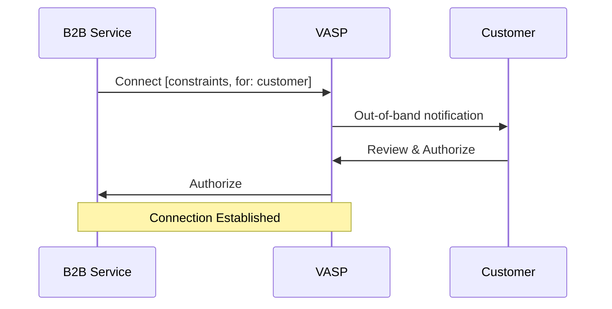
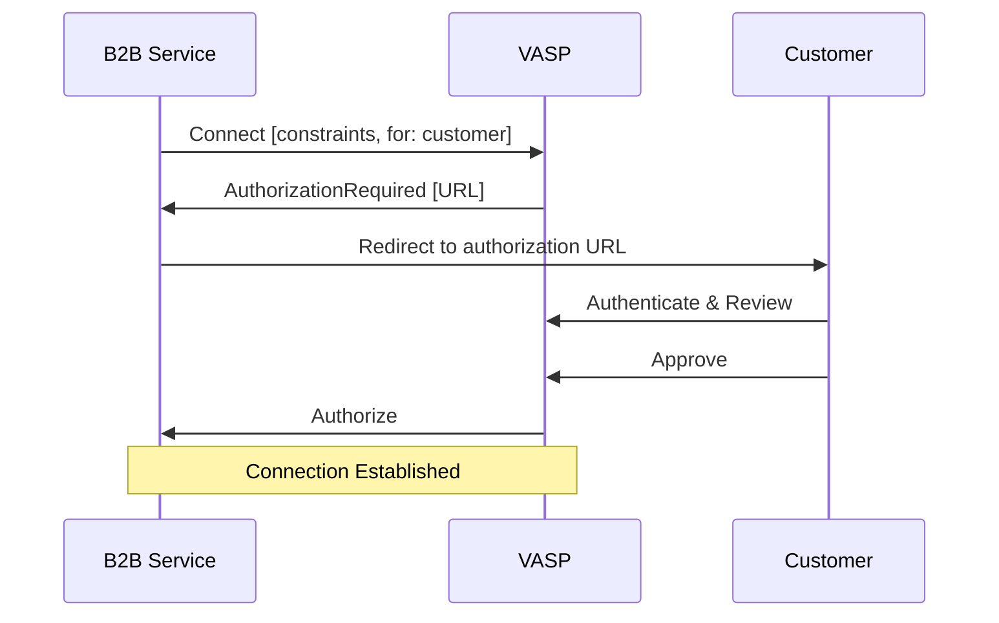
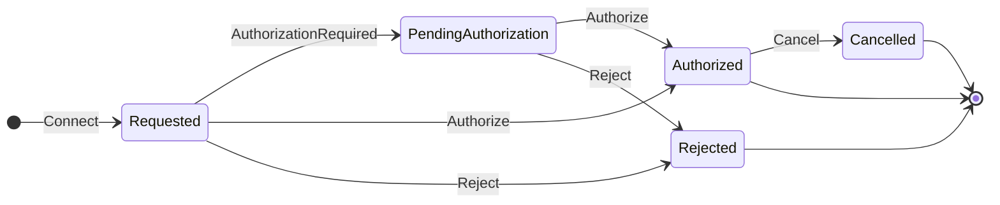
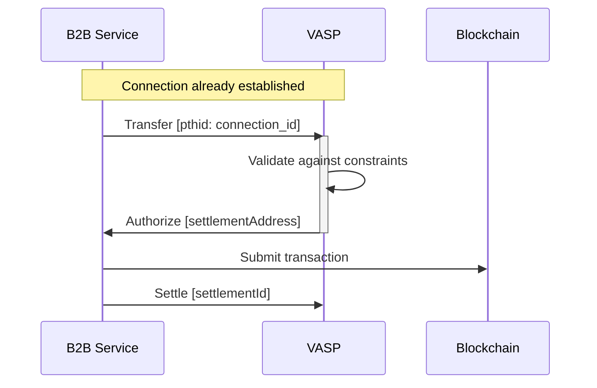

## Simple Summary

A standard protocol for establishing secure, authorized connections between agents in the Transaction Authorization Protocol ecosystem, with support for OAuth-style authorization flows and transaction constraints.

## Abstract

This TAIP defines a protocol for agents to establish secure, authorized connections with each other, particularly for ongoing business relationships. It builds on [TAIP-2] messaging, [TAIP-9] relationship proofs, and [TAIP-13] purpose codes to provide a standardized way for agents to request and authorize connections with transaction constraints. The protocol includes OAuth-style authorization flows, allowing interactive user consent when needed, and supports defining transaction limits and allowed purposes upfront.

## Motivation

The Transaction Authorization Protocol enables secure communication between different agents (AI Agents, VASPs, wallets, custodians, etc.). However, for ongoing business relationships, agents need a way to establish persistent, authorized connections with predefined constraints. Current implementations often rely on ad-hoc methods or require repeated authorizations. This TAIP addresses several key needs:

1. **Business Integration:** B2B services need to connect securely with their customers' accounts at VASPs or custodians for ongoing transactions on behalf of the customer.
2. **User Authorization:** Account holders must explicitly authorize agent connections through familiar OAuth-style flows.
3. **Transaction Constraints:** Connections should specify upfront what types of transactions are allowed (purposes, limits).
4. **Relationship Verification:** Agents must prove their relationship to the parties they represent.
5. **Risk Management:** Receiving agents need to maintain state and manage risk in real-time.

By standardizing these connection aspects, we enable secure B2B integrations while maintaining user control and risk management.

## Specification

### Message Types

All messages implement [TAIP-2] and are sent between [TAIP-5 Agents][TAIP-5]. Each message type has specific requirements for its body object.

### Connect Message

A message sent by an agent requesting connection to another agent:

- `@context` - REQUIRED the JSON-LD context `https://tap.rsvp/schema/1.0`
- `@type` - REQUIRED the JSON-LD type `https://tap.rsvp/schema/1.0#Connect`
- `agent` - OPTIONAL object containing information about the requesting agent:
  - `@id` - REQUIRED string DID of the requesting agent
  - `name` - OPTIONAL string human-readable name of the agent
  - `type` - OPTIONAL string type of agent (e.g. "ServiceAgent", "WalletAgent")
  - `serviceUrl` - OPTIONAL string URL for the agent's DIDComm endpoint
- `for` - REQUIRED string DID of the party the agent represents
- `constraints` - REQUIRED object specifying the requested transaction constraints:
  - `purposes` - OPTIONAL array of [TAIP-13] purpose codes
  - `categoryPurposes` - OPTIONAL array of [TAIP-13] category purpose codes
  - `limits` - OPTIONAL object containing transaction limits:
    - `per_transaction` - OPTIONAL string decimal amount
    - `daily` - OPTIONAL string decimal amount
    - `currency` - REQUIRED string ISO 4217 currency code if limits are specified
- `expiry` - OPTIONAL timestamp in ISO 8601 format indicating when the connection request expires. After this time, if no authorization has occurred, the connection request should be considered invalid. This is distinct from the technical message expiry handled by the DIDComm `expires_time` header.

### AuthorizationRequired Message

A message sent in response to a Connect request when interactive authorization is needed:

- `@context` - REQUIRED the JSON-LD context `https://tap.rsvp/schema/1.0`
- `@type` - REQUIRED the JSON-LD type `https://tap.rsvp/schema/1.0#AuthorizationRequired`
- `authorization_url` - REQUIRED string URL where the user can authorize the connection
- `expires` - REQUIRED string ISO 8601 timestamp when the authorization URL expires

### Authorize Message

A message sent to approve a connection request:

- `@context` - REQUIRED the JSON-LD context `https://tap.rsvp/schema/1.0`
- `@type` - REQUIRED the JSON-LD type `https://tap.rsvp/schema/1.0#Authorize`
- `connection` - REQUIRED object containing:
  - `id` - REQUIRED string unique identifier for the approved connection

### Reject Message

A message sent to reject a connection request:

- `@context` - REQUIRED the JSON-LD context `https://tap.rsvp/schema/1.0`
- `@type` - REQUIRED the JSON-LD type `https://tap.rsvp/schema/1.0#Reject`
- `reason` - OPTIONAL string human-readable reason for rejection

### Cancel Message

A message sent to terminate an existing connection:

- `@context` - REQUIRED the JSON-LD context `https://tap.rsvp/schema/1.0`
- `@type` - REQUIRED the JSON-LD type `https://tap.rsvp/schema/1.0#Cancel`
- `connection_id` - REQUIRED string identifier of the connection to cancel
- `reason` - OPTIONAL string human-readable reason for cancellation

### Connection Flow

1. Agent A sends Connect message to Agent B with:
   - Their identity and endpoints
   - The party they represent
   - Desired transaction constraints
   
2. Agent B chooses an authorization method:
   - Option 1: Out-of-band Authorization
     - Notifies customer through existing channels
     - Customer logs into VASP's service to review
   - Option 2: Authorization URL
     - Returns AuthorizationRequired with URL
     - Customer opens URL to review and authenticate

3. Customer reviews and decides:
   - Views connection details and constraints
   - Approves or denies through chosen interface

4. Agent B sends final response:
   - Authorize message if approved
   - Reject message if denied

5. Once authorized:
   - Connection is established with a unique identifier
   - Future transactions must respect the agreed constraints
   - Either party can Cancel the connection

### Out-of-Band Initiation

To initiate a connection with a party that hasn't communicated before, agents MUST support [Out-of-Band Messages](https://identity.foundation/didcomm-messaging/spec/v2.1/#out-of-band-messages). The OOB message allows sharing the Connect request through URLs or QR codes.

OOB messages for Connect requests:

1. MUST use the `https://didcomm.org/out-of-band/2.0` protocol
2. MUST include the goal_code `tap.connect`
3. SHOULD be shared as URLs according to the [Out-of-Band message spec](https://identity.foundation/didcomm-messaging/spec/v2.1/#out-of-band-messages)
4. MUST include the Connect message as a signed DIDComm message in the attachment

Example Out-of-Band message with Connect request:

```json
{
  "type": "https://didcomm.org/out-of-band/2.0/invitation",
  "id": "2e9e257c-2839-4fae-b0c4-dcd4e2159f4e",
  "from": "did:example:b2b-service",
  "body": {
    "goal_code": "tap.connect",
    "goal": "Establish agent connection",
    "accept": ["didcomm/v2"]
  },
  "attachments": [{
    "id": "connect-request-1",
    "mime_type": "application/didcomm-signed+json",
    "data": {
      "json": {
        "type": "https://tap.rsvp/schema/1.0#Connect",
        "id": "599f7220-6149-4c45-adbb-86d96c8e0608",
        "from": "did:example:b2b-service",
        "body": {
          "@context": "https://tap.rsvp/schema/1.0",
          "@type": "https://tap.rsvp/schema/1.0#Connect",
          "agent": {
            "@id": "did:example:b2b-service",
            "name": "B2B Payment Service"
          },
          "for": "did:example:business-customer",
          "constraints": {
            "purposes": ["BEXP", "SUPP"]
          }
        },
        "attachments": [],
        "created_time": 1516269022
      }
    }
  }]
}
```

The corresponding URL format would be either:
```
https://example.com/path?_oob=eyJ0eXAiOiJKV1QiLCJhbGciOiJFZERTQSJ9...
```

Or using the shorter `_oobid` parameter that references a previously published Out-of-Band message:
```
https://example.com/path?_oobid=2e9e257c-2839-4fae-b0c4-dcd4e2159f4e
```

Where the `_oob` parameter contains the base64url-encoded Out-of-Band message, or the `_oobid` parameter contains a unique identifier that can be resolved to retrieve the full Out-of-Band message.

### Connection Flow Diagrams

#### Basic Connection Flow with Direct Authorization



#### Connection Flow with Interactive Authorization



#### Connection State Machine



### Transaction Flow Using Connection

The following diagram shows how an established connection is used for subsequent transactions:



### Connection Security

- All messages MUST be encrypted using [TAIP-2] message encryption
- Agents MUST verify DIDs and signatures before accepting connections
- Authorization MUST be performed through secure, authenticated channels
- Authorization URLs MUST use HTTPS and include CSRF protection
- Connection identifiers should be unique and unpredictable

## Rationale

The design choices in this specification aim to balance security, usability, and flexibility:

- **Flexible Authorization:** Supports both out-of-band and URL-based flows
- **Purpose Codes:** Uses [TAIP-13] for standardized transaction types
- **Transaction Limits:** Provides clear constraints for risk management
- **Connection Identifiers:** Enable tracking and management of approved connections
- **State Management:** Receiving agents track connection status

## Security Considerations

- **Authorization Flow:** Must use secure authentication channels
- **Authorization URLs:** Must prevent CSRF and phishing attacks
- **Connection Identifiers:** Must be unique and unpredictable
- **Transaction Limits:** Must be enforced server-side
- **Connection State:** Must be securely maintained

## Privacy Considerations

- **Minimal Disclosure:** Only exchange necessary information
- **User Consent:** Clear authorization UI showing permissions
- **Connection Isolation:** Unique identifiers per connection
- **Data Retention:** Clear connection data when terminated
- **Audit Logs:** Balance logging with privacy

## Test Cases

The following are example plaintext messages. See [TAIP-2] for how to sign the messages.

### Connect

```json
{
  "id": "123e4567-e89b-12d3-a456-426614174000",
  "type": "https://tap.rsvp/schema/1.0#Connect",
  "from": "did:example:b2b-service",
  "to": ["did:example:vasp"],
  "created_time": 1516269022,
  "body": {
    "@context": "https://tap.rsvp/schema/1.0",
    "@type": "https://tap.rsvp/schema/1.0#Connect",
    "agent": {
      "@id": "did:example:b2b-service",
      "name": "B2B Payment Service",
      "type": "ServiceAgent",
      "serviceUrl": "https://b2b-service/did-comm"
    },
    "for": "did:example:business-customer",
    "constraints": {
      "purposes": ["BEXP", "SUPP"],
      "categoryPurposes": ["CASH", "CCRD"],
      "limits": {
        "per_transaction": "10000.00",
        "daily": "50000.00",
        "currency": "USD"
      }
    },
    "expiry": "2024-03-22T15:00:00Z"
  }
}
```

### AuthorizationRequired

```json
{
  "id": "98765432-e89b-12d3-a456-426614174001",
  "type": "https://tap.rsvp/schema/1.0#AuthorizationRequired",
  "from": "did:example:vasp",
  "to": ["did:example:b2b-service"],
  "thid": "123e4567-e89b-12d3-a456-426614174000",
  "created_time": 1516269023,
  "expires_time": 1516385931,
  "body": {
    "@context": "https://tap.rsvp/schema/1.0",
    "@type": "https://tap.rsvp/schema/1.0#AuthorizationRequired",
    "authorization_url": "https://vasp.com/authorize?request=abc123",
    "expires": "2024-03-22T15:00:00Z"
  }
}
```

### Authorize

```json
{
  "id": "abcdef12-e89b-12d3-a456-426614174002",
  "type": "https://tap.rsvp/schema/1.0#Authorize",
  "from": "did:example:vasp",
  "to": ["did:example:b2b-service"],
  "thid": "123e4567-e89b-12d3-a456-426614174000",
  "created_time": 1516269024,
  "body": {
    "@context": "https://tap.rsvp/schema/1.0",
    "@type": "https://tap.rsvp/schema/1.0#Authorize"
  }
}
```

### Reject

```json
{
  "id": "76543210-e89b-12d3-a456-426614174003",
  "type": "https://tap.rsvp/schema/1.0#Reject",
  "from": "did:example:vasp",
  "to": ["did:example:b2b-service"],
  "thid": "123e4567-e89b-12d3-a456-426614174000",
  "created_time": 1516269024,
  "body": {
    "@context": "https://tap.rsvp/schema/1.0",
    "@type": "https://tap.rsvp/schema/1.0#Reject",
    "reason": "unauthorized"
  }
}
```

### Cancel

```json
{
  "id": "fedcba98-e89b-12d3-a456-426614174004",
  "type": "https://tap.rsvp/schema/1.0#Cancel",
  "from": "did:example:vasp",
  "to": ["did:example:b2b-service"],
  "thid": "123e4567-e89b-12d3-a456-426614174000",
  "created_time": 1516269025,
  "body": {
    "@context": "https://tap.rsvp/schema/1.0",
    "@type": "https://tap.rsvp/schema/1.0#Cancel",
    "reason": "user_requested"
  }
}
```

## Using Connections for Transactions

Once a connection is established, the connecting agent can perform transactions on behalf of the customer. All transactions related to a connection MUST include the connection's `id` as the `pthid` (parent thread ID) in the message header. This allows receiving agents to validate the transaction against the connection's constraints.

### Example Transfer Using Connection

The following example shows a [TAIP-3] Transfer message sent by a B2B service using their authorized connection to initiate a transfer on behalf of their customer:

```json
{
  "id": "456789ab-e89b-12d3-a456-426614174005",
  "type": "https://tap.rsvp/schema/1.0#Transfer",
  "from": "did:example:b2b-service",
  "to": ["did:example:vasp"],
  "pthid": "123e4567-e89b-12d3-a456-426614174000",
  "created_time": 1516269026,
  "body": {
    "@context": "https://tap.rsvp/schema/1.0",
    "@type": "https://tap.rsvp/schema/1.0#Transfer",
    "asset": "eip155:1/slip44:60",
    "amount": "1.23",
    "originator": {
      "@id": "did:example:business-customer"
    },
    "agents": [
      {
        "@id": "did:example:b2b-service"
      },
      {
        "@id": "did:example:vasp"
      }
    ]
  }
}
```

The receiving agent MUST:
1. Verify the connection ID in `pthid` exists and is active
2. Validate that the transaction complies with the connection's constraints:
   - Check that the purpose (if specified) is allowed
   - Verify the amount is within the per-transaction and daily limits
   - Confirm the originator matches the connection's `for` party
3. Process the transaction according to [TAIP-4] if all checks pass 


## References

* [TAIP-2] TAP Messaging
* [TAIP-4] Transaction Authorization Protocol
* [TAIP-6] Transaction Parties
* [TAIP-9] Proof of Relationship
* [TAIP-13] Purpose Codes

[TAIP-2]: ./taip-2 "TAP Messaging"
[TAIP-4]: ./taip-4 "Transaction Authorization Protocol"
[TAIP-6]: ./taip-6 "Transaction Parties"
[TAIP-9]: ./taip-9 "Proof of Relationship"
[TAIP-13]: ./taip-13 "Purpose Codes"

## Copyright

Copyright and related rights waived via [CC0].
