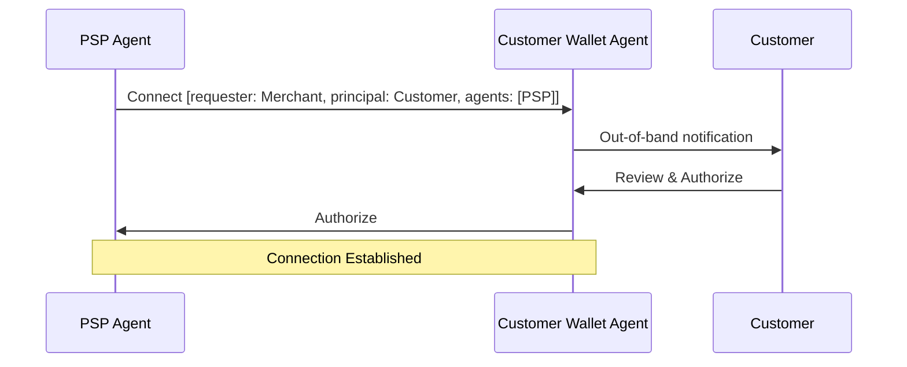
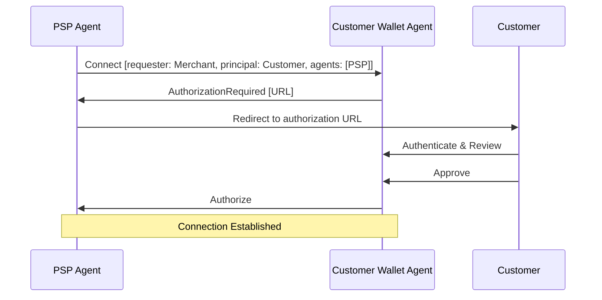
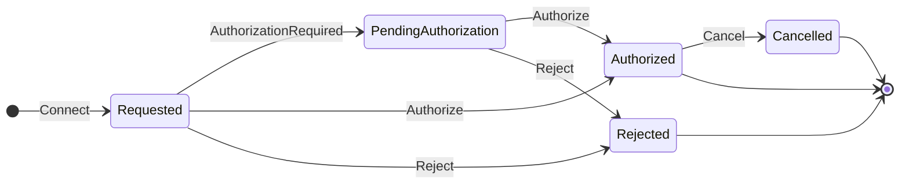
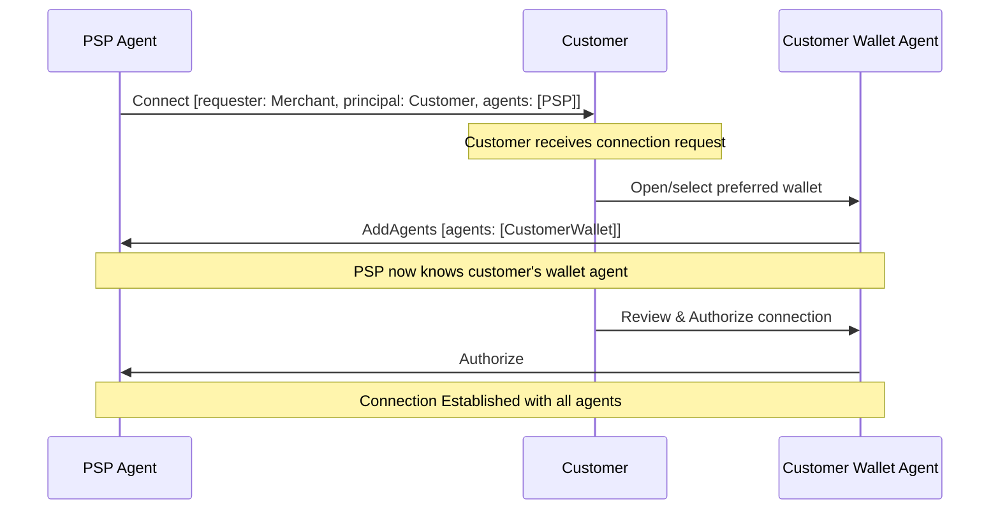
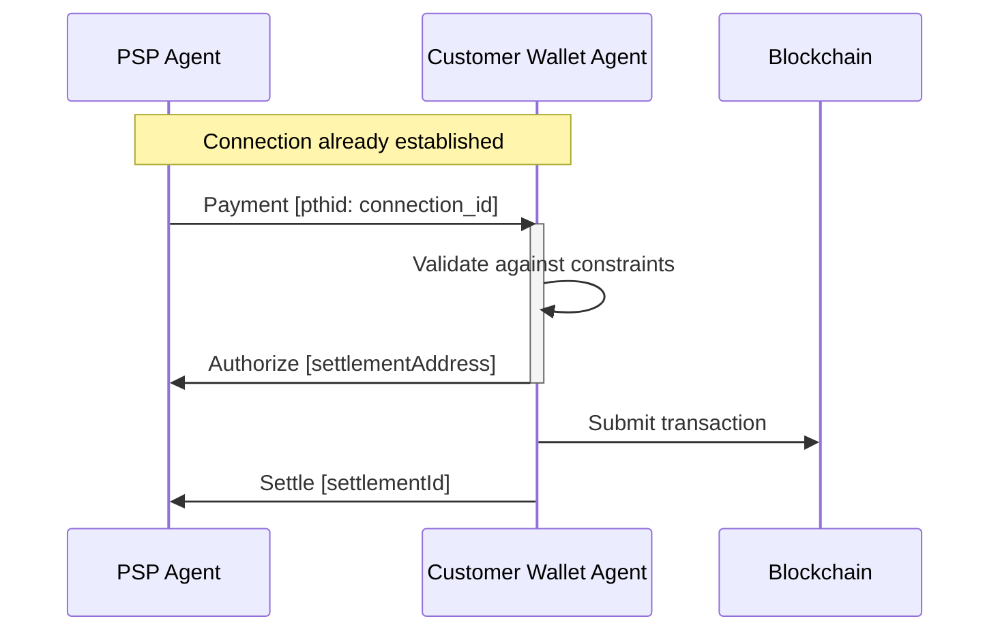

## Simple Summary

A standard protocol for establishing secure, authorized connections between agents in the Transaction Authorization Protocol ecosystem, supporting both transactional relationships (with OAuth-style authorization and constraints) and institutional trust relationships (DDQ exchange, mutual trust, whitelisting).


## Abstract

This TAIP defines a protocol for agents to establish secure, authorized connections with each other. It supports two primary connection models:

Transactional Connections: For ongoing business relationships like AI agent transactions, recurring billing, and B2B payment automation. These connections establish principal-agent relationships with transaction constraints (limits, purposes, allowed parties).
Trust Connections: For institutional relationships between VASPs, including DDQ (Due Diligence Questionnaire) exchange, mutual trust establishment, and whitelisting for straight-through processing.

The protocol builds on TAIP-2 messaging, TAIP-4 authorization, TAIP-6 parties, and TAIP-13 purpose codes to provide a standardized way for agents to request and authorize connections.

## Motivation

The Transaction Authorization Protocol enables secure communication between different agents (AI Agents, VASPs, wallets, custodians, etc.). However, for ongoing relationships, agents need ways to establish persistent, authorized connections. This TAIP addresses two distinct needs:

**Trust Connection Use Cases:**
1. **DDQ Exchange:** VASPs sharing Due Diligence Questionnaires for compliance
2. **Mutual Trust Establishment:** Bilateral verification and relationship building
3. **Whitelisting:** Pre-approved counterparties for straight-through processing
4. **Compliance Workflows:** Streamlined transaction processing between trusted parties

**Transactional Connection Use Cases:**
1. **AI Agent Transactions:** Autonomous AI agents executing trades, payments, or financial operations within user-defined limits and purposes (e.g., trading bot with $10k daily limit for crypto arbitrage).
2. **Subscription & Recurring Payments:** SaaS platforms, streaming services, and membership organizations collecting recurring fees (e.g., monthly Netflix subscription, annual software licenses, usage-based cloud billing).
3. **Self-Onboarding Services:** Entities directly onboarding with service providers where the agent and principal are the same party (e.g., a merchant directly connecting to a payment processor's API, a business self-registering with a financial platform).
4. **Corporate Treasury Management:** CFO tools and treasury platforms managing cash flows, vendor payments, and payroll on behalf of businesses (e.g., automated supplier payments, cross-border payroll processing).
5. **Expense Management Systems:** Corporate payment wallet programs and expense platforms processing employee reimbursements and vendor payments (e.g., Expensify submitting reimbursements, Ramp processing corporate card settlements).
6. **Marketplace & Platform Payouts:** E-commerce platforms, gig economy apps, and creator platforms distributing earnings (e.g., Shopify merchant payouts, Uber driver payments, YouTube creator revenue sharing).
7. **Automated Compliance & Reporting:** RegTech solutions performing automated transaction monitoring, tax withholding, and regulatory reporting (e.g., automatic tax payments, AML transaction screening).
8. **Cross-Border Payment Services:** International payment providers and remittance services executing FX conversions and transfers (e.g., Wise business accounts, payroll providers handling multi-currency payments).
9. **DeFi Protocol Integration:** Decentralized protocols performing automated yield farming, liquidity provision, or collateral management (e.g., auto-compounding vaults, algorithmic trading strategies).

  By standardizing these connection aspects, we enable secure B2B integrations while maintaining user control and risk management. Each Transactional connection     enforces specific constraints including transaction limits, allowed purposes, and time boundaries.

## Specification

### Message Types

All messages implement [TAIP-2] and are sent between [TAIP-5 Agents][TAIP-5].

### Connect Message

A message sent to establish or update a connection between agents.

#### All Connections (Required)

- `@context` - REQUIRED the JSON-LD context `https://tap.rsvp/schema/1.0`
- `@type` - REQUIRED the JSON-LD type `https://tap.rsvp/schema/1.0#Connect`
- `connectionTypes` - REQUIRED array of strings specifying the connection types being requested. Must contain at least one of:
  - `transaction` - For transactional connections (B2B integrations, recurring billing, transaction authorization)
  - `ddq-access` - For DDQ document exchange between institutions
  - `mutual-trust` - For establishing bilateral trust relationships
  - `whitelist` - For enabling pre-approved straight-through processing
- `purpose` - OPTIONAL string human-readable purpose for the connection
- `expiry` - OPTIONAL ISO 8601 timestamp when the connection request expires
- `agreement` - OPTIONAL string URL pointing to terms of service or agreement

#### Trust Connection Fields

Used when `connectionTypes` includes trust-related types (`ddq-access`, `mutual-trust`, `whitelist`):

- `action` - OPTIONAL string indicating connection lifecycle action. Defaults to `establish` if not specified. Valid values:
  - `establish` - Create a new connection relationship (default)
  - `update` - Modify an existing connection or broadcast document updates
- `attachments` - OPTIONAL array of [TAIP-2] message attachments. Can include DDQ documents or other supporting materials. When present, these documents are provided inline for review during connection establishment.

**Note**: Trust connections SHOULD NOT include `requester`, `principal`, `agents`, or `constraints` fields. These are peer-to-peer institutional relationships.

#### Trust Connection Action Semantics

The `action` field determines the purpose of the Connect message:

- **`action="establish"`** (default): Requests to create a new trust relationship. Used for initial DDQ access requests, mutual trust establishment, or whitelist requests.

- **`action="update"`**: Used in two scenarios:
  1. **Request connection upgrade**: Requesting additional connection types (e.g., adding `whitelist` to existing `mutual-trust`)
  2. **Broadcast document refresh**: Notifying connected parties of updated DDQ documents or supporting materials via attachments

When `action="update"` is used with attachments containing updated documents, recipients might acknowledge receipt but are not required to send Authorize responses unless the update requests new connection types.

Attachment Usage: Trust connections can use attachments to provide documents inline (e.g., DDQ PDFs, compliance certificates). The ddqDocument field in Authorize responses provides URLs for later retrieval, while attachments provide immediate document access during connection establishment.
DDQ Document Formats: Implementations MAY use any of the following formats based on their requirements:

- application/pdf: Human-readable signed PDF documents for regulatory compliance archives
- application/json: Structured DDQ objects for automated processing and machine-readable workflows
- application/didcomm-signed+json: Cryptographically signed structured data providing both machine-readability and verifiable authenticity

The choice of format depends on use case:

- Use PDF for regulatory submissions requiring human-readable signed documents
- Use JSON for automated processing, field-by-field validation, and API integrations
- Use signed JSON when cryptographic verification and non-repudiation are required

## Trust Connection Types

### transaction
Establishes a transactional connection for ongoing business relationships. Requires principal-agent relationship with transaction constraints.

**Typical use**: B2B integrations, recurring billing, AI agent transactions, expense management

**Required fields**: `requester`, `principal`, `agents`, `constraints`

### ddq-access
Grants access to view DDQ documents. Enables one party to retrieve the other's Due Diligence Questionnaire for compliance verification.

**Typical use**: Initial relationship establishment, periodic compliance reviews

### mutual-trust
Establishes bilateral trust relationship. Both parties acknowledge each other as verified entities, reducing verification requirements but transactions still undergo review.

**Typical use**: Post-DDQ review, established business relationships

### whitelist
Enables pre-approved, straight-through transaction processing. Transactions from whitelisted parties proceed with minimal friction and automatic approval within agreed parameters.

**Typical use**: High-volume trusted counterparties, routine business operations

**Typical trust progression**: ddq-access → mutual-trust → whitelist

#### Transactional Connection Fields

REQUIRED when `connectionTypes` includes `"transaction"`:

- `requester` - REQUIRED [TAIP-6] Party object representing the party requesting the connection
  - `@id` - REQUIRED string DID or IRI of the requesting party
- `principal` - REQUIRED [TAIP-6] Party object representing the party on whose behalf transactions will be performed
  - `@id` - REQUIRED string DID or IRI of the principal party
- `agents` - REQUIRED array of agent objects representing agents involved. Must include at least one agent whose `@id` matches the DIDComm `from` field with `for` attribute set to requester DID
- `constraints` - REQUIRED object specifying transaction constraints:
  - `purposes` - OPTIONAL array of [TAIP-13] purpose codes
  - `categoryPurposes` - OPTIONAL array of [TAIP-13] category purpose codes
  - `limits` - OPTIONAL object containing transaction limits:
    - `per_transaction`, `per_day`, `per_week`, `per_month`, `per_year` - OPTIONAL string decimal amounts
    - `currency` - REQUIRED string ISO 4217 currency code if limits specified
  - `allowedBeneficiaries` - OPTIONAL array of [TAIP-6] Party objects
  - `allowedSettlementAddresses` - OPTIONAL array of [CAIP-10] addresses
  - `allowedAssets` - OPTIONAL array of [CAIP-19] asset identifiers
- `attachments` - OPTIONAL array of transaction messages (Transfer, Payment) for immediate authorization


##### Parties and Agent Roles

The Agent Connection Protocol for Transaction connections involves two distinct parties and their respective agents:

**Requester Party**: The party that initiates the connection request. This is typically a service provider, merchant, or other entity seeking permission to perform transactions on behalf of or with another party. The requester party is represented by one or more agents that handle the technical aspects of the connection process.

**Principal Party**: The party that the requester wants to establish a connection with, and on whose behalf future transactions may be performed. This is typically a customer, user, or business entity that will authorize the connection and set transaction constraints. The principal party may have their own agents (such as wallet providers or custodial services) that act on their behalf.

**Agent Relationships**: 
- The requester's agent initiates the Connect message and must be included in the `agents` array with a `for` attribute pointing to the requester's DID
- The principal's agent(s) may be added during the connection process using AddAgent messages as replies to the Connect thread
- Each agent clearly identifies which party it represents through the `for` attribute as defined in [TAIP-5]
- Multiple agents can represent the same party for different capabilities (e.g., compliance, wallet services, settlement)

This separation allows for complex B2B relationships where a service provider (requester) wants to act on behalf of their customer (principal) while maintaining clear accountability and authorization chains.

**Note:** This party-agent model applies to transactional connections only. Trust connections are peer-to-peer institutional relationships without requester/principal distinction.

## Transaction Constraints (Transactional Connections)

Transaction constraints are a fundamental security mechanism in transactional connections that define the boundaries and permissions for transactions performed through an established connection. These constraints serve multiple critical purposes:

**Security and Risk Management**: Constraints act as guardrails that prevent unauthorized or excessive transactions, protecting both parties from potential fraud, errors, or misuse of the connection. They establish clear limits on transaction amounts, frequencies, and purposes.

**Compliance and Governance**: Many organizations require specific controls over automated transactions to meet regulatory requirements, internal policies, or audit standards. Constraints provide a standardized way to encode these requirements into the connection itself.

**User Control and Transparency**: By clearly defining what actions can be performed through a connection, constraints give users visibility and control over how their funds or assets may be used by authorized agents.

**Automated Decision Making**: Constraints enable receiving agents to automatically approve transactions that fall within established parameters while flagging or rejecting those that exceed the agreed-upon limits.

### Constraint Enforcement

Agents MUST enforce all specified constraints when processing transactions through an established connection. Failure to respect constraints constitutes a violation of the connection agreement and may result in:
- Transaction rejection
- Connection termination
- Loss of trust between parties
- Potential legal or regulatory consequences

### Types of Constraints

The Agent Connection Protocol supports several categories of transaction constraints:

**Purpose Constraints**: Define what types of transactions are permitted through the connection.
- `purposes` - Specific [TAIP-13] purpose codes that are allowed
- `categoryPurposes` - Broader [TAIP-13] category purpose codes that encompass multiple specific purposes

**Financial Limits**: Set monetary boundaries on transaction amounts and frequencies.
- `per_transaction` - Maximum amount for any single transaction
- `per_day`, `per_week`, `per_month`, `per_year` - Cumulative limits over time periods
- `currency` - The currency in which all limits are expressed

**Party Restrictions**: Control which entities can participate in transactions.
- `allowedBeneficiaries` - Specific [TAIP-6] parties that can receive payments through this connection
- This enables scenarios like approved vendor lists or restricted recipient sets

**Technical Restrictions**: Define technical parameters for transaction execution.
- `allowedSettlementAddresses` - Specific [CAIP-10] blockchain addresses permitted for settlement
- `allowedAssets` - Specific [CAIP-19] assets that can be transacted through this connection
- These constraints enable precise control over which tokens and addresses can be used

Constraints work together to create a comprehensive authorization framework. For example, a transactional connection might allow monthly subscription payments (`purposes: ["SUBS"]`) up to $100 per month (`limits: {"per_month": "100.00", "currency": "USD"}`) only to a specific merchant (`allowedBeneficiaries: [{"@id": "did:web:saas-provider.example"}]`) using only USDC tokens (`allowedAssets: ["eip155:1/erc20:0xA0b86a33E6441b7178bb7094b2c4b6e5066d68B7"]`).


### Response Messages

#### Authorize Message (Connection Approval)

Response approving a connection request. Uses standard [TAIP-4] Authorize message.

**For Transactional Connections:**
- Standard Authorize body (no additional fields needed)
- Connection ID is the message `id` of the Connect message (referenced via `thid`)

**For Trust Connections:**
Authorize body includes additional optional fields:

- `approvedTypes` - OPTIONAL array of approved connection types (subset of requested)
- `ddqDocument` - OPTIONAL object containing DDQ document reference:
  - `documentId` - REQUIRED string unique identifier
  - `version` - OPTIONAL string document version
  - `accessUrl` - OPTIONAL string HTTPS URL for retrieval
  - `checksum` - OPTIONAL string SHA-256 hash
  - `expiresAt` - OPTIONAL ISO 8601 timestamp when access expires
- `trustLevel` - OPTIONAL string: `whitelisted`, `trusted`, `standard`, `reviewing`, `suspended`
- `attachments` - OPTIONAL array of TAIP-2 message attachments. Can include DDQ documents or supporting materials (certificates, licenses) provided inline in the approval response

**DDQ Document Delivery Options:**

**URL-based:** Use ddqDocument.accessUrl for later retrieval (requires separate fetch)
**Inline:** Use attachments for immediate delivery (included in Authorize response)
**Both:** Can provide both URL for archival access and inline attachment for immediate use

**Use Cases for Attachments in Authorize Response**
**Scenario 1:** Immediate DDQ Exchange
VASP A → Connect (request ddq-access)
VASP B → Authorize (approve + attach their DDQ immediately)
Benefit: One round-trip instead of two

**Scenario 2:** Mutual DDQ Exchange
VASP A → Connect (request ddq-access + attach their DDQ)
VASP B → Authorize (approve + attach their DDQ in response)
Benefit: Simultaneous mutual exchange

**Scenario 3:** Supporting Documents
VASP A → Connect (request whitelist)
VASP B → Authorize (approve + attach license certificates, compliance docs)
Benefit: All verification materials provided immediately

#### Reject Message

Standard [TAIP-4] Reject message to decline connection:

- `@context` - REQUIRED the JSON-LD context `https://tap.rsvp/schema/1.0`
- `@type` - REQUIRED the JSON-LD type `https://tap.rsvp/schema/1.0#Reject`
- `reason` - OPTIONAL string explaining rejection

#### Cancel Message

Standard [TAIP-4] Cancel message to terminate connection:

- `@context` - REQUIRED the JSON-LD context `https://tap.rsvp/schema/1.0`
- `@type` - REQUIRED the JSON-LD type `https://tap.rsvp/schema/1.0#Cancel`
- `by` - REQUIRED the party terminating connection (for transactional: "principal" or "requester"; for trust: sender's DID)
- `reason` - OPTIONAL string explaining cancellation

#### AuthorizationRequired Message

For transactional connections requiring interactive authorization. Standard [TAIP-4] message:

- `@context` - REQUIRED the JSON-LD context `https://tap.rsvp/schema/1.0`
- `@type` - REQUIRED the JSON-LD type `https://tap.rsvp/schema/1.0#AuthorizationRequired`
- `authorizationUrl` - REQUIRED string URL for authorization
- `expires` - REQUIRED ISO 8601 timestamp when URL expires
- `from` - OPTIONAL party type requiring authorization


### Out-of-Band Initiation

To initiate a connection with a party that hasn't communicated before, agents MUST support [Out-of-Band Messages](https://identity.foundation/didcomm-messaging/spec/v2.1/#out-of-band-messages). The OOB message allows sharing the Connect request through URLs or QR codes.

OOB messages for Connect requests:

1. MUST use the `https://didcomm.org/out-of-band/2.0` protocol
2. MUST include the goal_code `tap.connect`
3. SHOULD be shared as URLs according to the [Out-of-Band message spec](https://identity.foundation/didcomm-messaging/spec/v2.1/#out-of-band-messages)
4. MUST include the Connect message as a signed DIDComm message in the attachment

Example Out-of-Band message with Connect request:

```json
{
  "type": "https://didcomm.org/out-of-band/2.0/invitation",
  "id": "2e9e257c-2839-4fae-b0c4-dcd4e2159f4e",
  "from": "did:example:b2b-service",
  "body": {
    "goal_code": "tap.connect",
    "goal": "Establish agent connection",
    "accept": ["didcomm/v2"]
  },
  "attachments": [{
    "id": "connect-request-1",
    "mime_type": "application/didcomm-signed+json",
    "data": {
      "json": {
        "type": "https://tap.rsvp/schema/1.0#Connect",
        "id": "599f7220-6149-4c45-adbb-86d96c8e0608",
        "from": "did:example:b2b-service",
        "body": {
          "@context": "https://tap.rsvp/schema/1.0",
          "@type": "https://tap.rsvp/schema/1.0#Connect",
          "requester": {
            "@id": "did:example:b2b-service"
          },
          "principal": {
            "@id": "did:example:business-customer"
          },
          "agents": [
            {
              "@id": "did:example:b2b-service",
              "name": "B2B Payment Service",
              "for": "did:example:b2b-service"
            }
          ],
          "constraints": {
            "purposes": ["BEXP", "SUPP"]
          },
          "agreement": "https://b2b-service.com/terms"
        },
        "attachments": [],
        "created_time": 1516269022
      }
    }
  }]
}
```

The corresponding URL format would be either:
```
https://example.com/path?_oob=eyJ0eXAiOiJKV1QiLCJhbGciOiJFZERTQSJ9...
```

Or using the shorter `_oobid` parameter that references a previously published Out-of-Band message:
```
https://example.com/path?_oobid=2e9e257c-2839-4fae-b0c4-dcd4e2159f4e
```

Where the `_oob` parameter contains the base64url-encoded Out-of-Band message, or the `_oobid` parameter contains a unique identifier that can be resolved to retrieve the full Out-of-Band message.


### Connection Workflows

#### Transactional Connection Flow
Simple:
```
Requesting Agent                    Principal's Agent
    |                                      |
    |--Connect---------------------------->|
    |  (connectionTypes: [transaction],    |
    |   requester, principal, agents,      |
    |   constraints)                       |
    |                                      |
    |<--AuthorizationRequired (optional)---|
    |  (authorizationUrl)                  |
    |                                      |
              [Principal authorizes via URL]
    |                                      |
    |<--Authorize--------------------------|
    |                                      |
```
Full:
1. Agent A sends Connect message to Agent B with:
  - The requesting party’s identity
  - The principal party they represent
  - Agent identities and endpoints in the agents array
  - Desired transaction constraints
  - Optionally, transaction messages (Transfer, Payment, etc.) as attachments for immediate authorization
2. Agent B chooses an authorization method:
  - Option 1: Out-of-band Authorization
    - Notifies customer through existing channels
    - Customer logs into VASP’s service to review
  - Option 2: Authorization URL
    - Returns AuthorizationRequired with URL
    - Customer opens URL to review and authenticate
3. Customer reviews and decides:
  - Views connection details and constraints
  - Reviews any attached transaction messages for immediate execution
  - Approves or denies through chosen interface
4. Agent B sends final response:
  - Authorize message if approved (automatically authorizes any attached transactions)
  - Reject message if denied
5. Agent addition (if needed):
  - Additional agents may be added using AddAgent messages as replies to the Connect thread
  - This allows the principal’s agent to be included if not initially present
6. Once authorized:
  - Connection is established with a unique identifier
  - Future transactions must respect the agreed constraints
  - Either party can Cancel the connection

#### Trust Connection Flow (DDQ Access)

```
VASP A                                 VASP B
    |                                      |
    |--Connect---------------------------->|
    |  (connectionTypes: [ddq-access])     |
    |                                      |
    |<--Authorize--------------------------|
    |  (approvedTypes: [ddq-access],       |
    |   ddqDocument: {...})                |
    |                                      |
```


#### Trust Connection Flow (Mutual DDQ Exchange)
```
VASP A                                 VASP B
    |                                      |
    |--Connect---------------------------->|
    |  (connectionTypes: [ddq-access],     |
    |   attachments: [VASP A's DDQ])       |
    |                                      |
    |<--Authorize--------------------------|
    |  (approvedTypes: [ddq-access],       |
    |   attachments: [VASP B's DDQ])       |
    |                                      |
```
Benefits of Mutual Exchange:
- Single round-trip for both parties to exchange DDQs
- Simultaneous verification
- Reduced latency in establishing trust relationship

#### Trust Connection Update Flow

```
VASP A                                 VASP B
    |                                      |
    |--Connect----------------------------->|
    |  (action: update,                    |
    |   connectionTypes:                   |
    |     [mutual-trust, whitelist])       |
    |                                      |
    |<--Authorize--------------------------|
    |  (approvedTypes:                     |
    |     [mutual-trust, whitelist],       |
    |   trustLevel: whitelisted)           |
    |                                      |
```

#### Connection Termination

```
Either Party                           Other Party
    |                                      |
    |--Cancel------------------------------>|
    |  (by: terminating party,             |
    |   reason: "...")                     |
    |                                      |
```

###DDQ Update Broadcast

When a VASP updates their DDQ, they broadcast to all ddq-access approved parties:
```json
{
  "id": "conn-update-ddq-202",
  "type": "https://tap.rsvp/schema/1.0#Connect",
  "from": "did:web:vasp-a.example",
  "to": ["did:web:vasp-b.example"],
  "created_time": 1706227400,
  "expires_time": 1706313800,
  "body": {
    "@context": "https://tap.rsvp/schema/1.0",
    "@type": "https://tap.rsvp/schema/1.0#Connect",
    "connectionTypes": ["ddq-access"],
    "action": "update",
    "purpose": "Updated DDQ - Q1 2025 version with new license information"
  },
  "attachments": [
    {
      "id": "ddq-document-updated",
      "description": "VASP A Due Diligence Questionnaire 2025-Q1 (Updated)",
      "media_type": "application/json",
      "data": {
        "json": {
          "version": "2025-Q1",
          "lastUpdated": "2025-01-15T00:00:00Z",
          "legalName": "VASP A Example Inc.",
          "jurisdiction": "US",
          "ownershipType": "Private",
          "conductsKyc": true,
          "kycProvider": "InternalTeam",
          "amlCompliance": true,
          "regulatoryLicenses": [
            {
              "jurisdiction": "US-NY",
              "licenseType": "BitLicense",
              "licenseNumber": "BL-12345"
            },
            {
              "jurisdiction": "US-CA",
              "licenseType": "Money Transmission License",
              "licenseNumber": "MTL-67890"
            }
          ],
          "supportedAssets": ["BTC", "ETH", "USDC", "USDT"],
          "transactionMonitoring": true,
          "sanctionsScreening": true,
          "changeLog": "Added California MTL, expanded supported assets to include USDT"
        }
      }
    }
  ]
}
```

### Extended Connection Flow Diagrams for Transactional connections

#### Basic Connection Flow with Direct Authorization


```mermaid
sequenceDiagram
    participant PSP as PSP Agent
    participant CustomerWallet as Customer Wallet Agent
    participant Customer

    PSP->>CustomerWallet: Connect [requester: Merchant, principal: Customer, agents: [PSP]]
    CustomerWallet->>Customer: Out-of-band notification
    Customer->>CustomerWallet: Review & Authorize
    CustomerWallet->>PSP: Authorize
    Note over PSP,CustomerWallet: Connection Established
```

#### Connection Flow with Interactive Authorization


```mermaid
sequenceDiagram
    participant PSP as PSP Agent
    participant CustomerWallet as Customer Wallet Agent
    participant Customer

    PSP->>CustomerWallet: Connect [requester: Merchant, principal: Customer, agents: [PSP]]
    CustomerWallet->>PSP: AuthorizationRequired [URL]
    PSP->>Customer: Redirect to authorization URL
    Customer->>CustomerWallet: Authenticate & Review
    Customer->>CustomerWallet: Approve
    CustomerWallet->>PSP: Authorize
    Note over PSP,CustomerWallet: Connection Established
```

#### Connection State Machine


```mermaid
stateDiagram-v2
    direction LR
    [*] --> Requested: Connect
    Requested --> PendingAuthorization: AuthorizationRequired
    Requested --> Authorized: Authorize
    Requested --> Rejected: Reject
    PendingAuthorization --> Authorized: Authorize
    PendingAuthorization --> Rejected: Reject
    Authorized --> Cancelled: Cancel
    Authorized --> [*]
    Rejected --> [*]
    Cancelled --> [*]
```

#### Connection Flow with AddAgents

The following diagram shows how a customer's wallet agent can join the connection using AddAgents:


```mermaid
sequenceDiagram
    participant PSP as PSP Agent
    participant Customer
    participant CustomerWallet as Customer Wallet Agent

    PSP->>Customer: Connect [requester: Merchant, principal: Customer, agents: [PSP]]
    Note over Customer: Customer receives connection request
    Customer->>CustomerWallet: Open/select preferred wallet
    CustomerWallet->>PSP: AddAgents [agents: [CustomerWallet]]
    Note over PSP,CustomerWallet: PSP now knows customer's wallet agent
    Customer->>CustomerWallet: Review & Authorize connection
    CustomerWallet->>PSP: Authorize
    Note over PSP,CustomerWallet: Connection Established with all agents
```

### Transaction Flow Using Connection

The following diagram shows how an established connection is used for subsequent transactions:


```mermaid
sequenceDiagram
    participant PSP as PSP Agent
    participant CustomerWallet as Customer Wallet Agent
    participant Blockchain

    Note over PSP,CustomerWallet: Connection already established
    PSP->>CustomerWallet: Payment [pthid: connection_id]
    activate CustomerWallet
    CustomerWallet->>CustomerWallet: Validate against constraints
    CustomerWallet->>PSP: Authorize [settlementAddress]
    deactivate CustomerWallet
    CustomerWallet->>Blockchain: Submit transaction
    CustomerWallet->>PSP: Settle [settlementId]
```

## Security Considerations

- All messages MUST be sent over DIDComm encrypted channels
- Transactional connections: Validate all transactions against constraints
- Trust connections: Verify DDQ document checksums before use
- Connection termination via Cancel MUST be honored immediately
- Expiration times SHOULD be enforced automatically

## Privacy Considerations

- `purpose` field is optional to protect decision-making details
- `Reject.reason` is optional to protect internal policies
- Trust connections: DDQ access URLs should be unique per requester
- Trust connections: Connection status changes are bilateral (not broadcast)
- Transactional connections: Constraints may reveal business relationships

## Backwards Compatibility

### Breaking Changes from Previous TAIP-15

1. **Made fields conditional**: `requester`, `principal`, `agents`, `constraints` are now REQUIRED only for transactional connections
2. **Added trust connection support**: New `connectionTypes` field and workflows
3. **Extended Authorize**: Added optional fields for trust connection approval

### Migration Path

Existing TAIP-15 implementations continue to work unchanged:
- All existing transactional connections remain valid
- Fields like `requester`, `principal` are still REQUIRED for transactional use
- New trust connection features are additive (won't break existing flows)

Implementations can detect connection type by field presence and handle accordingly.


## Test Cases

The following are example plaintext messages. See [TAIP-2] for how to sign the messages.

### Transactional Connect

```json
{
  "id": "123e4567-e89b-12d3-a456-426614174000",
  "type": "https://tap.rsvp/schema/1.0#Connect",
  "from": "did:example:b2b-service",
  "to": ["did:example:vasp"],
  "created_time": 1516269022,
  "body": {
    "@context": "https://tap.rsvp/schema/1.0",
    "@type": "https://tap.rsvp/schema/1.0#Connect",
    "connectionTypes": ["transaction"],
    "requester": {
      "@id": "did:example:b2b-service"
    },
    "principal": {
      "@id": "did:example:business-customer"
    },
    "agents": [
      {
        "@id": "did:example:b2b-service",
        "name": "B2B Payment Service",
        "serviceUrl": "https://b2b-service/did-comm",
        "for": "did:example:b2b-service"
      }
    ],
    "constraints": {
      "purposes": ["BEXP", "SUPP"],
      "categoryPurposes": ["CASH", "CCRD"],
      "limits": {
        "per_transaction": "10000.00",
        "per_day": "50000.00",
        "currency": "USD"
      },
      "allowedBeneficiaries": [
        {
          "@id": "did:example:vendor-1",
          "name": "Approved Vendor 1"
        },
        {
          "@id": "did:example:vendor-2", 
          "name": "Approved Vendor 2"
        }
      ],
      "allowedSettlementAddresses": [
        "eip155:1:0x742d35Cc6e4dfE2eDFaD2C0b91A8b0780EDAEb58",
        "eip155:1:0x89abcdefabcdefabcdefabcdefabcdefabcdef12"
      ],
      "allowedAssets": [
        "eip155:1/slip44:60",
        "eip155:1/erc20:0xA0b86a33E6441b7178bb7094b2c4b6e5066d68B7"
      ]
    },
    "agreement": "https://b2b-service.com/terms/api-agreement",
    "expiry": "2024-03-22T15:00:00Z"
  }
}
```

### Trust Connection: DDQ Exchange

```json
{
  "id": "conn-ddq-456",
  "type": "https://tap.rsvp/schema/1.0#Connect",
  "from": "did:web:vasp-a.example",
  "to": ["did:web:vasp-b.example"],
  "created_time": 1706227200,
  "body": {
    "@context": "https://tap.rsvp/schema/1.0",
    "@type": "https://tap.rsvp/schema/1.0#Connect",
    "connectionTypes": ["ddq-access"],
    "purpose": "Request DDQ access for compliance verification",
    "expiry": "2026-12-31T23:59:59Z"
  }
}
```

### Trust Connection: DDQ Exchange with Inline Document

```json
{
  "id": "conn-ddq-789",
  "type": "https://tap.rsvp/schema/1.0#Connect",
  "from": "did:web:vasp-a.example",
  "to": ["did:web:vasp-b.example"],
  "created_time": 1706227200,
  "body": {
    "@context": "https://tap.rsvp/schema/1.0",
    "@type": "https://tap.rsvp/schema/1.0#Connect",
    "connectionTypes": ["ddq-access"],
    "purpose": "Provide DDQ document for mutual verification",
    "expiry": "2026-12-31T23:59:59Z"
  },
  "attachments": [
    {
      "id": "ddq-doc-1",
      "description": "VASP A Due Diligence Questionnaire 2024-Q4",
      "filename": "vasp-a-ddq-2024-q4.pdf",
      "media_type": "application/pdf",
      "data": {
        "base64": "JVBERi0xLjQKJeLjz9MKMSAwIG9iago8PC9UeXBlL0NhdGFsb2cvUGFnZXMgMiAwIFI+PgplbmRvYmoKMiAwIG9iago8PC9UeXBlL1BhZ2VzL0NvdW50IDEvS2lkc1szIDAgUl0+PgplbmRvYmoK..."
      }
    }
  ]
}
```

### Trust Connection: Mutual Whitelisting

```json
{
  "id": "conn-whitelist-789",
  "type": "https://tap.rsvp/schema/1.0#Connect",
  "from": "did:web:vasp-a.example",
  "to": ["did:web:vasp-b.example"],
  "created_time": 1706227200,
  "body": {
    "@context": "https://tap.rsvp/schema/1.0",
    "@type": "https://tap.rsvp/schema/1.0#Connect",
    "connectionTypes": ["mutual-trust", "whitelist"],
    "purpose": "Establish mutual trust and enable straight-through processing",
    "expiry": "2027-01-26T00:00:00Z"
  }
}
```

### Trust Connection Update: Add Whitelist

```json
{
  "id": "conn-update-101",
  "type": "https://tap.rsvp/schema/1.0#Connect",
  "from": "did:web:vasp-a.example",
  "to": ["did:web:vasp-b.example"],
  "created_time": 1706227200,
  "body": {
    "@context": "https://tap.rsvp/schema/1.0",
    "@type": "https://tap.rsvp/schema/1.0#Connect",
    "action": "update",
    "connectionTypes": ["whitelist"],
    "purpose": "Upgrade to whitelisted status for high-volume processing"
  }
}
```

### AuthorizationRequired

```json
{
  "id": "98765432-e89b-12d3-a456-426614174001",
  "type": "https://tap.rsvp/schema/1.0#AuthorizationRequired",
  "from": "did:example:vasp",
  "to": ["did:example:b2b-service"],
  "thid": "123e4567-e89b-12d3-a456-426614174000",
  "created_time": 1516269023,
  "expires_time": 1516385931,
  "body": {
    "@context": "https://tap.rsvp/schema/1.0",
    "@type": "https://tap.rsvp/schema/1.0#AuthorizationRequired",
    "authorizationUrl": "https://vasp.com/authorize?request=abc123",
    "expires": "2024-03-22T15:00:00Z"
  }
}
```

### Authorize Transaction

```json
{
  "id": "abcdef12-e89b-12d3-a456-426614174002",
  "type": "https://tap.rsvp/schema/1.0#Authorize",
  "from": "did:example:vasp",
  "to": ["did:example:b2b-service"],
  "thid": "123e4567-e89b-12d3-a456-426614174000",
  "created_time": 1516269024,
  "body": {
    "@context": "https://tap.rsvp/schema/1.0",
    "@type": "https://tap.rsvp/schema/1.0#Authorize"
  }
}
```

### Authorize Connection
Example Trust Connection Approval with Inline DDQ:
```json
{
  "id": "auth-789",
  "type": "https://tap.rsvp/schema/1.0#Authorize",
  "from": "did:web:vasp-b.example",
  "to": ["did:web:vasp-a.example"],
  "thid": "conn-456",
  "created_time": 1706227260,
  "body": {
    "@context": "https://tap.rsvp/schema/1.0",
    "@type": "https://tap.rsvp/schema/1.0#Authorize",
    "approvedTypes": ["ddq-access", "mutual-trust"],
    "trustLevel": "trusted"
  },
  "attachments": [
    {
      "id": "ddq-response",
      "description": "VASP B Due Diligence Questionnaire 2024-Q4",
      "media_type": "application/json",
      "data": {
        "json": {
          "version": "2024-Q4",
          "lastUpdated": "2024-10-15T00:00:00Z",
          "legalName": "VASP B Example Corp.",
          "jurisdiction": "UK",
          "ownershipType": "Public",
          "conductsKyc": true,
          "regulatoryLicenses": [
            {
              "jurisdiction": "UK-FCA",
              "licenseType": "Cryptoasset Registration",
              "licenseNumber": "FCA-98765"
            }
          ],
          "supportedAssets": ["BTC", "ETH", "USDC", "GBP"]
        }
      }
    }
  ]
}
```
Example Trust Connection Approval with URL:
```json
{
  "id": "auth-456",
  "type": "https://tap.rsvp/schema/1.0#Authorize",
  "from": "did:web:vasp-b.example",
  "to": ["did:web:vasp-a.example"],
  "thid": "conn-123",
  "created_time": 1706227260,
  "body": {
    "@context": "https://tap.rsvp/schema/1.0",
    "@type": "https://tap.rsvp/schema/1.0#Authorize",
    "approvedTypes": ["ddq-access", "mutual-trust"],
    "ddqDocument": {
      "documentId": "ddq-uuid-789",
      "version": "2024-Q4",
      "accessUrl": "https://vasp-b.example/api/ddq/ddq-uuid-789",
      "expiresAt": "2026-12-31T23:59:59Z"
    },
    "trustLevel": "trusted"
  }
}
```

### Reject

```json
{
  "id": "76543210-e89b-12d3-a456-426614174003",
  "type": "https://tap.rsvp/schema/1.0#Reject",
  "from": "did:example:vasp",
  "to": ["did:example:b2b-service"],
  "thid": "123e4567-e89b-12d3-a456-426614174000",
  "created_time": 1516269024,
  "body": {
    "@context": "https://tap.rsvp/schema/1.0",
    "@type": "https://tap.rsvp/schema/1.0#Reject",
    "reason": "unauthorized"
  }
}
```

### Cancel

```json
{
  "id": "fedcba98-e89b-12d3-a456-426614174004",
  "type": "https://tap.rsvp/schema/1.0#Cancel",
  "from": "did:example:vasp",
  "to": ["did:example:b2b-service"],
  "thid": "123e4567-e89b-12d3-a456-426614174000",
  "created_time": 1516269025,
  "body": {
    "@context": "https://tap.rsvp/schema/1.0",
    "@type": "https://tap.rsvp/schema/1.0#Cancel",
    "reason": "user_requested"
  }
}
```

### Self-Onboarding Example

The following example shows a merchant directly onboarding with a payment processor where the agent and principal are the same entity:

```json
{
  "id": "789abcde-e89b-12d3-a456-426614174006",
  "type": "https://tap.rsvp/schema/1.0#Connect",
  "from": "did:example:merchant",
  "to": ["did:example:payment-processor"],
  "created_time": 1516269027,
  "body": {
    "@context": "https://tap.rsvp/schema/1.0",
    "@type": "https://tap.rsvp/schema/1.0#Connect",
    "requester": {
      "@id": "did:example:merchant"
    },
    "principal": {
      "@id": "did:example:merchant",
      "name": "Example Merchant Inc.",
      "countryCode": "US",
      "merchantCategoryCode": "5411"
    },
    "agents": [
      {
        "@id": "did:example:merchant",
        "name": "Example Merchant",
        "for": "did:example:merchant"
      }
    ],
    "constraints": {
      "purposes": ["SALA", "GDDS"],
      "limits": {
        "per_transaction": "5000.00",
        "per_day": "25000.00",
        "currency": "USD"
      }
    },
    "agreement": "https://payment-processor.com/merchant-agreement",
    "expiry": "2024-03-25T00:00:00Z"
  }
}
```

In this self-onboarding case:
- The `requester.@id` and `principal.@id` are the same DID (`did:example:merchant`)
- The agent's `@id` in the `agents` array matches the `from` field of the DIDComm message
- The merchant is acting as both the requesting party and the business principal
- There is one agent representing the merchant in the `agents` array
- The `agreement` field points to the merchant agreement terms


## Using Connections for Transactions
### Transactional Connections
Once a connection is established, the connecting agent can perform transactions on behalf of the customer. All transactions related to a connection MUST include the connection's `id` as the `pthid` (parent thread ID) in the message header. This allows receiving agents to validate the transaction against the connection's constraints.

### Example Transfer Using Transactional Connection

The following example shows a [TAIP-3] Transfer message sent by a B2B service using their authorized connection to initiate a transfer on behalf of their customer:

```json
{
  "id": "456789ab-e89b-12d3-a456-426614174005",
  "type": "https://tap.rsvp/schema/1.0#Transfer",
  "from": "did:example:b2b-service",
  "to": ["did:example:vasp"],
  "pthid": "123e4567-e89b-12d3-a456-426614174000",
  "created_time": 1516269026,
  "body": {
    "@context": "https://tap.rsvp/schema/1.0",
    "@type": "https://tap.rsvp/schema/1.0#Transfer",
    "asset": "eip155:1/slip44:60",
    "amount": "1.23",
    "originator": {
      "@id": "did:example:business-customer"
    },
    "beneficiary": {
      "@id": "did:example:merchant"
    },
    "agents": [
      {
        "@id": "did:example:b2b-service",
        "principal": {
          "@id": "did:example:business-customer"
        }
      },
      {
        "@id": "did:example:vasp",
        "principal": {
          "@id": "did:example:merchant"
        },
        "role": "BeneficiaryVASP"
      }
    ]
  }
}
```

The receiving agent MUST:
1. Verify the connection ID in `pthid` exists and is active
2. Validate that the transaction complies with the connection's constraints:
   - Check that the purpose (if specified) is allowed
   - Verify the amount is within the per-transaction and daily limits
   - Confirm the originator's `@id` matches the connection's `principal.@id` value
   - Verify the agent has permission to act for the specified principal
   - If `allowedBeneficiaries` is specified, confirm the beneficiary is in the approved list
   - If `allowedSettlementAddresses` is specified, confirm the settlement address is in the approved list
   - If `allowedAssets` is specified, confirm the transaction asset is in the approved list
3. Process the transaction according to [TAIP-4] if all checks pass

### Example Connect with Attached Payment for Recurring Billing

The following example shows a Transactional Connect message with an attached Payment message for establishing recurring billing with an immediate first payment:

```json
{
  "id": "recurring-connect-001",
  "type": "https://tap.rsvp/schema/1.0#Connect",
  "from": "did:web:saas-provider.example",
  "to": ["did:web:customer.wallet"],
  "created_time": 1516269030,
  "body": {
    "@context": "https://tap.rsvp/schema/1.0",
    "@type": "https://tap.rsvp/schema/1.0#Connect",
    "connectionTypes": ["transaction"],
    "requester": {
      "@id": "did:web:saas-provider.example",
      "name": "SaaS Platform Inc"
    },
    "principal": {
      "@id": "did:example:customer",
      "name": "Enterprise Customer"
    },
    "agents": [
      {
        "@id": "did:web:saas-provider.example",
        "name": "SaaS Payment Service",
        "for": "did:web:saas-provider.example"
      }
    ],
    "constraints": {
      "purposes": ["SUBS"],
      "limits": {
        "per_transaction": "999.99",
        "per_month": "999.99",
        "currency": "USD"
      }
    },
    "agreement": "https://saas-provider.example/subscription-terms",
    "expiry": "2024-04-01T00:00:00Z"
  },
  "attachments": [
    {
      "id": "first-payment-001",
      "media_type": "application/didcomm-signed+json",
      "data": {
        "json": {
          "id": "payment-001",
          "type": "https://tap.rsvp/schema/1.0#Payment",
          "from": "did:web:saas-provider.example",
          "to": ["did:web:customer.wallet"],
          "body": {
            "@context": "https://tap.rsvp/schema/1.0",
            "@type": "https://tap.rsvp/schema/1.0#Payment",
            "currency": "USD",
            "amount": "99.99",
            "merchant": {
              "@id": "did:web:saas-provider.example",
              "name": "SaaS Platform Inc",
              "mcc": "5734"
            },
            "agents": [
              {
                "@id": "did:web:saas-provider.example",
                "for": "did:web:saas-provider.example"
              }
            ],
            "expiry": "2024-04-01T00:00:00Z"
          }
        }
      }
    }
  ]
}
```

In this example:
- The Connect message establishes a recurring billing relationship with monthly subscription limits
- The attached Payment message requests immediate payment for the first billing cycle
- Authorization of the Connect automatically authorizes the attached Payment
- Future recurring payments can reference this connection via `pthid`
- The attached Payment respects the connection's constraints (amount within limits, correct purpose)

### Trust Connections

Trust connections influence authorization behavior but don't use `pthid`. Instead, agents check trust status when authorizing transactions.

**Example Transfer between Whitelisted VASPs:**

```json
{
  "id": "transfer-789",
  "type": "https://tap.rsvp/schema/1.0#Transfer",
  "from": "did:web:vasp-a.example",
  "to": ["did:web:vasp-b.example"],
  "created_time": 1706227400,
  "body": {
    "@context": "https://tap.rsvp/schema/1.0",
    "@type": "https://tap.rsvp/schema/1.0#Transfer",
    "asset": "eip155:1/erc20:0xA0b86991c6218b36c1d19D4a2e9Eb0cE3606eB48",
    "amount": "1000.00",
    "originator": {
      "@id": "did:example:alice"
    },
    "beneficiary": {
      "@id": "did:example:bob"
    },
    "agents": [
      {
        "@id": "did:web:vasp-a.example",
        "for": "did:example:alice"
      },
      {
        "@id": "did:web:vasp-b.example",
        "for": "did:example:bob"
      }
    ]
  }
}
```

VASP B checks its trusted connections table and sees VASP A is whitelisted, enabling fast-track authorization.


## References

* [TAIP-2] TAP Messaging
* [TAIP-4] Transaction Authorization Protocol
* [TAIP-6] Transaction Parties
* [TAIP-9] Proof of Relationship
* [TAIP-13] Purpose Codes
* [CAIP-10] Account ID Specification
* [CAIP-19] Asset Type and Asset ID Specification

[TAIP-2]: ./taip-2 "TAP Messaging"
[TAIP-4]: ./taip-4 "Transaction Authorization Protocol"
[TAIP-6]: ./taip-6 "Transaction Parties"
[TAIP-9]: ./taip-9 "Proof of Relationship"
[TAIP-13]: ./taip-13 "Purpose Codes"
[CAIP-10]: https://chainagnostic.org/CAIPs/caip-10 "Account ID Specification"
[CAIP-19]: https://chainagnostic.org/CAIPs/caip-19 "Asset Type and Asset ID Specification"

## Citation
Please cite this document as:

Pelle Braendgaard, "TAIP-15: Agent Connection Protocol," Transaction Authorization Improvement Proposals, no. 15, March 2024. [Online serial]. Available: https://github.com/TransactionAuthorizationProtocol/TAIPs/blob/master/TAIPs/taip-15.md
