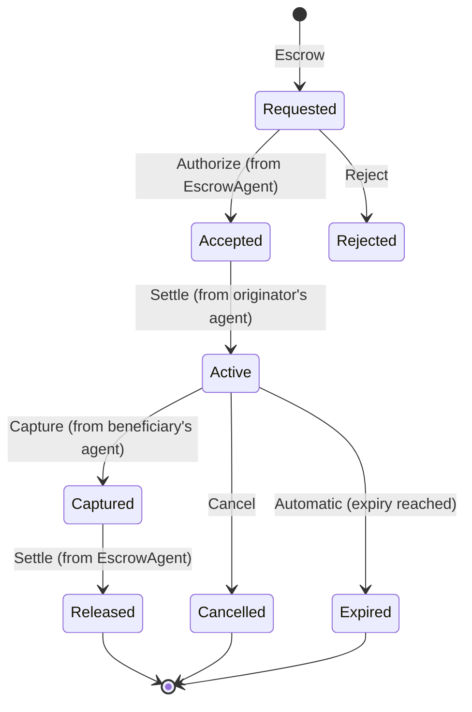

## Simple Summary

Introduces **Escrow** and **Capture** message types that allow agents to hold and release assets on behalf of parties during a transaction. The escrow can be captured (released to beneficiary) or cancelled (returned to originator), enabling payment guarantee flows (like credit card authorization/capture) and secure asset swaps between parties.

## Abstract

This proposal defines a composable **Escrow** workflow within the Transaction Authorization Protocol. An Escrow message allows one agent to request another agent to hold a specified amount of currency or asset from a party in escrow on behalf of another party. The specification introduces a **Capture** message for beneficiaries to authorize the release of escrowed funds, and defines the complete lifecycle including acceptance by the escrow agent, activation through settlement, and release or cancellation. The workflow reuses existing TAP messages (Authorize, Settle, Cancel) from [TAIP-4] and can optionally leverage [TAIP-3] for returning cancelled funds. This enables various use cases including payment guarantees for merchants, asset swaps between parties, and conditional payments that require multi-party authorization before settlement.

## Motivation

Current blockchain transactions are immediate and irreversible, making it challenging to implement common financial patterns like:

1. **Payment Guarantees**: Similar to credit card authorization, where funds are reserved but not immediately captured
2. **Asset Swaps**: Where two parties want to exchange different assets atomically
3. **Conditional Payments**: Where funds should only be released upon meeting certain conditions
4. **Multi-party Transactions**: Where multiple parties need to approve before funds are released

By introducing an Escrow message type, TAP can support these advanced workflows while maintaining its core principles of agent-based authorization and composability. The escrow agent acts as a trusted intermediary, holding assets until conditions are met for release or cancellation.

## Specification

### Roles and Participants

The Escrow workflow involves several distinct roles:

1. **Initiator**: The agent that creates and sends the Escrow request (identified by `from` in the DIDComm envelope)
2. **Escrow Agent**: The agent that receives the request and holds the assets in escrow (identified by the `EscrowAgent` role the `agents` array)
3. **Originator**: The party whose assets will be placed in escrow (consistent with TAIP-3 terminology)
4. **Beneficiary**: The party who will receive the assets if the escrow is released
5. **Authorized Agents**: Any agent listed in the `agents` array with a `for` field containing the beneficiary's DID can approve release or cancellation

The authorization model is simple: agents acting for the beneficiary (as indicated by the `for` field) have the authority to release the escrow to the beneficiary or cancel it (returning funds to the originator).

**Important**: Exactly one agent in the `agents` array MUST have the role `"EscrowAgent"`. This agent is responsible for holding the assets in escrow. Any agent can take on this role - it could be a dedicated escrow service, the originator's wallet provider, or any other trusted agent in the transaction.

**Policies**: Agents MAY declare policies per [TAIP-7] to specify their requirements for participating in the escrow. For example, an escrow agent might require `RequirePresentation` for KYC verification or `RequireAuthorization` from specific parties before accepting the escrow role.

### Escrow Message

An **Escrow** is a [DIDComm] message (per [TAIP-2]) that requests an agent to hold assets in escrow. Like all TAP messages, it follows the DIDComm v2 message structure with the TAP-specific body format.

The DIDComm message envelope contains:
- **`from`** – REQUIRED [DID] of the initiator agent (the agent requesting the escrow)
- **`to`** – REQUIRED Array containing [DID] of the agents taking part in the escrow process
- **`type`** – REQUIRED Message type: `"https://tap.rsvp/schema/1.0#Escrow"`
- **`id`** – REQUIRED Unique message identifier
- **`thid`** – OPTIONAL Thread identifier for related messages. Eg. a `Payment` ([TAIP-14])
- **`created_time`** – REQUIRED Message creation timestamp
- **`expires_time`** – OPTIONAL Message expiration timestamp

The message `body` contains:
- **`@context`** – REQUIRED JSON-LD context: `"https://tap.rsvp/schema/1.0"`
- **`@type`** – REQUIRED Type identifier: `"https://tap.rsvp/schema/1.0#Escrow"`
- **`asset`** – OPTIONAL The specific cryptocurrency asset to be held in escrow ([CAIP-19] identifier). Either `asset` OR `currency` MUST be present
- **`currency`** – OPTIONAL ISO 4217 currency code (e.g. "USD", "EUR") for fiat-denominated escrows. Either `asset` OR `currency` MUST be present
- **`amount`** – REQUIRED The amount to be held in escrow (string decimal)
- **`originator`** – REQUIRED The party whose assets will be placed in escrow (Party object per [TAIP-6])
- **`beneficiary`** – REQUIRED The party who will receive the assets when released (Party object per [TAIP-6])
- **`expiry`** – REQUIRED Timestamp after which the escrow automatically expires and funds are released back to the originator
- **`agreement`** – OPTIONAL URL or URI referencing the terms and conditions of the escrow
- **`agents`** – REQUIRED Array of agents involved in the escrow per [TAIP-5]. Exactly one agent MUST have `"role": "EscrowAgent"`

### Escrow States

An escrow progresses through the following states:



### Message Flow

The escrow workflow follows this sequence:

1. **Escrow Request**: Initiating agent sends Escrow message to all involved agents
2. **Escrow Acceptance**: The EscrowAgent responds with Authorize to accept the escrow role
   - If EscrowAgent also acts `for` the originator, funds are locked internally
   - Otherwise, Authorize MUST include a `settlementAddress` for the originator to send funds
3. **Beneficiary Approval**: Beneficiary's agent sends Authorize with their `settlementAddress`
4. **Activation**: Originator's agent sends Settle to transfer funds to escrow (if external)
5. **Verification**: Beneficiary's agent validates on-chain settlement using internal risk tools
6. **Capture**: Beneficiary's agent sends Capture message to release funds
   - Can optionally include `amount` (must be ≤ original amount) and `settlementAddress`
7. **Release**: EscrowAgent sends Settle to transfer funds to beneficiary
8. **Cancellation**: If cancelled, EscrowAgent can initiate a [TAIP-3] Transfer to return funds

### TAP Message Semantics

This TAIP reuses existing TAP messages with their established semantics from [TAIP-4]:

- **Authorize**: Signals approval or acceptance. Used by:
  - EscrowAgent to accept the escrow role
  - Beneficiary's agent to approve and provide settlement details
  
- **Settle**: Indicates blockchain settlement. Used by:
  - Originator's agent to fund the escrow
  - EscrowAgent to release funds after capture
  
- **Cancel**: Voluntary termination by any party. Results in funds returning to originator
  
- **Reject**: Policy-based refusal (e.g., failed compliance check). Escrow cannot proceed
  
- **Revert**: Request to reverse a completed transaction. Follows [TAIP-4] reversal flow

### Capture Message

A **Capture** is a [DIDComm] message that authorizes the release of escrowed funds to the beneficiary.

The DIDComm message envelope contains:
- **`from`** – REQUIRED [DID] of the beneficiary's agent
- **`to`** – REQUIRED Array containing [DID] of the EscrowAgent
- **`type`** – REQUIRED Message type: `"https://tap.rsvp/schema/1.0#Capture"`
- **`id`** – REQUIRED Unique message identifier
- **`thid`** – REQUIRED Thread identifier linking to the original Escrow message

The message `body` contains:
- **`@context`** – REQUIRED JSON-LD context: `"https://tap.rsvp/schema/1.0"`
- **`@type`** – REQUIRED Type identifier: `"https://tap.rsvp/schema/1.0#Capture"`
- **`amount`** – OPTIONAL Amount to capture (string decimal). If omitted, captures full escrow amount. MUST be ≤ original amount
- **`settlementAddress`** – OPTIONAL Blockchain address for settlement. If omitted, uses address from earlier Authorize

### Example: Payment Guarantee Flow

This example shows a merchant requesting a payment guarantee from a customer, formatted as a complete DIDComm message per [TAIP-2]:

```json
{
  "id": "123e4567-e89b-12d3-a456-426614174000",
  "type": "https://tap.rsvp/schema/1.0#Escrow",
  "from": "did:web:merchant.example",
  "to": ["did:web:paymentprocessor.example"],
  "created_time": 1719226800,
  "expires_time": 1719313200,
  "body": {
    "@context": "https://tap.rsvp/schema/1.0",
    "@type": "https://tap.rsvp/schema/1.0#Escrow",
    "asset": "eip155:1/erc20:0xa0b86991c6218b36c1d19d4a2e9eb0ce3606eb48",
    "amount": "100.00",
    "originator": {
      "@id": "did:eg:customer"
    },
    "beneficiary": {
      "@id": "did:web:merchant.example"
    },
    "expiry": "2025-06-25T00:00:00Z",
    "agreement": "https://merchant.example/order/12345/terms",
    "agents": [
      {
        "@id": "did:web:merchant.example",
        "for": "did:web:merchant.example"
      },
      {
        "@id": "did:web:paymentprocessor.example",
        "role": "EscrowAgent"
      },
      {
        "@id": "did:web:customer.wallet",
        "for": "did:eg:customer"
      }
    ]
  }
}
```

In this example:
- The merchant requests the payment processor to hold $100 USDC in escrow
- The merchant agent (acting for the beneficiary) can release or cancel the escrow
- The escrow expires after 24 hours if not released or cancelled
- The agreement URL points to the terms and conditions for this specific order

### Example: Asset Swap Flow

This example demonstrates an atomic swap between two parties where each party creates an escrow with the other as beneficiary:

```json
{
  "id": "swap-alice-to-bob",
  "type": "https://tap.rsvp/schema/1.0#Escrow",
  "from": "did:web:alice.wallet",
  "to": ["did:web:swap.service"],
  "body": {
    "@context": "https://tap.rsvp/schema/1.0",
    "@type": "https://tap.rsvp/schema/1.0#Escrow",
    "asset": "eip155:1/erc20:0xa0b86991c6218b36c1d19d4a2e9eb0ce3606eb48",
    "amount": "100.00",
    "originator": {
      "@id": "did:eg:alice"
    },
    "beneficiary": {
      "@id": "did:eg:bob"
    },
    "expiry": "2025-06-25T00:00:00Z",
    "agreement": "https://swap.service/trades/abc123",
    "agents": [
      {
        "@id": "did:web:alice.wallet",
        "for": "did:eg:alice"
      },
      {
        "@id": "did:web:bob.wallet",
        "for": "did:eg:bob"
      },
      {
        "@id": "did:web:swap.service",
        "role": "EscrowAgent"
      }
    ]
  }
}
```

In this swap scenario:
- Alice creates an escrow with Bob as beneficiary (100 USDC)
- Bob creates a matching escrow with Alice as beneficiary (0.05 ETH)
- Bob's agent can release Alice's escrow to Bob
- Alice's agent can release Bob's escrow to Alice
- The swap service coordinates the atomic execution

### Example: Fiat Currency Escrow

This example shows an escrow denominated in fiat currency:

```json
{
  "id": "789e0123-e89b-12d3-a456-426614174003",
  "type": "https://tap.rsvp/schema/1.0#Escrow",
  "from": "did:web:marketplace.example",
  "to": ["did:web:escrow.bank"],
  "body": {
    "@context": "https://tap.rsvp/schema/1.0",
    "@type": "https://tap.rsvp/schema/1.0#Escrow",
    "currency": "USD",
    "amount": "500.00",
    "originator": {
      "@id": "did:eg:buyer"
    },
    "beneficiary": {
      "@id": "did:eg:seller"
    },
    "expiry": "2025-07-01T00:00:00Z",
    "agreement": "https://marketplace.example/purchase/98765",
    "agents": [
      {
        "@id": "did:web:marketplace.example",
        "for": "did:eg:seller"
      },
      {
        "@id": "did:web:buyer.bank",
        "for": "did:eg:buyer"
      },
      {
        "@id": "did:web:escrow.bank",
        "role": "EscrowAgent"
      }
    ]
  }
}
```

In this fiat escrow:
- The marketplace requests $500 USD to be held in escrow
- The actual settlement might use stablecoins or traditional banking rails
- The marketplace (acting for the seller) can release upon delivery confirmation

### Example: Wallet Provider as Escrow Agent

This example shows the originator's wallet provider acting as the escrow agent:

```json
{
  "id": "internal-escrow-123",
  "type": "https://tap.rsvp/schema/1.0#Escrow",
  "from": "did:web:alice.wallet",
  "to": ["did:web:alice.wallet"],
  "body": {
    "@context": "https://tap.rsvp/schema/1.0",
    "@type": "https://tap.rsvp/schema/1.0#Escrow",
    "asset": "eip155:1/erc20:0xa0b86991c6218b36c1d19d4a2e9eb0ce3606eb48",
    "amount": "250.00",
    "originator": {
      "@id": "did:eg:alice"
    },
    "beneficiary": {
      "@id": "did:web:service.provider"
    },
    "expiry": "2025-06-26T12:00:00Z",
    "agents": [
      {
        "@id": "did:web:alice.wallet",
        "for": "did:eg:alice",
        "role": "EscrowAgent"
      },
      {
        "@id": "did:web:service.provider",
        "for": "did:web:service.provider"
      }
    ]
  }
}
```

In this example:
- Alice's wallet provider acts as both the originator's agent AND the escrow agent
- The service provider can release or cancel the escrow
- This pattern is efficient when the wallet already has custody of the assets

### Example: Escrow with Policy Requirements

This example shows an escrow agent requiring verification before accepting the escrow:

```json
{
  "id": "policy-escrow-456",
  "type": "https://tap.rsvp/schema/1.0#Escrow",
  "from": "did:web:marketplace.example",
  "to": ["did:web:compliant.escrow"],
  "body": {
    "@context": "https://tap.rsvp/schema/1.0",
    "@type": "https://tap.rsvp/schema/1.0#Escrow",
    "asset": "eip155:1/erc20:0xa0b86991c6218b36c1d19d4a2e9eb0ce3606eb48",
    "amount": "1000.00",
    "originator": {
      "@id": "did:eg:buyer"
    },
    "beneficiary": {
      "@id": "did:eg:seller"
    },
    "expiry": "2025-06-30T00:00:00Z",
    "agents": [
      {
        "@id": "did:web:compliant.escrow",
        "role": "EscrowAgent",
        "policies": [
          {
            "@type": "RequirePresentation",
            "fromAgent": "originator",
            "aboutParty": "originator",
            "purpose": "KYC/AML verification",
            "presentationDefinition": "https://compliant.escrow/definitions/kyc-basic"
          },
          {
            "@type": "RequireAuthorization",
            "fromAgent": "beneficiary",
            "purpose": "Beneficiary must approve escrow terms"
          }
        ]
      },
      {
        "@id": "did:web:buyer.wallet",
        "for": "did:eg:buyer"
      },
      {
        "@id": "did:web:seller.platform",
        "for": "did:eg:seller"
      }
    ]
  }
}
```

In this example:
- The escrow agent declares policies requiring KYC verification and beneficiary authorization
- These policies must be satisfied before the escrow agent will accept the role
- Standard [TAIP-7] policy negotiation applies

### Composability with Other TAP Messages

The Escrow workflow is designed to be composable with other TAP messages:

1. **With Transfer**: An escrow can be created as part of a Transfer flow
2. **With Payment**: Merchants can require escrow before shipping goods
3. **With Policies**: Agents can define policies requiring escrow for certain transactions

Example of capturing escrowed funds:

```json
{
  "id": "capture-123",
  "type": "https://tap.rsvp/schema/1.0#Capture",
  "from": "did:web:merchant.example",
  "to": ["did:web:paymentprocessor.example"],
  "thid": "123e4567-e89b-12d3-a456-426614174000",
  "body": {
    "@context": "https://tap.rsvp/schema/1.0",
    "@type": "https://tap.rsvp/schema/1.0#Capture",
    "amount": "95.00",
    "settlementAddress": "eip155:1:0x742d35Cc6634C0532925a3b844Bc9e7595f1234"
  }
}
```

Example of the EscrowAgent settling after capture:

```json
{
  "id": "settle-after-capture",
  "type": "https://tap.rsvp/schema/1.0#Settle",
  "from": "did:web:paymentprocessor.example",
  "to": ["did:web:merchant.example"],
  "thid": "123e4567-e89b-12d3-a456-426614174000",
  "body": {
    "@context": "https://tap.rsvp/schema/1.0",
    "@type": "https://tap.rsvp/schema/1.0#Settle",
    "settlementAddress": "eip155:1:0x742d35Cc6634C0532925a3b844Bc9e7595f1234",
    "amount": "95.00",
    "settlementId": "eip155:1:tx/0x4567890abcdef1234567890abcdef1234567890"
  }
}
```

### Authorization Rules

The escrow authorization follows specific rules:

1. **EscrowAgent Acceptance**: The agent with role "EscrowAgent" MUST send Authorize to accept the escrow
   - If acting `for` the originator, funds are locked internally (book transfer)
   - Otherwise, MUST include `settlementAddress` for external transfer

2. **Beneficiary Approval**: Agent acting `for` the beneficiary MUST send Authorize with `settlementAddress`

3. **Capture Authorization**: Only agents with `"for": "<beneficiary DID>"` can send Capture messages

4. **Cancellation**: Any involved agent can send Cancel, but only before Capture

5. **Message Semantics**: Cancel, Reject, and Revert messages have the same semantics as defined in [TAIP-4]

Common patterns:
- **Payment authorization**: Merchant captures payment after service delivery
- **Asset swap**: Each party's agent coordinates their side of the swap
- **Arbitration**: Third-party agent acting for beneficiary resolves disputes

### Expiry Handling

The `expiry` timestamp is required for all escrows:
- The escrow automatically expires at the specified time
- Expired escrows MUST return funds to the originator
- No further actions (release/cancel) are valid after expiry
- Escrow agents SHOULD process expiry automatically without requiring manual intervention

## Security Considerations

1. **Escrow Agent Trust**: Parties must trust the escrow agent to honestly hold and release funds
2. **EscrowAgent Role Validation**: Implementations MUST verify that exactly one agent has the "EscrowAgent" role
3. **Authorization Verification**: Escrow agents MUST verify that release/cancel messages come from agents listed in the `agents` array with `for` field containing the beneficiary's DID
4. **Double Spending**: Escrow agents must ensure funds are locked and cannot be spent elsewhere during the escrow period
5. **Atomicity**: For swaps, both legs must complete or both must fail
6. **Expiry Enforcement**: Escrow agents MUST enforce expiry times to prevent indefinite fund locks
7. **Agreement Validation**: If an agreement URL is provided, parties should verify its authenticity and terms

## Privacy Considerations

1. **Minimal Disclosure**: Escrow messages should not contain unnecessary party information
2. **Selective Revelation**: Use [TAIP-8] for sharing additional details only when required
3. **Transaction Linkability**: Multiple escrows may be linkable if using same agents

## Backwards Compatibility

This TAIP introduces a new message type and does not modify existing messages. Agents not supporting Escrow will reject such messages as unsupported, maintaining compatibility with existing TAP implementations.

## References

* [TAIP-2] TAP Messaging
* [TAIP-3] Asset Transfer
* [TAIP-4] Transaction Authorization Protocol
* [TAIP-5] Transaction Agents
* [TAIP-6] Transaction Parties
* [TAIP-7] Agent Policies
* [CAIP-19] Asset Type and Asset ID Specification
* [ISO-4217] ISO 4217 Currency Codes
* [DID] Decentralized Identifiers
* [DIDComm] DIDComm Messaging

[TAIP-2]: ./taip-2
[TAIP-3]: ./taip-3
[TAIP-4]: ./taip-4
[TAIP-5]: ./taip-5
[TAIP-6]: ./taip-6
[TAIP-7]: ./taip-7
[CAIP-19]: https://chainagnostic.org/CAIPs/caip-19
[ISO-4217]: https://www.iso.org/iso-4217-currency-codes.html
[DID]: https://www.w3.org/TR/did-core/
[DIDComm]: https://identity.foundation/didcomm-messaging/spec/

## Copyright

Copyright and related rights waived via [CC0](../LICENSE).
