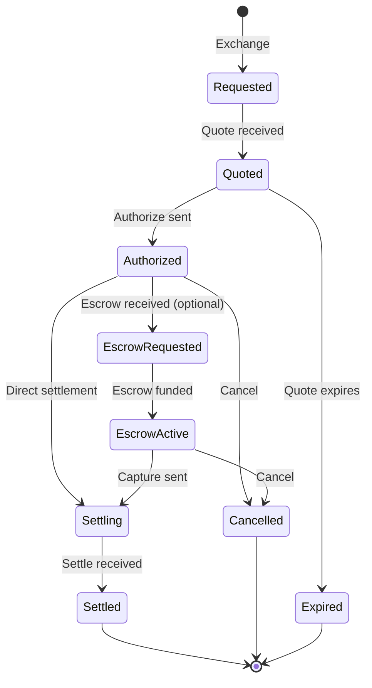
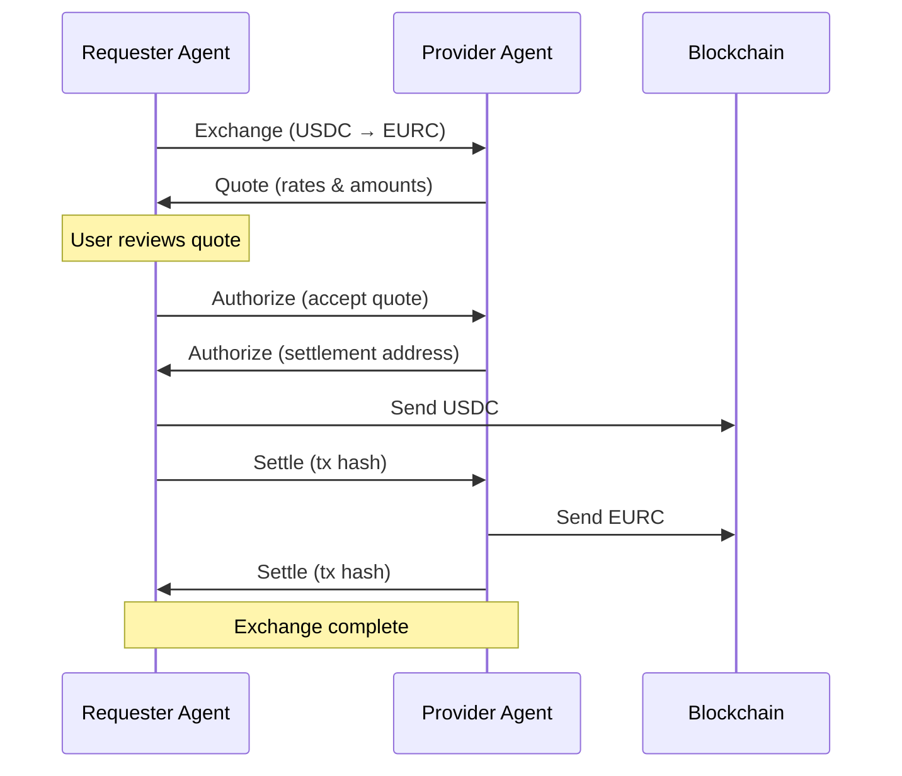
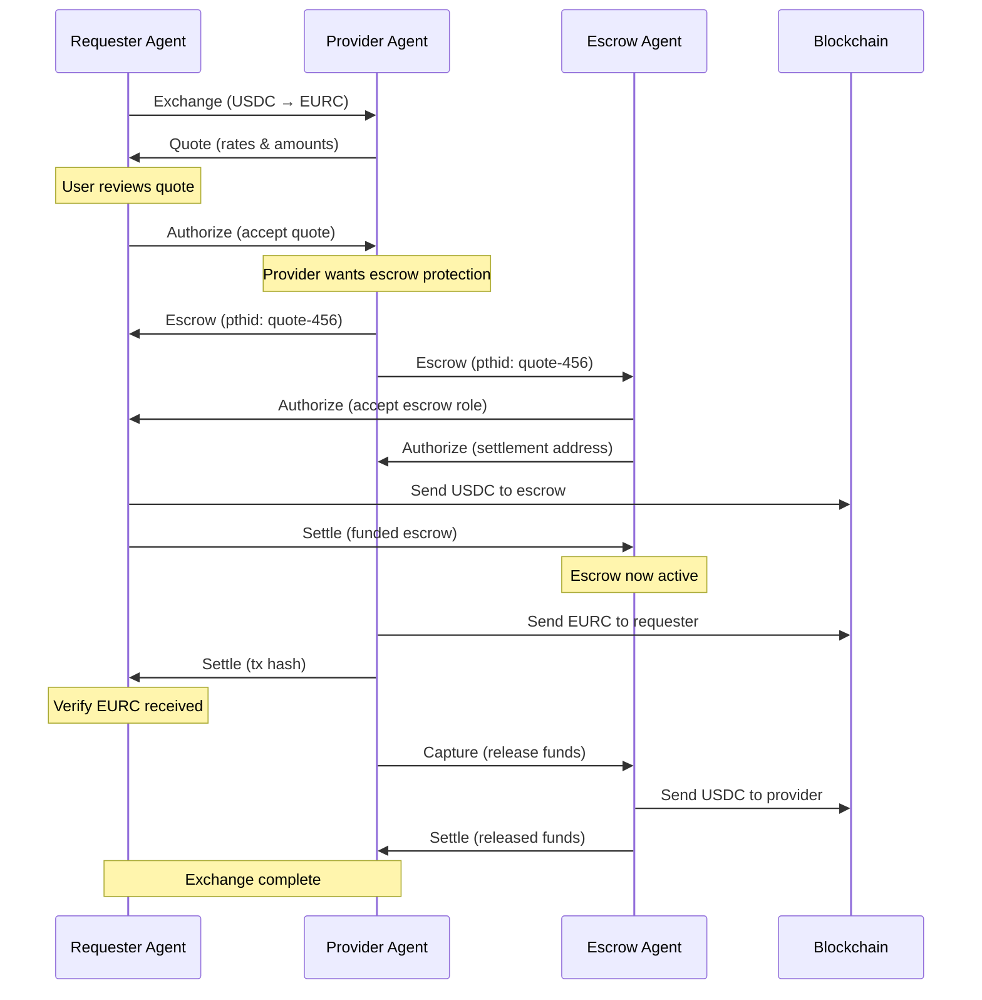
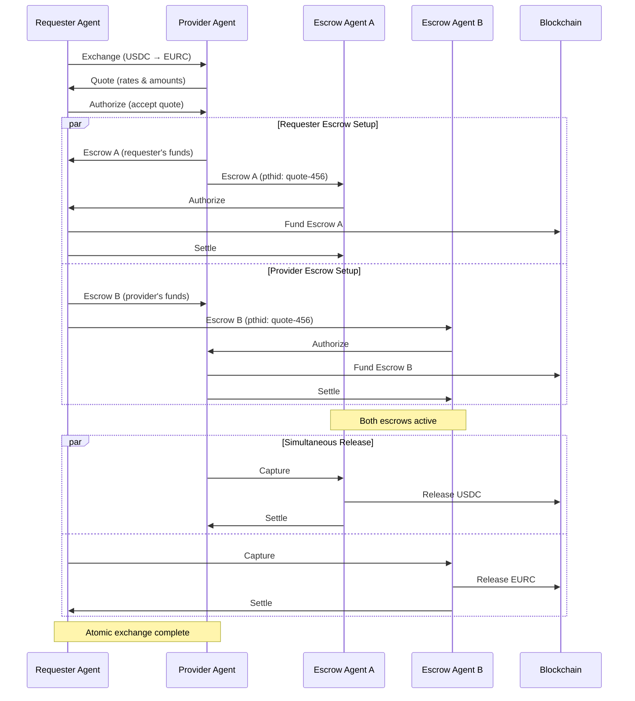
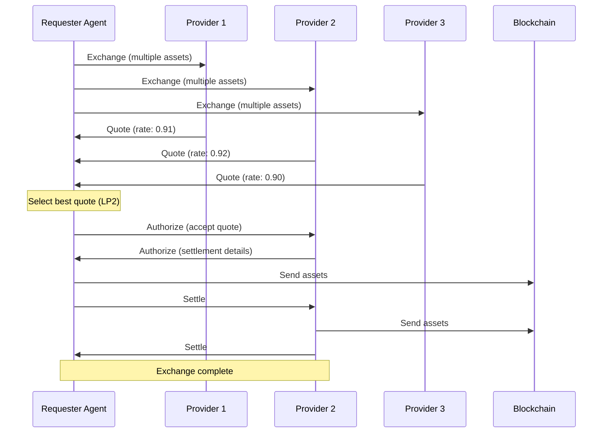

# TAIP-18: Asset Exchange

## Simple Summary

A standard for requesting and executing asset exchanges and price quotations for blockchain-based payment settlement. Enables wallets and orchestrators to request cross-asset quotes, approve swap routes, and settle in compatible assets with minimal trust assumptions.

## Abstract

TAIP-18 introduces an Exchange message format for initiating cross-asset quotes (e.g., from USDC to EURC, USD to USDC, or across chains) and defines optional settlement support for accepted quotes. It is designed for composability with existing TAP messages like Payment ([TAIP-14]) and Transfer ([TAIP-3]). TAIP-18 formalizes the message exchange required to:

* Quote and approve stablecoin swaps
* Discover on-/off-ramp pricing
* Execute FX transactions
* Bridge assets or stablecoins across chains

It enables wallets, liquidity providers (LPs), and orchestrators to collaborate on a unified quoting and swap interface.

## Motivation

Stablecoin-based payments often require conversion between tokens, chains, or currencies. For example:

* A business receives an invoice in EURC but only holds USDC
* A wallet provider wants to settle in native stablecoins across chains
* A PSP requires a cross-currency quote (e.g., USD to GBP)

Today, such flows are fragmented across centralized off-ramps, AMMs, and FX providers, with no standard message structure to request, negotiate, and execute swaps.

TAIP-18 solves this by creating a compliant, composable quote & swap framework that plugs into existing TAP flows. It abstracts complexity and adds identity-layered trust for regulatory-grade financial activity.

## Specification

TAIP-18 defines two new message types for quote negotiation (`Exchange` and `Quote`) and reuses existing [TAIP-4] messages (`Authorize` and `Settle`) for quote acceptance and swap settlement:

### 1. `Exchange`

An **Exchange** is a [DIDComm] message (per [TAIP-2]) sent by the party initiating an exchange request. Like all TAP messages, it follows the DIDComm v2 message structure with the TAP-specific body format.

The exchange request identifies the parties involved in the potential transaction and the agents acting on their behalf. The `requester` party represents the entity seeking the exchange. The optional `provider` party represents a specific liquidity provider being engaged; when omitted, the Exchange message can be broadcast through a centralized service or sent to multiple providers who can each choose to respond with a Quote. The `agents` array lists all software agents involved in processing this exchange request, including their roles and the parties they represent.

The Exchange message supports multiple assets in both `fromAssets` and `toAssets` arrays, enabling complex exchange scenarios. For example, when responding to a Payment request ([TAIP-14]) that lists multiple EUR stablecoins as supportedAssets, but the customer only has USD stablecoins available, they can list their available USD tokens in `fromAssets` and the merchant's supported EUR tokens in `toAssets`, allowing providers to quote cross-currency exchanges.

The DIDComm message envelope contains:

- **`from`** – REQUIRED [DID] of the initiating agent
- **`to`** – REQUIRED Array containing [DID] of the liquidity providers or orchestrators
- **`type`** – REQUIRED Message type: `"https://tap.rsvp/schema/1.0#Exchange"`
- **`id`** – REQUIRED Unique message identifier
- **`thid`** – OPTIONAL Thread identifier for related messages (e.g., a Payment from [TAIP-14])
- **`created_time`** – REQUIRED Message creation timestamp
- **`expires_time`** – OPTIONAL Message expiration timestamp

The message `body` contains:

- **`@context`** – REQUIRED JSON-LD context: `"https://tap.rsvp/schema/1.0"`
- **`@type`** – REQUIRED Type identifier: `"https://tap.rsvp/schema/1.0#Exchange"`
- **`fromAssets`** – REQUIRED Array of [CAIP-19], DTI, or [ISO-4217] currency codes for available source assets
- **`toAssets`** – REQUIRED Array of [CAIP-19], DTI, or [ISO-4217] currency codes for desired target assets
- **`fromAmount`** – CONDITIONAL Amount of source asset to exchange (string decimal). Either `fromAmount` or `toAmount` must be provided
- **`toAmount`** – CONDITIONAL Amount of target asset desired (string decimal). Either `fromAmount` or `toAmount` must be provided
- **`requester`** – REQUIRED The party requesting the exchange (Party object per [TAIP-6])
- **`provider`** – OPTIONAL The preferred liquidity provider party (Party object per [TAIP-6]). When omitted, the Exchange message can be broadcast to multiple providers
- **`agents`** – REQUIRED Array of agents involved in the exchange request per [TAIP-5]
- **`policies`** – OPTIONAL Compliance or presentation requirements per [TAIP-7]

### 2. `Quote`

A **Quote** is a [DIDComm] message sent by the liquidity provider or orchestrator in response to an Exchange request.

The quote response includes the `provider` party information and an updated `agents` array. The agents array must contain all agents from the original Exchange request plus any additional agents representing the provider. This ensures full traceability of all parties and agents involved in the potential transaction.

The DIDComm message envelope contains:

- **`from`** – REQUIRED [DID] of the liquidity provider or orchestrator
- **`to`** – REQUIRED Array containing [DID] of the original requester
- **`type`** – REQUIRED Message type: `"https://tap.rsvp/schema/1.0#Quote"`
- **`id`** – REQUIRED Unique message identifier
- **`thid`** – REQUIRED Thread identifier linking to the original Exchange request
- **`created_time`** – REQUIRED Message creation timestamp

The message `body` contains:

- **`@context`** – REQUIRED JSON-LD context: `"https://tap.rsvp/schema/1.0"`
- **`@type`** – REQUIRED Type identifier: `"https://tap.rsvp/schema/1.0#Quote"`
- **`fromAsset`** – REQUIRED Source asset (copied from request)
- **`toAsset`** – REQUIRED Target asset (copied from request)
- **`fromAmount`** – REQUIRED Amount of source asset to be exchanged (string decimal)
- **`toAmount`** – REQUIRED Amount of target asset to be received (string decimal)
- **`provider`** – REQUIRED The liquidity provider party (Party object per [TAIP-6])
- **`agents`** – REQUIRED Array of agents involved in the quote per [TAIP-5]. Must include all agents from the original Exchange request plus any provider agents
- **`expires`** – REQUIRED ISO 8601 timestamp when quote expires

### 3. Authorization and Settlement

TAIP-18 reuses the existing `Authorize` and `Settle` messages from [TAIP-4] for quote acceptance and swap settlement. This ensures consistency across the TAP protocol and enables seamless integration with existing authorization flows.

#### Using `Authorize` for Quote Acceptance

When accepting a quote, agents send an `Authorize` message (per [TAIP-4]) with the following considerations:

- **`thid`** links to the Quote message ID
- **`settlementAddress`** specifies where to receive the swapped assets
- **`settlementAsset`** confirms the asset being received (from `toAsset` in the quote)
- **`amount`** confirms the expected amount to receive based on the quote

#### Using `Settle` for Swap Settlement

When the swap is executed, the liquidity provider sends a `Settle` message (per [TAIP-4]) with:

- **`thid`** links to the authorization or original quote thread
- **`settlementAddress`** indicates where funds were sent
- **`settlementId`** contains the blockchain transaction hash in [CAIP-220] format
- **`amount`** specifies the actual settled amount

## Example Messages

### Exchange Example

This example shows a complete DIDComm message requesting an exchange from USDC to EURC:

```json
{
  "id": "exchange-request-123",
  "type": "https://tap.rsvp/schema/1.0#Exchange",
  "from": "did:web:wallet.example",
  "to": ["did:web:lp.example", "did:web:lp2.example"],
  "created_time": 1719226800,
  "expires_time": 1719313200,
  "body": {
    "@context": "https://tap.rsvp/schema/1.0",
    "@type": "https://tap.rsvp/schema/1.0#Exchange",
    "fromAssets": ["eip155:1/erc20:0xA0b86991c6218b36c1d19d4a2e9eb0ce3606eb48"],
    "toAssets": ["eip155:1/erc20:0xB00b00b00b00b00b00b00b00b00b00b00b00b00b"],
    "fromAmount": "1000.00",
    "requester": {
      "@id": "did:web:business.example"
    },
    "provider": {
      "@id": "did:web:liquidity.provider"
    },
    "agents": [
      {
        "@id": "did:web:wallet.example",
        "for": "did:web:business.example",
        "role": "requester"
      },
      {
        "@id": "did:web:lp.example",
        "for": "did:web:liquidity.provider",
        "role": "provider"
      }
    ]
  }
}
```

### Quote Example

```json
{
  "id": "quote-456",
  "type": "https://tap.rsvp/schema/1.0#Quote",
  "from": "did:web:lp.example",
  "to": ["did:web:wallet.example"],
  "thid": "exchange-request-123",
  "created_time": 1719226850,
  "body": {
    "@context": "https://tap.rsvp/schema/1.0",
    "@type": "https://tap.rsvp/schema/1.0#Quote",
    "fromAsset": "eip155:1/erc20:0xA0b86991c6218b36c1d19d4a2e9eb0ce3606eb48",
    "toAsset": "eip155:1/erc20:0xB00b00b00b00b00b00b00b00b00b00b00b00b00b",
    "fromAmount": "1000.00",
    "toAmount": "908.50",
    "provider": {
      "@id": "did:web:liquidity.provider"
    },
    "agents": [
      {
        "@id": "did:web:wallet.example",
        "for": "did:web:business.example",
        "role": "requester"
      },
      {
        "@id": "did:web:lp.example",
        "for": "did:web:liquidity.provider",
        "role": "provider"
      }
    ],
    "expiresAt": "2025-07-21T00:00:00Z"
  }
}
```

### Authorize Example (Quote Acceptance)

This example shows accepting a quote using the standard `Authorize` message from [TAIP-4]:

```json
{
  "id": "authorize-quote-789",
  "type": "https://tap.rsvp/schema/1.0#Authorize",
  "from": "did:web:wallet.example",
  "to": ["did:web:lp.example"],
  "thid": "quote-456",
  "created_time": 1719226900,
  "body": {
    "@context": "https://tap.rsvp/schema/1.0",
    "@type": "https://tap.rsvp/schema/1.0#Authorize",
    "settlementAddress": "eip155:1:0xabcdef0123456789abcdef0123456789abcdef01",
    "settlementAsset": "eip155:1/erc20:0xB00b00b00b00b00b00b00b00b00b00b00b00b00b",
    "amount": "908.50"
  }
}
```

### Settle Example (Swap Settlement)

This example shows swap settlement using the standard `Settle` message from [TAIP-4]:

```json
{
  "id": "settle-swap-999",
  "type": "https://tap.rsvp/schema/1.0#Settle",
  "from": "did:web:lp.example",
  "to": ["did:web:wallet.example"],
  "thid": "authorize-quote-789",
  "created_time": 1719227000,
  "body": {
    "@context": "https://tap.rsvp/schema/1.0",
    "@type": "https://tap.rsvp/schema/1.0#Settle",
    "settlementAddress": "eip155:1:0xabcdef0123456789abcdef0123456789abcdef01",
    "settlementId": "eip155:1:tx/0xdeadbeef1234567890abcdef1234567890abcdef1234567890abcdef123456",
    "amount": "908.50"
  }
}
```

### Example: Fiat to Crypto Quote

This example shows an exchange request from USD fiat to USDC stablecoin:

```json
{
  "id": "fiat-exchange-request-111",
  "type": "https://tap.rsvp/schema/1.0#Exchange",
  "from": "did:web:user.wallet",
  "to": ["did:web:onramp.provider"],
  "created_time": 1719230000,
  "body": {
    "@context": "https://tap.rsvp/schema/1.0",
    "@type": "https://tap.rsvp/schema/1.0#Exchange",
    "fromAssets": ["USD"],
    "toAssets": ["eip155:1/erc20:0xA0b86991c6218b36c1d19d4a2e9eb0ce3606eb48"],
    "fromAmount": "1000.00",
    "requester": {
      "@id": "did:web:user.entity"
    },
    "provider": {
      "@id": "did:web:onramp.company"
    },
    "agents": [
      {
        "@id": "did:web:user.wallet",
        "for": "did:web:user.entity",
        "role": "requester"
      },
      {
        "@id": "did:web:onramp.provider",
        "for": "did:web:onramp.company",
        "role": "provider"
      }
    ]
  }
}
```

Response:

```json
{
  "id": "fiat-quote-222",
  "type": "https://tap.rsvp/schema/1.0#Quote",
  "from": "did:web:onramp.provider",
  "to": ["did:web:user.wallet"],
  "thid": "fiat-exchange-request-111",
  "created_time": 1719230050,
  "body": {
    "@context": "https://tap.rsvp/schema/1.0",
    "@type": "https://tap.rsvp/schema/1.0#Quote",
    "fromAsset": "USD",
    "toAsset": "eip155:1/erc20:0xA0b86991c6218b36c1d19d4a2e9eb0ce3606eb48",
    "fromAmount": "1000.00",
    "toAmount": "996.00",
    "provider": {
      "@id": "did:web:onramp.company"
    },
    "agents": [
      {
        "@id": "did:web:user.wallet",
        "for": "did:web:user.entity",
        "role": "requester"
      },
      {
        "@id": "did:web:onramp.provider",
        "for": "did:web:onramp.company",
        "role": "provider"
      }
    ],
    "expiresAt": "2025-07-21T00:00:00Z"
  }
}
```

### Example: Broadcast Exchange Request

This example shows an Exchange request broadcast to multiple providers without specifying a particular provider. The requester has USDC and USDT on Ethereum mainnet available and wants to exchange for either USDC or USDT on Polygon:

```json
{
  "id": "broadcast-exchange-456",
  "type": "https://tap.rsvp/schema/1.0#Exchange",
  "from": "did:web:wallet.example",
  "to": ["did:web:exchange.platform", "did:web:lp1.example", "did:web:lp2.example"],
  "created_time": 1719228000,
  "body": {
    "@context": "https://tap.rsvp/schema/1.0",
    "@type": "https://tap.rsvp/schema/1.0#Exchange",
    "fromAssets": [
      "eip155:1/erc20:0xA0b86991c6218b36c1d19d4a2e9eb0ce3606eb48",
      "eip155:1/erc20:0xdAC17F958D2ee523a2206206994597C13D831ec7"
    ],
    "toAssets": [
      "eip155:137/erc20:0x2791Bca1f2de4661ED88A30C99A7a9449Aa84174",
      "eip155:137/erc20:0xc2132D05D31c914a87C6611C10748AEb04B58e8F"
    ],
    "toAmount": "5000.00",
    "requester": {
      "@id": "did:web:business.example"
    },
    "agents": [
      {
        "@id": "did:web:wallet.example",
        "for": "did:web:business.example",
        "role": "requester"
      }
    ]
  }
}
```

### Example: Exchange with Escrow

After a Quote is accepted via Authorize, the provider can request escrow using [TAIP-17]:

```json
{
  "id": "escrow-for-exchange-123",
  "type": "https://tap.rsvp/schema/1.0#Escrow",
  "from": "did:web:lp.example",
  "to": ["did:web:alice.wallet", "did:web:escrow.service"],
  "pthid": "quote-456",
  "created_time": 1719227000,
  "body": {
    "@context": "https://tap.rsvp/schema/1.0",
    "@type": "https://tap.rsvp/schema/1.0#Escrow",
    "asset": "eip155:1/erc20:0xA0b86991c6218b36c1d19d4a2e9eb0ce3606eb48",
    "amount": "1000.00",
    "originator": {
      "@id": "did:web:business.example"
    },
    "beneficiary": {
      "@id": "did:web:liquidity.provider"
    },
    "expiry": "2025-07-21T01:00:00Z",
    "agents": [
      {
        "@id": "did:web:alice.wallet",
        "for": "did:web:business.example"
      },
      {
        "@id": "did:web:lp.example",
        "for": "did:web:liquidity.provider"
      },
      {
        "@id": "did:web:escrow.service",
        "role": "EscrowAgent"
      }
    ]
  }
}
```

Note how the Escrow message:
- Uses `pthid: "quote-456"` to link to the accepted Quote
- Sets the requester as `originator` (their funds go into escrow)
- Sets the provider as `beneficiary` (they receive funds after exchange)
- Can be sent to the requester's custodial agent if they use one

### Example: Cross-Currency FX Quote

This example shows a pure FX exchange request between fiat currencies:

```json
{
  "id": "fx-exchange-request-333",
  "type": "https://tap.rsvp/schema/1.0#Exchange",
  "from": "did:web:bank.example",
  "to": ["did:web:fx.provider"],
  "created_time": 1719231000,
  "body": {
    "@context": "https://tap.rsvp/schema/1.0",
    "@type": "https://tap.rsvp/schema/1.0#Exchange",
    "fromAssets": ["USD"],
    "toAssets": ["EUR"],
    "fromAmount": "1000.00",
    "requester": {
      "@id": "did:web:bank.entity"
    },
    "provider": {
      "@id": "did:web:fx.company"
    },
    "agents": [
      {
        "@id": "did:web:bank.example",
        "for": "did:web:bank.entity",
        "role": "requester"
      },
      {
        "@id": "did:web:fx.provider",
        "for": "did:web:fx.company",
        "role": "provider"
      }
    ]
  }
}
```

## Flow

### Exchange State Machine

The following state diagram shows the possible states and transitions for an exchange from the requester's perspective:



### Basic Exchange Flow

The simplest exchange flow without escrow:



### Exchange Flow with Escrow

Either party can manage counterparty risk by requesting escrow after a Quote is accepted. This leverages [TAIP-17] Escrow messages with the `pthid` field linking to the Quote:



### Exchange Flow with Dual Escrow

For maximum protection, both parties can use escrow:



### Broadcast Exchange with Multiple Quotes

When broadcasting to multiple providers:



Key aspects of the escrow flow:
- **Uses `pthid`**: Escrow messages reference the Quote via parent thread ID
- **Standard [TAIP-17] flow**: Follows established escrow patterns
- **Flexible initiation**: Either party can request escrow
- **Atomic execution**: With dual escrow, both complete or both fail
- **Optional**: Parties negotiate escrow post-quote acceptance

## Composability

TAIP-18 can be embedded as a subflow in:

* `Payment` workflows ([TAIP-14]) for invoice settlement
* `Escrow` workflows ([TAIP-17]) for guaranteed payment with FX conversion
* On-ramp/off-ramp flows between fiat and crypto assets
* Cross-border remittance with currency conversion
* Multi-asset portfolio rebalancing

## Security Considerations

* Quote expiry timestamps prevent stale pricing abuse
* Settlement verification via txHash
* Swap routed through identity-bound agents
* When using escrow:
  - Escrow agent must be trusted by both parties
  - Atomic execution prevents partial settlement
  - Expiry times on escrows prevent indefinite fund locks
  - Both parties must verify escrow funding before releasing

## Privacy Considerations

* Quotes do not reveal identity unless policies require
* Presentation of verifiable credentials is optional via RequirePresentation ([TAIP-8])

## References

* [TAIP-2] TAP Messaging
* [TAIP-3] Asset Transfer
* [TAIP-4] Transaction Authorization Protocol
* [TAIP-5] Transaction Agents
* [TAIP-6] Transaction Parties
* [TAIP-7] Agent Policies
* [TAIP-8] Selective Disclosure
* [TAIP-9] DIDComm Integration
* [TAIP-14] Payment Request
* [TAIP-17] Composable Escrow
* [CAIP-10] Account ID Specification
* [CAIP-19] Asset Type and Asset ID Specification
* [CAIP-220] Transaction Identifier Specification
* [DTI] Digital Token Identifier
* [ISO-4217] ISO 4217 Currency Codes
* [DID] Decentralized Identifiers
* [DIDComm] DIDComm Messaging

[TAIP-2]: ./taip-2
[TAIP-3]: ./taip-3
[TAIP-4]: ./taip-4
[TAIP-5]: ./taip-5
[TAIP-6]: ./taip-6
[TAIP-7]: ./taip-7
[TAIP-8]: ./taip-8
[TAIP-9]: ./taip-9
[TAIP-14]: ./taip-14
[TAIP-17]: ./taip-17
[CAIP-10]: https://chainagnostic.org/CAIPs/caip-10
[CAIP-19]: https://chainagnostic.org/CAIPs/caip-19
[CAIP-220]: https://github.com/ChainAgnostic/CAIPs/pull/221
[DTI]: https://www.dtif.org/
[ISO-4217]: https://www.iso.org/iso-4217-currency-codes.html
[DID]: https://www.w3.org/TR/did-core/
[DIDComm]: https://identity.foundation/didcomm-messaging/spec/

## Copyright

Copyright and related rights waived via [CC0](../LICENSE).
