<!--You can leave these HTML comments in your merged EIP and delete the visible duplicate text guides, they will not appear and may be helpful to refer to if you edit it again. This is the suggested template for new EIPs. Note that an EIP number will be assigned by an editor. When opening a pull request to submit your EIP, please use an abbreviated title in the filename, `eip-draft_title_abbrev.md`. The title should be 44 characters or less.-->
## Simple Summary
<!--"If you can't explain it simply, you don't understand it well enough." Provide a simplified and layman-accessible explanation of the TAIP.-->
This proposes a simple generic transaction authorization flow, allowing agents acting on behalf of transaction parties to collaborate around authorizing or rejecting it.

## Abstract
<!--A short (~200 word) description of the technical issue being addressed.-->
This is Transaction Authorization Flow, provides the core functionality of the Transaction Authorization Protocol (TAP) and is implemented using a small set of [TAIP-2 Messages][TAIP-2] between [TAIP-5 Agents][TAIP-5]. It is designed to authorize any transaction initiated through [TAIP-2][TAIP-2] such as the [TAIP-3 Asset Transfer][TAIP-3].

## Motivation
<!--The motivation is critical for TAIP. It should clearly explain why the state of the art is inadequate to address the problem that the TAIP solves. TAIP submissions without sufficient motivation may be rejected outright.-->
Crypto transactions and blockchains are designed to be trustless at their core and follow a strict and very limited set of guidelines implemented in the underlying blockchain protocol. This allows the fully permissionless aspect of most blockchains, which we see as a core drivers of innovation and growth in the field. This open and permissionless aspect does present business and indiiduals transacting on blockchains with several operational and risk based challenges, that need to be solved for crypto transactions and blockchains to fully take off. The Transaction Authorization Protocol (TAP) and TAIP-4 offers a way to solve this in a private way between parties, without requiring changes to the permissionless aspects of blockchains today.

We will use the term *"Settlement layer"* to refer to the underlying blockchain protocol. It can refer to either Layer-1, Layer-2, or even DeFi protocols. We will use the term *"Authorization layer"* for the off-chain process handled by transactions participants prior or after settling the transaction on a blockchain. 

### Current State of Crypto Transactions

Currently, crypto transactions are limited by their reliance on the unilateral authorization by key holders, lacking mechanisms for authorization by beneficiaries.

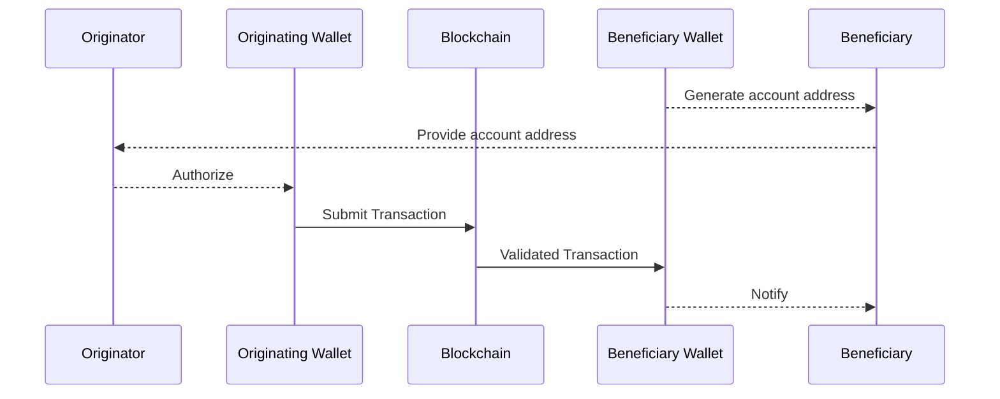

Once a transaction is authorized and submitted to the blockchain by the the originating wallet’s key holders, it is impossible by design to reverse the transaction, which represents a significant change over traditional payment systems that separate payment authorizations from underlying settlement.

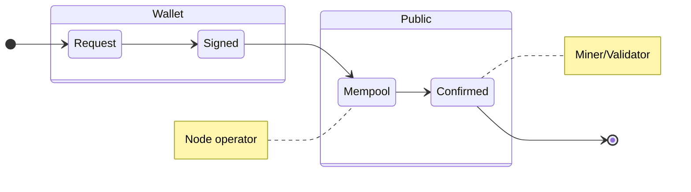

The above demonstrates the state machine behind all blockchain transactions. The only party able to authorize a transaction is the holder of the wallet. Once it has been submitted  to the public Mempool the wallet owner can still in some cases change it, but once confirmed it can no longer be reversed by anyone.

### Travel Rule Protocols

Most protocols implementing the FATF Travel Rule for crypto transactions have also implemented a two party authorization flow between an originator and beneficiary institution. These are all implemented through a deterministic message flow. Each agent or party to a transaction is expected to perform a set of actions in a particular sequence. The reality is that in most cases they don’t do that, but implement the travel rule somewhat haphazardly or not at all, causing most parties customers to not complete a successful authorization flow of a transaction.

### Non-deterministic multi-party authorization

TAP proposes a non-deterministic message flow instead allowing each party to negotiate for their required information and use game theoretical principles to encourage their counterparties to help them implement their own policy around transactions. An institution can force some consensus around the state of the payment, by withholding settlement or not sharing a settlement address until sufficient risk has been mitigated by all the participating agents.

## Specification
<!--The technical specification should describe the standard in detail. The specification should be detailed enough to allow competing, interoperable implementations. -->
Messages follow [TAIP-2 Messaging][TAIP-2] and are sent between [TAIP-5 Agents][TAIP-5] after an initial transaction request such as [TAIP-3 Asset Transfer][TAIP-3] has been sent. Authorization messages MUST include the ID of the original transaction request in the `thid` attribute of there message.

It is important to understand, that this is strictly speaking a messaging standard. There is no shared state implied between agents, with the exception of the ultimate settlement on a blockchain.

There are 3 primary actions an agent can take:

- `Settle` - They are sending the transaction to the blockchain. This is the only action that ultimately matters on the blockchain
- `Authorize` - Authorize or signal to other agents that they are free to `settle` a transaction
- `Reject` - Signal to other agents that they reject the transaction.

These are all sent as replies to an initial request by specifying the `id` of the original request in the `thid` attribute.

### Authorize

Any agent can authorize the transaction by replying as a thread to the initial message. The following shows the attributes of the `body` object:

* `@ctx` - REQUIRED the JSON-LD context `https://tap.rsvp/schema/1.0` (provisional)
* `@type` - REQUIRED the JSON-LD type `https://tap.rsvp/schema/1.0#Authorize` (provisional)
* `settlementAddress` - OPTIONAL string representing the intended destination address of the transaction specified in [CAIP-10](CAIP-10) format. If sent by a VASP representing the beneficiary this is REQUIRED unless the original request contains a `settlementAddress`. For all others it is OPTIONAL.

By not providing a `settlementAddress` until after `Authorization`, beneficiary agents can for the first time reject incoming blockchain transactions.

An example Authorization flow using two agents where the `settlementAddress` was included in the original `Transfer` message:

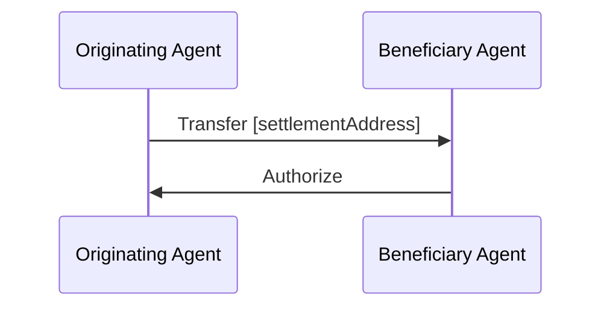

An example Authorization flow using two agents where the `settlementAddress` was not included in the original `Transfer` message, and thus has to be specified by a Beneficiary Agent:

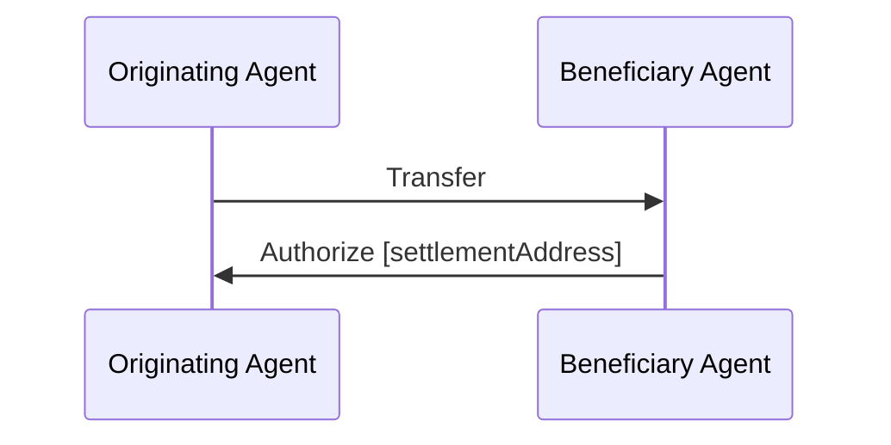

An example Authorization flow using three agents, including a wallet API service representing the Beneficiary agent, where the `settlementAddress` was not included in the original `Transfer` message, and thus has to be specified by a Beneficiary Agent:

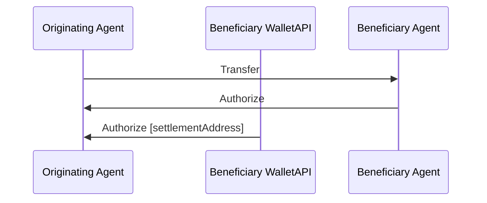

The above flow demonstrates the power of multiple agents collaborating around authorizing a transaction. Both the Beneficiary Agent and WalletAPI maintain their own risk profiles and can independently authorize the transaction. In most cases the Wallet API will defer to their customer the Beneficiary Agent, and can use the signal that their customer Authorizes it to Authorize it and present the `settlementAddress` to the originating agent.

### Settle

An originating agent notifies the other agents in the same thread that they are ready to settle the transfer. The following shows the attributes of the `body` object:

* `@ctx` - REQUIRED the JSON-LD context `https://tap.rsvp/schema/1.0` (provisional)
* `@type` - REQUIRED the JSON-LD type `https://tap.rsvp/schema/1.0#Settle` (provisional)
* `settlementId` - OPTIONAL an identifier of the underlying settlement transaction on a blockchain. REQUIRED by at least one agent representing the originator. 

The following shows an simplified authorization flow with a succesfull outcome (transaction settled):

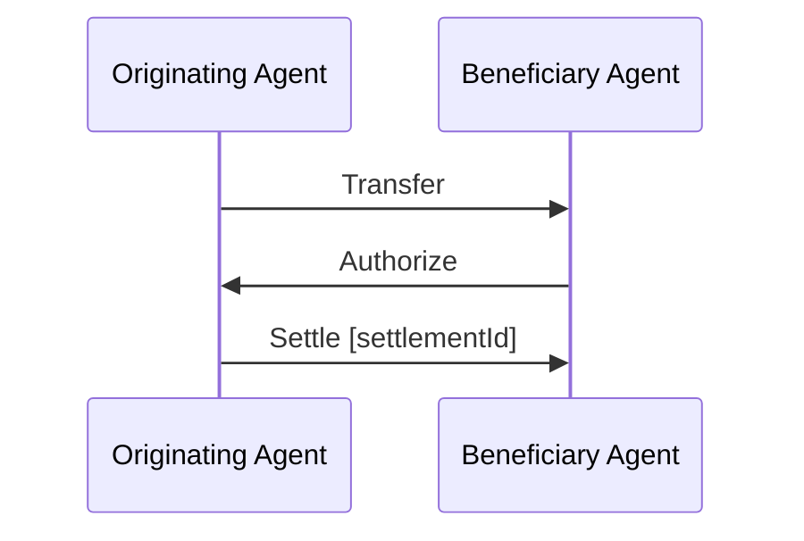

The following shows an authorization flow with the addition of a wallet API provider as an agent representing the originating agent, with a succesfull outcome (transaction settled):

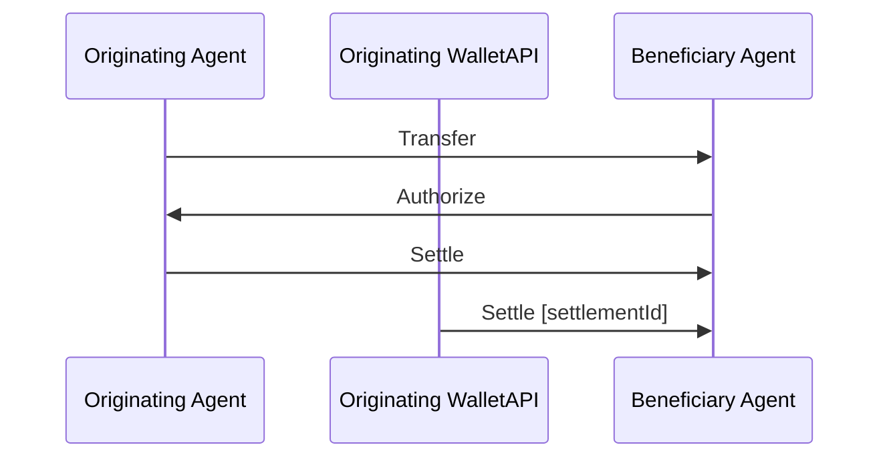

The above flow also demonstrates the power of multiple agents collaborating around authorizing a transaction. Both the Originating Agent and WalletAPI maintain their own risk profiles and can independently authorize the transaction for Settlement. In most cases the Wallet API will defer to their customer the Originating Agent, and can use the signal that their customer sends a Settle message to actually settle it on the blockchain and present the `settlementId` to the other agents.

#### SettlementID

Use a simplified version of the format proposed by [CAIP-220](https://github.com/ChainAgnostic/CAIPs/pull/221/files)

```
block_address:        chain_id + ":" [ + "block:"]? + "txn/" + transaction_id?
chain_id:             [-a-z0-9]{3,8}:[-_a-zA-Z0-9]{1,32} (See [CAIP-2][])
transaction_id:       [-%a-zA-Z0-9]{1,128}
```

eg:

```
eip155:1:tx/0x3edb98c24d46d148eb926c714f4fbaa117c47b0c0821f38bfce9763604457c33
```


### Reject

Any agent can always reject a transaction. This does not mean another party will comply with it.

* `@ctx` - REQUIRED the JSON-LD context `https://tap.rsvp/schema/1.0` (provisional)
* `@type` - REQUIRED the JSON-LD type `https://tap.rsvp/schema/1.0#Reject` (provisional)
* `reason` - OPTIONAL Human readable message describing why the transaction was rejected


The following shows a simple rejection of a Transfer by the Beneficiary Agent.

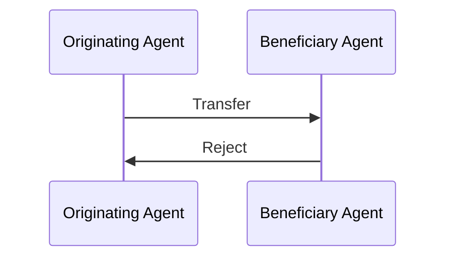

Any participants can `Reject` a Transfer. Even after others have authorized it. As an example an originating agent could reject a transaction authorized by the beneficiary agent, after the `settlementAddress` had too high a risk score.

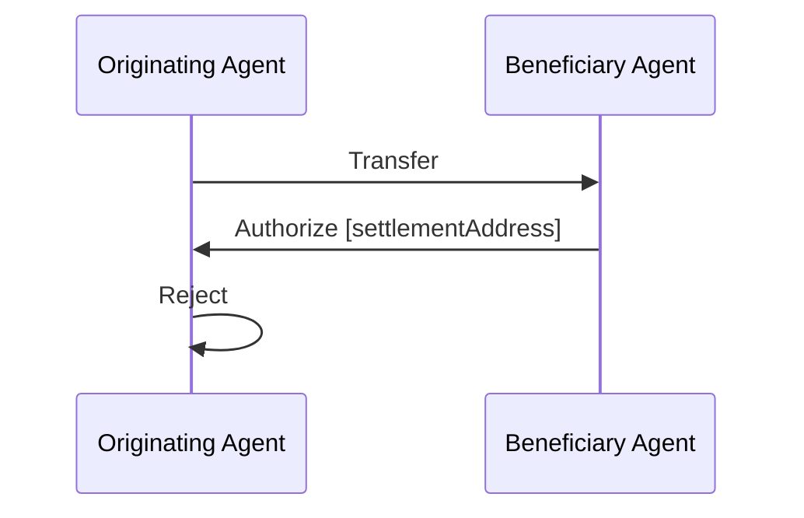


### Transaction State from the point of view of various agents

This is a potential state machine from the point of view of the originating agent (remember there is no shared state between agents, and each agent must maintain their own state):

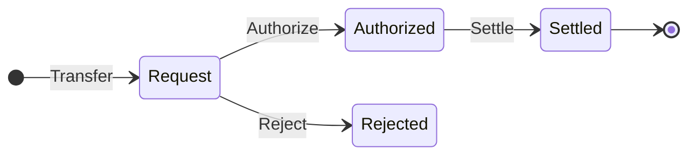

This is a potential state machine from the point of view of the beneficiary agent:

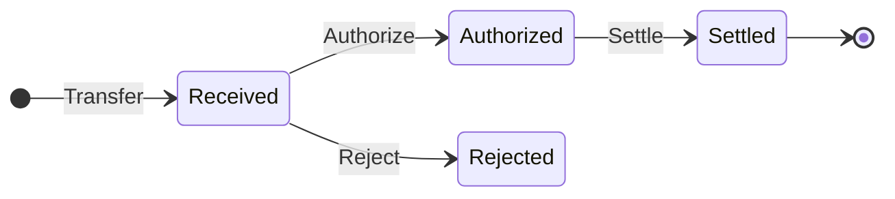


## Rationale
<!--The rationale fleshes out the specification by describing what motivated the design and why particular design decisions were made. It should describe alternate designs that were considered and related work, e.g. how the feature is supported in other languages. The rationale may also provide evidence of consensus within the community, and should discuss important objections or concerns raised during discussion.-->
A key aspect of this flow is the intentional lack of shared state. By focusing on a messages flow instead, it makes it more realistic to be used in permissionless blockchain applications. It also does provide more complexity on the implementing agent and their policies (see [TAIP-7][TAIP-7]).

## Test Cases
<!--Please add diverse test cases here if applicable. Any normative definition of an interface requires test cases to be implementable. -->
The following are example plaintext messages. See [TAIP-2][TAIP-2] for how to sign the messages.

### Authorize

```json
{
	"from":"did:web:beneficiary.vasp",
	"type": "https://tap.rsvp/schema/1.0#Authorize",
	"thid":"ID of transfer request",
	"to": ["did:web:originator.vasp"],
	"body": {
  		"@context": "https://tap.rsvp/schema/1.0",
		"@type": "https://tap.rsvp/schema/1.0#Authorize",
		"settlementAddress":"eip155:1:0x1234a96D359eC26a11e2C2b3d8f8B8942d5Bfcdb" /*CAIP-2 account address */
	}
}
```

### Settle

```json
{
	"from":"did:web:originator.vasp",
	"type": "https://tap.rsvp/schema/1.0#Settle",
	"thid":"ID of transfer request",
	"to": ["did:web:beneficiary.vasp"],
	"body": {
  		"@context": "https://tap.rsvp/schema/1.0",
		"@type": "https://tap.rsvp/schema/1.0#Settle",
        "settlementId":"eip155:1:tx/0x3edb98c24d46d148eb926c714f4fbaa117c47b0c0821f38bfce9763604457c33",  /* Blockchain transaction hash */
	}
}
```

### Reject

```json
{
	"from":"did:web:beneficiary.vasp",
	"type": "https://tap.rsvp/schema/1.0#Reject",
	"thid":"ID of transfer request",
	"to": ["did:web:originator.vasp"],
	"body": {
		"@context": "https://tap.rsvp/schema/1.0",
		"@type": "https://tap.rsvp/schema/1.0#Reject",
		"reason":"Beneficiary name mismatch"
	}
}
```

## Security Considerations
<!--Please add an explicit list of intra-actor assumptions and known risk factors if applicable. Any normative definition of an interface requires these to be implementable; assumptions and risks should be at both individual interaction/use-case scale and systemically, should the interface specified gain ecosystem-namespace adoption. -->
It is always the responsibility of each agent to verify the contents of each message before acting on it. This includes verifying that the sender of a message is part of a transaction flow.

## Privacy Considerations
<!--Please add an explicit list of intra-actor assumptions and known risk factors if applicable. Any normative definition of an interface requires these to be implementable; assumptions and risks should be at both individual interaction/use-case scale and systemically, should the interface specified gain ecosystem-namespace adoption. -->
The only potential PII that could potentially be shared and leaked through this flow are public blockchain addresses of specific customers. Agents can minimize this by no longer issuing blockchain addresses to individual customers and relying on more efficient omnibus accounts.

## References 
<!--Links to external resources that help understanding the TAIP better. This can e.g. be links to existing implementations. See CONTRIBUTING.md#style-guide . -->

- [TAIP-2][TAIP-2] Defines the TAP Message structure
- [TAIP-5][TAIP-4] Defines the TAP Authorization Flow
- [TAIP-5][TAIP-5] Transaction agents
- [TAIP-7][TAIP-7] Policies
- [CAIP-10][CAIP-10] Describes chainagnostic Account ID Specification
- [CAIP-19][CAIP-19] Describes transaction parties
  
[TAIP-2]: https://tap.rsvp/TAIPS/taip-2
[TAIP-3]: https://tap.rsvp/TAIPS/taip-3
[TAIP-5]: https://tap.rsvp/TAIPS/taip-5
[TAIP-7]: https://tap.rsvp/TAIPS/taip-7
[CAIP-10](https://chainagnostic.org/CAIPs/caip-10)

## Copyright
Copyright and related rights waived via [CC0](../LICENSE).