<!--You can leave these HTML comments in your merged EIP and delete the visible duplicate text guides, they will not appear and may be helpful to refer to if you edit it again. This is the suggested template for new EIPs. Note that an EIP number will be assigned by an editor. When opening a pull request to submit your EIP, please use an abbreviated title in the filename, `eip-draft_title_abbrev.md`. The title should be 44 characters or less.-->
## Simple Summary
<!--"If you can't explain it simply, you don't understand it well enough." Provide a simplified and layman-accessible explanation of the TAIP.-->
A simple generic transaction authorization flow allows agents acting on behalf of transaction parties to collaborate around authorizing or rejecting it.

## Abstract
<!--A short (~200 word) description of the technical issue being addressed.-->
This specification defines the Transaction Authorization Protocol, which allows [Transaction Agents][TAIP-5] acting on behalf of [Transaction Parties][TAIP-6] to Authorize a transaction such as an [Virtual Asset Transfer][TAIP-3]. The specification defines a small set of [Messages][TAIP-2] between Agents.

## Motivation
<!--The motivation is critical for TAIP. It should clearly explain why the state of the art is inadequate to address the problem that the TAIP solves. TAIP submissions without sufficient motivation may be rejected outright.-->
Crypto transactions and blockchains are trustless and follow strict guidelines implemented in the underlying blockchain protocol. This trustlessness allows most blockchains to be permissionless and function without centralized control, one of the core drivers behind innovation and growth in the field.

Unfortunately, it presents businesses and individuals transacting on blockchains with several operational and risk-based challenges that must be solved for crypto transactions and blockchains to take off fully. The Transaction Authorization Protocol (TAP) and TAIP-4 offer a way to solve this privately between parties without requiring changes to the permissionless aspects of blockchains today.

We will use the term *"Settlement layer"* to refer to the underlying blockchain protocol. It can refer to either Layer-1, Layer-2, or even DeFi protocols. We will use the term *"Authorization layer"* for the off-chain process handled by transaction participants before or after settling the transaction on a blockchain.

### Current State of Crypto Transactions

Currently, crypto transactions are limited by their reliance on unilateral authorization by key holders, lacking mechanisms for authorization by beneficiaries.

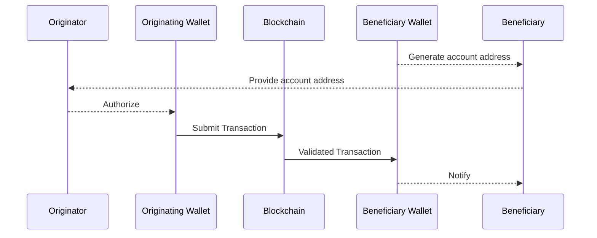

Once a transaction is authorized and submitted to the blockchain by the originating wallet’s key holders, it is impossible by design to reverse the transaction, representing a significant change over traditional payment systems that separate payment authorizations from the underlying settlement.

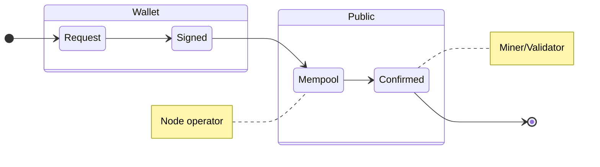

The above demonstrates the state machine behind all blockchain transactions. The only party able to authorize a transaction is the wallet holder. Once it has been submitted to the public Mempool, the wallet owner can still, in some cases, change it, but once confirmed, no one can reverse it.

### Travel Rule Protocols

Most protocols implementing the FATF Travel Rule for crypto transactions have also implemented a two-party authorization flow between an originator and beneficiary institution. These are all implemented through a deterministic message flow. Each agent or party to a transaction is expected to perform a set of actions in a particular sequence. In most cases, they don’t do that but implement the travel rule somewhat haphazardly or not at all, causing most parties' customers to not complete a successful authorization flow of a transaction.

### Non-deterministic multi-party authorization

TAP proposes a non-deterministic message flow, allowing each party to negotiate for their required information and use game theoretical principles to encourage counterparties to help them implement their policy around transactions. An institution can force some consensus around the state of the payment by withholding settlement or not sharing a settlement address until all the participating agents have mitigated sufficient risk.

## Specification
<!--The technical specification should describe the standard in detail. The specification should be detailed enough to allow competing, interoperable implementations. -->
Messages implement [TAIP-2] and are sent between [TAIP-5 Agents][TAIP-5] after an initial transaction request, such as a [TAIP-3 Asset Transfer][TAIP-3]. Authorization messages MUST include the `id` of the original transaction request in the `thid` attribute of the message.

It is essential to understand that this is, strictly speaking, a messaging standard. No shared state is implied between agents except the ultimate settlement on a blockchain.

There are four primary actions an agent can take:

- `AuthorizationRequired` - Request that an end user opens an authorization URL to approve the transaction.
- `Settle` - They announce they will send the transaction to the blockchain.
- `Authorize` - Authorize or signal to other agents that they are free to `settle` a transaction.
- `Cancel` - Signal to other agents that they are canceling the transaction.
- `Reject` - Signal to other agents that they reject the transaction.
- `Revert` - Request a Reversal of the transaction.

All messages are sent as replies to an initial request by specifying the `id` of the original request in the `thid` attribute.

### AuthorizationRequired

Any agent can require that an end user opens up an authorization URL in a web browser or app before proceeding with the transaction. An agent may require this to ensure that the end user authorizes a payment. The following shows the attributes of the `body` object:

- `@context` - REQUIRED the JSON-LD context `https://tap.rsvp/schema/1.0`
- `@type` - REQUIRED the JSON-LD type `https://tap.rsvp/schema/1.0#AuthorizationRequired`
- `authorizationUrl` - REQUIRED string URL where the user can authorize the transaction
- `expires` - REQUIRED string ISO 8601 timestamp when the authorization URL expires
- `from` - OPTIONAL the party type (e.g., `customer`, `principal`, or `originator`) that is required to open the URL

### Authorize

Any agent can authorize the transaction by replying as a thread to the initial message. The following shows the attributes of the `body` object:

- `@context` - REQUIRED the JSON-LD context `https://tap.rsvp/schema/1.0`
- `@type` - REQUIRED the JSON-LD type `https://tap.rsvp/schema/1.0#Authorize`
- `settlementAddress` - OPTIONAL string representing the intended destination address of the transaction specified in either [CAIP-10] or [RFC 8905] format. [CAIP-10] format is used for blockchain addresses, while [RFC 8905] payto URIs are used for traditional payment systems such as bank transfers (e.g., `payto://iban/DE75512108001245126199`). If sent by an Agent representing the beneficiary this is REQUIRED unless the original request contains an agent with the `settlementAddress` role. For all others it is OPTIONAL.
- `settlementAsset` - OPTIONAL string representing an asset for settlement in [CAIP-19] format. If multiple `supportedAssets` are presentented in the Transaction message (eg. `Payment` from [TAIP-14]) then an agent representing the sending side of the transaction is REQUIRED to specify the `settlementAsset` as part of their authorization, so the receiving side can specify the correct `settlementAddress`
- `amount` - OPTIONAL string with the full amount as a decimal representation of the `settlementAsset` in case it is different than the original `Payment` or `Transfer` message.
- `expiry` - OPTIONAL timestamp in ISO 8601 format indicating when the authorization expires. After this time, if settlement has not occurred, the authorization should be considered invalid and settlement should not proceed. In merchant payment flows, the customer's wallet may either repeat the merchant's specified expiration time or override it with a different time.

By not providing a `settlementAddress` until after `Authorization`, beneficiary agents can reject incoming blockchain transactions for the first time.

An example Authorization flow using two agents where the `settlementAddress` was included in the original `Transfer` message:

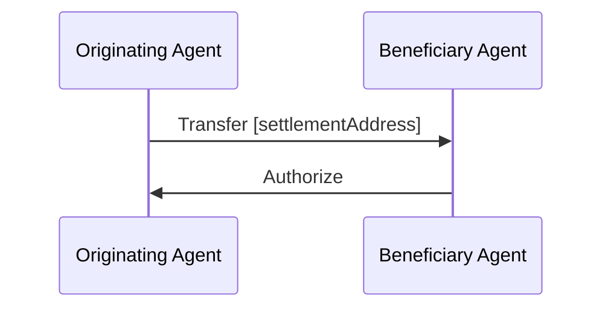

An example Authorization flow using two agents where the `settlementAddress` was not included in the original `Transfer` message, and thus has to be specified by a Beneficiary Agent:

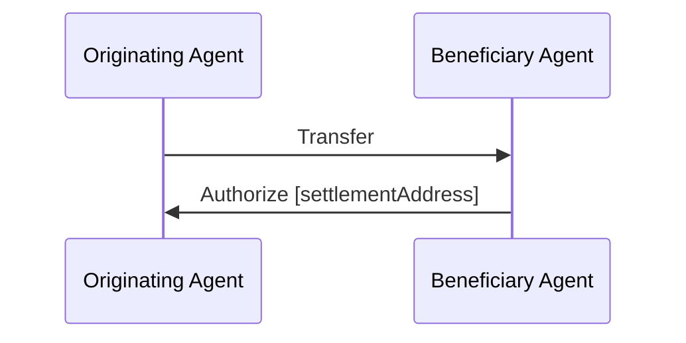

An example Authorization flow using three agents, including a wallet API service representing the Beneficiary agent, where the `settlementAddress` was not included in the original `Transfer` message, and thus has to be specified by a Beneficiary Agent:

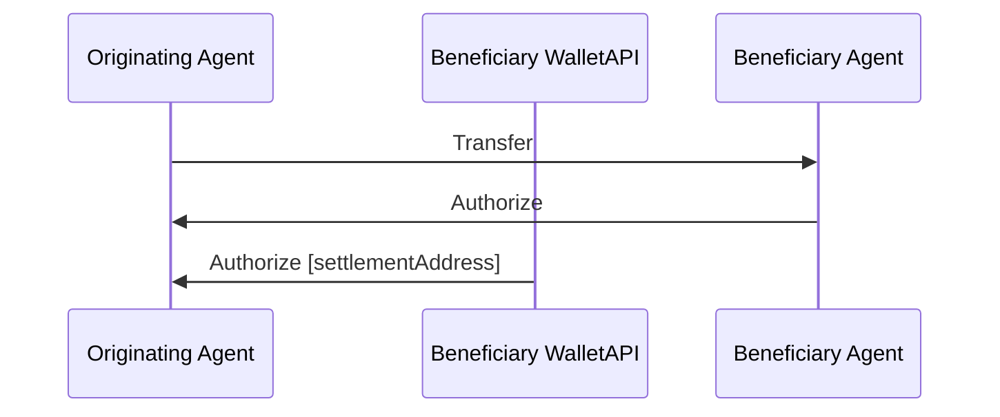

The above flow demonstrates the power of multiple agents collaborating around authorizing a transaction. The Beneficiary Agent and WalletAPI maintain their risk profiles and can independently authorize the transaction. In most cases, the Wallet API will defer to their customer, the Beneficiary Agent, and can use the signal that their customer Authorizes it to Authorize it and present the `settlementAddress` to the originating agent.

### Settle

An originating agent notifies the other agents in the same thread that they are ready to settle the transfer. The following shows the attributes of the `body` object:

- `@context` - REQUIRED the JSON-LD context `https://tap.rsvp/schema/1.0`
- `@type` - REQUIRED the JSON-LD type `https://tap.rsvp/schema/1.0#Settle`
- `settlementAddress` - REQUIRED string representing the destination address of the transaction specified in either [CAIP-10] or [RFC 8905] format. [CAIP-10] format is used for blockchain addresses, while [RFC 8905] payto URIs are used for traditional payment systems such as bank transfers.
- `settlementId` - OPTIONAL a [CAIP-220](https://github.com/ChainAgnostic/CAIPs/pull/221/files) identifier of the underlying settlement transaction on a blockchain. REQUIRED by at least one agent representing the originator.
- `amount` - OPTIONAL string containing a decimal representation of the settled amount. If specified, this MUST be less than or equal to the amount in the original transaction message. If a `Authorize` message was received with an amount specified, then the amount in the `Settle` message MUST match that value. If omitted, the full amount from the original transaction message is implied.

The following shows an simplified authorization flow with a succesfull outcome (transaction settled):

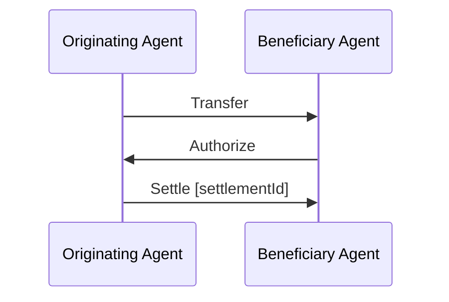

The following shows an authorization flow with the addition of a wallet API provider as an agent representing the originating agent, with a succesfull outcome (transaction settled):

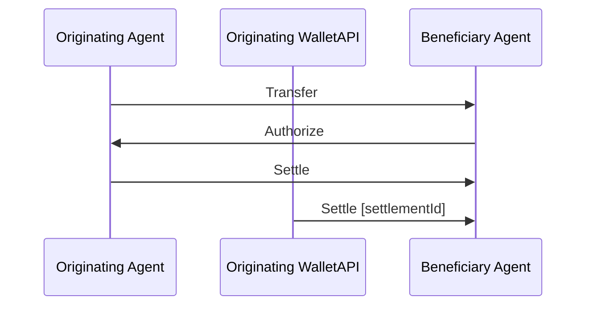

The above flow also demonstrates the power of multiple agents collaborating to authorize a transaction. The Originating Agent and WalletAPI maintain their risk profiles and can independently authorize the transaction for settlement. In most cases, the Wallet API will defer to their customer, the Originating Agent, and can use the signal that their customer sends a Settle message to settle it on the blockchain and present the `settlementId` to the other agents.

#### SettlementID

Use a simplified version of the format proposed by [CAIP-220](https://github.com/ChainAgnostic/CAIPs/pull/221/files)

```
block_address:        chain_id + ":" [ + "block:"]? + "txn/" + transaction_id?
chain_id:             [-a-z0-9]{3,8}:[-_a-zA-Z0-9]{1,32} (See [CAIP-2][])
transaction_id:       [-%a-zA-Z0-9]{1,128}
```

eg:

```
eip155:1:tx/0x3edb98c24d46d148eb926c714f4fbaa117c47b0c0821f38bfce9763604457c33
```

### Reject

Any agent can always reject a transaction. This does not mean another agent will comply with it.

- `@context` - REQUIRED the JSON-LD context `https://tap.rsvp/schema/1.0`
- `@type` - REQUIRED the JSON-LD type `https://tap.rsvp/schema/1.0#Reject`
- `reason` - OPTIONAL Human readable message describing why the transaction was rejected

The following shows a simple rejection of a Transfer by the Beneficiary Agent.

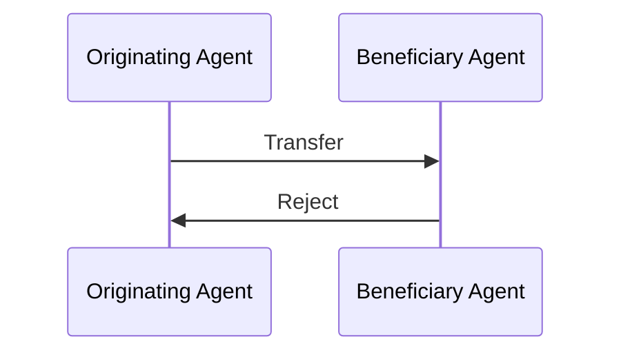

Any agent can `Reject` a Transfer. Even after others have authorized it. As an example an originating agent could reject a transaction authorized by the beneficiary agent, after the `settlementAddress` had too high a risk score.

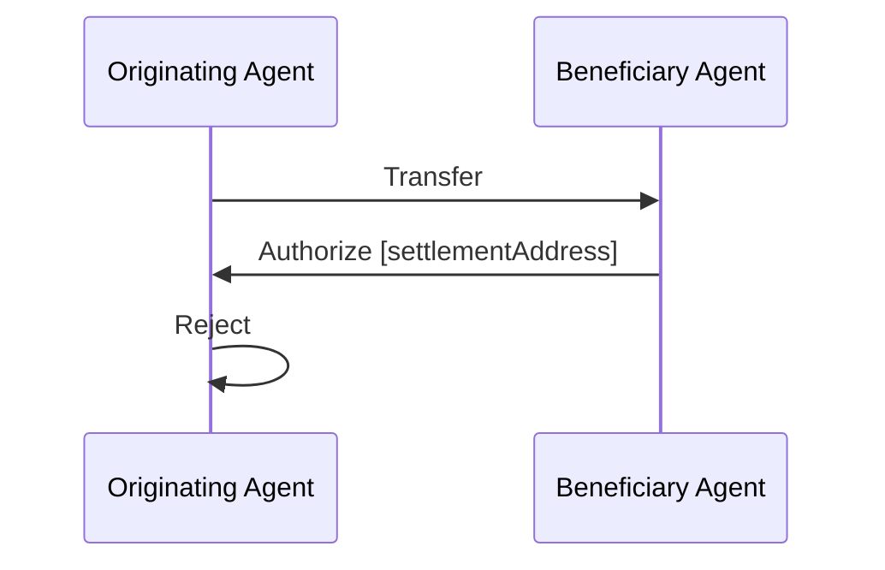

### Cancel

An agent directly on behalf of any party to the transaction can cancel a message. This does not mean another agent will comply with it.

An example purpose for this could be allowing an originator to cancel a Transfer for example because the Authorization was taking too long.

The difference between a `Cancel` and a `Reject` is that a `Cancel` is intended as an action of one of the parties. Where `Reject` is a signal of a rejection of a specific agent for for example fraud, compliance or security purposes.

- `@context` - REQUIRED the JSON-LD context `https://tap.rsvp/schema/1.0`
- `@type` - REQUIRED the JSON-LD type `https://tap.rsvp/schema/1.0#Cancel`
- `by` - REQUIRED the party of the transaction wishing to cancel it. (In case of a Transfer [TAIP3]  `originator` or `beneficiary`)
- `reason` - OPTIONAL Human readable message describing why the transaction was cancelled

The following shows a simple cancel of a Transfer by the Originator Agent.

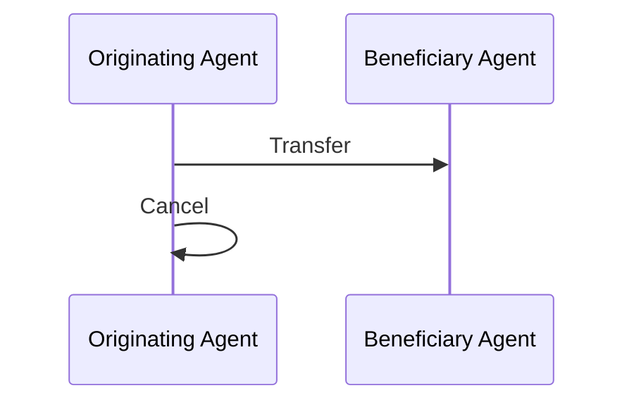

Any party can `Cancel` a Transfer through an agent acting on their behalf. Even after others have authorized it. As an example an originating cancel could reject a transaction authorized by the beneficiary agent because it took too long to authorize.


### Revert

Agents acting on behalf of customers may need to request reversal of a transaction after it has been settled. This could be as part of a dispute resolution, post-transaction compliance checks or other reasons.

A `Revert` message could be `Settled`, `Authorized` or `Rejected` or simply ignored by the other agents involved.

- `@context` - REQUIRED the JSON-LD context `https://tap.rsvp/schema/1.0`
- `@type` - REQUIRED the JSON-LD type `https://tap.rsvp/schema/1.0#Revert`
- `settlementAddress` - REQUIRED the proposed settlement address in either [CAIP-10] or [RFC 8905] format to return the funds to
- `reason` - REQUIRED Human readable message describing why the transaction reversal is being requested

The following shows a simple Reversal request of a Transfer by the Originating Agent.

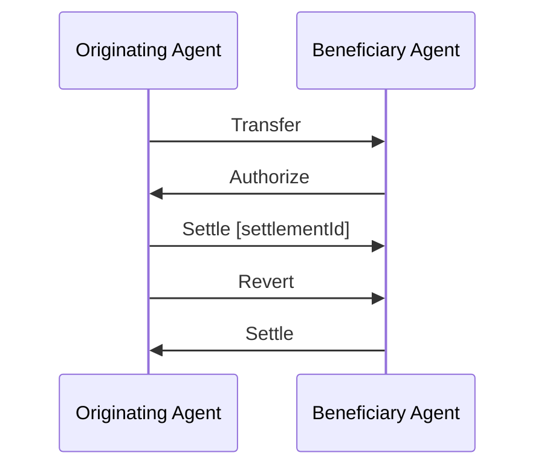

The following shows a simple Reversal request of a Transfer by the Beneficiary Agent where the Originating Agent specifies a different settlementAddress.

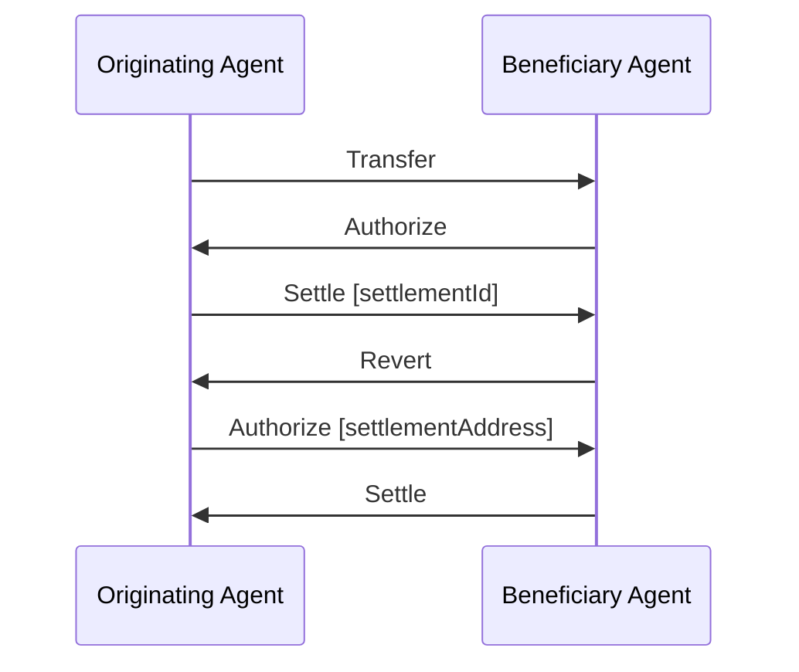

### Transaction State from the point of view of various agents

This is a potential state machine from the point of view of the originating agent (remember there is no shared state between agents, and each agent must maintain their own state):

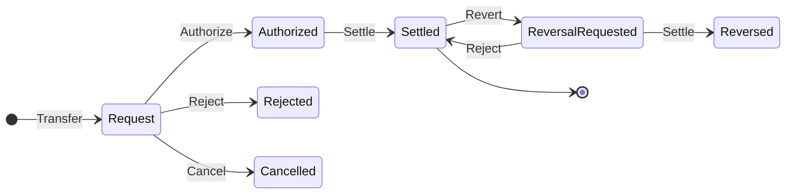

This is a potential state machine from the point of view of the beneficiary agent:

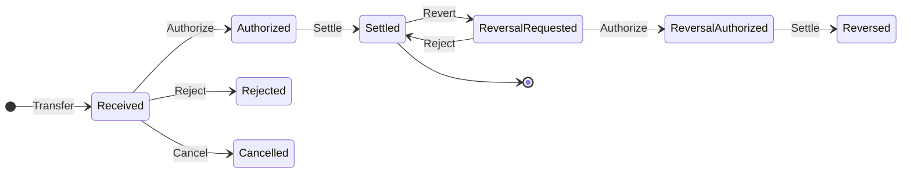


## Rationale

A standard messaging flow between participants in transactions is needed for virtual asset transactions to support regular business and retails use cases.

A vital aspect of this flow is the intentional lack of a shared state. Focusing on a message flow instead makes it more realistic to use in permissionless blockchain applications. It also does provide more complexity for the implementing agent and their policies (see [TAIP-7]).

It is very important to understand that messages are just messages. Agents may or may not act on the messages, which is why it's important that trust is built between agents. See [TAIP-5] and [TAIP-8].


## Test Cases
<!--Please add diverse test cases here if applicable. Any normative definition of an interface requires test cases to be implementable. -->
The following are example plaintext messages. See [TAIP-2] for how to sign the messages.

### AuthorizationRequired

```json
{
  "from": "did:web:beneficiary.vasp",
  "type": "https://tap.rsvp/schema/1.0#AuthorizationRequired",
  "thid": "ID of transfer request",
  "to": ["did:web:originator.vasp"],
  "body": {
    "@context": "https://tap.rsvp/schema/1.0",
    "@type": "https://tap.rsvp/schema/1.0#AuthorizationRequired",
    "authorizationUrl": "https://beneficiary.vasp/authorize?request=abc123",
    "expires": "2024-01-01T12:00:00Z",
    "from": "customer"
  }
}
```

### Authorize

```json
{
  "from": "did:web:beneficiary.vasp",
  "type": "https://tap.rsvp/schema/1.0#Authorize",
  "thid": "ID of transfer request",
  "to": ["did:web:originator.vasp"],
  "body": {
    "@context": "https://tap.rsvp/schema/1.0",
    "@type": "https://tap.rsvp/schema/1.0#Authorize",
    "settlementAddress": "eip155:1:0x1234a96D359eC26a11e2C2b3d8f8B8942d5Bfcdb",
    "expiry": "2024-01-01T12:00:00Z"
  }
}
```

### Settle

```json
{
 "from":"did:web:originator.vasp",
 "type": "https://tap.rsvp/schema/1.0#Settle",
 "thid":"ID of transfer request",
 "to": ["did:web:beneficiary.vasp"],
 "body": {
    "@context": "https://tap.rsvp/schema/1.0",
    "@type": "https://tap.rsvp/schema/1.0#Settle",
    "settlementId":"eip155:1:tx/0x3edb98c24d46d148eb926c714f4fbaa117c47b0c0821f38bfce9763604457c33",
    "amount": "100.00"
  }
}
```

### Reject

```json
{
 "from":"did:web:beneficiary.vasp",
 "type": "https://tap.rsvp/schema/1.0#Reject",
 "thid":"ID of transfer request",
 "to": ["did:web:originator.vasp"],
 "body": {
    "@context": "https://tap.rsvp/schema/1.0",
    "@type": "https://tap.rsvp/schema/1.0#Reject",
    "reason":"Beneficiary name mismatch"
  }
}
```


### Cancel

```json
{
 "from":"did:web:beneficiary.vasp",
 "type": "https://tap.rsvp/schema/1.0#Cancel",
 "thid":"ID of transfer request",
 "to": ["did:web:originator.vasp"],
 "body": {
    "@context": "https://tap.rsvp/schema/1.0",
    "@type": "https://tap.rsvp/schema/1.0#Cancel",
    "by": "beneficiary",
    "reason":"Transfer took too long"
  }
}
```

### Revert

```json
{
 "from":"did:web:beneficiary.vasp",
 "type": "https://tap.rsvp/schema/1.0#Revert",
 "thid":"ID of transfer request",
 "to": ["did:web:originator.vasp"],
 "body": {
    "@context": "https://tap.rsvp/schema/1.0",
    "@type": "https://tap.rsvp/schema/1.0#Revert",
    "settlementAddress":"payto://iban/DE75512108001245126199",
    "reason":"Insufficient Originator Information"
  }
}
```

## Security Considerations
<!--Please add an explicit list of intra-actor assumptions and known risk factors if applicable. Any normative definition of an interface requires these to be implementable; assumptions and risks should be at both individual interaction/use-case scale and systemically, should the interface specified gain ecosystem-namespace adoption. -->
It is always the responsibility of each agent to verify the contents of each message before acting on it. This includes verifying that the sender of a message is part of a transaction flow.

## Privacy Considerations
<!--Please add an explicit list of intra-actor assumptions and known risk factors if applicable. Any normative definition of an interface requires these to be implementable; assumptions and risks should be at both individual interaction/use-case scale and systemically, should the interface specified gain ecosystem-namespace adoption. -->
The only potential PII that could be shared and leaked through this flow are public blockchain addresses of specific customers. Agents can minimize this by no longer issuing blockchain addresses to individual customers and relying on more efficient omnibus accounts.

## References
<!--Links to external resources that help understanding the TAIP better. This can e.g. be links to existing implementations. See CONTRIBUTING.md#style-guide . -->

- [TAIP Whitepaper] The Transaction Authorization Whitepaper
- [TAIP-2] Defines the TAP Message structure
- [TAIP-3] Asset Transfer Message
- [TAIP-5] Transaction Agents
- [TAIP-6] Transaction Parties
- [TAIP-7] Policies
- [TAIP-14] Payments
- [CAIP-10] Describes chainagnostic Account ID Specification
- [CAIP-19] Describes chainagnostic Asset ID specification
- [RFC 8905] The 'payto' URI Scheme for Payments


[TAIP-2]: ./taip-2
[TAIP-3]: ./taip-3
[TAIP-5]: ./taip-5
[TAIP-6]: ./taip-6
[TAIP-7]: ./taip-7
[TAIP-14]: ./taip-14
[CAIP-10]: <https://chainagnostic.org/CAIPs/caip-10>
[CAIP-19]: <https://chainagnostic.org/CAIPs/caip-19>
[RFC 8905]: <https://datatracker.ietf.org/doc/rfc8905/>
[TAIP Whitepaper]: <https://docs.google.com/document/d/1z16nPRjiCFGsnMqr7GiBRMCMMPBG6laaS337s4oJrEw/edit#heading=h.ujq0dkl3njwc>

## Copyright

Copyright and related rights waived via [CC0](../LICENSE).
