# Transaction Authorization Protocol (TAP) White Paper

#### Open protocol to allow parties to authorize real-world transactions settled on public blockchains

## Executive Summary

The Transaction Authorization Protocol (TAP) represents a the first practical approach at creating a method for handling complex transaction authorizations for critical and complex real world use-cases such as ecommerce, trade, and cross-border payments settled on blockchains.

Most real-world payment and financial use-cases involving multiple parties require a Transaction Authorization process to ensure payments are sent between the correct real-world parties for a multitude of reasons:

- Avoid loss of funds by sending to wrong recipient or account
- Record keeping for accounting, order fulfillment, and regulatory compliance purposes
- Fraud and other financial crime avoidance
- Better UX and overall customer experience

TAP is designed from first principles to support similar use-cases to [ISO-20022] and [ISO-8583] used in traditional payments, but supporting end-user controlled wallets, centralized services, and decentralized protocols like smart contracts as first class participants.

TAP is agnostic to the specific blockchain type and can work for real-world transactions composed of multiple underlying settlement transactions across multiple blockchains and fiat payment gateways.

TAP is designed to improve amongst others the following key use cases important on blockchains today:

- Crypto withdrawals and deposits
- Post trade settlement
- FATF Travel Rule compliance

TAP also opens up many use cases for public blockchains such as:

- B2B Payments
- E-Commerce Payments

## Introduction

Public blockchains provide an order of magnitude better solutions for settlement of both complex and simple transactions between untrusted counterparties. Blockchains are implemented as public ledgers shared between all the account holders. Anyone can become an account holders by generating their own cryptographic keys. 

This differs from traditional payment systems that are implemented by centralized intermediaries on behalf of their customers each with their own private ledger, sending for example [ISO-20022] messages between each other to authorize a transaction and a separate settlement process typically implemented through another set of centralized intermediaries. Authorization and identification of participants is fundamental to how these work in the back end, to ensure consensus towards final settlement.

A core technical aspect of blockchain transactions are that they are settled immediately when an account holder submits a transaction to a blockchain. There is by design no identification of parties, and no opportunity for anyone but the sender of funds to authorize a transaction.

This means beneficiaries are currently unable to authorize or reject a transaction. In many real world transactions there may be multiple steps involved in a transactions. Real world transactions can also include a combination of multiple blockchain transactions across multiple blockchains, with optionally centralized steps such as conversion from or to FIAT or providing of liquidity.

Besides providing a mapping between real world transactions one or more orchestrated blockchain transactions, each party involved needs to manage risks such as counterparty risk, loss of funds through security or fraud, as well as manage compliance duties to limit financial crime.

With the entrance of a next generation of startups and traditional financial institutions entering the digital asset space, it is critical that the industry works together to build out a messaging and authorization messaging system, similar in many ways to [ISO-20022], but native to the intricacies of blockchain transactions.

TAP as an open protocol bridges these gaps in transaction authorization, trust, and compliance required to allow the digital asset industry to solve for a much wider set of use cases. This document outlines the protocol's design, goals, and its significance for a varied audience, including developers, financial institutions, and regulatory bodies.

At this pivotal moment in the crypto industry, with institutions, fintechs, and banks preparing for significant migration to blockchain technologies, TAP's flexibility and rapid adaptability to new technologies through Transaction Authorization Improvement Protocols (TAIPs) are crucial.

## Current State of Crypto Transactions

Currently, crypto transactions are limited by their reliance on the unilateral authorization by key holders, lacking mechanisms for authorization by beneficiaries.

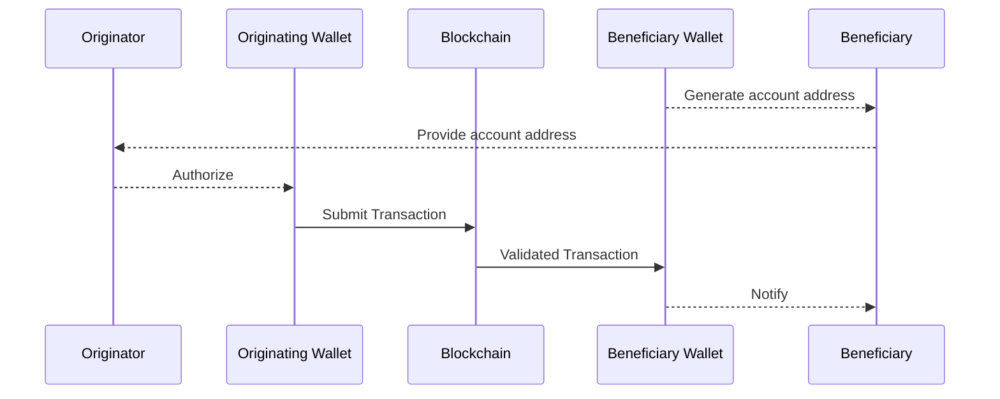

Once a transaction is authorized and submitted to the blockchain by the the originating wallet’s key holders, it is impossible by design to reverse the transaction, which represents a significant change over traditional payment systems that separate payment authorizations from underlying settlement.

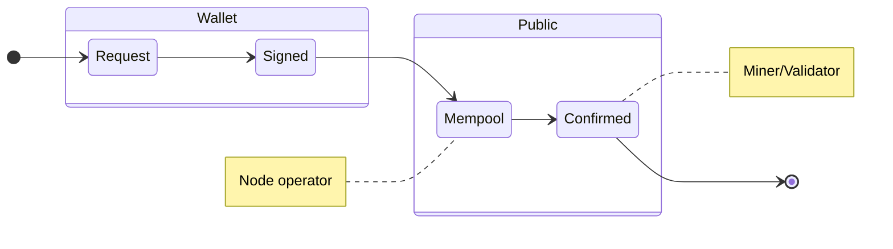

The above demonstrates the state machine behind all blockchain transactions. The only party able to authorize a transaction is the holder of the wallet. Once it has been submitted  to the public Mempool the wallet owner can still in some cases change it, but once confirmed it can not be reversed by anyone.

### Identification of Transaction Participants

To be able to ensure that funds are sent to the correct real-world counter-party and credit funds received to the correct account or invoice, it is important that the parties to a transaction can identify each other.

Most blockchains today rely on account addresses generated through a cryptographic hashing process of the cryptographic public key and/or smart contract code. These addresses are created by the key holder who in most cases only identifiable through their transaction history which is public on most blockchains. Careful graph analysis such as provided by blockchain analytics services today, can be used to label or cluster addresses together as belonging to a particular participant, but it is imperfect and can never label a brand new address as it doesn't have enough transaction information to classify it.

There have been multiple attempts such as [ENS] that attempts to solve this by adding identifying information to the public ledger. This approach while easy to understand comes with serious data privacy problems. Public ledgers are as the name implies fully public and immutable, thus an individuals identity is forever tied to it's public transaction history.

Besides identifying the ultimate counterparty to a transaction, there are other kinds of participants that are equally important to identify. Unless both parties use self-hosted wallets, there are also businesses such as exchanges and fintechs involved as intermediaries to a transaction. These businesses may also utilize additional intermediaries such a MPC wallet services and liquidity providers behind the scenes. Since these services control the keys to a blockchain address, they are often the parties that are labelled through blockchain analytics.

Every participant needs to manage their own risk and also brings in additional risk to a transaction between the ultimate counterparties.

### Implications for self-hosted wallet users

One of the core tenets of the blockchain industry is to allow individuals to manage their own private wallets and keys. There are significant security challenges involved with this that hardware and smart contract based wallet providers are working on solving.

There are however additional risks involved to the owners of these self-hosted wallets. There has been considerable fraud involving self-hosted wallet owners accidentally authorizing transactions through phishing attacks sending funds to the wrong party. Proper authorization and counterparty identification for both retail and self-hosted wallet users is key to allow the echo system to grow.

Since transactions on blockchains are themselves public, self-hosted wallet owners regularly expose what they expect to be their private transaction history whenever they share their blockchain addresses to anyone. This also exposes them to fraudulent incoming transactions that can lead to serious reputational risk for wallet holders and additional fraud use cases.

Inadvertently transacting with high risk wallets or mixers, can permanently damage the possibility of interacting directly with a centralized service for example.

### Implications for Centralized Services

Security for wallet key holders, as well as most interactions orchestrated between buyers and sellers on exchange market places are in most cases today handled by centralized services holding custody on behalf of ultimate parties to transactions.

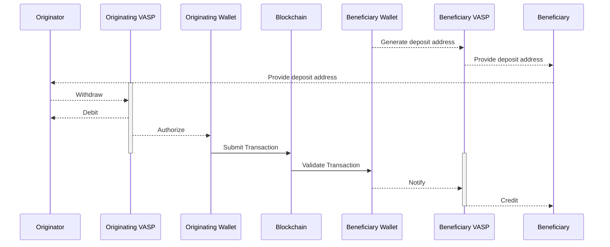

These centralized services are exposed to significant risk of fraud and compliance risk, due to the lack of authorization flows on receiving sides. At the same time any party using one of these centralized services is exposed to significant counterparty risk and exposure to fraud, by relying on these services as well as not being able to identify the ultimate counterparties to their own transactions.

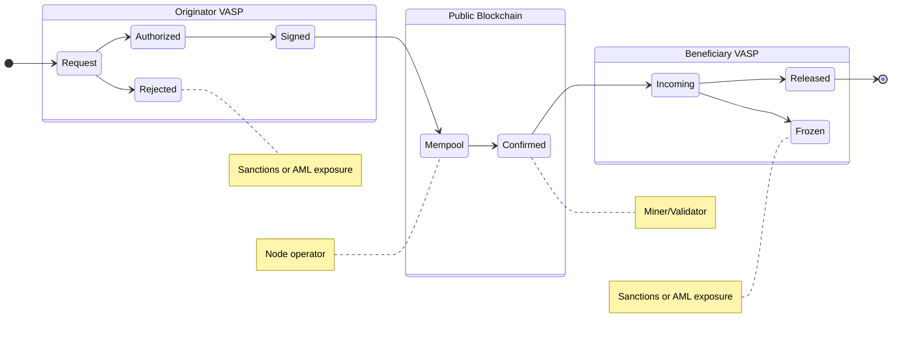

As many centralized services are also now facilitating transactions between FIAT payment services and blockchains, the risks start to grow exponentially. The reversible authorization flow of a FIAT transaction, clashes with the non-reverseable characteristics of a blockchain transaction.

The ultimate parties to a FIAT transaction are difficult to match to a blockchain transaction as blockchain transactions do not contain information about the ultimate originating and beneficiary parties. This can cause major fraud risk exposure to the centralized service performing the transaction and can lead to them having their access to FIAT payment service providers revoked. (TODO refer to cases where this has happened)

## Overview of TAP

TAP introduces a new authorization messaging layer for centralized and decentralized services to coordinate the execution of real-world transactions using blockchain transactions. It supports many similar use cases to [ISO-20022] and even allows a future compatibility layer to be created.

Where it differs from [ISO-20022] is its first class support for blockchain transactions, blockchain accounts, complex decentralized protocols built using Smart Contracts and is extensible to support future technologies. At the same time it can handle the interoperability between FIAT payment systems as well.

In addition due to the decentralized and often chaotic aspects of blockchain ecosystems, it also relies on game theoretical aspects for each party or agent to reach eventual finalization of a transaction across multiple steps.

## Design Principles of TAP

TODO perhaps remove or simplify this section (or move to the end)

- Follow the ~[Robustness Principle](https://en.wikipedia.org/wiki/Robustness_principle)~
  - *“be conservative in what you do, be liberal in what you accept from others”*
- It should be message based and support peer 2 peer messaging
- It should support self-hosted wallets under the direct control of an ultimate party
- Avoid reliance on centralized gateways or associations to impose trust by utilizing Decentralized Identifiers (DIDs) for all parties and agents involved.
- Certain workflows such as the Travel Rule flow, should be able to be implemented even if one services to participates actively in the flow, but should encourage and help push more services to be active participants
- Any agent to the transaction should be able to initiate a transaction
- There is no strict message flow defined, but strict flows can be added through TAIPs
- To be able to support a transition for companies adopting it, it should be possible to create messages after the fact outlining the meta-data for an exiting crypto transaction
- Modern blockchain transactions often include multiple individual real world transactions, such as Bitcoin UTXO transactions or airdrop transactions. Several kinds of real world transactions are also implemented through multiple blockchain transactions such as multi-sigs and many kinds of transactions requiring pre-authorization. Thus transactions in TAP could have a many to many relationship with blockchain transactions.
- Separate out the exchange of sensitive PII information between agents to be fully end-to-end encrypted and handled through the messaging flow on a need to know policy based basis
- Allow each agent to be able to authorize or reject a transfer, while understanding that for blockchain transactions only the agent holding the keys ultimately authorizes a transaction
- Support discovery of relevant agents to the flow, by allowing each agent to be able to inject an intermediary agent
- Allow each agent to be able to replace themselves from the transaction with another DID, e.g. redirect the transaction to another legal entity or a custodial service provider
- Built primarily on existing open standards
  - Flexible message encoding default, but default to [JSON-LD](https://json-ld.org)
  - Use [Chain Agnostic standards](https://chainagnostic.org) whenever possible for blockchain relevant standards, such as:
    - References to blockchain assets should rely on [CAIP-19](https://chainagnostic.org/CAIPs/caip-19)
    - References to blockchain accounts should rely on [CAIP-10](https://chainagnostic.org/CAIPs/caip-10)
  - Identifiers for parties should use [RFC-3987 IRIs](https://datatracker.ietf.org/doc/html/rfc3987), but more specifically [W3C Decentralized Identifiers](https://www.w3.org/TR/did-core/) (DIDs) are recommended
  - Identifiers for agents should use [W3C Decentralized Identifiers](https://www.w3.org/TR/did-core/) (DIDs)

- References to agents or other services should also use DID’s, but prefer DID methods that can immediately be used to identify it. Eg. [PKH-DID](https://github.com/w3c-ccg/did-pkh/blob/main/did-pkh-method-draft.md) methods for blockchain wallets or smart contracts and [Web DIDs](https://w3c-ccg.github.io/did-method-web/) for centralized services
- Messaging and Encryption should be based on proven digital signature and encryption standards:
  - [IETF RFC-7515 JWS](https://www.rfc-editor.org/rfc/rfc7515) for signed data between agents
  - [IETF RFC-7516 JWE](https://www.rfc-editor.org/rfc/rfc7516.html) for encrypted data between agents
  - [DID-Comm V2](https://identity.foundation/didcomm-messaging/spec/v2.0/) semantics for decentralized messaging between services
- Allow anyone to build their own agent implementing the protocol

## Messaging

TAP relies on the existing [DIDComm](https://didcomm.org) protocol as a messaging spec. DIDComm presents a secure method for both trusted and untrusted agents implemented using DIDs to communicate together through a simple email like protocol.

It supports low latency communication between servers without a centralized messaging broker and supports end-to-end encryption, digital signatures and many other features.

DIDComm is itself based on tried and true IETF standards such as [IETF RFC-7515 JWS](https://www.rfc-editor.org/rfc/rfc7515) and  [IETF RFC-7516 JWE](https://www.rfc-editor.org/rfc/rfc7516.html) for encrypting and signing data.

Server based agents can include their public keys and a DIDComm https end point in their DID document in a fully decentralized manner. Interactive agents such as mobile or desktop wallets can interact either through a trusted service or through encoding the messages in URL’s and/or QR codes through [DIDComm’s Out-of-Band](https://identity.foundation/didcomm-messaging/spec/#out-of-band-messages) functionality.

See [TAIP-2] for the specifics on how messaging is implemented in TAP.

## Transaction Types

From a high level this protocol should be workable with many different real-world transaction types that involve one or more underlying blockchain transactions.

From the outset the most important transaction to support is a regular crypto token transfer. From a naming point of view, these should be nouns that indicate the object regardless of the underlying state. Eg. transfer instead of transfer-request. The data model should be useable to backfill existing data to recreate it.

Basic TAIPs describing specific core transaction types will be defined from the beginning. Additional TAIPs can be proposed by anyone to support  both new and existing transaction types.

| Type            | TAIP   | Description                                                    |
|-----------------|--------|----------------------------------------------------------------|
| Transfer        |[TAIP-3]| A simple originator to beneficiary transfer of any token.      |
| Swap            |        | Swap a token for another token                                 |

### Example: Transfer

The primary type of transaction this defines supports the transfer of an amount of a fungible or non-fungible token from an originator to a beneficiary. Most regular crypto transactions today would fall under this definition.

A Transfer contains the following attributes:

- `asset` - the [CAIP-19](CAIP-19) identifier of the asset
- `amountSubunits` - Specified as a string with the full amount in integer in the smallest subunit of a token. This is not used for NFT transfers
- `originator` - the originating (aka the sender) party (see [Parties](#transaction-parties))
- `beneficiary` - the beneficiary (aka the recipient) party (see [Parties](#transaction-parties))
- `settlementId` - a [CAIP-220](https://github.com/ChainAgnostic/CAIPs/pull/221/files) identifier of the underlying settlement transaction on a blockchain
- `agents` - list of agents who help execute the transaction. See [Agents](#agents) for more.

This message type is designed to be as general and chain agnostic as possible and compatible with as little meta-data as possible, together with any required meta-data, that is useful for improving usability, safety, and record-keeping for a transaction.

It is not intended to cover more complex transaction use cases, such as non-token transfer-related smart contract calls. This TAIP is encouraged to be forked and modified to create similar requests for Swaps, lending, and other everyday use cases.

## Transaction Parties

Parties are the real-world entities involved with a transaction. It could be either legal or natural persons. Parties can control [Agents](#agents) who are part of performing a transaction but are distinct from, for example, a software wallet they control.

Blockchains often use blockchain addresses instead of the ultimate parties to a transaction. They are missing the context required to tie a transaction into a real-world use case, such as an e-commerce payment, payroll, or other transactions requiring record keeping, legal recourse, and risk mitigation based on real-world counterparties.

Parties are identified using an [IRI] as the @id attribute in a [JSON-LD] object. IRIs are the internationalized updated version of URIs that most people know today. IRI’s typically used as identifiers today represent [email addresses][MAILTO] and [phone numbers][SMS]. Modern [Decentralized Identifiers (DIDs)][DID], which allow users to create and manage their own identities in a decentralized manner, are also recommended.

[TAIP-6] provides detailed technical specifications for Parties.

## Agents

Agents are the wallets, exchanges, and other services directly involved with a transaction. Each party can be represented by one or more agents. Some agents are direct intermediaries in a transaction, without having a direct relationship with any of the parties to a transaction.

Some agents are commercial centralized services. Some are Apps or other pieces of software running on one of the parties devices, such as a mobile wallet. Finally smart contracts such as DeXes, MultiSig wallets, or Bridges running on blockchains could also be considered agents.

Traditional payment authorization protocols such as [ISO-20022] or [ISO-8583] only support centralized financial institutions as agents and must work better with self-hosted or decentralized participants.

For virtual asset transactions to truly become a core part of the world's financial infrastructure, all three types of agents can participate equally in the authorization flow of a transaction.

Each agent can publish or manage their own policy and authorize or reject transactions. To do this [W3C Decentralized Identifiers](https://www.w3.org/TR/did-core/) (DIDs) are required. DIDs are based on different DID methods, that specify public keys and service endpoints that are required to securely communicate, between agents.

[TAIP-5] provides detailed technical specifications for Agents.

### Representing Agents

Agents are identified using [Decentralized Identifiers (DIDs)][DID]. These identifiers have specific properties of being created by the Agent and support both authenticated and end-to-end encryption. DIDs can equally identify centralized and blockchain-native services such as wallets and DeFi protocols.

Decentralized Identifiers can communicate securely and privately through the [DIDComm] messaging protocol and are created and issued by the Agent itself and not by a centralized authority like SWIFT.

#### Centralized agents

Centralized agents such as VASPs, Custodial Wallet API’s, Payment Providers, or other service providers are identified using [Web DIDs](https://w3c-ccg.github.io/did-method-web/). These are based on a well known domain name of the business. A DID document containing public keys and endpoints for messaging can be placed on any website, so it is easy for any business to take ownership and manage their own DID.

An important benefit of Web DIDs is that they can be created on behalf of any service with an existing domain name. They do not have to actively do anything to be identified as a passive agent, but can easily activate it once they have compliance or business requirements to do so. This aspect forms an important feature allowing TAP to be rolled out without all agents actively supporting it.

#### Self-hosted wallets as agents

Any wallet address on any blockchain already has an account address, which acts as an identifier. Using  prepended with `did:pkh:` to create a [PKH-DID](https://github.com/w3c-ccg/did-pkh/blob/main/did-pkh-method-draft.md) for the address. Similarly to web-dids these can be used with existing account identifiers that are used within the underlying settlement process.

Example: The main net Ethereum address `0xab16a96D359eC26a11e2C2b3d8f8B8942d5Bfcdb` is encoded as CAIP-10 to `eip155:1:0xab16a96D359eC26a11e2C2b3d8f8B8942d5Bfcdb`, which in turn becomes `did:pkh:eip155:1:0xab16a96D359eC26a11e2C2b3d8f8B8942d5Bfcdb`.

Most blockchain accounts are based on public keys that can also be used to securely sign messages.

#### Smart contracts as agents

In most smart contract based blockchains, smart contracts have addresses similar to those of regular wallets. Thus the above [PKH-DID](https://github.com/w3c-ccg/did-pkh/blob/main/did-pkh-method-draft.md) method can also be used.

While Smart Contracts do not themselves have public keys, [ERC-1271: Standard Signature Validation Method for Contracts](https://eips.ethereum.org/EIPS/eip-1271) or future methods could be adapted in a future TAIP to allow them to accept or reject transactions.

## Transaction Participant Graph

A blockchain is a graph of transactions between addresses. In this world a Transaction is simply an edge between an originator and a beneficiary node.

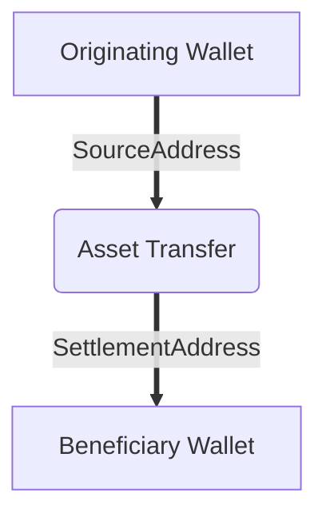

In TAP a transaction is on the other hand a graph between the real-world participants. The following shows very minimal TAP graph, without any information required to actually execute the transaction:

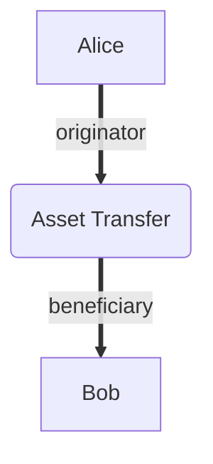

To be able to fully execute a transaction we need to expand it to include all the different participants. The following shows an example where Alice is sending funds to Bob from her exchange account to his self-hosted wallet.

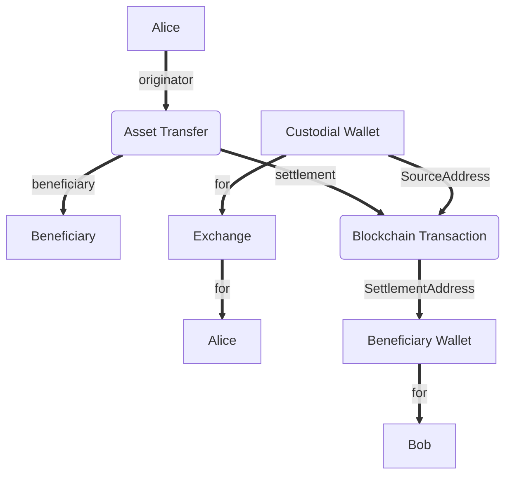

### Discovery of participants

End-users may not know all the agents involved in a transaction from the outset. So to be able to authorize and settle it their agents need to work through a with them and their counterpart to be able to identify the required participants.

#### Bob sends Alice a Transfer request

In this example Bob's Wallet creates a Transfer request that he can send to Alice requesting payment.

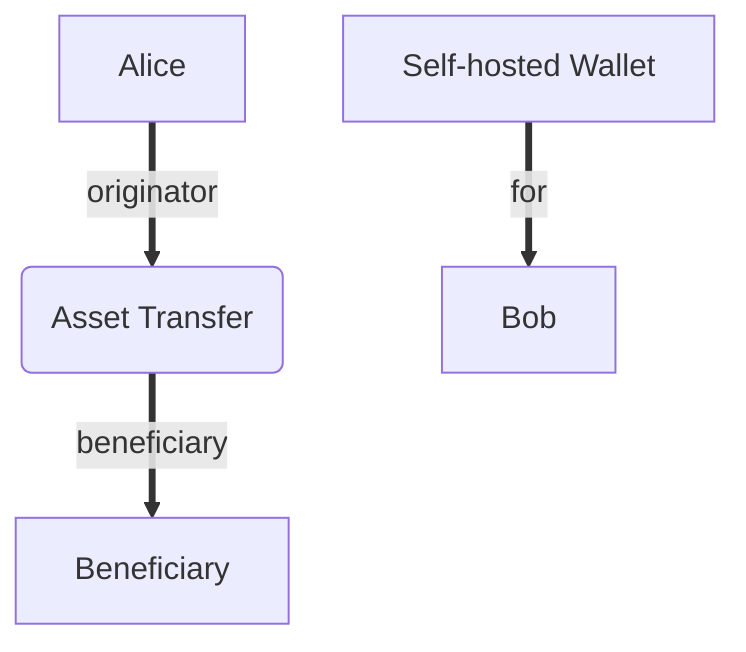

Alice opens it in her exchanges mobile wallet, which inserts itself and sends a message to Bob's wallet with the additional details and asking it to Authorize the transaction.

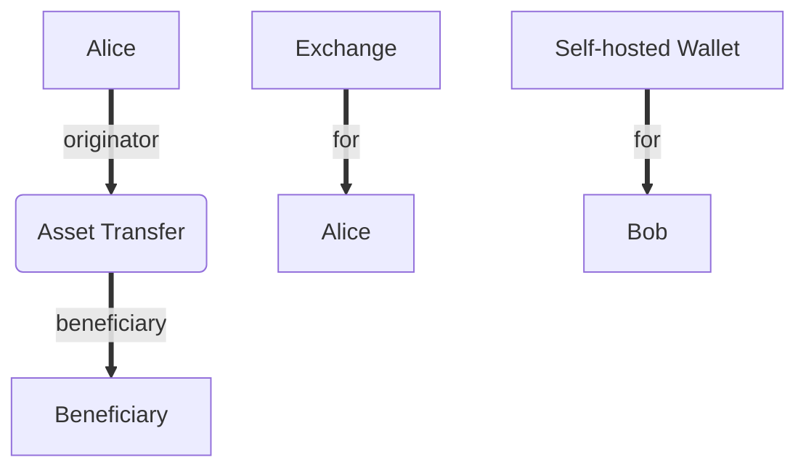

Bob's wallet authorizes the transaction and sends the Exchange his address. Now the Transfer is complete and can be settled by the Exchange.


#### Bob sends Alice his blockchain address (Legacy)

Today most wallets and exchanges use blockchain addresses to send to


TODO expand this example

### Adding and replacing agents

Any agent can add and replace agents to the transaction as part of the discovery process. Sometimes this happens before a request is sent to another agent, but messages defined in [TAIP-5] can be used by agents to collaborate about discovery after a request is sent.

As an example as part of a transaction the parent entity of an exchange was identified as the agent. In reality the customer is a customer of a local subsidiary and replaces itself with the correct agent.

An exchange may also use an MPC Wallet Service and could add it as another agent to the transaction. An MPC Wallet Service could also help identify blockchain addresses as belonging to another customer of their's and add their customer as a new agent.

### Proving relationships between agents

The Transaction Agent model allows Agents to declare whom they are acting on behalf of. In some cases, more than a declaration is needed, and either a confirmation by the other party or cryptographically signed proof will increase the certainty of the original statement.

The primary use-cases today are:

- Prove that the intended beneficiary to a transaction controls a blockchain wallet address to ensure the transaction reaches its intended beneficiary
- Prove that a known party controls a blockchain wallet address for KYC and Sanctions Screening purposes
- Prove that an Agent controls a blockchain wallet address to ensure the exchange of PII to the correct agent in the context of a Travel Rule compliant transaction

## Transaction Authorization

A simple generic transaction authorization protocol allows agents acting on behalf of transaction parties to collaborate around authorizing or rejecting it.

The core of the Transaction Authorization Protocol is defined in [TAIP-4].

### Non-deterministic multi-party authorization

Most payment authorization and travel rule protocols have a deterministic message flow. Each agent or party to a transaction is expected to perform a set of actions in a particular sequence.

The reality in the crypto world in 2023 that in most cases they don’t do that, but implement the travel rule somewhat haphazardly or not at all, causing most agenets to not have a successful flow.

By designing it as a non-deterministic message protocol instead allowing each party to negotiate for their required information and use game theoretical principles to force their counterparties to follow the rules that their national regulator or risk department requires. It also elegantly handles the differences between regulatory requirements along the world, where companies can create and modify policies as the industry and regulation changes.

An institution can force some consensus around the state of the payment, by withholding settlement or not sharing a settlement address until sufficient risk has been mitigated by counterparties.

### Authorization Message Flow

There are three primary messages an agent can take:

- `Settle` - They announce they will send the transaction to the blockchain.
- `Authorize` - Authorize or signal to other agents that they are free to `settle` a transaction.
- `Reject` - Signal to other agents that they reject the transaction.

The following shows an simplified authorization flow with a succesfull outcome:

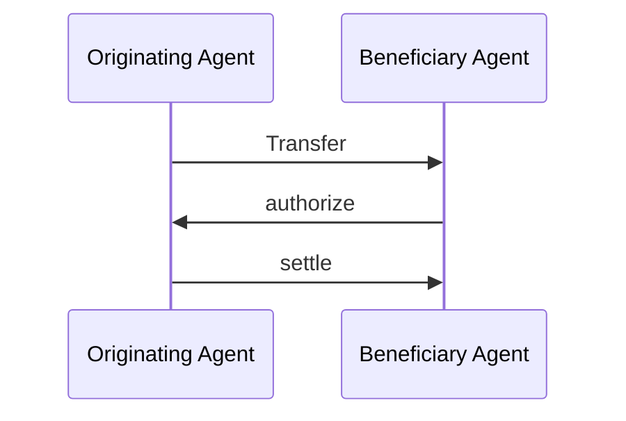

The following shows an simplified authorization flow where a beneficary agent rejects the transaction:

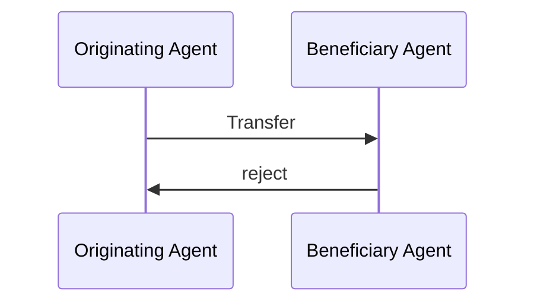

### Enforcing rejection from Beneficiary Agents

One of the core issues business face when receiving crypto transactions, is the inability to reject a transaction.

TAP allows Beneficiary Agents to only provding a `settlementAddress` after `Authorization`, which allows them to reject unwanted transactions for the first time.

An example Authorization flow using two agents where the `settlementAddress` was included in the original `Transfer` message:

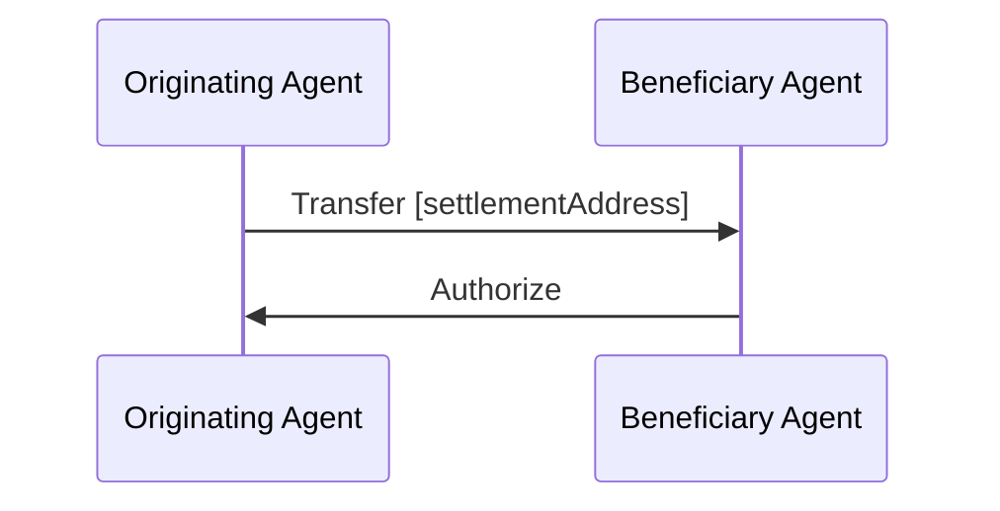

An example Authorization flow using two agents where the `settlementAddress` was not included in the original `Transfer` message, and thus has to be specified by a Beneficiary Agent:

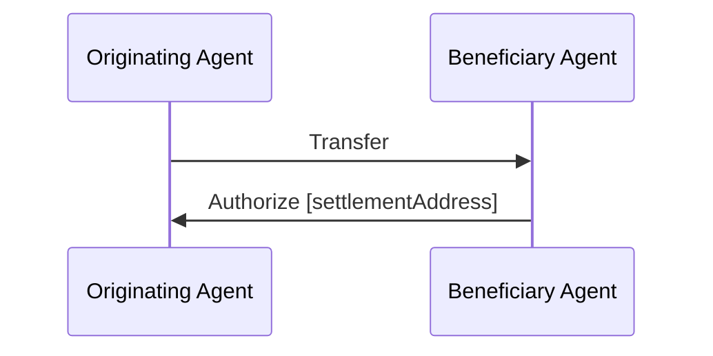

An example Authorization flow using three agents, including a wallet API service representing the Beneficiary agent, where the `settlementAddress` was not included in the original `Transfer` message, and thus has to be specified by a Beneficiary Agent:

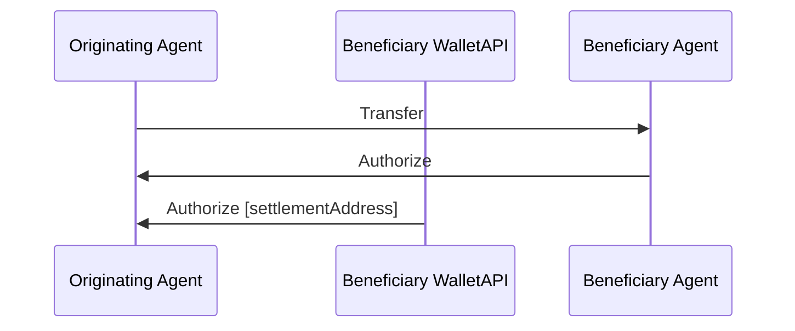

The above flow demonstrates the power of multiple agents collaborating around authorizing a transaction. The Beneficiary Agent and WalletAPI maintain their risk profiles and can independently authorize the transaction. In most cases, the Wallet API will defer to their customer, the Beneficiary Agent, and can use the signal that their customer Authorizes it to Authorize it and present the `settlementAddress` to the originating agent.

### Wallet Service Providers as Agents

The following shows an authorization flow with the addition of a Wallet Service Provider as an agent representing the originating agent, with a succesful outcome (transaction settled):

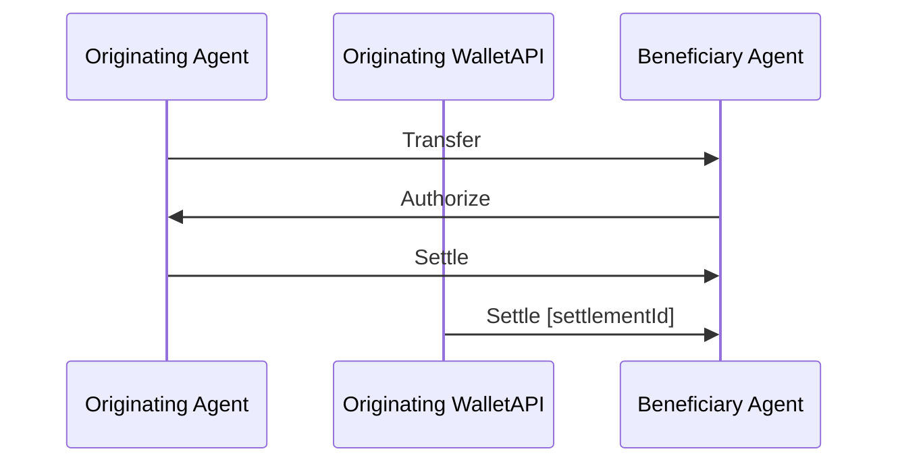

The above flow also demonstrates the power of multiple agents collaborating to authorize a transaction. The Originating Agent and WalletAPI maintain their risk profiles and can independently authorize the transaction for settlement. In most cases, the Wallet API will defer to their customer, the Originating Agent, and can use the signal that their customer sends a Settle message to settle it on the blockchain and present the `settlementId` to the other agents.

### Transaction State from the point of view of various agents

A vital aspect of this flow is the intentional lack of a shared state. Focusing on a message flow instead makes it more realistic to use in permissionless blockchain applications. It also does provide more complexity for the implementing agent and their policies (see [TAIP-7]).

This is a potential state machine from the point of view of the originating agent (remember there is no shared state between agents, and each agent must maintain their own state):

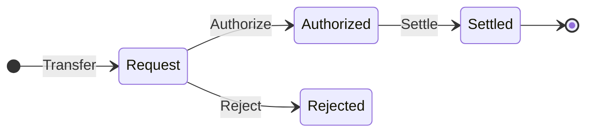

This is a potential state machine from the point of view of the beneficiary agent:

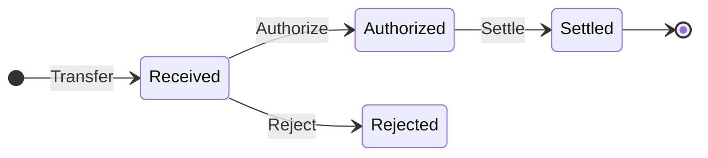

## Policies

As specified in [TAIP-5], agents are services often run by businesses that have business, contractual, and regulatory reasons for managing risk regarding transactions. Individuals may also create policies to protect themselves from unwanted liability and security risks. As part of [TAIP-4] they can declare their requirements for authorizing a transaction as policies.

Traditional centrally managed Payment Associations issue shared guidelines and policies as part of their membership agreements, ensuring information requirements are standardized regionally and globally. [TAP][TAIP-4] was designed to work in a decentralized ecosystem based on public blockchains, with no centralized association to create a set of policies.

Use cases and regulations are rapidly expanding worldwide, and some jurisdictions have stricter requirements than others. E-commerce and trading use cases also have different requirements, so they can’t be standardized in a global set of policies for everyone to implement.

The approach proposed here allows each agent to declare their policies and will enable each agent to decide if they want to comply with them based on balancing risk and business value.

This method allows a market-based approach to rolling out policies instead of a top-down policy by a national or transnational organization.

[TAIP-7] provides detailed technical specifications for Policies.

### Require Authorization

If an agent requires that another agent specifically `Authorizes` a message prior to them sending a `Settle` message, they can require this of either all other Agents or specific agents.

### Require Relationship Confirmation

An agent likely on the originator side could require that prior to settling funds to a customer or providing originator PII, that an beneficiary performs an address ownership proof, and what standard to use. For illustrative purposes this could be presented using a message `proof-of-control`.

## Require Presentation of Verifiable Credentials

In some cases, such as when implementing the FATF Travel Rule, e-commerce flows, or as part of management of counterparty risk in certain institutional use cases identifying information may be requested and exchanged by agents surrounding either themselves or the ultimate parties to the underlying transaction.

This is a generic way of requesting a selected [Verifiable Presentation][VP] from another agent in the transaction of a particular identity information regarding a party or agent.

An agent could for example specify a `require-presentation` policy to request for example the name or shipping address of a party. See [TAIP-9] for more details.

## Selective Disclosure of Identifying Information

Transaction Agents may have a requirement to identify specific aspects of another Transaction Participant before they can Authorize or Settle transactions according to the [Transaction Authorization Flow][TAIP-4]. They present these as [TAIP-7 Agent Policies][TAIP-7]. This provides a simple method to securely share required information as [Verified Presentations][VP] over End-to-End encrypted [DIDComm].

There are strict regulatory requirements for exchanging PII of transaction parties within the context of a transaction, such as complying with Sanctions Name Screening requirements, FATF’s Travel Rule, and various international data protection legislation.

Highlighting the identity of the parties and providing the data to the transaction counterparties also improves UX, reduces the risk of fraud, and ties transactions into business workflows such as payroll and e-commerce.

Many other Transaction Authorization Protocols, including [iso20022], and most Crypto Travel Rule Protocols based on [IVMS-101] exchange transmit the PII in line with the transfer request itself, which lends themselves to a significant risk of PII exposure.

This is bad for end-users and can expose significant legal liability for Transaction Agents handling this.

The approach taken here is to remove any PII from the core transaction meta-data that all agents require, and only exchange the minimum required information directly between the specific Agents requiring it. By allowing transaction agents to publish their policies up-front through [TAIP-7], other agents can take a risk-based approach to comply with and exchange the PII separately. It allows Agents to asses privacy policies, regulations, etc, for the Agent requiring the PII before exchanging it.

[TAIP-8] provides detailed technical specifications for Selective Disclosure.

## Comparison with other Transaction Authorization Specifications

### How does TAP compare with ISO 20022

[ISO-20022] is a modern messaging specification used by [SWIFT] and many other national, regional, and international payment networks.

ISO-20022 is a very flexible authorization protocol similar to TAP, however it is designed to work in centrally managed organizations like payment associations.

It does not support neither self-hosted or on-chain agents as full participants. It is designed to be used strictly for B2B communication.

Technically speaking ISO-20022 utilizes tried and true, but old standards like XML, X509 certificates, and XML Signatures. Many banks have spent many years trying to implement it for SWIFT, but it has presented many challenges to do so.

Travel Rule related PII is sent in-line directly between participants, thus it does not support the minimization of PII exposure between only the required agents.

### How does TAP compare with ISO 8583

[ISO-8583] is an older protocol used by many card associations. It is also intended for asyncronous message communication over slow data lines. Due to it's age it is very limited in its expandability.

It does not support neither self-hosted or on-chain agents as full participants.

PII and counterparty information exchanged is present but very limited due to the message size restrictions.

## Comparison with Crypto Travel Rule Protocols

### How does TAP compare with TRUST?

Coinbase’s TRUST solution does not provide a Transaction Authorization flow. TRUST provides a centralized “bulletin board” operated by Coinbase, which allows VASPs to opportunistically identify beneficiary VASPs after a transaction has settled and share PII between the originator and beneficiary VASPs.

TRUST does not support transaction intermediaries such as custodial wallet services. TAP supports complex flows, including multiple intermediaries such as wallet services.

### How does TAP compare with VerifyVASP?

UpBit’s VerifyVASP solution provides a transaction authorization flow between VASPs that fully implements the travel rule. It only supports use cases required for the travel rule and thus does not support authorization of transactions without the exchange of customer PII.

VerifyVASP does not support transaction intermediaries such as custodial wallet services. TAP supports complex flows, including multiple intermediaries such as wallet services.

### How does TAP compare with TRP?

TRP provides an open transaction authorization flow between VASPs that fully implements the travel rule. It only supports use cases required for the travel rule and thus does not support authorization of transactions without the exchange of customer PII.

TRP does not support transaction intermediaries such as custodial wallet services. TAP supports complex flows, including multiple intermediaries such as wallet services.

## Example Use Cases

Illustrative use cases are presented here to demonstrate TAP's versatility and applicability in real-world scenarios,  including projections on how future TAIPs might impact decentralized protocols, self-hosted wallets, and e-commerce payment flows.

### Legacy digital asset transfer authorization

This implements an authorization scheme between two custodial wallet services with a known beneficiary wallet address.

#### Parties in example legacy flow

- `did:eg:bob`
- `did:eg:alice`

#### Agents in example legacy flow

- `did:eg:originator.vasp`
- `did:eg:beneficiary.vasp`
- `did:pkh:eip155:1:0xabcdef`

Bob wants to send 1 ETH to Alice using his wallet at `originator.vasp` to beneficiary address `0xabcdef`.

For legacy transfers like this the sending VASP must lookup who the beneficiary VASP is or ask Bob to ask Alice for the details. The details of how this works is out of scope.

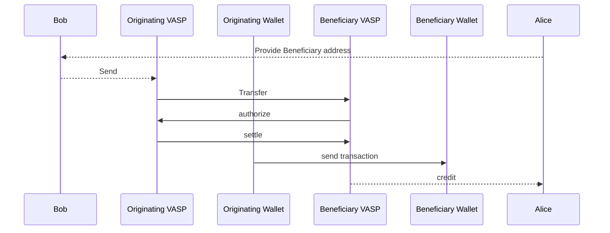

There are two main problem with the above flow:

- Identifying the beneficiary VASP behind a blockchain address, but there are various solutions for this implemented by travel rule solutions today although none are perfect
- While this does present an authorization flow, it requires the originator institution to respect and wait for a rejection by the beneficiary VASP. Some beneficiary VASP are presenting policies that they will could freeze incoming funds. TAP can be used to negotiate these policies up front.

1. The originating VASP can declare as its policy in the initial `Transfer` message, that it will not transfer funds without an explicit authorization by the beneficiary VASP.
2. The beneficiary VASP authorizes the transaction by replying with an `Authorize` message.
3. The originating VASP replies with a `Settle` message

#### Using policies to support the FATF Travel Rule for Legacy transactions

The FATF Travel Rule requires the originating VASP to collect information about the beneficiary customer and transmit both that and PII about their customer along to the beneficiary VASP.

This allows the beneficiary VASP to confirm that the beneficiary is indeed the correct customer as well as allowing both sides to perform name sanctions screening on the counterparties customer for third-party transfers.

Due to the sensitive nature of customer PII, agents could present a policy of requiring `proof-of-control` of an address before sharing information.

In addition to providing the beneficiary address, Bob also now needs to provide Alice’s name to his VASP.

```mermaid
sequenceDiagram
    Participant Bob
    Participant Originating VASP
    Participant Originating Wallet
    Participant Beneficiary VASP
    Participant Beneficiary Wallet
    Participant Alice
    
    Alice -->> Bob: Provide Beneficiary address and name
    Bob -->> Originating VASP: Send to address and name
    Originating VASP ->> Beneficiary VASP: Transfer
    Beneficiary VASP ->> Originating VASP: require-presentation
    Originating VASP ->> Beneficiary VASP: require-proof-of-control
    Beneficiary Wallet ->> Originating VASP: proof-of-control
    Originating VASP ->> Beneficiary VASP: present-credentials
    Beneficiary VASP ->> Originating VASP: authorize
    Originating VASP ->> Beneficiary VASP: settle
    Originating Wallet ->> Beneficiary Wallet: send transaction
    Beneficiary VASP -->> Alice: credit
```

1. The Originating VASP can include it’s policies in the original Transfer message.
2. The Beneficiary VASP can respond with a message declaring that it requires information about the originator and beneficiary.
3. The Originating VASP requires proof that the settlement address is controlled by the Beneficiary VASP and declares this.
4. The Beneficiary VASP can provide proof of control by signing and sending a message according to [TAIP-9]
5. Originator VASP encrypts and sends a message according to [TAIP-8] containing requested PII directly to the Beneficiary VASP

Now since all the policies are fulfilled beneficiary can perform the `Authorize` and `Settle` steps as before.

### Modern digital asset transfer authorization

This implements an authorization scheme between two custodial wallet services on behalf of their customers. The beneficiary wallet address is not shared until after any authorization has been performed.

#### Parties

- `did:eg:bob`
- `did:eg:alice`

#### Agents

- `did:eg:originator.vasp`
- `did:eg:beneficiary.vasp`

Bob wants to send 1 ETH to Alice using his wallet at `originator.vasp` to Alice’s account at beneficiary VASP. Instead of presenting the beneficiary address, the beneficiary VASP provides a TransferRequest signed by the Beneficiary VASP, containing her identifier. She can then share this with Bob instead of a beneficiary address.

This can not only ensure considerably better UX for retail users than is available today, it also allows the beneficiary VASP to require that originating VASP allows them to perform an authorization step.

```mermaid
sequenceDiagram
    Participant Bob
    Participant Originating VASP
    Participant Originating Wallet
    Participant Beneficiary VASP
    Participant Beneficiary Wallet
    Participant Alice
    
 Beneficiary VASP -->> Alice: Create TransferRequest
    Alice -->> Bob: Share TransferRequest
    Bob -->> Originating VASP: Submit TransferRequest
    Originating VASP ->> Beneficiary VASP: Transfer
    Beneficiary VASP ->> Originating VASP: authorize
    Originating VASP ->> Beneficiary VASP: settle
    Originating Wallet ->> Beneficiary Wallet: send transaction
    Beneficiary VASP -->> Alice: credit
```

By only sharing the beneficiary address after the authorization flow, the beneficiary VASP can now authorize or reject transactions on an equal basis with the originating VASP.

After sharing it the originator VASP can initiate a `Transfer` as a thread to the `TransferRequest` expanding on it adding its own details and policies to it.

The beneficiary VASP authorizes the transaction by replying as a thread to the `Transfer` adding a `settlementAddress` containing the deposit address.

#### Using policies to support the FATF Travel Rule

As mentioned in the legacy transfer flow, the FATF Travel Rule requires the originating VASP to collect information about the beneficiary customer and transmit both that and PII about their customer along to the beneficiary VASP.

Using the modern TAP flow implementing the Travel Rule can be done without adding additional steps, thus it is much simpler.

Also since the beneficiary wallet is no longer a core part of the flow, there is no longer a requirement for obtaining proof of control, eliminating this step completely.

The sequence diagram does not change to implement the Travel Rule, but each party adds additional data and policies to the request to verify it.

The initial TransferRequest message adds beneficiary name information which can be displayed to the sending customer providing better UX.
After sharing it the originator VASP can initiate a `Transfer` as a thread to the `TransferRequest` expanding on it adding the required originator PII as an attachment. While the beneficiary name is required as part of implementing the travel rule, it is implicitly included in the thread, through the original `TransferRequest` and can be acted on by the originator VASP before initiating a transfer.

Now the `Authorize` and `Settle` flow can happen as before.

### Self-hosted wallet authorization

TBD

## Transaction Authorization Improvement Proposals

The concept of TAIPs allows the community to propose enhancements and specific applications of TAP to their unique transaction scenarios. The initial set of TAIPs (TAIP-1 to TAIP-4) outlines specific technical details such as messaging structure, DIDs usage, identity credential requests, and compliance with the FATF Travel Rule.

### Initial TAIPs

| TAIP | Description                                                            |
|------|------------------------------------------------------------------------|
| 1    | [Transaction Authorization Improvement Proposals](./TAIPs/taip-1.md)   |
| 2    | [Messaging](./TAIPs/taip-2.md)                                         |
| 3    | [Virtual Asset Transfer](./TAIPs/taip-3.md)                            |
| 4    | [Transaction Authorization Protocol](./TAIPs/taip-4.md)                |
| 5    | [Transaction Agents](./TAIPs/taip-5.md)                                |
| 6    | [Transaction Parties](./TAIPs/taip-6.md)                               |
| 7    | [Agent Policies](./TAIPs/taip-7.md)                                    |
| 8    | [Selective Disclosure](./TAIPs/taip-8.md)                              |
| 9    | [Proof of Relationship](./TAIPs/taip-9.md)                             |

## Implementation and Integration

Guidelines for the implementation of TAP are provided in this section, along with insights into integrating the protocol with existing payment systems and blockchain networks.

## Glossary

## References

- [TAIP-1] Transaction Authorization Improvement Proposals
- [TAIP-2] Defines the TAP Message structure
- [TAIP-3] Asset Transfer Message
- [TAIP-4] Defines the Transaction Authorization Protocol
- [TAIP-5] Describes Transaction Agents
- [TAIP-6] Describes Transaction Parties
- [TAIP-7] Policies
- [TAIP-8] Selective disclosure of PII
- [TAIP-9] Proof of Relationship
- [ChainAgnostic] Chain Agnostic Improvement Proposals
- [CAIP-10] Describes chainagnostic Account ID Specification
- [CAIP-19] Describes chainagnostic Asset ID specification
- [CAIP-74] CACAO
- [DID][DID] W3C Decentralized Identifiers
- [DIDComm][DIDComm] DIDComm Messaging
- [PKH-DID] `did:pkh` specification
- [WEB-DID] `did:web` specification
- [JSON][JSON] JavaScript Object Notation
- [JSON-LD][JSON-LD] JSON Linked Data
- [ISO-20022] ISO-20022 Universal Financial Industry message scheme
- [ISO-8583] ISO-8683 Financial-transaction-card-originated messages
- [IRI] Internationalized Resource Identifiers
- [MAILTO] The `mailto` URI scheme
- [SMS] The `sms` URI Scheme for Global System for Mobile Communications (GSM) Short Message Service (SMS)
- [PEx] Presentation Exchange
- [PExDef] Presentation Exchange - Presentation Definition
- [WACIPEx] Wallet and Credential Interaction (WACI) Protocols for both Issuance and Presentation Exchange
- [VCModel] W3C Verifiable Credentials Data Model
- [VC] Verifiable Credentials
- [VP] Verifiable Presentation
- [IVMS-101] interVASP Messaging Standard 101 (IVMS 101)

[DID]: https://www.w3.org/TR/did-core/
[DIDComm]: https://identity.foundation/didcomm-messaging/spec/v2.1/
[JSON]: https://datatracker.ietf.org/doc/html/rfc8259
[JSON-LD]: https://www.w3.org/TR/json-ld  
[TAIP-1]: https://tap.rsvp/TAIPs/taip-1
[TAIP-2]: https://tap.rsvp/TAIPs/taip-2
[TAIP-3]: https://tap.rsvp/TAIPs/taip-3
[TAIP-4]: https://tap.rsvp/TAIPs/taip-4
[TAIP-6]: https://tap.rsvp/TAIPs/taip-6
[TAIP-7]: https://tap.rsvp/TAIPs/taip-7
[TAIP-5]: https://tap.rsvp/TAIPs/taip-5
[TAIP-8]: https://tap.rsvp/TAIPs/taip-8
[TAIP-9]: https://tap.rsvp/TAIPs/taip-9
[ChainAgnostic]: https://chainagnostic.org
[CAIP-10]: <https://chainagnostic.org/CAIPs/caip-10>
[CAIP-19]: <https://chainagnostic.org/CAIPs/caip-19>
[CAIP-74]: <https://chainagnostic.org/CAIPs/caip-74>
[PKH-DID]: <https://github.com/w3c-ccg/did-pkh/blob/main/did-pkh-method-draft.md>
[WEB-DID]: <https://www.w3.org/did-method-web/>
[ISO-20022]: <https://www.iso20022.org>
[ISO-8583]: <https://en.wikipedia.org/wiki/ISO_8583>
[IRI]: https://datatracker.ietf.org/doc/rfc3987/
[MAILTO]: https://www.iana.org/go/rfc6068
[SMS]: https://www.rfc-editor.org/rfc/rfc5724.html
[PEx]: <https://identity.foundation/presentation-exchange/spec/v2.0.0/>
[PExDef]: <https://identity.foundation/presentation-exchange/spec/v2.0.0/#presentation-definition>
[WACIPEx]: <https://identity.foundation/waci-didcomm/>
[VCModel]: <https://www.w3.org/TR/vc-data-model-2.0/>
[VC]: <https://www.w3.org/TR/vc-data-model-2.0/#credentials>
[VP]: <https://www.w3.org/TR/vc-data-model-2.0/#presentations>
[IVMS-101]: <https://www.intervasp.org>


## License

<p xmlns:cc="http://creativecommons.org/ns#" xmlns:dct="http://purl.org/dc/terms/"><a property="dct:title" rel="cc:attributionURL" href="https://tap.rsvp/Whitepaper.html">Transaction Authorization Protocol Whitepaper</a> by <a rel="cc:attributionURL dct:creator" property="cc:attributionName" href="https://notabene.id">Notabene</a> is licensed under <a href="http://creativecommons.org/licenses/by-nd/4.0/?ref=chooser-v1" target="_blank" rel="license noopener noreferrer" style="display:inline-block;">CC BY-ND 4.0</a></p>
