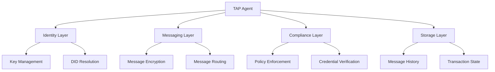
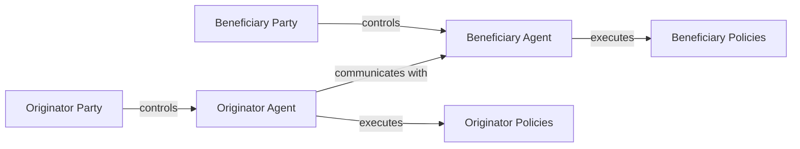
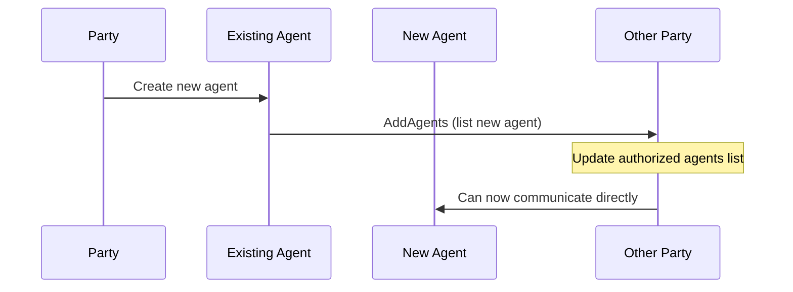
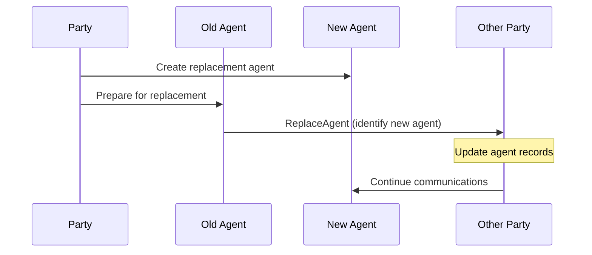
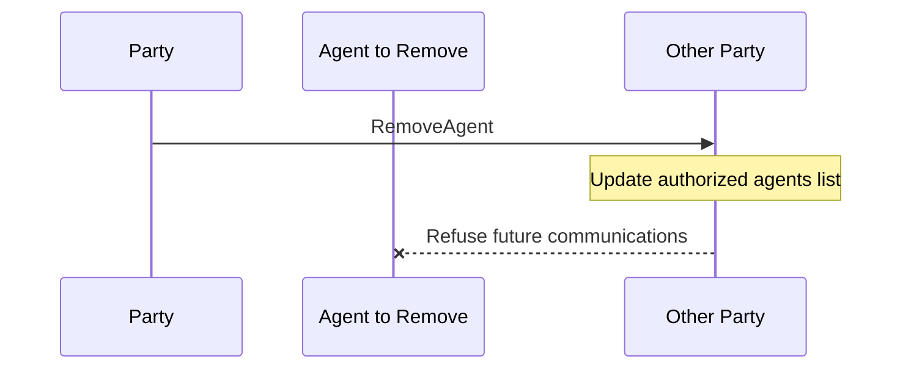

Agents are a core component of the Transaction Authorization Protocol (TAP) architecture. They act as the operational entities that facilitate communication and execute transactions on behalf of parties.

## What is a TAP Agent?

A TAP Agent is a software entity that:
- Has its own cryptographic identity (typically a DID)
- Operates on behalf of a specific party
- Manages cryptographic keys for secure messaging
- Implements the TAP protocol logic
- Executes compliance policies defined by its controlling party

## Agent Architecture

TAP agents follow the DIDComm agent model, combining identity management with secure messaging capabilities:

## Agent Roles and Relationships

Agents operate within a structured relationship model:

### Agent-Party Relationship

- Each agent is controlled by exactly one party
- A party may control multiple agents for different purposes
- Agents derive their authority from their controlling party
- The agent-party relationship must be cryptographically verifiable

### Party Attributes

Agents manage various party attributes, including:

- **Identity** - DIDs or IRIs that identify the party
- **Name** - Human-readable identifiers
- **LEI Codes** - For institutional parties, Legal Entity Identifiers
- **Merchant Category Codes** - ISO 18245 codes identifying business types for merchant parties
- **Verification methods** - Ways to verify party identity and claims

## Agent Management Messages

TAP includes specific messages for managing agents throughout their lifecycle:

### AddAgents

The AddAgents message allows a party to register new agents that can operate on its behalf:

### ReplaceAgent

The ReplaceAgent message enables key rotation or agent migration while maintaining operational continuity:

### RemoveAgent

The RemoveAgent message revokes an agent's authority to act on behalf of a party:

## Agent Capabilities

TAP agents should ideally provide these core capabilities:

- **Secure Messaging**: Facilitating encrypted, authenticated communication between parties
- **Identity Management**: Maintaining cryptographic identities and handling verification
- **Policy Enforcement**: Applying and enforcing compliance rules during transactions
- **Transaction Management**: Tracking and managing the state of ongoing transactions
- **Audit Trail**: Maintaining a secure record of all messages and actions
- **Key Management**: Securely handling cryptographic materials for the agent and party

## DID Method Support

TAP agents can support multiple DID methods to enable flexible identity scenarios, such as:

- **did:key**: For simple and portable identities
- **did:web**: For organization-hosted identities
- **did:pkh**: For blockchain account-based identities

Additional DID methods can be supported based on specific implementation needs.

## Agent-to-Agent Communication

Agents communicate with each other using the DIDComm v2 messaging protocol, which provides:

- **End-to-End Encryption**: All messages are encrypted to protect sensitive data
- **Authentication**: Every message can be cryptographically verified
- **Asynchronous Messaging**: Messages can be sent and processed asynchronously
- **Transport Flexibility**: Support for HTTPS, WebSockets, and other transport methods

## Implementation Considerations

When designing TAP agents:

1. **Security**: Focus on robust key management and secure message handling
2. **Scalability**: Consider how the agent will handle increasing message volume
3. **Compliance**: Ensure proper enforcement of party-defined policies
4. **Interoperability**: Design for compatibility with other TAP agent implementations
5. **Auditability**: Provide detailed logs of all agent operations for compliance purposes

## Technical Integration

For technical details on agent data structures and message formats, see the [full message reference](/messages/#participant-management-messages).
