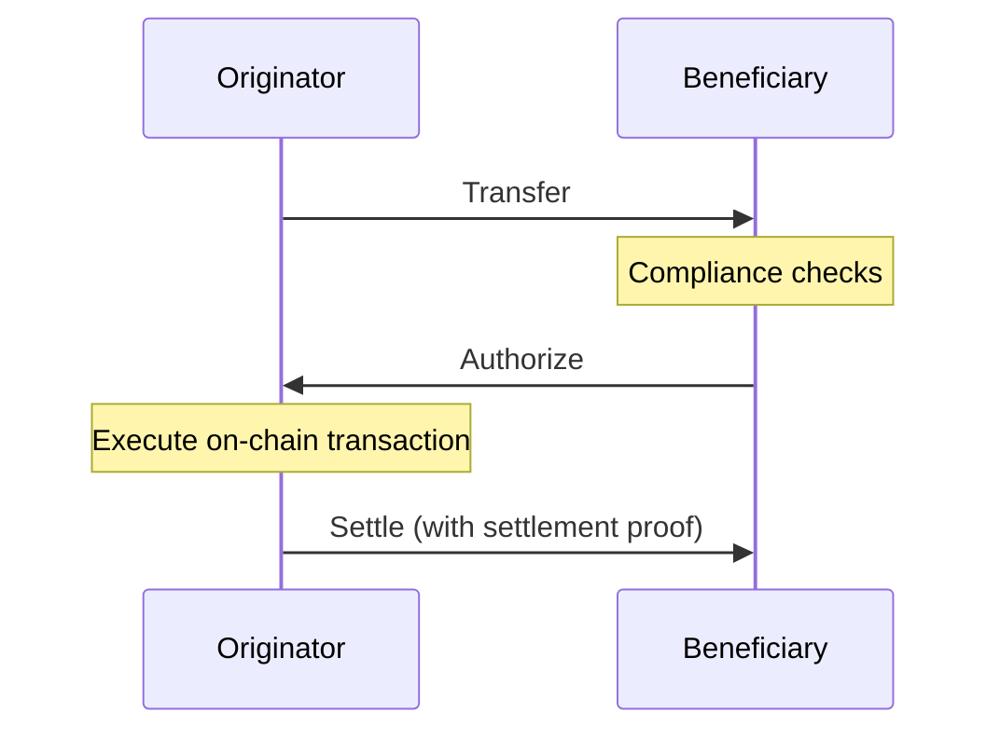
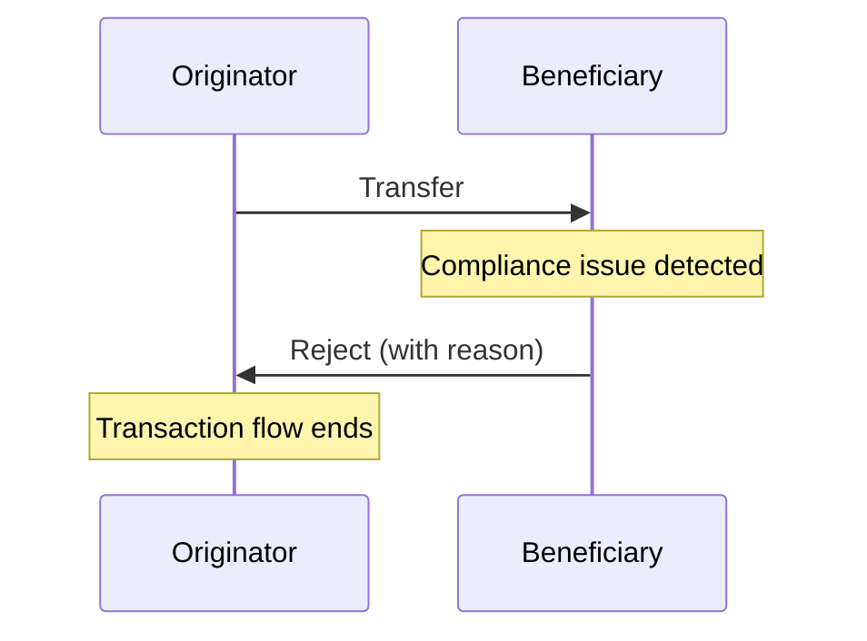
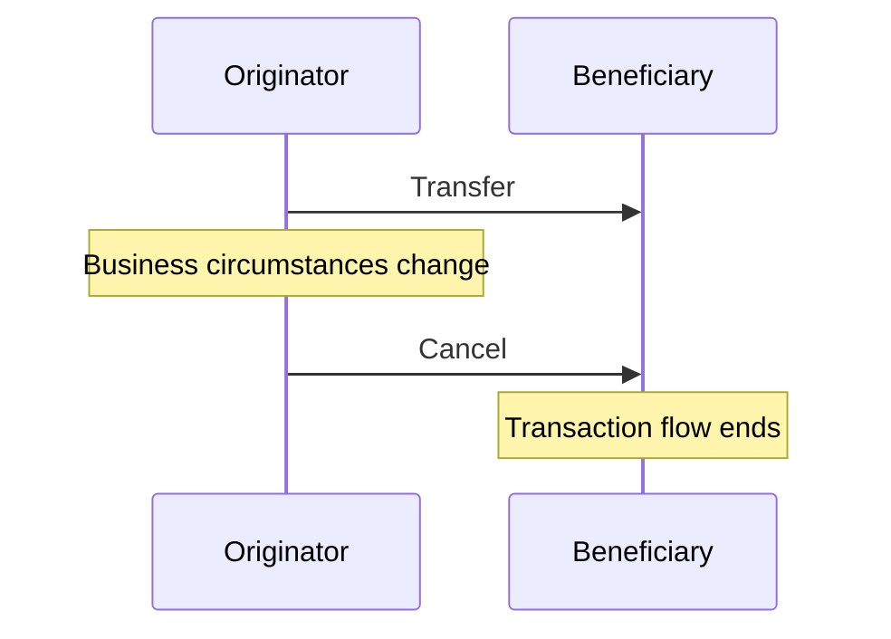
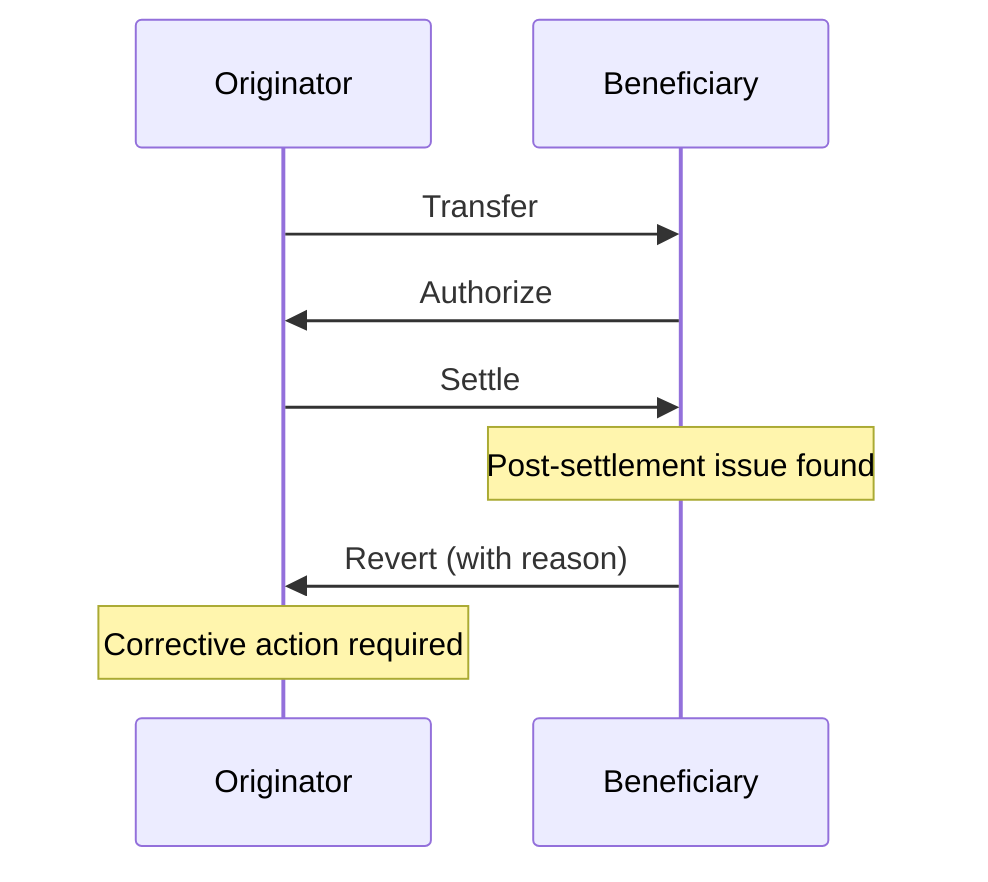
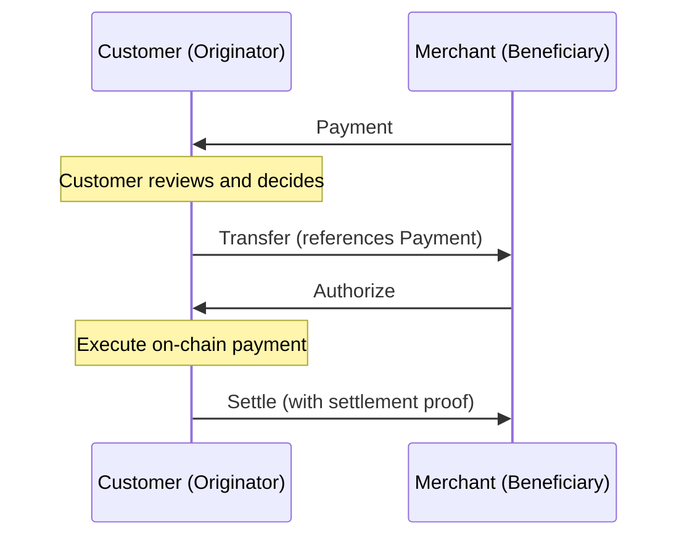
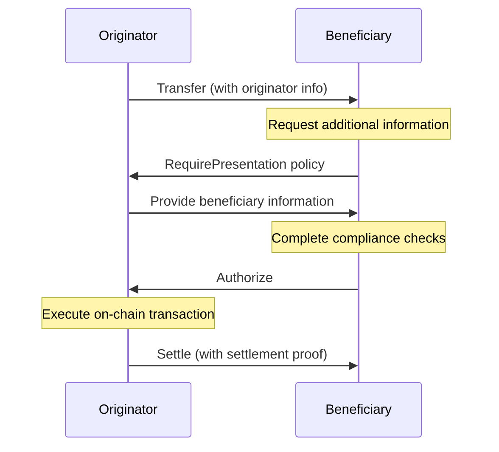

The Transaction Authorization Protocol (TAP) creates a pre-transaction authorization layer that operates independently from the blockchain settlement layer. This separation allows participants to exchange compliance information, perform risk assessments, and obtain proper authorization before assets move on-chain.

## Key Concepts

- **Pre-Transaction Authorization**: All transactions are authorized before on-chain settlement
- **Message Threading**: All authorization messages reference the original transaction using DIDComm thread IDs
- **State Transitions**: Transactions move through specific states (proposed → authorized → settled)
- **Split Responsibility**: Originators propose transactions, beneficiaries authorize, originators settle

## Basic Authorization Flow

The standard TAP authorization flow consists of three main steps:

1. **Transaction Proposal**: Originator sends a Transfer/Payment message
2. **Authorization Decision**: Beneficiary responds with Authorize or Reject
3. **Settlement Confirmation**: Originator notifies of on-chain settlement via Settle message

## Authorization Messages

### Authorize

The Authorize message indicates the beneficiary approves the transaction after completing their compliance checks. It references the original Transfer/Payment via the DIDComm thread ID.

**Business Implications**:
- Confirms the beneficiary has completed all compliance requirements
- Provides the originator legal clearance to execute the transaction
- Creates an audit trail of approval for regulatory purposes

### Reject

The Reject message indicates the beneficiary cannot approve the transaction. A clear reason must be provided to help the originator understand the compliance issue.

**Business Implications**:
- Stops the transaction flow, preventing non-compliant transactions
- Requires a specific reason to support remediation efforts
- Creates a compliance record of rejection and reasoning

### Settle

The Settle message confirms that the originator has executed the authorized transaction on-chain. It includes settlement proof (e.g., transaction hash) that links the TAP authorization to the blockchain settlement.

**Business Implications**:
- Creates a record linking off-chain authorization to on-chain settlement
- Enables reconciliation between compliance systems and blockchain transactions
- Completes the authorization-settlement cycle for audit purposes

### Cancel

The Cancel message allows the originator to withdraw a transaction proposal before it's authorized or settled.

**Business Implications**:
- Provides clean transaction termination for changed business circumstances
- Helps manage transaction queues during operational issues
- Creates clear records for incomplete transactions

### Revert

The Revert message addresses situations where a transaction was settled incorrectly or needs to be reversed. It creates a clear record that the original transaction should not be considered valid.

**Business Implications**:
- Addresses settlement errors or compliance issues discovered post-settlement
- Creates a compliance record of the reversal decision
- May trigger compensating transactions to correct the blockchain state

## Complex Authorization Flows

### Payment Flow

When using the Payment message type, the flow begins with the beneficiary requesting payment, shifting the initial message direction.

### Authorization with Travel Rule Information

For transactions requiring Travel Rule compliance, additional identity information is exchanged before authorization.

## Implementation Considerations

When implementing TAP authorization flows, consider:

1. **Policy Enforcement**: Define clear policies for which transactions require special handling
2. **Timeout Handling**: Establish processes for transactions that don't receive timely responses
3. **Compliance Record Keeping**: Maintain authorization messages for regulatory requirements
4. **Integration with On-chain Systems**: Ensure settlement proofs accurately reference blockchain transactions
5. **Error Handling**: Develop clear processes for handling various rejection scenarios

## Technical Integration

For technical details on authorization message formats, see the [full message reference](/messages/#authorization-flow-messages).
