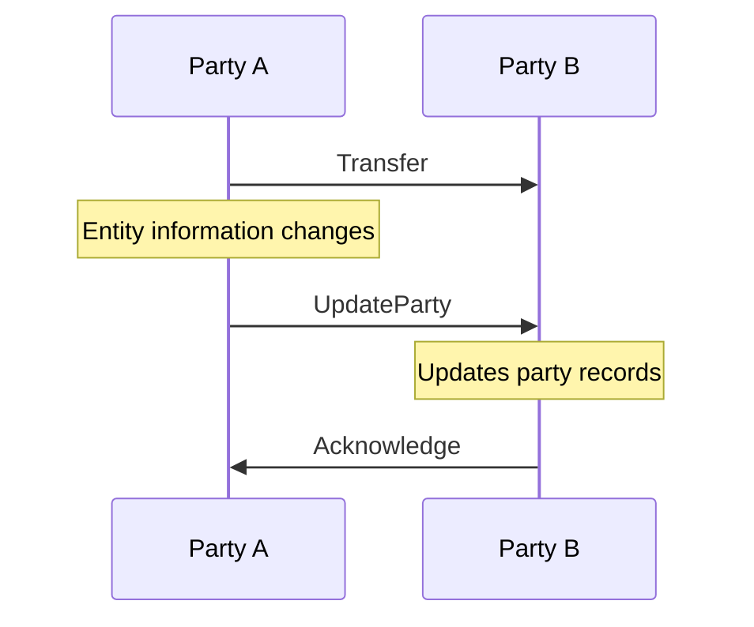

Parties are a fundamental concept in the Transaction Authorization Protocol (TAP). They represent the legal entities involved in blockchain transactions and form the foundation of TAP's compliance capabilities.

## What is a Party?

A Party in TAP represents a legal entity that:
- Has a verifiable identity (typically through DIDs)
- Can be subject to regulatory requirements
- Holds legal responsibility for transactions
- Manages one or more agents that execute transactions on its behalf

Examples of parties include virtual asset service providers (VASPs), financial institutions, corporations, merchants, and in some cases, individual customers.

## Party Roles in Transactions

The roles of parties in TAP are dependent on the specific transaction type:

- In **Transfers**, parties act as **Originators** (sending assets) and **Beneficiaries** (receiving assets)
- In **Payments**, parties take the roles of **Customers** (paying for services/goods) and **Merchants** (providing services/goods)
- **Intermediary Parties** may facilitate transactions between other parties and are typically implemented as [Agents](/agents/) that follow the TAP Agent architecture

Each transaction type defines specific responsibilities and compliance requirements for the involved parties. For detailed information about transaction types and associated party roles, see the [Transaction Types](/transactions/) documentation.

## Party Identity

Each party in TAP is identified through:

1. **Decentralized Identifiers (DIDs)**: Provides a cryptographically verifiable identity
2. **Verifiable Credentials**: May provide additional attestations about the party
3. **Relationship Proofs**: Document connections between parties and their agents

## Party Attributes

Parties in TAP may have various attributes that describe their characteristics:

1. **Name**: Human-readable identifier for the party (based on schema.org/Organization or schema.org/Person)
2. **Legal Entity Identifier (LEI)**: For institutional parties, a globally recognized identifier
3. **Merchant Category Code (MCC)**: Optional ISO 18245 code for merchant parties that identifies their business type (e.g., "5411" for grocery stores, "5812" for restaurants)
4. **Contact Information**: Methods for reaching the party outside of the TAP protocol, including:
   - **URL**: Website address (based on schema.org/Organization)
   - **Email**: Contact email address (based on schema.org/Organization or schema.org/Person) 
   - **Telephone**: Contact phone number (based on schema.org/Organization or schema.org/Person)
5. **Branding Information**: Visual identity elements:
   - **Logo**: URL to the party's logo image (based on schema.org/Organization)
   - **Description**: Textual description of the party (based on schema.org/Organization)
6. **Type Information**: JSON-LD type identifiers (e.g., "https://schema.org/Organization" for institutions, "https://schema.org/Person" for individuals)
7. **Regulatory Status**: Information about regulatory compliance and licensing

## Party Management Messages

TAP includes specific messages for managing party information:

### UpdateParty

The UpdateParty message allows participants to update party information during an ongoing transaction or relationship. This might include:
- Updated legal entity information
- Changed regulatory status
- Revised compliance policies

## Implementation Considerations

When designing party support in TAP:

1. **Party Registration**: Establish a secure process for registering and verifying parties
2. **Identity Management**: Maintain accurate and up-to-date party information
3. **Regulatory Alignment**: Ensure party information fulfills relevant regulatory requirements
4. **Privacy Considerations**: Balance compliance needs with data minimization principles
5. **Relationship Management**: Maintain clear records of relationships between parties and agents

## Technical Integration

Parties can be enhanced with schema.org attributes to provide richer metadata while maintaining compatibility with existing implementations. The schema.org vocabulary enables better interoperability with web standards and search engines.

For technical details on party data structures, message formats, and the complete list of supported schema.org attributes, see the [full message reference](/messages/#data-elements).
