# **Transaction Authorization Protocol (TAP) White Paper**
## Decentralized protocol to allow multiple parties to identify each other and collaborate around authorizing real-world transactions
## Executive Summary
The Transaction Authorization Protocol (TAP) represents a the first practical approach at creating a method for handling complex transaction authorizations for critical and complex real world use-cases such as cross-border payments, specifically designed for use for settlement on blockchains.
Designed to facilitate complex payments across a range of centralized and decentralized intermediaries, TAP addresses the critical need for robust, multi-layered transaction authorization in an increasingly digital economy.
The protocol is agnostic to the specific blockchain type and can work for real-world transactions composed of multiple underlying settlement transactions across multiple blockchains and fiat payment gateways.
Specific use-cases to be addressed from day one include:
- Both retail and institutional custodial to custodial transfers
- Handle both retail and institutional self-hosted wallet authorization flows
- Handle both 1st party and 3rd party flows
- Optionally implement FATF Travel Rule compliance depending on policy
- Self-hosted wallet authorization flows
- Complex flows with additional intermediaries such as wallet API services and FIAT on/off ramps
- Merchant payment flows
## Introduction
Public blockchains provide an order of magnitude better solutions for settlement of both complex and simple transactions between untrusted counterparties. Transactions typically exist within a single blockchain transaction on a single network and the entire authorization mechanism is handled by the holders of the keys to the originating account.
This means beneficiaries are currently unable to authorize or reject a transaction. In many real world transactions there may be multiple steps involved in a transactions. Real world transactions can also include a combination of multiple blockchain transactions across multiple blockchains, with optionally centralized steps such as conversion from or to FIAT or providing of liquidity.
Besides providing a mapping between real world transactions one or more orchestrated blockchain transactions, each party involved needs to manage risks such as counterparty risk, loss of funds through security or fraud, as well as manage compliance duties to limit financial crime.
With the entrance of a next generation of startups and traditional financial institutions entering the digital asset space, it is critical that the industry works together to build out a messaging and authorization messaging system, similar in many ways to ISO20022, but native to the intricacies of blockchain transactions.
TAP emerges as a solution, bridging gaps in transaction authorization, trust, and compliance in the digital asset industry. This document outlines the protocol's design, goals, and its significance for a varied audience, including developers, financial institutions, and regulatory bodies. 
At this pivotal moment in the crypto industry, with institutions, fintechs, and banks preparing for significant migration to blockchain technologies, TAP's flexibility and rapid adaptability to new technologies through Transaction Authorization Improvement Protocols (TAIPs) are crucial.
## Current State of Crypto Transactions
Currently, crypto transactions are limited by their reliance on the unilateral authorization by key holders, lacking mechanisms for authorization by beneficiaries.
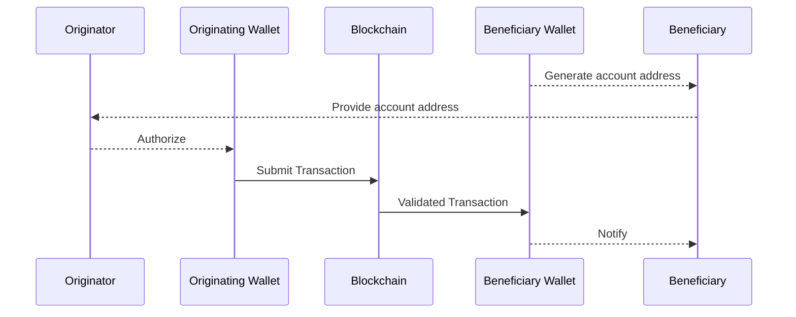
Once a transaction is authorized and submitted to the blockchain by the the originating wallet’s key holders, it is impossible by design to reverse the transaction, which represents a significant change over traditional payment systems that separate payment authorizations from underlying settlement.
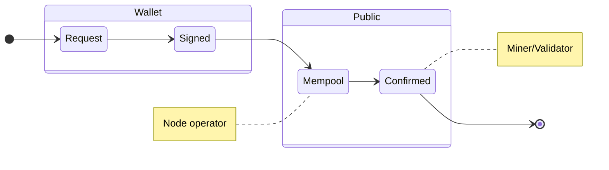
The above demonstrates the state machine behind all blockchain transactions. The only party able to authorize a transaction is the holder of the wallet. Once it has been submitted  to the public Mempool the wallet owner can still in some cases change it, but once confirmed it can not be reversed by anyone. 
### Implications for self-hosted wallet users
One of the core tenets of the blockchain industry is to allow individuals to manage their own private wallets and keys. There are significant security challenges involved with this that hardware and smart contract based wallet providers are working on solving.
There however additional risks involved to the owners of these self-hosted wallets. There has been considerable fraud involving self-hosted wallet owners accidentally authorizing transactions through phishing attacks sending funds to the wrong party. Proper authorization and counterparty identification for both retail and self-hosted wallet users is key to allow the echo system to grow.
Since transactions on blockchains are themselves public, self-hosted wallet owners regularly expose what they expect to be their private transaction history whenever they share their blockchain addresses to anyone. This also exposes them to fraudulent incoming transactions that can lead to serious reputational risk for wallet holders and additional fraud use cases.
Inadvertently transacting with high risk wallets or mixers, can permanently damage the possibility of interacting directly with a centralized service for example.
### Implications for Centralized Services
Security for wallet key holders, as well as most interactions orchestrated between buyers and sellers on exchange market places are in most cases today handled by centralized services holding custody on behalf of ultimate parties to transactions.
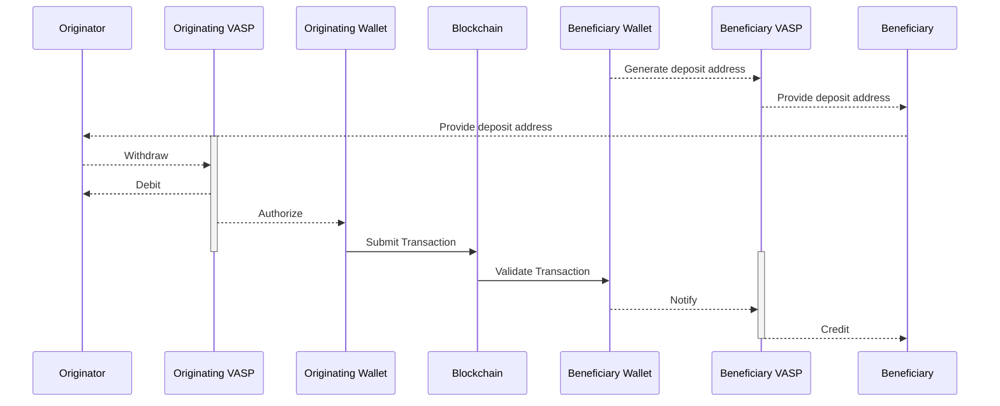
These centralized services are exposed to significant risk of fraud and compliance risk, due to the lack of authorization flows on receiving sides. At the same time any party using one of these centralized services is exposed to significant counterparty risk and exposure to fraud, by relying on these services as well as not being able to identify the ultimate counterparties to their own transactions.

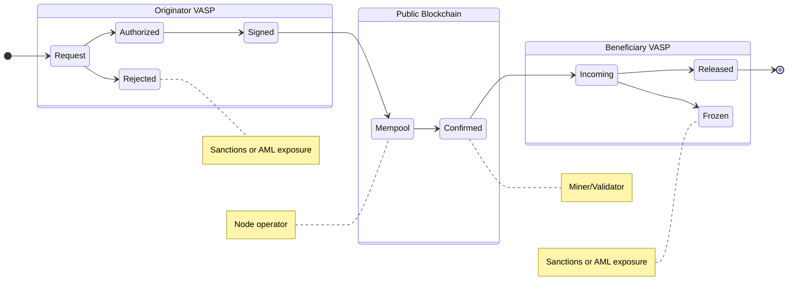
As many centralized services are also now facilitating transactions between FIAT payment services and blockchains, the risks start to grow exponentially.  The reversible authorization flow of a FIAT transaction, clashes with the non-reverseable characteristics of a blockchain transaction.
The ultimate parties to a FIAT transaction are difficult to match to a blockchain transaction as blockchain transactions do not contain information about the ultimate originating and beneficiary parties. This can cause major fraud risk exposure to the centralized service performing the transaction and can lead to them having their access to FIAT payment service providers revoked. (TODO refer to cases where this has happened)
## Overview of TAP
TAP introduces a new authorization messaging layer for centralized and decentralized services to coordinate the execution of real-world transactions using blockchain transactions. It supports many similar use cases to ISO20022 and even allows a future compatibility layer to be created.
Where it differs from ISO20022 is its first class support for blockchain transactions, blockchain accounts, complex decentralized protocols built using Smart Contracts and is extensible to support future technologies. At the same time it can handle the interoperability between FIAT payment systems as well.
In addition due to the decentralized and often chaotic aspects of blockchain ecosystems, it also relies on game theoretical aspects for each party or agent to reach eventual finalization of a transaction across multiple steps.
## Design Principles of TAP
* Follow the ~[Robustness Principle](https://en.wikipedia.org/wiki/Robustness_principle)~
  * *“be conservative in what you do, be liberal in what you accept from others”*
* It should be message based and support peer 2 peer messaging
* It should support self-hosted wallets under the direct control of an ultimate party
* Avoid reliance on centralized gateways or associations to impose trust by utilizing Decentralized Identifiers (DIDs) for all parties and agents involved.
* Certain workflows such as the Travel Rule flow, should be able to be implemented even if one services to participates actively in the flow, but should encourage and help push more services to be active participants
* Any agent to the transaction should be able to initiate a transaction
* There is no strict message flow defined, but strict flows can be added through TAIPs
* To be able to support a transition for companies adopting it, it should be possible to create messages after the fact outlining the meta-data for an exiting crypto transaction
* Modern blockchain transactions often include multiple individual real world transactions, such as Bitcoin UTXO transactions or airdrop transactions. Several kinds of real world transactions are also implemented through multiple blockchain transactions such as multi-sigs and many kinds of transactions requiring pre-authorization. Thus transactions in TAP could have a many to many relationship with blockchain transactions.
* Separate out the exchange of sensitive PII information between agents to be fully end-to-end encrypted and handled through the messaging flow on a need to know policy based basis
* Allow each agent to be able to authorize or reject a transfer, while understanding that for blockchain transactions only the agent holding the keys ultimately authorizes a transaction
* Support discovery of relevant agents to the flow, by allowing each agent to be able to inject an intermediary agent
* Allow each agent to be able to replace themselves from the transaction with another DID, e.g. redirect the transaction to another legal entity or a custodial service provider
* Built primarily on existing open standards
  * Flexible message encoding default, but default to [JSON-LD](https://json-ld.org)
  * Use [Chain Agnostic standards](https://chainagnostic.org) whenever possible for blockchain relevant standards, such as:
    * References to blockchain assets should rely on [CAIP-19](https://chainagnostic.org/CAIPs/caip-19)
    * References to blockchain accounts should rely on [CAIP-10](https://chainagnostic.org/CAIPs/caip-10)
  * Identifiers for parties should use [RFC-3987 IRIs](https://datatracker.ietf.org/doc/html/rfc3987), but more specifically [W3C Decentralized Identifiers](https://www.w3.org/TR/did-core/) (DIDs) are recommended
  * Identifiers for agents should use [W3C Decentralized Identifiers](https://www.w3.org/TR/did-core/) (DIDs) 

* References to agents or other services should also use DID’s, but prefer DID methods that can immediately be used to identify it. Eg. [PKH-DID](https://github.com/w3c-ccg/did-pkh/blob/main/did-pkh-method-draft.md) methods for blockchain wallets or smart contracts and [Web DIDs](https://w3c-ccg.github.io/did-method-web/) for centralized services
* Messaging and Encryption should be based on proven digital signature and encryption standards:
  * [IETF RFC-7515 JWS](https://www.rfc-editor.org/rfc/rfc7515) for signed data between agents
  * [IETF RFC-7516 JWE](https://www.rfc-editor.org/rfc/rfc7516.html) for encrypted data between agents
  * [DID-Comm V2](https://identity.foundation/didcomm-messaging/spec/v2.0/) semantics for decentralized messaging between services
* Allow anyone to build their own agent implementing the protocol
## Messaging
TAP relies on the existing [DIDComm](https://didcomm.org) protocol as a messaging spec. DIDComm presents a secure method for both trusted and untrusted agents implemented using DIDs to communicate together through a simple email like protocol.
It supports low latency communication between servers without a centralized messaging broker and supports encryption, digital signatures and many other features.

A basic DIDComm message looks like this:
```json
{
  "thid": "abcdefg",
  "type": "<message-type-uri>",
  "from": "did:example:alice",
  "to": ["did:example:bob"],
  "created_time": 1516269022,
  "expires_time": 1516385931,
  "body": {
    /* ... TAP message body */
  }
}
```
DIDComm is based on tried and true IETF standards such as [IETF RFC-7515 JWS](https://www.rfc-editor.org/rfc/rfc7515) and  [IETF RFC-7516 JWE](https://www.rfc-editor.org/rfc/rfc7516.html) for encrypting and signing data.
Server based agents can include their public keys and a DIDComm https end point in their DID document in a fully decentralized manner. Interactive agents such as mobile or desktop wallets can interact either through a trusted service or through encoding the messages in URL’s and/or QR codes through [DIDComm’s Out-of-Band](https://identity.foundation/didcomm-messaging/spec/#out-of-band-messages) functionality. 

### Message Identifiers and Threads
As a convention if not specified the id is assumed to be the [CID](https://github.com/multiformats/cid) of the signed message. Any responses should reference the original requests `cid` in the `thid` is used for threading messages together.

### Digital Signatures
All TAP Messages should be [digitally signed](https://identity.foundation/didcomm-messaging/spec/#didcomm-signed-messages) by a public key that can be resolved in their DID document. For simplicity all examples here are shown as plain text messages.

### Encrypted messages
It is assumed that all DIDComm endpoints are already encrypted using TLS or similar. Some messages could include sensitive information such as end-user PII as should be end-to-end  [encrypted](https://identity.foundation/didcomm-messaging/spec/#didcomm-encrypted-messages) only to the specific agents requiring it.

## Transaction Types
From a high level this protocol should be workable with many different real-world transaction types that involve one or more underlying blockchain transactions.
From the outset the most important transaction to support is a regular crypto token transfer. From a naming point of view, these should be nouns that indicate the object regardless of the underlying state. Eg. transfer instead of transfer-request. The data model should be useable to backfill existing data to recreate it.
Basic TAIPs describing specific core transaction types will be defined from the beginning. Additional TAIPs can be proposed by anyone to support  both new and existing transaction types.

| Type            | TAIP | Description                                                  |
|-----------------|------|--------------------------------------------------------------|
| Transfer        |      | A simple originator to beneficiary transfer of a fungible token. |
| TransferRequest |      | Beneficiary requesting a transfer from originator            |
| NFT Transfer    |      | A simple originator to beneficiary transfer of an NFT        |
| Connection      |      | A connection allows parties to create an identified and verified connection between two parties in order to provide optimized transaction flow in the future. This is similar to the current whitelisting process that companies manage today |
| Invoice         |      | An invoice is a request for payment by a party from either an identified or non-identified party. |

### Example: Transfer
As defined above this is a mapping of a straight forward transfer of a token. Most regular crypto transactions today would fall under this definition:
* `originator` - IRI (DID preferred) of sender of transaction
* `beneficiary `- IRI (DID preferred) of beneficiary of transaction
* `asset` - CAIP-19 of asset
* `amount` - Amount of currency in native fixed decimal format


An example of such a payload:
```json
{
	"@context": "https://tap.rsvp/schema/1.0",
	"@type": "https://tap.rsvp/schema/1.0#Transfer"
	"originator":{"@id":"did:web:alice.example"},
	"beneficiary":{"@id":"did:web:bob.example"},
	"asset": "bip122:000000000019d6689c085ae165831e93/slip44:0"
	"amount": "0.5122"
}
```

## Transaction Parties
Transactions typically involve one or more real world parties:
- Ultimate `originator` of the transaction
- Ultimate `beneficiary` of the transactions
There could be future use cases where other parties are involved, these can be supported through future TAIPs.
Parties are specified using IRIs, but Decentralized Identifiers (DIDs) are preferred. Any DID method can be used, including customer Identifiers, Institutional Identifiers such as web-dids, or DID’s created using Self Sovereign Identity (SSI) Wallets. Other IRI’s could be Profile URL’s or `mailto:` or `sms:` identifiers.
## Agents
Agents are the wallets, exchanges, and other services directly involved with a transaction. Each party can be represented by one or more agents. Some agents are direct intermediaries in a transaction, without having a direct relationship with any of the parties to a transaction.
Some agents are commercial centralized services. Some are Apps or other pieces of software running on one of the parties devices. Finally smart contracts running on blockchains could also be agents.
Each agent can publish or manage their own policy and authorize or reject transactions. To do this [W3C Decentralized Identifiers](https://www.w3.org/TR/did-core/) (DIDs) are required. DIDs are based on different DID methods, that specify public keys and service endpoints that are required to securely communicate, between agents.
Agents are specified by DID’s in JSON-LD blocks. The order is significant and indicates the flow of funds. Meaning the first agent is the originating side and the final agent is the beneficiary side. Agents can replace themselves, or insert other agents directly before or after themselves to help discovery of relevant agents.
Agents can also be listed with specific policies they require other agents to comply with as well as potentially information about what role they perform.
### Centralized agents
Centralized agents such as VASPs, Custodial Wallet API’s, Payment Providers, or other service providers should use [Web DIDs](https://w3c-ccg.github.io/did-method-web/). These are based on a well known domain name of the business. A DID document containing public keys and endpoints for messaging can be placed on any website.
An important benefit of Web DIDs is that they can be created on behalf of any service with an existing domain name. They do not have to actively do anything to be identified as a passive agent, but can easily activate it once they have compliance or business requirements to do so. This aspect forms an important feature allowing TAP to be rolled out without all agents actively supporting it.
Services typically require a method to communicate securely with other agents thus adding a messaging endpoint is important for them to participate.
### Self-hosted wallets as agents
Any wallet address already has a blockchain account address, which acts as an identifier. This can be turned into a [CAIP-10](https://chainagnostic.org/CAIPs/caip-10) identifier, which in turn can be prepended with `did:pkh:` to create a [PKH-DID](https://github.com/w3c-ccg/did-pkh/blob/main/did-pkh-method-draft.md) for the address. Similarly to web-dids these can be used with existing account identifiers that are used within the underlying settlement process.
Example: The main net Ethereum address `0xab16a96D359eC26a11e2C2b3d8f8B8942d5Bfcdb` is encoded as CAIP-10 to `eip155:1:0xab16a96D359eC26a11e2C2b3d8f8B8942d5Bfcdb`, which in turn becomes `did:pkh:eip155:1:0xab16a96D359eC26a11e2C2b3d8f8B8942d5Bfcdb`.
Most blockchain accounts are based on public keys that can also be used to securely sign messages.
### Smart contracts as agents
In most smart contract based blockchains, smart contracts have addresses similar to those of regular wallets. Thus the above [PKH-DID](https://github.com/w3c-ccg/did-pkh/blob/main/did-pkh-method-draft.md) method can also be used.
While Smart Contracts do not themselves have public keys, [ERC-1271: Standard Signature Validation Method for Contracts](https://eips.ethereum.org/EIPS/eip-1271) or future methods could be adapted in a future TAIP to allow them to accept or reject transactions.
### Actions Modifying list of agents
In many cases the list of agents are not known based on a blockchain address as the last agent in a list. Agents can insert new agents before or after each other, or replace themselves using the following actions:
- `insert-agent` allows an agent to add an agent before or after themselves. This could be for a VASP to introduce their wallet api service, or looking up who the exchange is that owns a particular blockchain account
- `replace-agent` allows an agent to replace themselves in the list
The following shows a case where a beneficiary VASP inserts their wallet service before them in the list of agents:
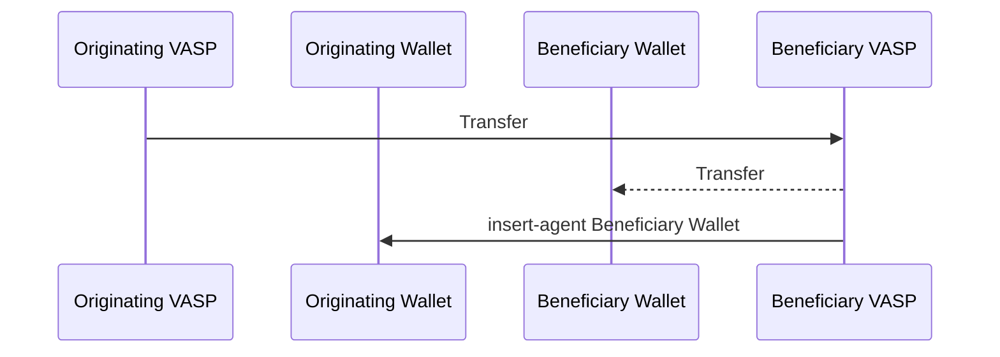
### Discovering agents
A typical problem found in implementing the Travel Rule is discovering the VASP behind a wallet address.
This can be handled by existing agents adding one or more agents 
## Transaction Authorization Mechanism
This part of the white paper describes the intricate process of transaction authorization in TAP.
### Non-deterministic multi-party authorization
Most travel rule protocols have a deterministic message flow. Each agent or party to a transaction is expected to perform a set of actions in a particular sequence.
The reality is that in most cases they don’t do that, but implement the travel rule somewhat haphazardly or not at all, causing most of our customers to not have a successful flow.
By designing it as a non-deterministic message protocol instead allowing each party to negotiate for their required information and use game theoretical principles to force their counterparties to follow the rules that their national regulator or risk department requires. It also elegantly handles the sunrise period, where companies can create and modify policies as the industry and regulation changes.
An institution can force some consensus around the state of the payment, by withholding settlement or not sharing a settlement address until sufficient risk has been mitigated by counterparties.
### Actions
There are 3 primary actions an agent can take:
- `Settle` - They are sending the transaction to the blockchain. This is the only action that ultimately matters on the blockchain
- `Authorize` - Authorize or signal to other agents that they are free to `settle` a transaction
- `Reject` - Signal to other agents that they reject the transaction.

These are all sent as replies to an initial request.

The following shows an simplified authorization flow with a succesfull outcome:
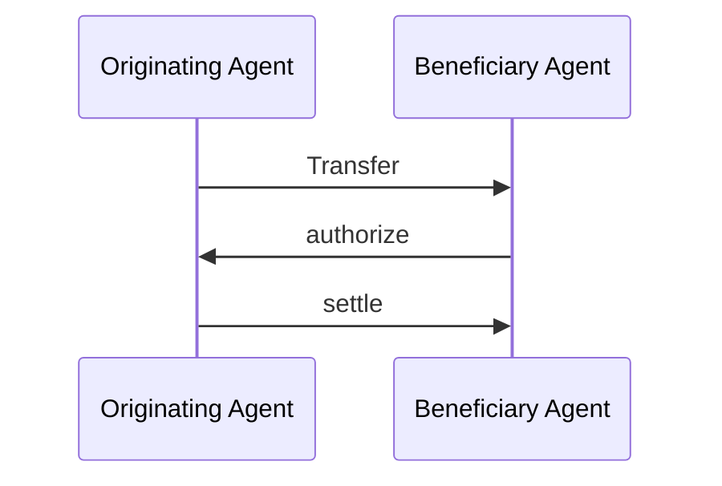

#### Authorize
The beneficiary VASP authorizes the transaction by replying as a thread to the initial message:
```json
{
	"from":"did:web:beneficiary.vasp",
	"type": "https://tap.rsvp/schema/1.0#Authorize",
	"thid":"ID of transfer request",
	"to": ["did:web:originator.vasp"]
	"body": {
		"settlementAddress":"..." /*CAIP-2 account address */
	}
}
```

#### Settle
The originating VASP notifies the beneficiary VASP in the same thread that they are settling the transfer like this:
```json
{
	"from":"did:web:originator.vasp",
	"type": "https://tap.rsvp/schema/1.0#Settle",
	"thid":"ID of transfer request",
	"to": ["did:web:beneficiary.vasp"]
	"body": {
		"txhash":"...." /* Blockchain transaction hash */
	}
}
```

#### Reject
Any agent can always reject a transaction:
```json
{
	"from":"did:web:beneficiary.vasp",
	"type": "https://tap.rsvp/schema/1.0#Reject",
	"thid":"ID of transfer request",
	"to": ["did:web:originator.vasp"]
	"body": {
		"reason":"...."
	}
}
```

See the following flow:
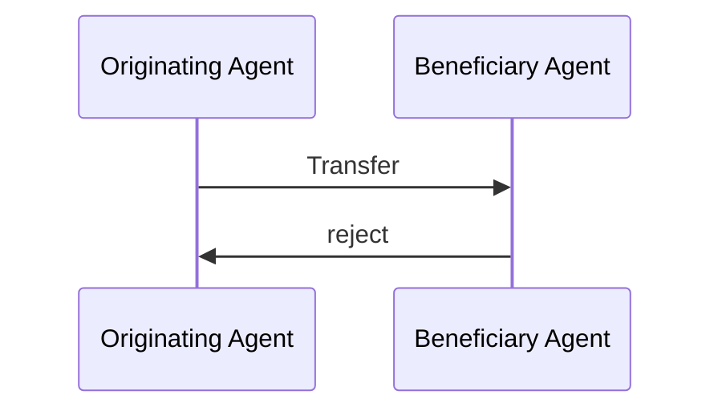

### Transaction State
This is an idealized state machine from the point of view of the originating agent:
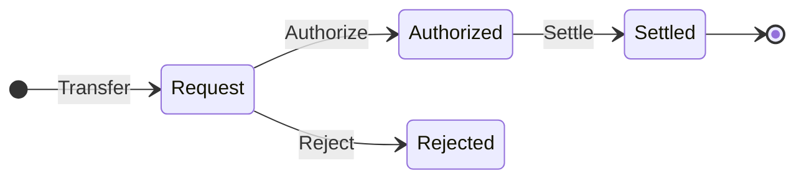

While the above Within the context of the FATF Travel Rule in 2023 the industry is only just beginning to see a significant amount of responses to Travel Rule authorization requests. Companies are currently taking a risk based approach to settling regardless of response rate. For this and future use cases, agents can make the decision to do this:
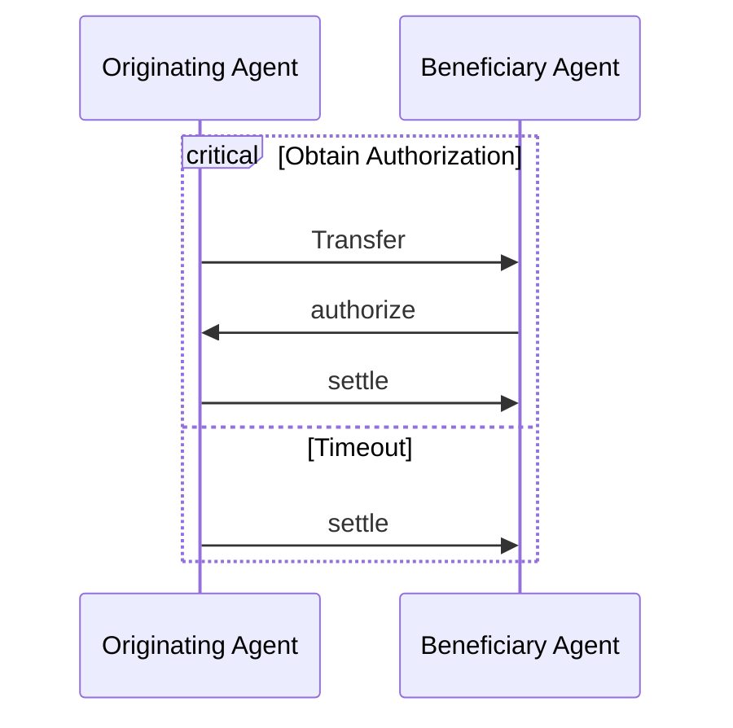

In real world situations, there are often multiple intermediary agents. They can all participate equally in a transaction flow:
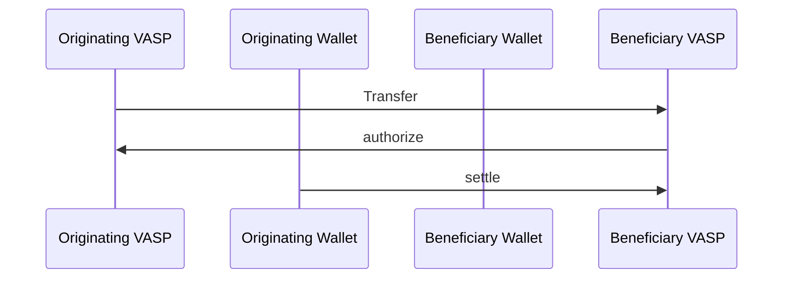

## Policies
Any agent maintains their own set of policies to manage their own compliance and risk procedures. Notabene helps their customers authorize or cancel transactions based on their policies.
This allows us for example to eliminate PII completely from a flow in the case where a DID is already identified, or that I as a business don’t require it (EG. I don’t have Travel Rule requirements).
Policies also allow an agent to signal to counterparties what they require to either settle funds on behalf of the originator or credit funds to the beneficiary.
Policies could be included in DID documents or specified on a case by case basis as part of the transaction flow.
An agent can add a policy to the transaction through the following message:
```json
{
	"from":"did:web:beneficiary.vasp",
	"type": "https://tap.rsvp/schema/1.0#AppendPolicy",
	"thid":"ID of transfer request",
	"to": ["did:web:originator.vasp"]
	"body": {
		"require-presentation":{
			"originator":["fullName", "date-of-birth"],
			"beneficiary":["fullName"]
		}
	}
}
```

### `require-authorization`
An agent requires an `authorize` action from either the final agent in the list or an agent managing it. 
### `require-presentation`
This is a generic way of requesting a selected Verifiable Presentation of a particular credential. 
This could be used to request information about any party to a transaction including agents. This could be implemented using a `present-credentials` message (see Selective Disclosure of Verifiable Credentials below).
### `require-proof-of-control`
An agent likely on the originator side could require that prior to settling funds to a customer or providing originator PII, that an beneficiary performs an address ownership proof, and what standard to use. For illustrative purposes this could be presented using a message `proof-of-control`.
## Selective Disclosure of Verifiable Credentials
In some cases, such as when implementing the FATF Travel Rule, e-commerce flows, or as part of management of counterparty risk in certain institutional use cases identifying information may be requested and exchanged by agents surrounding either themselves or the ultimate parties to the underlying transaction.
In these cases agents can specify a `require-presentation` policy to request for example the name or shipping address of a party. The negotiation and exchange of verifiable credentials can be negotiated using [WACI](https://identity.foundation/waci-didcomm/v1.0/) or similar. Different TAIPs can specify this in more detail.
## Example Use Cases
Illustrative use cases are presented here to demonstrate TAP's versatility and applicability in real-world scenarios,  including projections on how future TAIPs might impact decentralized protocols, self-hosted wallets, and e-commerce payment flows.

### Legacy digital asset transfer authorization
This implements an authorization scheme between two custodial wallet services with a known beneficiary wallet address. 
**Parties**
- `did:eg:bob`
- `did:eg:alice`

**Agents**
- `did:eg:originator.vasp`
- `did:eg:beneficiary.vasp`
- `did:pkh:eip155:1:0xabcdef`

Bob wants to send 1 ETH to Alice using his wallet at `originator.vasp` to beneficiary address `0xabcdef`.
For legacy transfers like this the sending VASP must lookup who the beneficiary VASP is or ask Bob to ask Alice for the details. The details of how this works is out of scope.

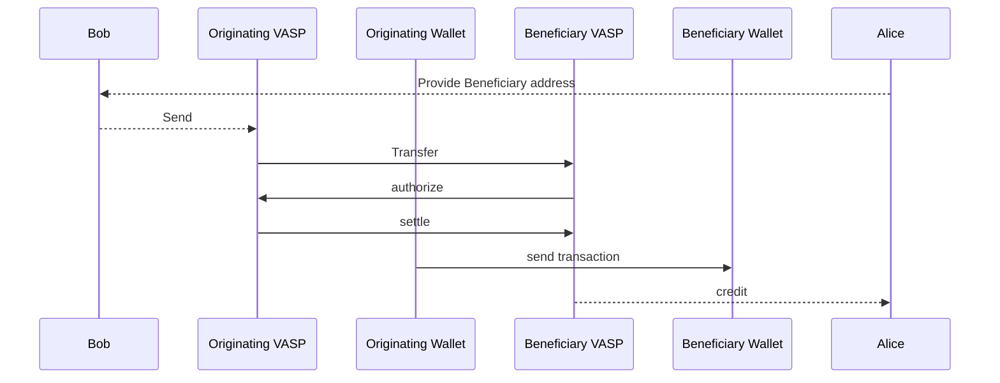
There are two main problem with the above flow:
- Identifying the beneficiary VASP behind a blockchain address, but there are various solutions for this implemented by travel rule solutions today although none are perfect
- While this does present an authorization flow, it requires the originator institution to respect and wait for a rejection by the beneficiary VASP. Some beneficiary VASP are presenting policies that they will could freeze incoming funds. TAP can be used to negotiate these policies up front.

The initial Transfer message could look like this:

```json
{
	"from":"did:web:originator.vasp",
	"type": "https://tap.rsvp/schema/1.0#Transfer"
    "id": "...",
	"to": ["did:web:beneficiary.vasp", "did:pkh:eip155:1:0x1234a96D359eC26a11e2C2b3d8f8B8942d5Bfcdb"]
	"body": {
		"@context": "https://tap.rsvp/schema/1.0",
		"@type": "https://tap.rsvp/schema/1.0#Transfer"
		"originator":{"@id":"did:eg:bob"},
		"beneficiary":{"@id":"did:eg:alice"},
		"asset": "eip155:1/slip44:60",
		"amount": "1.0"
		"agents":[
			{
				"@id":"did:web:originator.vasp",
				"policies":["require-authorization"]
			},
			{
				"@id":"did:beneficiary.vasp",
			},
			{
				"@id":"did:pkh:eip155:1:0x1234a96D359eC26a11e2C2b3d8f8B8942d5Bfcdb"
			}
		]
	}
}
```
The originating VASP lists as its policy that it will not transfer funds without an explicit authorization by the beneficiary VASP.

The beneficiary VASP authorizes the transaction by replying as a thread to the initial message:
```json
{
	"from":"did:web:beneficiary.vasp",
	"type": "https://tap.rsvp/schema/1.0#Authorize",
	"thid":"ID of transfer request",
	"to": ["did:web:originator.vasp"]
	"body": {}
}
```

The originating VASP notifies the beneficiary VASP in the same thread that they are settling the transfer like this:
The beneficiary VASP can authorize the transaction by replying as a thread to the initial message:
```json
{
	"from":"did:web:originator.vasp",
	"type": "https://tap.rsvp/schema/1.0#Settle",
	"thid":"ID of transfer request",
	"to": ["did:web:beneficiary.vasp"]
	"body": {
		"txhash":"...." /* Blockchain transaction hash */
	}
}
```

#### Using policies to support the FATF Travel Rule
The FATF Travel Rule requires the originating VASP to collect information about the beneficiary customer and transmit both that and PII about their customer along to the beneficiary VASP. 
This allows the beneficiary VASP to confirm that the beneficiary is indeed the correct customer as well as allowing both sides to perform name sanctions screening on the counterparties customer for third-party transfers.
Due to the sensitive nature of customer PII, agents could present a policy of requiring `proof-of-control` of an address before sharing information.
In addition to providing the beneficiary address, Bob also now needs to provide Alice’s name to his VASP.
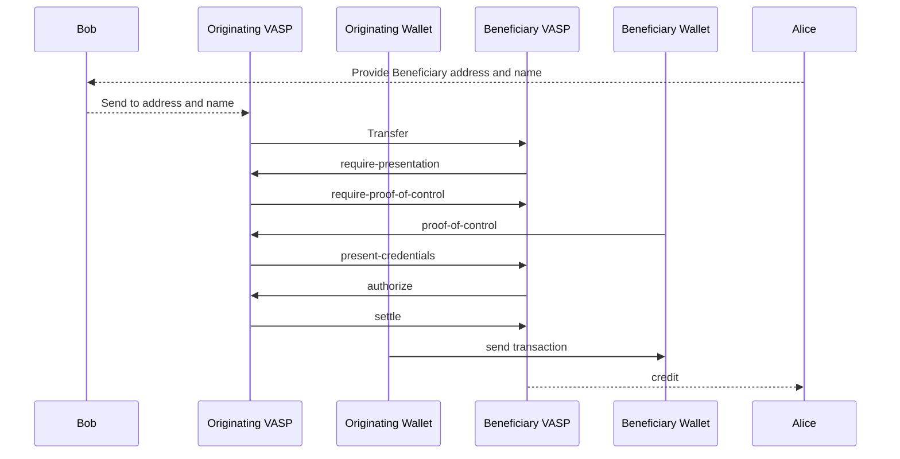

The originating VASP could include it’s policies in the original Transfer message like this:
```json
{
	"from":"did:web:originator.vasp",
	"type": "https://tap.rsvp/schema/1.0#Transfer"
	"to": ["did:web:beneficiary.vasp", "did:pkh:eip155:1:0x1234a96D359eC26a11e2C2b3d8f8B8942d5Bfcdb"]
	"body": {
		"@context": "https://tap.rsvp/schema/1.0",
		"@type": "https://tap.rsvp/schema/1.0#Transfer"
		"@id": "...",
		"originator":{"@id":"did:eg:bob"},
		"beneficiary":{"@id":"did:eg:alice"},
		"asset": "eip155:1/slip44:60",
		"amount": "1.0"
		"agents":[
			{
				"@id":"did:web:originator.vasp",
				"policies":["require-authorization"]
			},
			{
				"@id":"did:beneficiary.vasp"
			},
			{
				"@id":"did:pkh:eip155:1:0x1234a96D359eC26a11e2C2b3d8f8B8942d5Bfcdb"
			}
		]
	}
}
```
The Beneficiary VASP is required to implement the FATF travel rule and can respond that it requires information about the originator and beneficiary:
```json
{
	"from":"did:web:beneficiary.vasp",
	"type": "https://tap.rsvp/schema/1.0#AppendPolicy",
	"thid":"ID of transfer request",
	"to": ["did:web:originator.vasp"]
	"body": {
		"require-presentation":{
			"originator":["fullName", "date-of-birth"],
			"beneficiary":["fullName"]
		}
	}
}
```
In return the originating VASP could have a policy to request proof of control of the beneficiary wallet address before providing the PII.

```json
{
	"from":"did:web:originator.vasp",
	"type": "https://tap.rsvp/schema/1.0#AppendPolicy",
	"thid":"ID of transfer request",
	"to": ["did:web:beneficiary.vasp"]
	"body": {
		"require-proof-of-control": "did:pkh:eip155:1:0x1234a96D359eC26a11e2C2b3d8f8B8942d5Bfcdb"
	}
}
```

The Beneficiary VASP can provide proof of control by signing a message according to [CAIP-74](https://chainagnostic.org/CAIPs/caip-74) and providing the proof:
```json
{
	"from":"did:web:beneficiary.vasp",
	"type": "https://tap.rsvp/schema/1.0#ProofOfControl",
	"thid":"ID of transfer request",
	"to": ["did:web:originator.vasp"]
	"body": {
		"proof":"uOqJlcm9vdHOB2CpYJQABcR..."
	}
}
```

Since this proof fulfills the policy of the originator VASP can now provide the PII as encrypted Verifiable Credentials using [WACI Credential Fulfilment](https://identity.foundation/waci-didcomm/#step-5-issue-credential-issue-credential-credential-fulfilment):
```json
{
	"from":"did:web:originator.vasp",
	"type":"https://didcomm.org/issue-credential/3.0/issue-credential",
	"thid":"ID of transfer request",
	"to": ["did:web:beneficiary.vasp"]
	"body": {
	},
	"attachments": [
		"...." /* Verifiable Presentation of requested PII */
    ]
}
```

Now since all the policies are fulfilled beneficiary can perform the `Authorize` and `Settle` steps as before.

### Modern digital asset transfer authorization
This implements an authorization scheme between two custodial wallet services on behalf of their customers. The beneficiary wallet address is not shared until after any authorization has been performed.
**Parties**
- `did:eg:bob`
- `did:eg:alice`

**Agents**
- `did:eg:originator.vasp`
- `did:eg:beneficiary.vasp`
Bob wants to send 1 ETH to Alice using his wallet at `originator.vasp` to Alice’s account at beneficiary VASP. Instead of presenting the beneficiary address, the beneficiary VASP provides a TransferRequest signed by the Beneficiary VASP, containing her identifier. She can then share this with Bob instead of a beneficiary address.
This can not only ensure considerably better UX for retail users than is available today, it also allows the beneficiary VASP to require that originating VASP allows them to perform an authorization step.
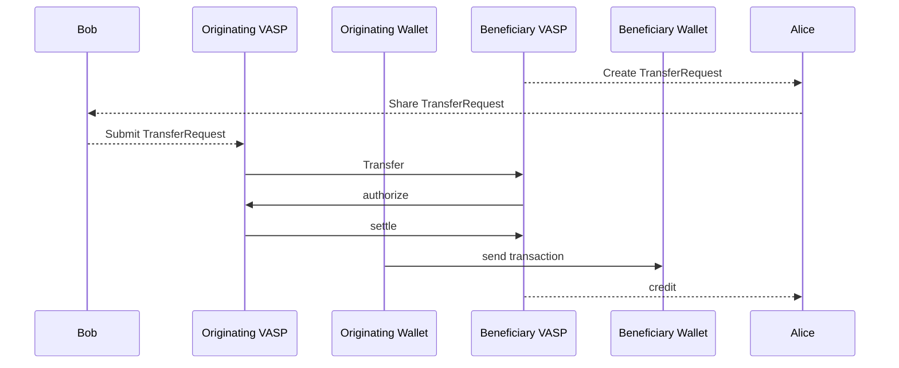
By only sharing the beneficiary address after the authorization flow, the beneficiary VASP can now authorize or reject transactions on an equal basis with the originating VASP.

The initial TransferRequest message could look like this:
```json
{
	"from":"did:web:beneficiary.vasp",
	"type": "https://tap.rsvp/schema/1.0#TransferRequest"
	"to": ["did:eg:alice"]
	"body": {
		"@context": "https://tap.rsvp/schema/1.0",
		"@type": "https://tap.rsvp/schema/1.0#Transfer"
		"@id": "...",
		"beneficiary":{"@id":"did:eg:alice"},
		"asset": "eip155:1/slip44:60",
		"amount": "1.0"
		"agents":[
			{
				"@id":"did:beneficiary.vasp",
			}
		]
	}
}
```

After sharing it the originator VASP can initiate a `Transfer` as a thread to the `TransferRequest` expanding on it adding its own details and policies to it.

```json
{
	"from":"did:web:originator.vasp",
	"type": "https://tap.rsvp/schema/1.0#Transfer",
	"thid":"ID of transfer request",
	"to": ["did:web:beneficiary.vasp"]
	"body": {
		"@context": "https://tap.rsvp/schema/1.0",
		"originator":{"@id":"did:eg:bob"},
		"beneficiary":{"@id":"did:eg:alice"},
		"asset": "eip155:1/slip44:60",
		"amount": "1.0"
		"agents":[
			{
				"@id":"did:web:originator.vasp",
				"policies":["require-authorization"]
			},
			{
				"@id":"did:beneficiary.vasp",
			}
		]
	}
}
```

The beneficiary VASP authorizes the transaction by replying as a thread to the `Transfer` adding a `settlementAddress` containing the deposit address:
```json
{
	"from":"did:web:beneficiary.vasp",
	"type": "https://tap.rsvp/schema/1.0#Authorize",
	"thid":"ID of transfer request",
	"to": ["did:web:originator.vasp"]
	"body": {
		"settlementAddress": "eip155:1:0x1234a96D359eC26a11e2C2b3d8f8B8942d5Bfcdb"
	}
}
```

#### Using policies to support the FATF Travel Rule
As mentioned in the legacy transfer flow, the FATF Travel Rule requires the originating VASP to collect information about the beneficiary customer and transmit both that and PII about their customer along to the beneficiary VASP.
Using the modern TAP flow implementing the Travel Rule can be done without adding additional steps, thus it is much simpler.
Also since the beneficiary wallet is no longer a core part of the flow, there is no longer a requirement for obtaining proof of control, eliminating this step completely.
The sequence diagram does not change to implement the Travel Rule, but each party adds additional data and policies to the request to verify it.
The initial TransferRequest message adds beneficiary name information which can be displayed to the sending customer providing better UX:
```json
{
	"from":"did:web:beneficiary.vasp",
	"type": "https://tap.rsvp/schema/1.0#TransferRequest"
	"to": ["did:eg:alice"]
	"body": {
		"@context": "https://tap.rsvp/schema/1.0",
		"@type": "https://tap.rsvp/schema/1.0#Transfer"
		"@id": "...",
		"beneficiary":{"@id":"did:eg:alice"},
		"asset": "eip155:1/slip44:60",
		"amount": "1.0"
		"agents":[
			{
				"@id":"did:beneficiary.vasp",
				"policies":{
					"require-presentation":{
						"originator":["fullName", "date-of-birth"]
					}
				}
			}
		]
	},
	"attachments": [
		"...." /* Verifiable Presentation of Beneficiary name */
    ]
}
```

After sharing it the originator VASP can initiate a `Transfer` as a thread to the `TransferRequest` expanding on it adding the required originator PII as an attachment. While the beneficiary name is required as part of implementing the travel rule, it is implicitly included in the thread, through the original `TransferRequest` and can be acted on by the originator VASP before initiating a transfer.

```json
{
	"from":"did:web:originator.vasp",
	"type": "https://tap.rsvp/schema/1.0#Transfer",
	"thid":"ID of transfer request",
	"to": ["did:web:beneficiary.vasp"]
	"body": {
		"@context": "https://tap.rsvp/schema/1.0",
		"originator":{"@id":"did:eg:bob"},
		"beneficiary":{"@id":"did:eg:alice"},
		"asset": "eip155:1/slip44:60",
		"amount": "1.0"
		"agents":[
			{
				"@id":"did:web:originator.vasp",
				"policies":["require-authorization"]
			},
			{
				"@id":"did:beneficiary.vasp",
				"policies":{
					"require-presentation":{
						"originator":["fullName", "date-of-birth"]
					}
				}
			}
		]
	},
	"attachments": [
		"...." /* Verifiable Presentation of required originator details */
    ]
}
```

Now the `Authorize` and `Settle` flow can happen as before.

### Self-hosted wallet authorization
TBD

## Transaction Authorization Improvement Proposals
The concept of TAIPs allows the community to propose enhancements and specific applications of TAP to their unique transaction scenarios. The initial set of TAIPs (TAIP-1 to TAIP-4) outlines specific technical details such as messaging structure, DIDs usage, identity credential requests, and compliance with the FATF Travel Rule.

### Initial TAIPs

| TAIP | Description                                     |
|------|-------------------------------------------------|
| 1    | Transaction Authorization Improvement Proposals |
| 2    | Messaging                                       |
| 3    | Transaction Types                               |
| 4    | Transaction Authorization                       |
| 5    | Agents                                          |
| 6    | Transaction Parties                             |
| 7    | Agent Policies                                  |
| 8    | Selective Disclosure                            |
| 9    | Proof of Control                                |
| 10    | FATF Travel Rule workflow                      |


## Implementation and Integration
Guidelines for the implementation of TAP are provided in this section, along with insights into integrating the protocol with existing payment systems and blockchain networks.

## Glossary


## License

<p xmlns:cc="http://creativecommons.org/ns#" xmlns:dct="http://purl.org/dc/terms/"><a property="dct:title" rel="cc:attributionURL" href="https://tap.rsvp">Transaction Authorization Protocol</a> by <a rel="cc:attributionURL dct:creator" property="cc:attributionName" href="https://notabene.id">Notabene, Inc.</a> is licensed under <a href="http://creativecommons.org/licenses/by-sa/4.0/?ref=chooser-v1" target="_blank" rel="license noopener noreferrer" style="display:inline-block;">CC BY-SA 4.0</a></p>
